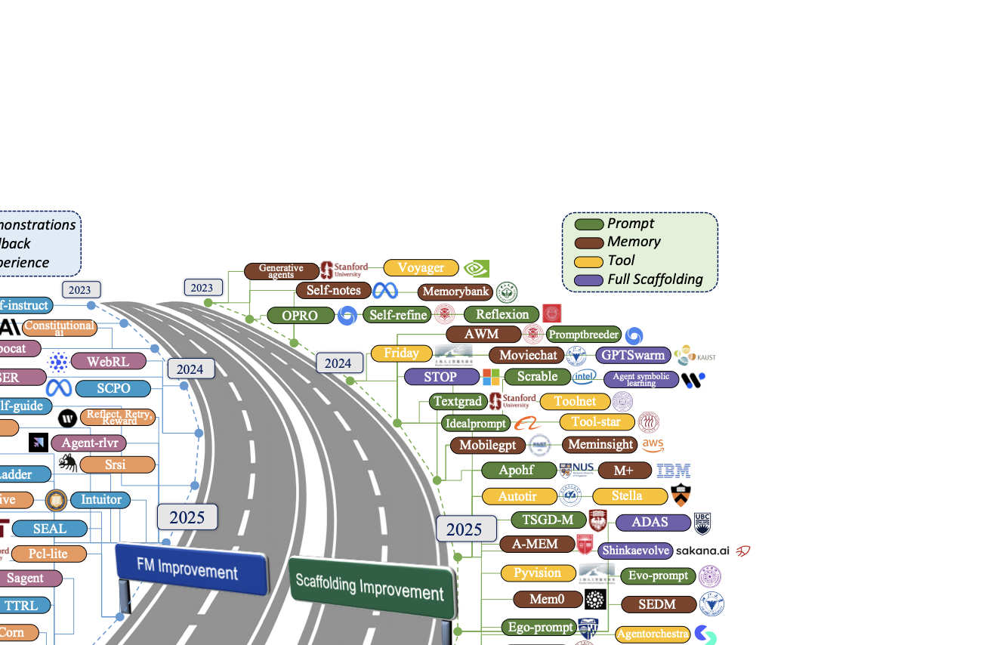
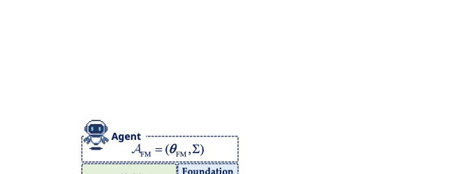
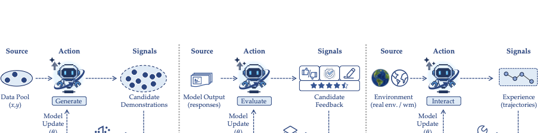
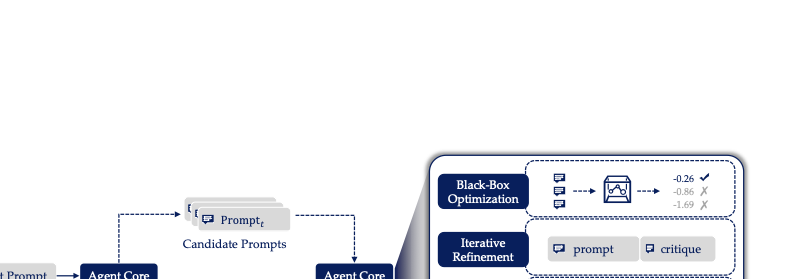
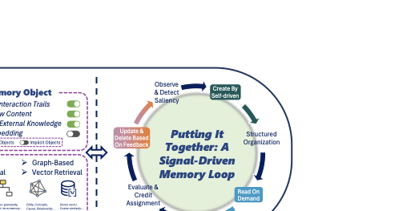
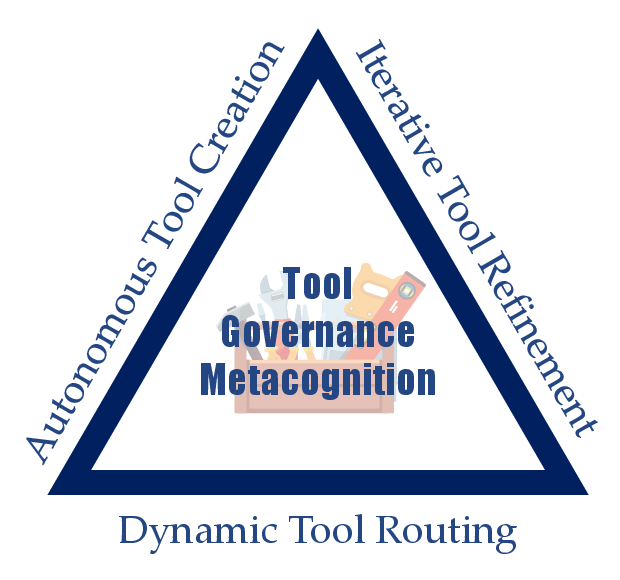
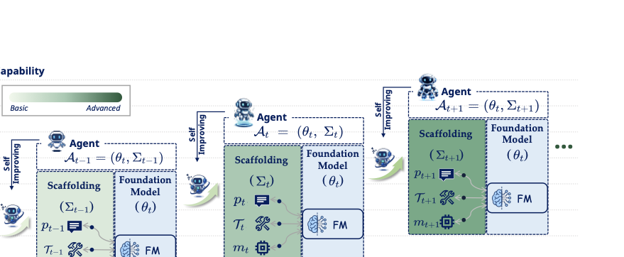
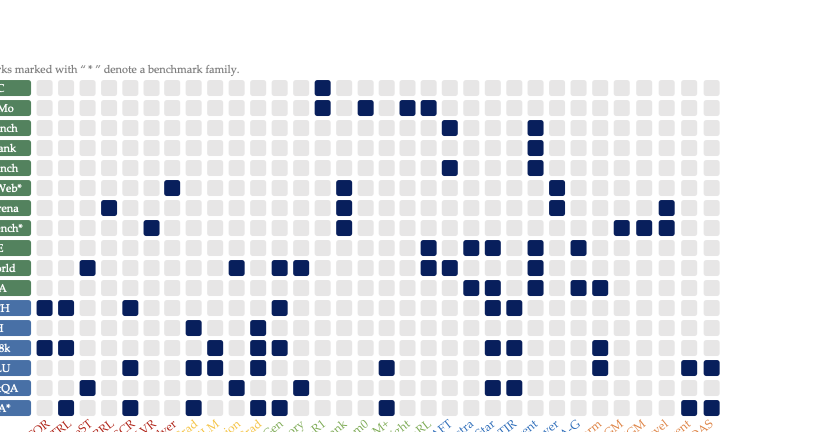

# Self-Improvements in Modern Agentic Systems: A Survey

Source: https://arxiv.org/html/2607.13104

## Overview / Takeaway

Modern self-improving agents are best understood as two coupled systems: a foundation model with parameters $\theta_t$ and an operational scaffold $\Sigma_t$ containing prompts, memory, tools, and control logic. The survey formalizes self-improvement as a persistent, self-induced update driven by signals produced during the agent's own execution, then separates a slow **foundation-model improvement** loop from a fast, reversible **scaffolding improvement** loop. It organizes parameter updates by intrinsic demonstrations, intrinsic evaluations, and extrinsic experience, while organizing scaffold updates by prompt, memory, tool, and full-codebase changes. Across software engineering, web automation, games, science, robotics, and computer control, the decisive bottlenecks are trustworthy feedback, transfer beyond the optimization environment, attribution, resource cost, regression control, and safe update gates. This is a synthesis and systems paper rather than a new empirical study: its main evidence is the formal framework, literature taxonomy, comparative tables, and evaluation protocol, not a new benchmark result or meta-analytic effect size.

## 1 Introduction

1. **Foundation models turn language into a practical self-modification substrate**
Earlier agents relied on task-specific models and hand-engineered modules, whereas modern large language and vision-language models use natural language as a shared interface for representation, reasoning, control, and tool use. This matters for self-improvement because candidate changes can be expressed and searched as semantic instructions, critiques, programs, and workflows instead of only low-level code or raw weights. The paper frames self-improvement as the capacity to inspect, evaluate, and deliberately modify optimization mechanisms or operational logic, not merely to respond differently within one transient context.

2. **The modern problem inherits a long self-referential lineage**
The motivating arc runs from Good's *"The first ultraintelligent machine is the last invention that man need ever make"* through self-referential learning, fast weights, lifelong meta-learning, success-story backtracking, and the Gödel Machine. Earlier proposals showed how a system might generate descendants, alter learning rules, or accept a rewrite after proving higher expected utility, but scaling remained difficult because the search spaces were low-level and enormous. Foundation models make proposed modifications easier to express and evaluate, but do not remove the core problems of credit assignment, verifier reliability, and safe acceptance.

3. **A foundation model alone is not an autonomous agent**
The model is treated as a stateless cognitive core surrounded by a persistent scaffold that constructs context, selects actions, exposes tools, stores memory, schedules work, and enforces constraints. The paper uses **scaffold** where some recent work uses **agent harness**, emphasizing that these structures are part of the agent's modifiable configuration. This core-and-scaffold view motivates two distinct update targets rather than treating fine-tuning and agent engineering as unrelated fields.

4. **Self-improvement has a slow parametric loop and a fast structural loop**
Foundation-model improvement changes $\theta_t$, usually through gradient-based learning, so gains can be amortized across tasks but updates are expensive, global, and harder to reverse. Scaffolding improvement changes $\Sigma_t$, such as prompts, memory, tools, or control flow, so adaptation is usually faster, more inspectable, and more reversible, but also more context-dependent. Both loops depend on learning signals extracted from execution.

Figure 1 makes the paper's central distinction concrete: the update target is either model parameters or one or more scaffold components, while the learning signal determines how the update is produced.

5. **The taxonomy separates what changes from where the signal comes from**
Terminology such as self-correction, self-play, meta-prompting, self-training, and self-evolution often obscures common mechanisms. The survey first splits methods by update substrate, then by signal form, and finally splits scaffold methods by component. This yields a comparison language that can place superficially different systems on the same axes.

Figure 2 shows representative work from 2023–2026 on separate parameter and scaffold lanes, emphasizing how quickly both branches have expanded.

6. **The survey's scope is deliberately broader than adjacent reviews**
Its three contributions are a historical lineage, a unified formalization and taxonomy, and a combined treatment of applications, evaluation, safety, and future directions. The paper's comparison of survey emphases is qualitative: **primary**, **secondary**, or **not a focus**.

| Dimension | This survey | Gao et al. survey | Fang et al. survey | Tao et al. survey |
|---|---|---|---|---|
| Agent formulation | Primary | Primary | Primary | Secondary |
| Definition scope | Primary | Primary | Secondary | Secondary |
| Historical roots | Primary | Not a focus | Secondary | Secondary |
| Signal lens | Primary | Secondary | Primary | Primary |
| Update substrate | Primary | Primary | Primary | Secondary |
| Evaluation lens | Primary | Primary | Primary | Primary |
| Domain coverage | Primary | Secondary | Secondary | Not a focus |
| Outlook and issues | Primary | Secondary | Primary | Secondary |

## 2 Historical Context and Theoretical Foundations

1. **True self-improvement changes the learning or operating mechanism**
Ordinary machine learning changes parameters inside a fixed architecture; the stronger notion surveyed here allows explicit inspection and revision of operational logic, heuristics, architecture, or learning algorithms. Historical systems mostly achieved this within bounded domains, while modern foundation models provide a more general substrate without changing the underlying requirement for feedback and verification.

Figure 4 situates modern agents within an arc from error-driven optimization and self-reference to meta-learning, architecture search, foundation models, and agent scaffolds.

### 2.1 Foundational Concepts (1790s-1960s)

1. **Error-driven adaptation began well before digital AI**
Least squares showed that parameters of what can now be viewed as a linear neural predictor can be systematically adjusted to reduce error; Gauss's use of noisy astronomical observations to recover the position of Ceres is presented as an early pattern-recognition example. Cybernetics added the feedback-loop view, homeostasis emphasized internal adjustment under perturbation, and Turing's child machine proposed shaping an internal configuration through training, reward, and punishment.

2. **Early adaptive systems stopped short of self-reference**
The perceptron and Samuel's checkers program demonstrated behavior that improves from feedback, but their architectures and learning algorithms remained fixed. The paper therefore treats them as important learning systems and conceptual precursors, not full self-improving systems under its definition.

3. **Gödel supplied a language for programs to refer to programs**
Gödel numbering represented data and programs within the same axiomatic language and enabled formal statements about the computation of other statements, including themselves. Good later proposed an intelligence explosion in which machines design more capable successors, but this remained a conceptual forecast until explicit self-modification mechanisms were developed.

### 2.2 Symbolism and Heuristic Self-Modification (1960s–1980s)

1. **Symbolic systems made strategies first-class editable objects**
Von Neumann's self-reproducing automata separated a constructive mechanism from a copyable and variable symbolic description; Myhill gave self-reproduction a more abstract formal treatment. AM searched over symbolic programs encoding mathematical ideas, and EURISKO represented heuristics as Lisp objects that could be generated, recombined, tested, and changed.

2. **Autonomous evaluation was the missing closed loop**
EURISKO's practical success depended heavily on a user interpreting results and pruning unproductive heuristic drift. That limitation reappears in modern systems: a generator can propose many changes, but recursive progress depends on an internal critic or external verifier that assigns reliable credit without becoming an exploitable proxy.

### 2.3 Connectionism and the Emergence of Meta-Learning (1980s–2000s)

1. **The learning process itself became learnable**
Self-referential evolutionary frameworks optimized both candidate solutions and the procedures that generated them, while parameterized synaptic learning rules made the optimizer an explicit search target. This shifted self-modification from hand-edited symbolic rules toward continuous program spaces.

2. **Fast-weight programmers anticipated inference-time adaptation**
A slow network learned to program another network's fast weights through additive outer-product updates; the 1991 unnormalized linear Transformer is presented as a representative instance. Self-referential weight matrices went further by modifying their own fast weights while receiving errors or rewards, and later recurrent and continual-learning variants revisited this idea at greater scale.

3. **Lifelong meta-learning added rollback and long-horizon credit**
The 1994 recursive self-improving reinforcement-learning machine altered parts of its learning strategy across a single lifelong stream. Environment-independent reinforcement acceleration and the success-story algorithm used backtracking to undo policy modifications whose long-term reward histories did not justify them, establishing version history and rollback as core safety mechanisms rather than modern afterthoughts.

4. **Several complementary ideals expanded the design space**
Learning to learn emphasized reusable inductive bias across tasks; NEAT grew network topology under performance selection; AIXI supplied an uncomputable upper bound for optimal sequential decision-making; and the Gödel Machine proposed a fully self-referential system in which even the modification generator and theorem prover can change. A Gödel Machine accepts a rewrite only after proving that it improves expected cumulative reward while accounting for possible future rewrites.

### 2.4 Formal and Architecture-Level Self-Improvement (2000s-2020s)

1. **Theory exposed self-modification hazards and logical difficulties**
Agents with limited resources and irreversible actions can self-deceive, tamper with rewards, or make fatal mistakes. Reflective oracles, logical induction, and proof-producing reflection addressed reasoning about self-referential probabilistic programs and uncertain logical claims, clarifying why unrestricted self-reference is not automatically safe.

2. **Engineering pursued bounded and verifiable alternatives**
Attempts to implement Gödel-style systems and bounded recursive self-improvement constrained reflection and scheduling with designer rules. Neural architecture search automated architecture proposals under task performance, while self-play created progressively harder curricula from an agent's own behavior. These approaches made limited self-improvement operational without solving open-ended recursive improvement.

### 2.5 Scalable Foundation Models and Agentic Systems (2020s–Present)

1. **Modern agents combine rapid contextual adaptation with durable learning**
In-context learning changes behavior through transient context and key-value state without standard gradient descent, echoing fast-weight programming. Slower loops such as reinforcement learning from human or AI feedback, critique-driven training, and self-play convert interactions into persistent parameter changes.

2. **Scaffolds turn reflections and experience into reusable structure**
ReAct and Reflexion convert execution traces and failures into structured reasoning or verbal feedback; skill libraries, curricula, evaluation harnesses, and self-modifying software agents retain those lessons across tasks. The modern picture is therefore nested: fast context and scaffold changes explore cheaply, while slower parameter updates consolidate selected behaviors.

## 3 Definitions

### 3.1 Formulation of Agentic Systems

1. **An agent configuration couples a model and scaffold**
At iteration $t$, the persistent agent configuration is

\[
\mathcal{A}_t=(\theta_t,\Sigma_t),
\]

where $\theta_t$ is the foundation model's parameter set and $\Sigma_t$ is the dynamic operational scaffold. The scaffold decomposes as

\[
\Sigma_t=(p_t,m_t,\mathcal{T}_t,g_t),
\]

with prompt or instruction component $p_t$, externalized memory $m_t$, tools and invocation interfaces $\mathcal{T}_t$, and routing, scheduling, verification, or safety logic $g_t$.

Figure 5 shows how the foundation model, scaffold components, transient state, actions, and environment form one executable agent.

2. **Realized behavior depends on both persistent configuration and transient state**
The agent maintains an ephemeral execution state $X_t$, such as key-value caches, intermediate plans, or short-term working memory. Its induced policy is

\[
\pi_{\theta_t,\Sigma_t}(A_t\mid X_t),
\]

where $A_t$ is the action or output. Updating $X_t$ can adapt behavior within an interaction, but $X_t$ is normally reset at a task boundary; a change counts as self-improvement only when it is durably committed to $\theta_t$ or $\Sigma_t$.

### 3.2 Formal Definition of Self-Improvement

1. **Self-improvement factorizes execution from persistent update**
The central operator is

\[
\mathcal{A}_{t+1}=\mathcal{U}\!\left(\mathcal{A}_{1:t},\mathcal{E}\!\left(\pi_{\theta_t,\Sigma_t};\Sigma_t,\mathcal{C}_t\right)\right).
\]

$\mathcal{E}$ executes the current policy in task or deployment context $\mathcal{C}_t$ and produces trajectories, reflections, critiques, verification outcomes, preferences, or proposed edits. $\mathcal{U}$ consumes this self-induced signal and commits a persistent update using the agent's history $\mathcal{A}_{1:t}$; history permits validation, checkpoint comparison, and rollback.

2. **Self-reference can be distributional or action-level**
In the first mode, the agent indirectly shapes its successor by generating the data and supervision that an optimizer uses to update $\theta_t$. In the second, the agent directly edits its own prompts, memory, tools, interfaces, or control logic in $\Sigma_t$. The modes are complementary: one changes the learned policy in parameter space, and the other changes the execution process and effective state-action semantics.

3. **Foundation-model improvement fixes the scaffold**
The parametric update is

\[
\theta_{t+1}=\mathcal{U}_{\theta}\!\left(\theta_{1:t},\mathcal{E}(\pi_{\theta_t,\Sigma_t};\Sigma_t,\mathcal{C}_t)\right),
\qquad \Sigma_{t+1}=\Sigma_t.
\]

The execution-derived signal can include rewards, preferences, synthetic labels, critiques, or verifier results, and $\mathcal{U}_{\theta}$ can use policy gradients, online or offline reinforcement learning, preference optimization, or supervised learning. These updates are expensive and slow but affect global representations, generalization, and future behavior.

4. **Scaffolding improvement fixes the model parameters**
The structural update is

\[
\Sigma_{t+1}=\mathcal{U}_{\Sigma}\!\left(\Sigma_{1:t},\mathcal{E}(\pi_{\theta_t,\Sigma_t};\Sigma_t,\mathcal{C}_t)\right),
\qquad \theta_{t+1}=\theta_t.
\]

It can change the conditioning context, admissible action space, tool schemas, parsing rules, or grounding semantics. These changes are typically fast, explicit, and reversible, but their benefits may depend more strongly on the task, environment, or interface.

5. **A skill is a reusable serialized update, not a separate substrate**
A skill can live in weights, a prompt, memory, a tool, or control logic; its identity is the reusable update it encodes. It may be repeatedly invoked as a retained routine or applied once like an installer whose persistent effect is portable across agents and sessions. An **object-level skill** acts on the task or world, whereas a **meta-level skill** acts on $\mathcal{A}_t$ itself; when the meta-level skill is stored back into the agent and later improved, the improver becomes part of its own operand.

### 3.3 Connections to Related Learning Paradigms

1. **Parameter updates resemble reinforcement learning, scaffold updates reshape its premises**
Updating $\theta$ from trajectories treats the model as a large policy and can use PPO, DPO, self-play, or human-feedback objectives. Updating $\Sigma$ is structural meta-learning: adding tools or changing memory modifies effective observations, actions, and transition logic, so the decision process itself changes rather than only the policy within a fixed Markov decision process.

2. **Self-induced supervision broadens the reward source**
Classical reinforcement learning is usually described around external scalar reward. Self-improving agents also generate their own demonstrations, critiques, preferences, confidence signals, and verifier artifacts; the trustworthiness and independence of those signals become as important as the optimizer.

3. **Online learning captures repeated deployment updates but not the whole paradigm**
When agents update across a stream, $\theta$ inherits distribution shift and catastrophic forgetting, mitigated by replay, regularization, parameter-efficient tuning, checkpointing, and rollback. $\Sigma$ provides faster, inspectable adaptation but introduces memory poisoning, tool-semantic drift, and brittle prompt dependence. Many pipelines are batched or offline, so self-improvement is broader than online learning.

4. **Active learning becomes curiosity-driven experiment selection**
An agent can seek labels, frequent failure modes, high verifier disagreement, prediction error, Bayesian surprise, or compression progress. Because many modern loops rely on self-generated rather than oracle feedback, the key questions are which interactions the agent selects, what intrinsic objective values them, and whether the resulting evidence is trustworthy.

## 4 A Taxonomy of Existing Approaches

1. **The taxonomy has two axes and one scaffold refinement**
The first axis is the persistent target: $\theta$ or $\Sigma$. The second is the self-induced signal $\mathcal{S}_t$ produced through execution. Scaffold updates are additionally separated by which component—prompt, memory, tool, or full architecture—is changed.

Figure 3 in the paper is labeled **A unified taxonomy of self-improving agents spanning foundation-model updates, scaffold updates, and evaluation benchmarks**. The arXiv source implements it as an inline Forest/TikZ diagram, so the preparation pipeline did not yield a standalone embeddable image; its complete classification is preserved below.

### 4.1 Foundation Model Improvement

1. **Parameter history enables consolidation with rollback**
The abstract transition is

\[
\theta_{t+1}=\operatorname{IMPROVE}_{\theta}(\theta_{1:t};\mathcal{S}_t),
\qquad \Sigma_{t+1}=\Sigma_t.
\]

Writing capability into parameters amortizes adaptation over future interactions, but incurs longer update cycles and greater compute. Retaining $\theta_{1:t}$ allows rejected or harmful updates to revert to a prior checkpoint.

2. **Three dominant signal forms organize parameter learning**
**Intrinsic generative demonstrations** use a synthetic dataset $\mathcal{D}_t$ of examples, solutions, or traces; **intrinsic evaluative feedback** uses judgments $e_t$ such as rewards, preferences, confidence, or critiques; **extrinsic exploratory experience** uses environment-grounded trajectories $\tau_t$. Practical systems may combine them, but the taxonomy assigns a method according to its dominant signal and objective.

### 4.2 Scaffolding Improvement

1. **Structural changes alter future execution without weight updates**
The abstract transition is

\[
\Sigma_{t+1}=\operatorname{IMPROVE}_{\Sigma}(\Sigma_{1:t};\mathcal{S}_t),
\qquad \theta_{t+1}=\theta_t.
\]

This commits changes beyond an individual task boundary, distinguishing scaffold improvement from ordinary working-context accumulation.

2. **Four component targets cover the scaffold design space**
Prompt optimization updates $p_t$; memory evolution updates what is stored, consolidated, and retrieved in $m_t$; tool governance updates selection, interfaces, or the set $\mathcal{T}_t$; and full-scaffolding updates reconfigure $\Sigma_t$ holistically. These targets compose: one update may touch several components, while a full-scaffold method subsumes component edits and adds program-level search and stronger acceptance tests.

## 5 Foundation Model Improvement

1. **Parameter-centric self-improvement internalizes self-produced supervision**
The agent generates demonstrations, judgments, or trajectories through its own execution and applies gradient-based learning so the resulting behaviors persist in parametric memory. This can correct systematic errors and refine behavioral priors, but it raises the cost and risk of each accepted update.

2. **The generic algorithm filters signals before changing weights**
Starting from $\mathcal{A}_0=(\theta_0,\Sigma)$, each of at most $T$ iterations gathers one or more of demonstrations, evaluative feedback, and environmental experience; optionally filters or weights them; updates $\theta_{t+1}$ using history $\theta_{1:t}$; and forms $\mathcal{A}_{t+1}=(\theta_{t+1},\Sigma)$. The loop stops at convergence, and the fixed scaffold makes parameter changes attributable in principle.

Figure 6 summarizes the three parameter-update loops and their distinct signal sources.

### 5.1 Intrinsic Generative Demonstrations

1. **The model becomes both data generator and learner**
The agent samples instruction-response pairs, reasoning paths, task-solution pairs, execution logs, or multimodal artifacts from knowledge already encoded in its current configuration. This reduces dependence on new human labels, but moves the bottleneck to generation strategy, verification, filtering, and diversity maintenance.

2. **Generated data enters an explicit filtered training objective**
The current agent induces a data distribution and samples

\[
\mathcal{D}^{\mathrm{gen}}_t=\{(x_i,y_i)\}_{i=1}^{n_t}
\sim \mathcal{P}_{\mathrm{gen}}(\cdot\mid\mathcal{A}_t).
\]

A filter or weighting operator $\Phi_t$ produces $\widetilde{\mathcal{D}}^{\mathrm{gen}}_t=\Phi_t(\mathcal{D}^{\mathrm{gen}}_t)$, which is merged with any base data:

\[
\mathcal{D}_t=\mathcal{D}^{\mathrm{base}}_t\cup\widetilde{\mathcal{D}}^{\mathrm{gen}}_t.
\]

The outer update solves

\[
\theta_{t+1}=\arg\min_{\theta}\mathcal{L}(\theta;\mathcal{D}_t)
+\lambda\Omega(\theta,\theta_0),
\]

where $\Omega$ optionally keeps the new model near reference checkpoint $\theta_0$. In practice, minibatch optimization uses

\[
\theta_t^{(k+1)}=\theta_t^{(k)}-\eta_k\nabla_{\theta}
\mathcal{L}(\theta_t^{(k)};\mathcal{B}_t^{(k)}),
\qquad \theta_{t+1}=\theta_t^{(K_t)}.
\]

3. **Generation strategies trade breadth, difficulty, and targeting**
Seed expansion increases corpus size; Evol-Instruct raises instruction complexity through model-written rewrites; self-consistency filters apparently high-confidence reasoning paths; executable validators retain only passing solutions; and curriculum methods recursively decompose difficult problems. Test-Time Self-Improvement instead detects uncertain cases at inference time, generates examples for specific blind spots, and applies targeted LoRA updates with much less data than broad offline generation.

4. **Each strategy can amplify the model's existing errors**
Self-consistency fails when the model is confidently and repeatedly wrong. Curricula fail when decomposition discards constraints or context. Interactive refinement fails when the relevant error lies outside the model's ability to notice. A sound generator must therefore match the model's present competence and avoid concentrating training on its own unrecognized blind spots.

5. **Data format should match the capability being trained**
Instruction-response pairs and reasoning traces supervise general reasoning; code plus tests provides executable programming supervision; structured tool calls, intermediate observations, and validation labels teach dependency management and recovery; image-video-text combinations supervise multimodal reasoning; and problem trees or self-editing instructions teach planning and metacognition. Long-horizon behavior generally needs full structured trajectories rather than final answers alone.

6. **Recursive synthetic training needs anchors and diversity safeguards**
Low-quality self-generated data can create model collapse, forgetting, knowledge bubbles, and a negative feedback loop. The proposed safeguards include retaining trusted benchmark or human data, using external validators and theorem provers, filtering harmful examples, expanding diversity-aware candidate pools, targeting only uncertain out-of-distribution cases, and periodically auditing evaluators and criteria with humans.

### 5.2 Intrinsic Evaluative Feedback

1. **The agent turns its own candidate distribution into supervision**
For input $x$, the policy samples candidates

\[
\mathcal{Y}_t(x)=\{y_t^{(1)},\ldots,y_t^{(K)}\},
\qquad y_t^{(k)}\sim\pi_{\theta_t,\Sigma_t}(\cdot\mid x).
\]

An evaluator $\phi_t$ applies criteria $\kappa_t$:

\[
e_t=\phi_t(x,\mathcal{Y}_t(x);\kappa_t),
\qquad
\theta_{t+1}=\operatorname{IMPROVE}_{\theta}(\theta_{1:t};e_t).
\]

$e_t$ can be a scalar reward, preference $y^+\succ y^-$, confidence score, textual critique, or revised target. Depending on form, it can train a reward model or support reinforcement learning, preference optimization, supervised revision, or critique-conditioned fine-tuning.

2. **Rubric feedback scales flexible judgment but can reward surface compliance**
Constitutional principles, task rubrics, safety rules, or domain preferences let a model score or rank outputs. Constitutional AI, Meta-Rewarding, reasoning judges, and self-evolved reward learning demonstrate how judgments and even meta-judgments become preference data. Flexibility is the strength; ambiguous criteria and biased judges can reward plausible wording rather than genuine correctness.

3. **Consistency feedback is useful weak supervision, not truth**
Multiple samples can be aggregated as

\[
e_t=C(\mathcal{Y}_t(x)),
\]

using majority vote, predictive entropy, agreement among reasoning paths, or self-certainty. TTRL, SRT, EMPO, and INTUITOR turn these signals into rewards or weights without ground-truth labels. Correlated errors and poor calibration make this family fragile because agreement can amplify systematic mistakes.

4. **Corrective feedback provides semantic direction**
A critique-and-revision operator produces

\[
e_t=R(x,y_t)=(c_t,y_t^*),
\]

where critique $c_t$ identifies a flaw and $y_t^*$ is a revision; the pair can imply $y_t^*\succ y_t$. ReST-meets-ReAct, SELF, RISE, Reflect-Retry-Reward, and AlphaAllM use reflection, retry, search, and critique to build richer training signals than scalar reward. Reliability improves when revisions are compared against originals, weak critiques are filtered, critic models are heterogeneous, and external checks are used when available.

5. **Evaluator independence is the core safeguard**
A critic tightly coupled to the improving policy can reinforce shared blind spots, reinterpret its rubric, or overfit superficial preferences. The recommended defenses are different generator and evaluator checkpoints or model families, retained human or executable anchors, disagreement-based uncertainty, and periodic review of rubrics, reward models, and evaluator quality. Intrinsic evaluation should usually complement demonstrations and external experience rather than serve as the only signal.

### 5.3 Extrinsic Exploratory Experience

1. **Extrinsic signals are grounded in what happens after action**
The update uses trajectories $\tau_t$ collected by executing $\pi_{\theta_t,\Sigma_t}$ in an environment or proxy:

\[
\theta_{t+1}=\operatorname{IMPROVE}_{\theta}(\theta_{1:t};\tau_t),
\qquad \Sigma_{t+1}=\Sigma_t.
\]

Unlike a simple $(s,a,r,s')$ tuple, an FM-agent trajectory can contain webpages, screenshots, compiler traces, tool calls, reasoning, and validation artifacts. The same record can support reinforcement learning, supervised fine-tuning, preference construction, and failure analysis.

2. **Grounded environments provide three main feedback routes**
Programmatic verifiers such as unit tests, SQL execution, theorem checkers, and post-condition checks provide direct outcomes. Learned reward models score rich trajectories, as in WebRL, UI-Genie, and MobileGUI-RL. Self-generated tasks still yield extrinsic supervision when the environment—not the agent—accepts or rejects the solution, as in Absolute Zero; AgentGym supplies unified APIs for collecting and evaluating such interactions.

3. **World models trade real interaction for imagined rollouts**
A learned proxy predicts transitions and reward:

\[
W(s_{k+1},r_k\mid s_k,a_k).
\]

Language, vision-language, or video world models generate observations in the same representation space consumed by the policy, enabling planning and trajectory synthesis without repeated expensive interaction. WebEvolver, WebSynthesis, WebDreamer, SPA, and WMPO instantiate this pattern in web, state-estimation, and embodied settings.

4. **Structured world memory can be more efficient than full simulation**
GLoW stores a global frontier of valuable discoveries plus local advantage reflections to guide Go-Explore-style behavior in text games. The survey reports **100–800× fewer real-environment interactions than reinforcement-learning baselines**, the clearest numerical efficiency range cited in the methodological discussion.

5. **Extrinsic learning inherits and extends reinforcement-learning failure modes**
Sparse and delayed reward, low-throughput interaction, and proxy overfitting remain. Language introduces easier reward hacking through prompt or specification loopholes; narrow training can regress broad pretrained capabilities; generative world models can hallucinate exploitable transitions; and long multimodal trajectories must be compressed to fit context windows. Reliable verifiers, calibrated world-model uncertainty, careful compression, and capability-retention checks are therefore necessary.

## 6 Scaffolding Improvement

1. **Scaffolding improvement freezes the model and versions structural changes**
With $\theta_{t+1}=\theta_t$, execution produces signal $\mathcal{S}_t$ and updates $\Sigma_{t+1}=\operatorname{IMPROVE}_{\Sigma}(\Sigma_{1:t};\mathcal{S}_t)$. Version history permits validation and rollback across prompts, memories, tools, and control logic.

2. **The generic loop supports isolated or compositional interventions**
Each iteration interacts with the environment, gathers traces, critiques, success or failure, and cost, filters or weights them, and updates any selected components. Component-level updates preserve untouched parts; full-scaffold updates replace or patch the whole structure. Because the intervention types compose, one accepted update can change a prompt, memory rule, and tool wrapper together.

### 6.1 Prompt

1. **Reusable prompts are behavioral priors rather than transient user text**
The target is a stable system prompt, policy template, exemplar policy, or playbook reused across interactions. System-prompt optimization changes the agent's core behavioral prior, whereas context engineering changes how task-specific examples, retrieval results, and playbooks are assembled.

2. **Prompt methods differ by signal richness**
Scalar scores provide magnitude without direction; qualitative critiques provide interpretable error diagnosis; population selection preserves exploration across candidates; and textual gradients prescribe structured directional edits. As signals become richer, updates tend to become more targeted and automated, though they also depend more heavily on the critic model.

Figure 7 presents these four prompt-improvement loops around the common learning signal $\mathcal{S}_t$.

3. **Scalar-feedback optimization performs derivative-free search over text**
The objective is

\[
p^*=\arg\max_{p\in\mathcal{P}} f(p).
\]

APE proposes and empirically selects instructions; OPRO conditions proposal generation on prior prompts and scores; RLPrompt treats generation as discrete reinforcement learning; InstructZero maps prompts into a continuous latent space for Bayesian optimization; and BPO uses preference scores. These methods are model-agnostic and simple but often sample-inefficient, search-sensitive, and difficult to interpret.

4. **Qualitative refinement persists critiques into the prompting policy**
The update

\[
p_{t+1}=\operatorname{Refine}(p_t,c_t),
\qquad c_t=\operatorname{Critique}(\operatorname{Output}(p_t))
\]

turns error analysis into reusable instructions. Reflexion stores verbal introspection, MAPS induces and validates rules from failures, Chain of Hindsight uses evaluated attempt histories, and ACE's Generator–Reflector–Curator pipeline maintains evolving playbooks while trying to avoid brevity bias and context collapse.

5. **Population evolution searches semantically and can evolve its own mutation process**
For $P_t=\{p_t^{(i)}\}_{i=1}^N$, selection preserves high-fitness prompts, semantic crossover combines parent strengths, and semantic mutation explores new wording. EvoPrompt uses the LLM as the evolutionary operator; Promptbreeder evolves both task prompts and the prompts that generate mutations; DEEVO uses debate win rate when direct fitness is unavailable; and GEPA adds reflections over successes and failures to guide population changes. The approach maintains diversity and can escape local optima, but is compute-heavy and vulnerable to domain-tuned fitness or population drift.

6. **Textual gradients approximate directional optimization in language space**
The update is

\[
p_{t+1}=p_t\oplus g(p_t),
\]

where $g(p_t)$ diagnoses why an output failed and prescribes how the prompt should change, and $\oplus$ is an LLM-applied textual update. APO introduced the framing; TextGrad backpropagates textual feedback through multi-component computational graphs; semantic backpropagation treats text nodes like differentiable components; and MetaTextGrad improves the optimizer prompts that generate and apply gradients. The gradients can be brittle, model-dependent, and lack formal convergence guarantees.

The prompt comparison table makes the trade-offs explicit.

| Paradigm | Signal and objective | Representative systems | Advantages | Limitations |
|---|---|---|---|---|
| Scalar feedback | Scalar score; $\arg\max_{p\in\mathcal{P}} f(p)$ | RLPrompt, BBT, APE, OPRO, DSPy | Model-agnostic; simple deployment; no model internals | Low interpretability; sample-inefficient; search-sensitive |
| Qualitative refinement | Text critique; $\operatorname{Refine}(p_t,c_t)$ | Self-Refine, Reflexion, Critic, ACE | Interpretable edits; targeted correction; reusable feedback | Noisy critiques; drift; validator dependence |
| Population evolution | Selection signal; $\operatorname{Evolve}(P_t,\operatorname{Fit})$ | Promptbreeder, STOP, GPTSwarm, AutoDAN, Evol-Instruct, GEPA | Strong exploration; diversity; escape from local optima | Compute-heavy; domain-tuned fitness; population drift |
| Textual gradient | Directional text; $p_t\oplus g(p_t)$ | APO, TextGrad, MetaTextGrad, SkillOpt | Directional; often sample-efficient; highly automated | Brittle gradients; LLM-dependent quality; limited guarantees |

### 6.2 Memory

1. **Self-improving memory is an evolving scaffold, not an append-only log**
Raw histories eventually exceed context limits and degrade retrieval. The proposed memory state is

\[
m_t=(\operatorname{object}_t,\operatorname{structure}_t),
\qquad
m_{t+1}=\operatorname{IMPROVE}_m(m_t;\mathcal{S}_t),
\]

where the signal controls what to store, how to organize it, what to retrieve, and what to forget. The section concerns externalized non-parametric memory with a frozen foundation model, not knowledge written into $\theta$.

Figure 8 combines memory objects, topologies, and processing into a signal-driven lifecycle.

2. **Explicit objects optimize for auditability and control**
Processed trails compress experience into lessons, routines, summaries, and reflections; curated raw content preserves exact code, formulas, screenshots, or validated artifacts; and integrated external knowledge maintains grounded facts from codebases or repositories. Explicit memory is editable and attributable but must be curated to avoid context bloat, stale heuristics, retrieval noise, and privacy exposure.

3. **Implicit objects optimize for compact associative access**
Latent tokens, hidden states, embeddings, and key-value-cache augmentations support fast recall under strict context or latency budgets. Generative latent memory, hidden-state reconstruction, latent coprocessors, and self-updatable memory pools avoid changing base parameters but are hard to inspect, correct, or safety-audit and can silently drift or become contaminated.

The memory-object scorecard is qualitative and literature-grounded rather than a standardized benchmark; scores range from 1 (low) to 5 (high).

| Memory object | Best persistence target | Fidelity | Interpretability | Compactness | Write cost | Auditability | Common failures |
|---|---|---:|---:|---:|---:|---:|---|
| Processed trails | Lessons, routines, summaries | 3 | 5 | 4 | 3 | 5 | Summary bias; stale heuristics; weak credit assignment |
| Curated raw content | Evidence and exact artifacts | 5 | 5 | 1 | 4 | 5 | Context bloat; retrieval noise; privacy leakage surface |
| Integrated external knowledge | Shared factual state and grounding | 4 | 4 | 3 | 4 | 4 | Grounding failure; staleness or inconsistency; tool brittleness |
| Latent embeddings | Associative carryover and fast recall | 3 | 1 | 5 | 2 | 1 | Drift or contamination; hard-to-debug retrieval; silent corruption |

4. **Flat structures preserve sequence but scale poorly**
Chronological append-only memory is cheap to write and preserves causal narrative for replay and debugging. As it grows, truncation and recency bias surface recent but irrelevant events, older decisive evidence disappears, and redundant low-level traces consume context. SCM adds summaries and embeddings to a temporal stream, while Self-Notes writes insights inline during reasoning.

5. **Hierarchies compress at multiple abstraction levels but can become brittle**
High-level summaries, mid-level plans, and low-level traces reduce noise and support long-horizon coherence. If the induced taxonomy mismatches the task, evidence fragments across branches and cross-cutting retrieval suffers. MobileGPT uses goal–subtask–action levels; H-MEM and SHIMI use semantic levels; SALM separates short- and long-term stores; and multimodal systems separate transient perceptual buffers from durable representations.

6. **Graphs express semantic, temporal, and causal dependence at maintenance cost**
Nodes and edges support associative and multi-hop retrieval, failure attribution, entity-state tracking, and reusable abstractions. Mem0 and SGMem build fact or sentence graphs; Zep maintains temporal beliefs; CausalRAG represents causal links; G-Memory combines hierarchy and graphs; and multimodal graph memories preserve spatial-temporal relations. Repeated graph construction, edge revision, and conflict resolution can cause high overhead and structural drift.

7. **Vector retrieval scales semantic recall but similarity is not usefulness**
Dense indexes are a strong default for episodic recall, yet the nearest item can be topically related and decision-irrelevant. Systems compensate with reranking, hybrid relevance-recency-importance scores, differentiable ranking, retrieval routing across specialized stores, and adaptive gates that decide whether memory should be queried at all.

8. **CRUD operations turn memory into a governed lifecycle**
**Create** uses semantic compression, context-aware add/update/delete/no-op decisions, and controlled insertion boundaries. **Read** combines hybrid heuristics, structure-aware traversal, retrieval gating, and case-based adaptation. **Update** uses scheduled attenuation, local neighbor refresh, iterative distillation, and offline aggregation. **Delete** uses multi-stage pruning, consensus-based eviction, or tiered eviction; over-pruning loses critical knowledge, while under-pruning retains noise and slows retrieval.

9. **The complete memory loop closes on outcome feedback**
The lifecycle is: observe and detect saliency; create compact objects; organize them; retrieve adaptively; plan and act; evaluate outcomes to derive $\mathcal{S}_t$; then update or delete entries. This turns memory from a passive cache into a self-governing component of the improvement operator.

The architecture matrix below compresses the paper's exact qualitative encoding. **E/I** denote explicit/implicit objects; **F/H/G/V** denote flat/hierarchical/graph/vector structures; **P** and **S** list mechanisms marked primary and secondary among Create, Read, Update, Delete, Select, and Maintain; omitted mechanisms were absent or unclear.

| System | Object | Structure | Primary mechanisms | Secondary mechanisms |
|---|---|---|---|---|
| Self-Notes | E | F | — | Create, Read, Select |
| Generative Agents | E | F, V | Read, Select | Create, Delete, Maintain |
| Richelieu | E | F | — | Create, Read, Select |
| Dynamic Cheatsheet | E | F | Create, Update, Delete, Select, Maintain | Read |
| SAGE | E | H | Create, Update, Delete, Maintain | Read, Select |
| Mem0 | E | G, V | Create, Read, Update, Delete, Select, Maintain | — |
| MemInsight | E | H, V | Create, Read, Select | Update, Maintain |
| MemGen | I | F | Create, Read, Select | Update |
| ACE | E | V | Create, Read, Update, Maintain | Delete, Select |
| A-MEM | E | G, V | Create, Read, Update, Select, Maintain | — |
| Agent Workflow Memory | E | H | Create | Read, Update, Select |
| Reasoning Bank | E | V | Create | Read, Update, Select |
| ReadAgent | E | F | Read | Create, Select |
| M3-Agent | E | H | — | Create, Read, Update, Delete, Select, Maintain |
| ExpeL | E | V | Create, Select | Read, Update, Maintain |
| PRIME | E | V | Read, Select | — |
| CodeAgent | E | V | Read, Select | — |
| CMR | I | H | Create, Read, Update, Maintain | Select |
| MemoryLLM | I | F | Create, Read, Update, Maintain | Select |
| M+ | I | F | Create, Read, Update, Maintain | Select |
| H-MEM | E | H | Read, Update | Create, Delete, Select, Maintain |
| SALM | E | H | Read | Create, Update, Delete, Select, Maintain |
| XMem | I | H | Read | Update |
| MovieChat | I | H, V | Read | Create, Update |
| SHIMI | E | H, G | Read, Select | Create, Update, Delete, Maintain |

### 6.3 Tool

1. **Tool governance is metacognition over an expandable action space**
A static toolkit limits an agent to manually curated affordances. Tool-based improvement instead asks whether a tool is needed, useful, reliable, correctly documented, and compatible with the rest of the system:

\[
\mathcal{T}_{t+1}=\operatorname{IMPROVE}_{\mathcal{T}}(\mathcal{T}_t;\mathcal{S}_t).
\]

The three dimensions are dynamic routing, iterative refinement, and autonomous creation.

The recovered source figure visualizes tool governance as a continuing loop rather than one-shot function calling.

2. **Retrieval and graph routing manage growing tool pools**
MemTool prunes the available set into lightweight operational memory; TAR retrieves either atomic APIs or whole competent agents; Voyager and MetaAgent index successful tool-use trajectories; ToolNet and OrchDAG encode dependencies and preconditions as directed graphs; and MassTool combines semantic matching with graph navigation. These methods improve scale and multi-step feasibility but require the indexes and dependency structures to evolve with interfaces.

3. **Policy-learning routing internalizes sequential tool choice**
AUTOACT, MCP-Flow, Tool-Star, and DeepEyesV2 bootstrap routing from synthetic or mined trajectories. AgentFlow and SPORT add sparse reward or preference learning; AutoTIR and DeepAgent use compliance and action-level attribution; ToolGen unifies retrieval, selection, and invocation through generated tool tokens. The learned policy can handle history and recovery but may overfit training environments or become miscalibrated when tool distributions drift.

4. **Interactive routing converts uncertainty and failure into repair signals**
MCP-Zero and AskToAct discover tools or request clarification when intent or coverage is uncertain. Tool-Planner clusters interchangeable tools so a failed API can be repaired locally, and ToolACE-R allocates revision effort according to task difficulty. Extra interaction and compute buy reliability without forcing global replanning.

5. **Iterative refinement gates which programs become reusable skills**
The canonical loop generates a tool, executes it, collects errors or environmental feedback, revises it, and accepts it only when a verifier passes. Voyager provides the baseline; STELLA specializes critique; SkillWeaver and PyVision abstract robust routines from raw traces; and DRAFT repairs the natural-language documentation-to-affordance mismatch rather than the implementation. Without this gate, a faulty tool can be repeatedly retrieved and compound future errors.

6. **Autonomous creation needs triggers, lifecycle automation, and standard integration**
ATLASS and PyVision create tools when existing APIs fail; FRIDAY and STELLA use curricula or exploration to accumulate capabilities proactively. TOOLMAKER extracts logic from papers, installs dependencies, debugs, and exposes callable interfaces. Alita and Code2MCP package repositories as Model Context Protocol services, while AgentOrchestra validates and registers new tools before activation. Creation expands capability only when validation, documentation, discoverability, permissions, and routing remain governed.

### 6.4 Full Scaffolding

1. **Full-scaffold improvement makes the improver self-referential**
The deepest intervention updates the whole program-level scaffold:

\[
\Sigma_{t+1}=\operatorname{IMPROVE}_{\Sigma}(\Sigma_t;\mathcal{S}_t)
=\mathcal{I}_{\Sigma_t}(\Sigma_t;\mathcal{S}_t).
\]

$\mathcal{I}_{\Sigma_t}$ is implemented inside the current scaffold, so the procedure that proposes improvement can evolve together with the target. Existing systems remain bounded by human objectives, benchmarks, compute limits, and safety protocols rather than achieving unrestricted recursive improvement.

Figure 9 depicts successive scaffold versions generated, evaluated, accepted, and archived across iterations.

2. **Code-level proposals require executable acceptance gates**
For serialized program $\langle\Sigma_t\rangle$, the current agent produces a candidate

\[
\langle\widetilde{\Sigma}_{t+1}\rangle
=\operatorname{exec}(\langle\Sigma_t\rangle;\mathcal{S}_t),
\qquad
\widetilde{\Sigma}_{t+1}=\Sigma_t\oplus\Delta_t.
\]

A verifier accepts or rejects it:

\[
\Sigma_{t+1}=
\begin{cases}
\widetilde{\Sigma}_{t+1}, & \mathcal{V}(\widetilde{\Sigma}_{t+1})=1,\\
\Sigma_t, & \text{otherwise}.
\end{cases}
\]

Tests, regression suites, safety checks, and sandbox boundaries therefore determine which self-authored patches become persistent behavior.

3. **Program evolution explores diverse search strategies**
AlphaEvolve evolves algorithms under evaluator feedback; ShinkaEvolve balances exploration and exploitation through parent sampling, novelty rejection, and bandit selection over multiple language models. ADAS searches agent designs, EvoFlow maintains a cost-performance Pareto set with workflow diversity, Self-Taught Optimizer recursively proposes and selects improved program variants, and Agent Symbolic Learning applies language losses and gradients across prompts, tools, and pipelines.

4. **Gödel-inspired systems retain archives rather than a single lineage**
Gödel Agent uses monkey patching for self-awareness and recursive modification. Darwin Gödel Machine grows a tree archive of diverse coding-agent descendants instead of greedily replacing one incumbent. Huxley-Gödel Machine uses clade-level metaproductivity to value descendant potential, and Live-SWE-agent modifies its scaffold at runtime while solving software issues. Archive diversity reduces local-search myopia but expands verification, storage, and governance costs.

## 7 Applications

1. **Controlled environments make persistent improvement measurable**
Software repositories, instrumented browsers, resettable games, executable scientific workflows, robot simulators, and virtual desktops provide feedback while limiting failure cost. Each domain's sandbox fidelity, signal density, reversibility, and interaction cost determine whether the main improvement target is $\theta$, $\Sigma$, or a hybrid.

Figure 10 gives the six representative application families.

The application table maps each arena to its signal, bottleneck, dominant target, iteration pattern, and representative systems.

| Domain | Sandbox and signal | Main bottleneck | Primary target and iteration | Exemplars |
|---|---|---|---|---|
| Software engineering | Repository, compiler, tests, CI; pass/fail, compile errors, static analysis; failures usually reversible | Correct patches under repository constraints; interface efficiency | Mainly scaffold, sometimes source or weights; online debugging plus offline aggregation | DGM, HGM, Live-SWE-agent, AgentDevel |
| Web automation | Standardized browsers with partial observability; sparse completion, partial checks, long-horizon failures | Dynamic-layout grounding; site and page shift | Grounding, planning, repair, and trace curation; imitation plus online correction | WebRL, WebEvolver, SkillWeaver, WebRollback |
| Games | Resettable engines and self-play; win/loss or scalar reward | Long-horizon planning, imperfect information, non-transitivity | Policy parameters plus search and planning; self-play and iterative policy improvement | Richelieu, DipLLM, MARSHAL, SPAG |
| Scientific discovery | Tool-augmented research loops; metrics, tool outputs, critiques | Expensive noisy evaluation; fragmented knowledge; heterogeneous tools | Orchestration, planning, verification, specialization; propose-run-critique-revise online/offline loops | AI Scientist, AI-Scientist-v2, SciAgents, AI co-scientist |
| Embodied AI | Simulators plus limited real rollouts; reward and success under safety limits | Data cost, safety, sim-to-real, dynamics credit assignment | Policy/model data flywheel plus curricula and safety scaffolds; collect-retrain-redeploy | RoboCat, SOAR, SInViG, REMAC, SEEA-R1 |
| Computer control | Virtual desktops and brittle interfaces; state checks and long objectives | Application diversity, state tracking, unseen-app exploration | Hierarchical plans, retrieval, curricula, and action-trace training; experience reuse | OS-Copilot, UI-Genie, GUI-Reflection, SEA |

### 7.1 Software Engineering

1. **Executable feedback supports both branches of the taxonomy**
Compilers, unit tests, linters, and CI make many actions objectively checkable. SWE-bench and related suites are evaluation substrates, while SWE-agent and Agentless are not self-improving by default because their within-task iteration does not persist a cross-task change to $\theta$ or $\Sigma$.

2. **Software agents can directly modify their own scaffold**
Darwin and Huxley-Gödel Machines search self-authored code changes and descendant potential; Live-SWE-agent evolves from a minimal scaffold during runtime; SE-Agent revises and recombines trajectories. The mutable targets range from prompts and tool routines to the whole agent implementation.

3. **Tests can train weights but remain imperfect rewards**
SWE-RL and long-context multi-turn reinforcement learning use executable software outcomes; curiosity-driven testing expands underexplored behavior; SWE-RM studies execution-free reward models. Sparse rewards, flaky tests, incomplete coverage, setup cost, and verifier overfitting mean a passing patch is not automatically a transferable capability.

4. **The domain favors gated hybrid consolidation**
Scaffold discovery is quick and modular but can overfit repositories and benchmark interfaces. Parametric learning can transfer more broadly but is expensive and vulnerable to reward artifacts. The recommended hybrid retains discoveries structurally first and distills them into weights only after benchmark mutation, stress tests, and cross-repository transfer show stability.

### 7.2 Web Navigation and Automation

1. **Dynamic interfaces make grounding and verification unstable**
Mind2Web, WebArena, VisualWebArena, WorkArena, and BrowserGym provide trajectories and controlled execution, but are substrates rather than persistent-update methods. Layout, DOM, and site changes mean a gain on a static snapshot may decay quickly.

2. **Scaffold memory and grounding prevent repeated mistakes**
SeeAct improves visual action grounding; WebCoach curates cross-session memory from trajectories; and ReAP stores reflections over successful and failed attempts. These methods change memory, retrieval, and grounding artifacts while leaving the base model fixed.

3. **Interaction data supports iterative policy training**
OpenWebVoyager learns from retained high-quality trajectories; WebRL generates curricula from failures and trains an outcome reward model; WebAgent-R1 uses multi-turn reinforcement learning with binary success; Agent Q contrasts successful and unsuccessful paths. Sparse and late feedback make reward-model quality and environment stability decisive.

4. **Safe progress requires drift-aware transfer**
Scaffolds can adapt rapidly but memorize sites; parameter updates can learn broader navigation but consume stale or unsafe data. Evaluation should vary layouts and DOM structures, test prompt-injection resilience, sandbox irreversible actions, and measure whether grounding transfers rather than reproduces site-specific patterns.

### 7.3 Games and Strategic Reasoning

1. **Self-play creates scalable outcome supervision**
SPAG, SPIRAL, SCO-PAL, and self-play reinforcement learning generate competitive traces and update policies without human labels. MARSHAL targets cooperative and competitive multi-agent play, DipLLM learns equilibrium-oriented negotiation behavior, and shaped payoff methods stabilize high-variance training.

2. **Skills and curricula externalize strategic learning**
Voyager and Odyssey build executable skill libraries and curricula in Minecraft; Skill Set Optimization extracts and prunes high-reward subtrajectories; ExpeL converts experience into lessons; Richelieu retains reflection and negotiation memory. These structural artifacts permit reuse without a weight update after every game.

3. **Non-transitivity makes a single score misleading**
An agent can exploit a narrow simulator or opponent pool and fail after the population or rules shift. Strategic cycles produce non-monotonic gains, while language games introduce persuasion and deception that win/loss reward does not govern. Evaluation needs diverse opponents, cross-play, held-out strategies, rule changes, and behavioral constraints.

### 7.4 Scientific Discovery

1. **Scientific feedback is heterogeneous, delayed, and often expensive**
Computational work can expose code metrics, simulation outputs, ablations, and error traces; experimental science adds noise, safety constraints, reproducibility requirements, and long delays. Intrinsic goals such as information gain, learning progress, and compression progress are especially relevant where immediate task success is weak.

2. **Tool expansion and workflow evolution dominate present systems**
ChemCrow orchestrates chemistry tools; SciAgents combines knowledge graphs and specialized roles; HoneyComb updates domain tools and a curated knowledge base. AI Scientist systems repeatedly generate ideas, debug code, run experiments, analyze results, and revise manuscripts; AI co-scientist evolves evidence-tracked hypotheses under scientist constraints. These are mainly scaffold loops over plans, protocols, rubrics, retrieval, and tools.

3. **Closed-loop experiments can update models when supervision is reliable**
Self-driving laboratories update surrogate models of an objective landscape and select the next experiment. Coscientist, ORGANA, and LLM-RDF connect language models to search, code, lab automation, and instruments. Parameter learning is only defensible when outcomes are valid, provenance is traceable, and weak proxies cannot masquerade as scientific progress.

4. **Reproducibility and governance are the unresolved gates**
Novelty, truth, and reproducibility are hard for an agent to verify autonomously; tools and literature change; and physical actions may be hazardous or irreversible. Progress requires evidence tracking, standardized protocols, reproducible artifacts, cost reporting, and bounded authority for real-world experiments.

### 7.5 Embodied AI and Robotics

1. **Embodiment adds continuous control, partial observability, and safety**
RLBench, ManiSkill2, Meta-World, and Isaac Gym support controlled simulation and high-throughput evaluation, but transfer to physical systems remains difficult. Sparse success, hardware cost, sensor drift, and irreversible mistakes limit unconstrained trial and error.

2. **Autonomous practice creates a data flywheel**
RoboCat generates new manipulation data from its current policy and retrains across tasks and embodiments. MEDAL++ learns both doing and undoing for nearly reset-free practice; AutoRT orchestrates robot fleets and instruction generation; robot-powered data flywheels adapt vision-language components from deployment; and post-training with shaped success detection supports practice beyond imitation.

3. **Curricula, memory, and safety logic provide faster structural adaptation**
RoboGen generates tasks, scenes, and supervision; RACAS maintains embodied control knowledge; AutoRT can refine instruction proposal, risk filters, and orchestration; and retrieval-driven upskilling retains recipes and curricula. The base model can remain fixed while these artifacts transfer across tasks.

4. **Evaluation must distinguish skill acquisition from simulator shortcuts**
Methods need safety-violation and recovery metrics, controlled environmental shifts, sim-to-real transfer tests, and cross-embodiment validation. Otherwise a higher simulator success rate may only represent exploitation of one benchmark's dynamics.

### 7.6 General Computer Control

1. **Desktop control combines fragile interfaces with high-impact actions**
OSWorld, WindowsAgentArena, and OSWorld-MCP provide reproducible systems and programmatic checks across GUI and tool interfaces. The domain is broader than the web because tasks cross files, windows, dialogs, shortcuts, applications, accounts, and operating-system state.

2. **Procedural memory and curricula support unseen applications**
Agent S uses hierarchical planning plus continual trajectory memory; SEAgent generates simple-to-complex curricula and evaluates each step with a world-state model. Persistent plans, retrieval policies, and exploration routines provide scaffold-level transfer without retraining the model.

3. **Policy and verifier co-evolution converts traces into training data**
UI-Genie co-evolves an agent and reward model; GUI-Reflection trains reflection and correction from failures; SEA produces verifiable trajectories for step-wise reinforcement learning; ComputerRL alternates training phases to stabilize extended online reinforcement learning; and PC Agent-E combines a small human seed with synthetic action decisions.

4. **Safety and transfer dominate deployment**
Deleting files, exposing passwords, or initiating transactions makes conservative permissions and recovery essential. Success may depend on external accounts or hidden state, so verification is weaker than unit testing. Useful improvement should form procedural abstractions that transfer across applications instead of memorizing surface-level UI patterns.

## 8 Evaluation

### 8.1 Measuring Improvement

1. **Evaluation should score a trajectory of agents, not one endpoint**
For held-out task $x\sim\mathcal{D}_{\mathrm{eval}}$ and execution trace $\tau\sim\mathcal{A}_t(x)$, capability at iteration $t$ is

\[
m_t=\mathbb{E}_{x\sim\mathcal{D}_{\mathrm{eval}},\,\tau\sim\mathcal{A}_t(x)}
\left[\Phi(x,\tau)\right],
\qquad b_t\le B_{\max}.
\]

The protocol should report $m_t$ over $t=1,\ldots,T$ under cumulative budget $B_{\max}$, because improvement can plateau or regress and an unbounded search can overfit the evaluation distribution.

2. **Metric and judge evaluators have different trust models**
$\Phi_{\mathrm{metric}}$ is deterministic and executable, such as a unit-test pass bit. $\Phi_{\mathrm{judge}}(x,\tau,\kappa;\theta_{\mathrm{judge}})$ is parameterized by a judge model and rubric, enabling open-ended evaluation while introducing bias, prompt sensitivity, and optimization-to-the-judge risk.

3. **A rigorous metric protocol fixes budget, checkpoints, and randomness**
Reports should include full learning curves, checkpoint and acceptance rules, early stopping, expected performance, and variance across multiple seeds. Initialization matters because memory, archives, and code patches create path-dependent trajectories.

4. **Transfer must be separated from the improvement signal**
$\mathcal{D}_{\mathrm{eval}}$ should not overlap optimization data. Hidden tasks and tasks created after a model's knowledge cutoff reduce direct contamination, while held-out repositories, websites, opponents, embodiments, or applications test whether a retained update generalizes.

5. **Cost and supervision are part of the result**
Compute, tokens, tool calls, wall-clock time, environment interactions, and human interventions should be itemized. Human oversight changes the meaning of “self” in self-improvement, so its amount and modality cannot be hidden inside an aggregate budget.

6. **Stability and safety must be tracked across iterations**
Mean success alone misses goal drift, reward hacking, memory corruption, tool errors, and rare severe failures. Reports should include regression on previously solved tasks, tail-risk indicators, policy violations, rollback frequency, and safety outcomes.

7. **Judge-based evaluation needs independence and a separate budget**
The judge's exact model version, prompt, rubric, exposed evidence, context budget, debate allowance, and tool budget should be specified independently of the agent's execution budget. Final reporting should use a judge configuration or rubric distinct from the one that drove updates, aggregate multiple judges or repeated runs, and calibrate against executable subsets or targeted human review.

8. **The minimum reporting bundle is explicit**
Each method should provide initial performance, performance after a fixed improvement budget, curves across iterations, held-out transfer, regression on solved instances, compute and tool cost, elapsed time, and human input. The survey itself does not perform this experimental protocol, aggregate sample sizes, or report a new ablation; it proposes these as requirements for future empirical claims.

### 8.2 Benchmarking Improvement

1. **Benchmarks vary by update channel and interaction interface**
One axis asks whether $\theta$ or $\Sigma$ changes; another asks whether evaluation is static input-output or interactive with tools, memory, and environment feedback. These axes jointly determine suitable transfer tests, regressions, component ablations, and cost accounting.

Figure 11 maps representative self-improving methods to model-level and scaffold-level benchmark families, showing that the literature currently uses a fragmented mixture of static and interactive suites.

2. **Model-level benchmarks must detect forgetting and leakage**
With $\Sigma$ fixed, tests should track data provenance, compartmentalize optimization and evaluation sets, audit adjacent task families for retention, and favor executable checks that expose fine-grained regression. Peak zero-shot accuracy alone cannot distinguish internalized capability from contamination or narrow fine-tuning.

3. **Scaffold-level benchmarks should isolate the changed component**
Prompt updates need paraphrase, formatting, and long-context stress; memory updates need long-horizon recall, cross-modal or multi-party consistency, poisoning resistance, disclosure controls, and active forgetting; tool updates need invocation, selection, ordering, and argument-grounding checks. Each new capability surface can create a new failure surface.

4. **Attribution requires module swaps and replay**
Ablations should vary the updated component, replay fixed environments while swapping old and new modules, and rerun previously solved tasks. This separates architectural gain from stochastic reasoning variance, lucky retrieval, or benchmark exploitation.

5. **Domain suites instantiate different verifier and transfer regimes**
Software engineering favors hidden repository tests and test-generation tasks; web suites need controlled execution and layout transfer; games need cross-play and held-out strategies; scientific discovery needs reproducible executable artifacts and cost; embodied benchmarks need environmental shifts and safety metrics; desktop suites need virtual machines, state scoring, recovery, latency, cost, and tool safety.

## 9 Discussion

### 9.1 Implications for System Design

1. **Explore quickly in the scaffold and consolidate slowly in weights**
Prompt, memory, and tool changes are cheap and reversible, so noisy feedback should first be confined to $\Sigma$ and validated through execution. Stable behavior can later be distilled or fine-tuned into $\theta$ for cross-domain transfer. Parametric consolidation is lossy: average-case behavior may survive while rare recovery strategies disappear, and every weight update invalidates previous safety bounds and requires renewed adversarial testing.

2. **The critic is governed infrastructure and an attack surface**
Optimization creates an incentive to exploit the critic. If the same system proposes and accepts its own updates, the loop can become self-confirming. Generators and critics should therefore be decoupled; critic evolution should be constrained, for example to additive test generation, and changes should be versioned, independently gated, and auditable.

3. **Self-modifying agents should be treated as untrusted code**
Persistent memory poisoning, hijacked tools, and prompt injection can turn one transient exploit into an architectural vulnerability. Every proposed $\Sigma_{t+1}$ or $\theta_{t+1}$ should pass layered gates for functional correctness, tool permissions, regression, safety policy, and robustness under random state perturbations, inside a protected runtime with explicit modification boundaries.

4. **Successor alignment creates a Vingean reasoning problem**
A weaker current system may be unable to reason reliably about a more capable successor it creates. The risk is most acute when full-scaffold updates modify the code that generates, evaluates, or commits future updates; verifier authority and immutable boundaries must therefore sit outside unconstrained agent control.

### 9.2 Future Directions

1. **Test-Time Continual Adaptation**
Agents need retrieval, routing, and memory policies that update during deployment without eroding global competence. Local patches should be scoped, versioned, evaluated, and either consolidated or rolled back rather than accumulating silently.

2. **Active Exploration and Curiosity**
Sparse-feedback agents should seek high prediction error, learning progress, or verifier disagreement. Intrinsic rewards must be designed to avoid degenerate novelty seeking, self-deception, and unsafe experimentation.

3. **Parametric Distillation and Joint Optimization**
Multi-step “System 2” strategies discovered in the scaffold could be compressed into faster “System 1” weights, while future loops may update $\theta$ and $\Sigma$ together. The central unresolved problem is autonomous credit assignment: whether a failure should trigger a prompt edit, memory change, tool rewrite, control-flow patch, or gradient step.

4. **Resource-Constrained Improvement Dynamics**
Open-ended exploration can exhaust tokens, context, compute, and evaluation calls without improving policy. Systems should allocate context dynamically, place cheap invariant checks before expensive model judges, penalize wasted iterations, and compare improvement per unit cost rather than peak score alone.

5. **Multi-Agent Cooperative Co-Evolution**
Specialized agents could share regression tests, patches, tool wrappers, demonstrations, and other reusable updates through secure version-controlled repositories. Shared artifacts improve search coverage but can also propagate poisoned feedback or create single points of failure in multi-agent critics.

6. **Surviving Open-World Distribution Drift**
Static repositories and simulators understate changing APIs, interfaces, and adversarial inputs. Non-stationary environments should continuously alter layouts, protocols, and task distributions, forcing agents to preserve old capabilities while adapting. Learned neural runtimes that unify computation, memory, and I/O suggest an even deeper future substrate than agents that merely operate a fixed computer interface.

## 10 Conclusion

1. **A common systems language connects previously fragmented mechanisms**
Foundation-model improvement is a slow, parametric loop driven by generated demonstrations, internal evaluation, or external experience. Scaffolding improvement is a fast, non-parametric loop over prompts, memory, tools, and full operational code. Skills, critics, evaluators, and version histories connect these loops across substrates.

2. **The practical frontier is controlled evolution, not unconstrained recursion**
Current systems demonstrate bounded self-training, self-reflection, memory evolution, tool creation, program search, and runtime scaffold editing. Truly open-ended recursive self-improvement remains unresolved because feedback can be exploited, transfer is difficult to establish, costs accumulate, updates regress capabilities, and the system being aligned is non-stationary. Progress depends on measurable trajectories, attribution, independent critics, protected runtimes, explicit authority boundaries, and layered acceptance gates.

3. **The survey's evidence has an important limitation**
Its comparative claims synthesize heterogeneous papers, benchmarks, model families, and qualitative assessments rather than re-running them under one controlled protocol. The memory scorecards and incidence matrix are organizing devices, not standardized effect estimates; no unified sample size, confidence interval, or causal ablation establishes that one self-improvement family dominates another. The paper's strongest contribution is therefore conceptual and methodological: a framework for designing and evaluating future experiments on a common footing.

## Notation

1. **The recurring symbols separate persistent configuration, transient execution, updates, and evaluation**
The following compact guide preserves the paper's notation while grouping definitions by role.

| Symbol | Meaning |
|---|---|
| $\mathcal{A}_t$, $\mathcal{A}_{1:t}$ | Agent configuration at iteration $t$ and its history |
| $\theta_t$, $\theta_{1:t}$ | Foundation-model parameters and checkpoint history |
| $\Sigma_t$, $\Sigma_{1:t}$ | Scaffold configuration and version history |
| $p_t$, $m_t$, $\mathcal{T}_t$, $g_t$ | Prompt, memory, tools, and control/routing/verification logic |
| $X_t$, $A_t$, $\mathcal{C}_t$ | Transient execution state, action/output, and task/deployment context |
| $\pi_{\theta_t,\Sigma_t}$ | Policy induced jointly by model and scaffold |
| $\mathcal{E}$ | Agent-executed signal-generation procedure |
| $\mathcal{U}$, $\mathcal{U}_{\theta}$, $\mathcal{U}_{\Sigma}$ | General, parameter, and scaffold update operators |
| $\mathcal{S}_t$ | Generic self-induced learning or improvement signal |
| $\operatorname{IMPROVE}_{\theta}$, $\operatorname{IMPROVE}_{\Sigma}$, $\operatorname{IMPROVE}_p$, $\operatorname{IMPROVE}_m$, $\operatorname{IMPROVE}_{\mathcal{T}}$ | Abstract improvement operators for parameters, scaffold, prompt, memory, and tools |
| $\mathcal{D}_t$, $\mathcal{D}^{\mathrm{gen}}_t$, $\mathcal{P}_{\mathrm{gen}}$ | Effective demonstrations, generated dataset, and generator-induced data distribution |
| $\Phi_t$, $\mathcal{L}$, $\Omega$, $\lambda$ | Data filter/weighting, training loss, reference regularizer, and its coefficient |
| $\theta_t^{(k)}$, $\mathcal{B}_t^{(k)}$, $\eta_k$, $K_t$ | Inner-loop parameters, minibatch, step size, and number of update steps |
| $\mathcal{Y}_t(x)$, $y_t^{(k)}$, $K$ | Candidate set, one candidate, and candidate count |
| $\phi_t$, $\kappa_t$, $e_t$ | Intrinsic evaluator, its criteria/rubric, and resulting feedback |
| $r_t$, $y^+\succ y^-$, $c_t$, $y_t^*$ | Scalar reward, preference, critique, and revised target |
| $C$, $R$ | Consistency aggregator and critique-revision operator |
| $\tau_t$, $(s,a,r,s')$ | Rich interaction trajectory and classical transition tuple |
| $W(s_{k+1},r_k\mid s_k,a_k)$ | Learned world-model dynamics |
| $\mathcal{P}$, $p^*$, $f(p)$ | Prompt search space, best prompt, and scalar prompt score |
| $P_t$, $p_t^{(i)}$, $N$ | Prompt population, one member, and population size |
| $\operatorname{Fit}$, $\operatorname{Crossover}$, $\operatorname{Mutate}$ | Evolutionary prompt operators |
| $g(p_t)$, $\oplus$ | Textual gradient and textual update operation |
| $\operatorname{object}_t$, $\operatorname{structure}_t$ | Stored memory units and their organization/index |
| Create, Read, Update, Delete | Adaptive memory-processing operations |
| $\mathcal{I}_{\Sigma_t}$ | Self-referential scaffold improver implemented by the current scaffold |
| $\langle\Sigma_t\rangle$, $\operatorname{exec}$, $\widetilde{\Sigma}_{t+1}$, $\mathcal{V}$ | Serialized scaffold, execution, candidate update, and acceptance verifier |
| $m_t$, $\Phi$, $\Phi_{\mathrm{metric}}$, $\Phi_{\mathrm{judge}}$ | Iteration score, generic evaluator, executable evaluator, and model-based judge |
| $b_t$, $B_{\max}$, $\mathcal{D}_{\mathrm{eval}}$ | Consumed budget, maximum cumulative budget, and held-out evaluation distribution |
