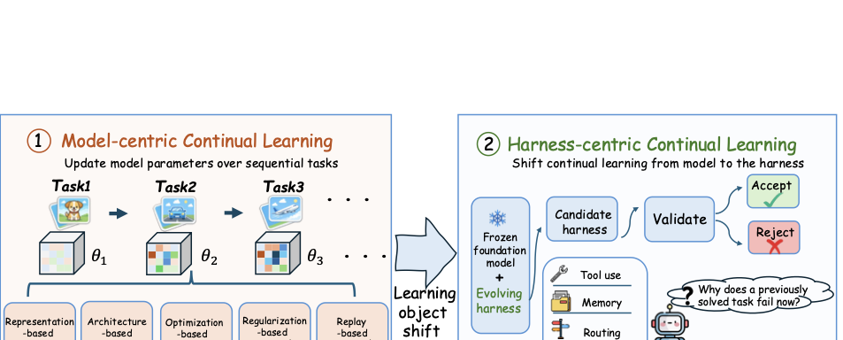
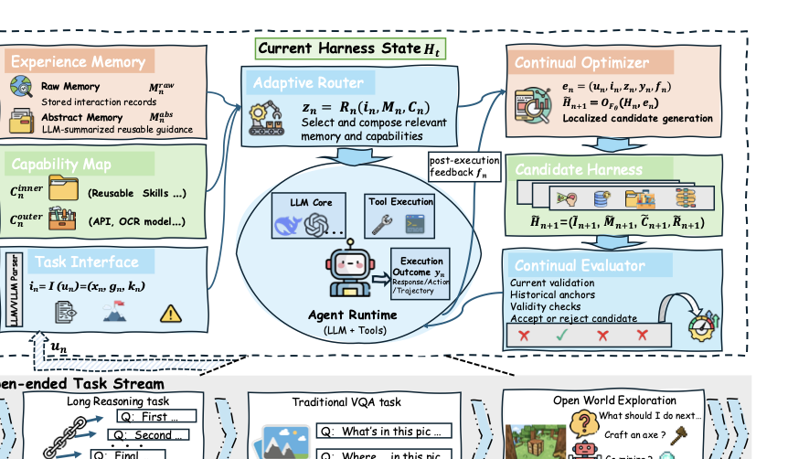
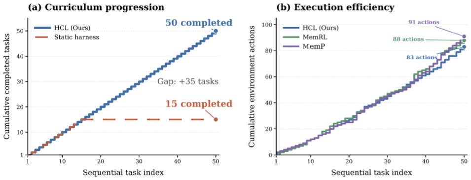
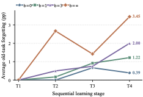
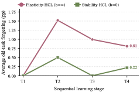

# Harness Continual Learning: Continual Adaptation Beyond Model Parameters

Source: https://arxiv.org/html/2608.19013v1

## Overview / Takeaway

Harness Continual Learning (HCL) treats the mutable infrastructure around a frozen foundation model—prompts, memories, skills, tools, and routing rules—as a continual-learning state whose updates can both acquire and forget behavior. The proposed framework versions four harness components together and uses guarded evolution: an optimizer generates candidate states, while an evaluator commits only candidates that improve the current task, respect a historical-loss budget, and remain valid. Across textual reasoning, multimodal perception, ALFWorld, and Minecraft, HCL improves final performance and supports long-horizon capability accumulation, but its results also show that harness-level forgetting is real and that unconstrained plasticity is not always optimal. The central significance is a shift from treating agent infrastructure as ad hoc configuration to treating it as a learned, retention-sensitive state with explicit deployment gates.

## Introduction

1. **Continual learning now has an important state outside model parameters**
Traditional continual learning changes parameters, representations, or model architecture, but modern agents also persistently adapt **prompts, memories, tool and skill specifications, and routing policies**. These harness contents determine what information the foundation model receives and how its outputs become actions, so a frozen model can still acquire new behavior through an evolving external state.

The conceptual shift matters because both parameter updates and harness updates can improve new behavior while disrupting earlier behavior.

2. **Harness-level forgetting extends the stability–plasticity problem to agent infrastructure**
A new memory can change evidence retrieved for an old query, a revised skill can alter tool use, and a routing edit can break a previously successful workflow. An earlier correct answer, valid tool call, or successful action trajectory can therefore become a failure even though the foundation model is unchanged. **Harness-level forgetting** names this loss of behavior that had become reliable under an earlier deployed harness.

3. **HCL studies sequences of deployed harness states rather than one-off optimization**
Conventional harness optimization typically searches for a prompt, function, or workflow that improves a current objective. HCL instead asks whether a sequence of harness updates both acquires new behavior and preserves behavior made reliable by earlier updates. The learning object is the entire jointly versioned harness, not an isolated prompt or memory component.

4. **The framework separates what evolves from how updates become deployable**
The mutable state contains a **Task Interface**, **Experience Memory**, **Capability Map**, and **Adaptive Router**. A **Continual Optimizer** proposes edits after observing execution feedback, while a **Continual Evaluator** commits the resulting candidate only if it passes current-improvement, historical-retention, and validity tests. This proposal–evaluation–commitment cycle makes retention a deployment condition rather than an assumed side effect of improvement.

5. **The evidence spans reasoning, perception, and open-world interaction**
Experiments use frozen models across textual reasoning, multimodal perception, ALFWorld, and Minecraft. The reported results show capability accumulation, failure recovery, relative gains above **10%** over corresponding baselines in multiple settings, measurable forgetting, and controllable stability–plasticity behavior. Component ablations and retention-budget sweeps probe why the framework works and when strict retention limits adaptation.

## Related Work

### Harness Engineering

1. **Contemporary harnesses repeatedly implement four execution functions**
Although agent systems use different names and architectures, their persistent runtime contents commonly include an **interface** that structures inputs, **memory** that retains records or guidance, a **capability registry** that describes tools and skills, and a **router or workflow controller** that selects and orders them. Environment adapters execute actions, while task-specific validators check boundary outcomes.

2. **The components form a coupled execution pipeline**
The interface determines what the router sees; memory and capability descriptions determine what can be selected; and the chosen workflow determines how the model acts. Systems for reasoning and acting, tool coordination, long-term memory, reflection, and executable skill acquisition already demonstrate the usefulness of individual parts, but a change in one part can propagate through the whole pipeline.

3. **Existing harness optimization lacks a general full-state retention criterion**
Prior work revises prompts, declarative programs, memories, skills, tool policies, and workflows from execution feedback, and newer systems explore configuration search, cross-layer diagnosis, and sustained self-improvement. Their usual objective is the quality of a component or next configuration on a current task or target distribution. Repeated improvement does not itself ensure that the complete mutable harness retains behavior acquired through earlier committed updates.

### Model-Centric Continual Learning

1. **Classical continual learning offers complementary anti-forgetting principles**
Representation methods seek transferable features or prompts; architecture methods isolate, expand, or select modules; optimization and regularization methods constrain update trajectories; and replay methods retain or reconstruct past examples. These families mainly protect knowledge encoded in model parameters, representations, or architecture.

2. **HCL moves the learning object outside the frozen model**
HCL borrows replay, abstraction, modularity, and constrained-update ideas but implements them in memory, reusable skills, routing, and candidate evaluation. Its distinction is not that agent harnesses are editable, but that their coordinated evolution is formulated as continual learning under an explicit acquisition–retention objective.

## Harness Continual Learning

### Definition and Problem Setting

1. **A deployed harness evolves around a fixed foundation model**
Let $F_\theta$ be the foundation model and $H_n$ the deployed harness at interaction step $n$. The parameters $\theta$ never change, while a committed update to $H_n$ affects later interactions. Retention means that behavior previously reliable under a given input and execution conditions—such as a correct response, valid tool call, or goal-reaching trajectory—remains successful after later harness updates.

2. **Interaction evidence records the complete update context**
Raw interaction $\mathbf{u}_n$ is transformed into structured interaction $\mathbf{i}_n$, combined with selected memory and capabilities into execution context $\mathbf{z}_n$, and executed to produce outcome $\mathbf{y}_n$; $\mathbf{f}_n$ is post-execution feedback. The evidence tuple is

\[
\mathbf{e}_n=
\left(
\mathbf{u}_n,
\mathbf{i}_n,
\mathbf{z}_n,
\mathbf{y}_n,
\mathbf{f}_n
\right).
\]

This preserves not just the task and answer but also the representation and execution context responsible for the outcome.

3. **Candidate generation is isolated from deployment**
The optimizer uses the frozen model, deployed harness, and interaction evidence to propose

\[
\widetilde{H}_{n+1}
=
\mathcal{O}_{F_\theta}\left(H_n,\mathbf{e}_n\right).
\]

The candidate $\widetilde{H}_{n+1}$ cannot influence future interactions until an explicit binary commitment decision $G_n\in\{0,1\}$ is made.

4. **A rejected proposal leaves the entire deployed state unchanged**
Harness evolution follows

\[
H_{n+1}
=
\begin{cases}
\widetilde{H}_{n+1}, & G_n=1,\\
H_n, & G_n=0.
\end{cases}
\]

All component edits travel as one candidate. Passing the gate replaces the complete versioned state; failing it prevents any proposed component change from entering deployment.

### Harness State for Continual Learning

1. **The harness is a jointly versioned four-part state**
The learning state is

\[
H_n=\left(I_n,M_n,C_n,R_n\right),
\]

where $I_n$ is the Task Interface, $M_n$ Experience Memory, $C_n$ the Capability Map, and $R_n$ the Adaptive Router. Their prompts, processing rules, stored experience, skills, and routing specifications persist across interactions and jointly determine later behavior.

The following table clarifies what each component does during execution and what HCL can update.

| Component | Function during execution | Mutable contents |
| --- | --- | --- |
| Task Interface $I_n$ | Transforms raw interactions into structured representations. | Prompts, task templates, parsing rules, and normalization rules. |
| Experience Memory $M_n$ | Supplies concrete interactions and abstract guidance. | Raw records and LLM-generated Abstract Memory entries. |
| Capability Map $C_n$ | Supplies external operations and reusable internal skills. | Inner skills extracted from Abstract Memory. |
| Adaptive Router $R_n$ | Selects and organizes memory and capabilities. | Routing prompts, selection criteria, and workflow templates. |

2. **Joint versioning accounts for cross-component interference**
A memory edit may require a routing change; a new skill may alter which workflow should be selected; an interface revision may change how all downstream components interpret the task. HCL evaluates proposed changes as one complete candidate so that component interactions are tested before any part becomes persistent.

The framework diagram shows the execution path and the separate feedback-driven update path, including the commitment gate.

### Task Interface

1. **The interface makes input, objective, and constraints explicit**
The Task Interface maps a raw interaction into

\[
\mathbf{i}_n
=I_n(\mathbf{u}_n)
=\left(\mathbf{x}_n,\mathbf{g}_n,\mathbf{k}_n\right),
\]

where $\mathbf{x}_n$ is the available input, $\mathbf{g}_n$ the task objective, and $\mathbf{k}_n$ constraints such as output format, legal tool use, and environment restrictions. An LLM-based parser applies the interface’s prompts, templates, parsing rules, and normalization rules.

2. **Interface updates are behaviorally significant**
A unified representation lets one continual-learning pipeline handle heterogeneous task forms, but revising the interface can change task interpretation. It must therefore be versioned and evaluated with the rest of the harness rather than treated as harmless preprocessing.

### Experience Memory

1. **Memory combines concrete evidence and reusable abstraction**
Experience Memory is split into

\[
M_n=\left(M_n^{\mathrm{raw}},M_n^{\mathrm{abs}}\right),
\]

where Raw Memory preserves task-specific interactions and Abstract Memory turns them into transferable guidance.

2. **Raw Memory is bounded and preserves both success and failure evidence**
$M_n^{\mathrm{raw}}$ stores the raw input $\mathbf{u}_n$, response or action trajectory $\mathbf{y}_n$, and feedback $\mathbf{f}_n$. It keeps a fixed number of interactions from each task in arrival order, providing concrete material for replay, solution reuse, and avoiding repeated errors.

3. **Abstract Memory consolidates recurring patterns**
An LLM summarizes Raw Memory into scoped entries such as output conventions, reliable reasoning patterns, and common errors. New raw interactions can create or revise entries for related future tasks. Raw records support behavioral recovery, while abstractions support transfer.

### Capability Map

1. **Capabilities are separated by external and learned origin**
The map is

\[
C_n=\left(C_n^{\mathrm{outer}},C_n^{\mathrm{inner}}\right).
\]

Outer capabilities come from the runtime; inner capabilities are learned reusable skills distilled through continual interaction.

2. **Outer capabilities define operational contracts**
Examples include APIs, retrieval services, perception models, calculators, and environment actions. Each entry specifies function, input and output forms, invocation protocol, availability, and limitations, giving the frozen model the operations needed to obtain information and act.

3. **Inner capabilities turn memory into executable procedures**
An LLM consolidates related Abstract Memory entries into skills with explicit inputs, outputs, execution steps, and applicability scopes. Skills can be added or revised as memory evolves, allowing the executable repertoire to grow without parameter updates.

### Adaptive Router

1. **The router assembles the execution context**
Given the structured interaction, the router retrieves experience, selects capabilities, and organizes a workflow:

\[
\mathbf{z}_n=R_n\left(\mathbf{i}_n,M_n,C_n\right).
\]

The resulting context contains the task representation, selected memories and capabilities, and the execution workflow used by the frozen model and runtime.

2. **Routing must evolve with memory and skills**
As $M_n$ and $C_n$ change, the useful items and their correct ordering can change too. The router uses an LLM with routing prompts, selection criteria, and workflow templates; these specifications are themselves mutable so routing can remain aligned with the available state.

### Guarded Harness Evolution

1. **Guarded evolution turns retention into a hard deployment condition**
Candidate generation and deployment are separated because current-task improvement can regress earlier behavior. A candidate is isolated, evaluated, and committed only if it passes all three gates; otherwise the previous harness remains deployed.

### Continual Optimizer: Candidate Generation

1. **The optimizer diagnoses which harness components should change**
Given $H_n$ and $\mathbf{e}_n$, the frozen foundation model inspects the outcome, feedback, and execution context. It may revise interface prompts or parsing, record or summarize memory, add or change skills, or adjust routing and workflow rules.

2. **Multiple component edits use a sequential coordinate-style search**
Selected components are processed in a predefined order. For each component, the optimizer proposes up to $K$ alternatives one at a time, replacing only that component in the current candidate while holding the others fixed. The highest-scoring admissible alternative becomes the basis for editing the next component; if none passes, that component stays unchanged. Even after component-wise selection, deployment waits until the final candidate completes evaluation.

3. **The proposal strategy is intentionally simple but underspecified empirically**
The paper motivates sequential alternatives as a way to explore different directions while limiting repeated LLM calls, but it does not report a dedicated ablation of component order, $K$, random tie-breaking, or alternative search procedures. Those choices may affect both update quality and cost.

### Continual Evaluator: Historical Evaluation and Commitment

1. **Candidate and deployed harnesses are compared under controlled conditions**
The evaluator uses the same frozen model, decoding settings, tools, environment, and seeds for $H_n$ and $\widetilde H_{n+1}$. This is important because the gate should measure a harness change rather than sampling or runtime variation.

2. **Current improvement measures the candidate’s gain on held-out validation cases**
For current-task validation set $V_n$,

\[
\Delta_n
=P\left(\widetilde H_{n+1},V_n\right)
-P\left(H_n,V_n\right).
\]

The candidate passes when $\Delta_n\geq\delta_n$, where $P$ may be answer accuracy, tool-use success, or environment completion and $\delta_n$ is the required minimum gain.

3. **Historical retention uses evaluation-only anchors**
The evaluator maintains compact set $A_n$ containing raw inputs and task-specific success criteria from earlier cases. Anchors are selected at each task’s end using a predefined ratio of successful and failed cases, backfilling from the other group if one group is too small. They are not exposed to execution or candidate generation, reducing direct optimization leakage.

4. **Historical loss counts regressions, not aggregate score changes**
For anchor $a$, binary indicator $q(H,a)$ denotes whether harness $H$ satisfies its success criterion. Candidate-induced historical loss is

\[
D_n
=
\sum_{a\in A_n}
\mathbf{1}\!\left[
q(H_n,a)=1
\land
q\left(\widetilde H_{n+1},a\right)=0
\right].
\]

Only a solved-to-failed transition counts. A gain on another anchor does not offset it. The retention gate requires $D_n\leq B_n$; $B_n=0$ protects every anchor currently solved by $H_n$, while larger values permit controlled regressions.

5. **Validity covers both harness artifacts and task execution**
For each validity check $\ell$ in set $\mathcal L_n$,

\[
v_{n,\ell}\left(\widetilde H_{n+1}\right)\in\{0,1\}.
\]

Checks can include artifact syntax, output-schema compliance, legal tool use, task constraints, and environment consistency.

6. **Commitment is a hard conjunction of all three requirements**
For candidate $k$,

\[
G_n^{(k)}
=
\mathbf{1}\!\left[
(\Delta_n^{(k)}\geq\delta_n)
\land(D_n^{(k)}\leq B_n)
\land
\left(\forall\ell,\;v_{n,\ell}(\widetilde H_{n+1}^{(k)})=1\right)
\right].
\]

Passing candidates are ranked by a composite of current performance, validity, and retention; the highest scorer is committed, with random tie-breaking. If no candidate is admissible, $H_n$ remains deployed.

7. **The historical-loss budget is the explicit stability–plasticity control**
Smaller $B_n$ rejects more locally useful but historically damaging updates, increasing stability. Larger $B_n$ allows more aggressive adaptation. Because a committed state changes all later evidence and proposals, this budget influences the entire evolution trajectory, not only the immediate trade-off.

### Connections to Model-Centric Continual Learning

1. **Each harness component realizes a familiar continual-learning principle**
Raw Memory resembles replay; Abstract Memory and inner skills resemble transferable representation learning; capabilities and routing resemble modular architecture; and the optimizer–evaluator gate resembles constrained optimization or regularization using earlier information.

2. **The correspondence is conceptual, not an implementation equivalence**
HCL does not reproduce classical algorithms at the parameter level. Its contribution is to coordinate replay, abstraction, modularity, and protection inside one external state and govern all of them under the same acquisition–retention objective.

## Experiments

1. **The evaluation separates open-world accumulation from controlled forgetting measurement**
ALFWorld and Minecraft test capability accumulation, reuse, and recovery during interaction. Textual and multimodal streams repeatedly test all observed tasks, enabling direct measurement of harness-level forgetting. A component ablation and a historical-budget sweep investigate mechanism and trade-offs.

2. **All adaptation is isolated to harness state**
ALFWorld uses frozen **Qwen3.5-9B**; Minecraft and the main multimodal stream use frozen **Qwen3.6-27B**; textual reasoning uses frozen **DeepSeek-V4-Flash**; and the component ablation uses frozen **Qwen3.5-4B**. Comparisons within an experiment use the same model, so improvements cannot be attributed to fine-tuning.

### Evaluation Protocol

1. **Every stage tests the current and all previously observed tasks**
If $H^{(s)}$ is the harness after learning task $\mathcal D_s$, its score on earlier task $j\leq s$ is

\[
R_{s,j}=\operatorname{Eval}\left(H^{(s)},\mathcal D_j^{\mathrm{test}}\right).
\]

Current validation cases and anchors are used only by the evaluator; disjoint final test sets are used only for reporting.

2. **Final average and forgetting measure complementary outcomes**
For a (T)-task stream,

\[
\operatorname{Avg}_T
=\frac{1}{T}\sum_{j=1}^{T}R_{T,j},
\qquad
\operatorname{Fgt}_T
=\frac{1}{T-1}\sum_{j=1}^{T-1}
\left(\max_{r\in\{j,\ldots,T\}}R_{r,j}-R_{T,j}\right).
\]

$\operatorname{Avg}_T$ captures final performance across the full stream; $\operatorname{Fgt}_T$ captures the average drop of earlier tasks from their best observed score. Static and zero-shot baselines receive no forgetting score because they make no sequential updates.

3. **The two main HCL profiles differ only in historical tolerance**
**Stability-HCL** uses $B_n=0$, rejecting any update that breaks a currently solved anchor. **Plasticity-HCL** uses $B_n=\infty$, so only current improvement and validity can block a proposal. Minecraft uses the retention-oriented profile.

### Open-World Capability Accumulation

#### ALFWorld

1. **The stream contains six sequential household-task categories**
The order is **Pick-and-Place → Look-in-Light → Clean → Heat → Cool → Two-object**, with **10 adaptation episodes per category**, a maximum of **50 steps per episode**, and final reporting on **134 official evaluation episodes**. After every stage, the harness is tested on all categories seen so far.

2. **Memory reuse helps, but full harness evolution performs better overall**
RAG raises final average from the Static Harness’s **47.12%** to **55.56%** and has **1.74** average forgetting. MemP reaches **53.15% / 5.18**, and MemRL **51.51% / 5.64**. These memory-based baselines reuse experience but cannot consistently revise interface, procedures, and routing together.

3. **Stability and plasticity emphasize different ALFWorld outcomes**
Plasticity-HCL obtains the best final average, **62.98%**, and solves **100%** of Two-object episodes, but its average forgetting rises to **10.94**. Stability-HCL reaches **61.74%** with **2.64** forgetting and is best on Pick, Look, Clean, and Cool. Its balance is stronger even though RAG’s absolute forgetting is lower, because RAG’s final average is **6.18 points** worse.

The full category breakdown makes the acquisition–retention distinction visible.

| Method | Pick | Look | Clean | Heat | Cool | Two-object | Final avg. ↑ | Avg. forgetting ↓ |
| --- | ---: | ---: | ---: | ---: | ---: | ---: | ---: | ---: |
| Static Harness | 95.80 | 66.70 | 25.80 | 26.10 | 9.50 | 58.80 | 47.12 | — |
| RAG Baseline | 95.80 | 83.30 | 41.90 | 39.10 | 14.30 | 58.80 | 55.56 | 1.74 |
| MemP | 95.80 | 83.30 | 48.40 | 34.80 | 9.50 | 47.10 | 53.15 | 5.18 |
| MemRL | 87.50 | 66.70 | 29.00 | 60.90 | 23.80 | 41.20 | 51.51 | 5.64 |
| Stability-HCL | 100.00 | 83.30 | 51.60 | 30.40 | 28.60 | 76.50 | 61.74 | 2.64 |
| Plasticity-HCL | 100.00 | 77.80 | 41.90 | 39.10 | 19.00 | 100.00 | 62.98 | 10.94 |

4. **The baseline comparison is controlled but not fully repository-native**
MemP and MemRL are reimplemented inside the authors’ framework with unified data processing and action selection while retaining their algorithms. This improves infrastructure comparability, but reproduction fidelity becomes a relevant caveat because neither baseline is run from its official repository.

#### Minecraft

1. **The curriculum tests long-horizon skill growth over 50 tasks**
With frozen Qwen3.6-27B, tasks cover collection, crafting, mining, tool use, placement, smelting, and multi-step dependencies. Environment feedback enters Experience Memory, and retained skill tests serve as historical anchors. A skill addition or revision is committed only if it improves the current objective and preserves all applicable retained tests.

2. **HCL continues after the static harness plateaus**
The Static Harness progresses through **15 tasks** and then stops, while HCL completes **all 50**. This is the clearest evidence that the harness can expand behavior around a fixed model through persistent memory, skill, and workflow changes.

3. **HCL also reduces environment actions relative to memory baselines**
Across the curriculum, HCL uses **83 actions**, compared with **88 for MemRL** and **91 for MemP**. The later-trajectory gap is attributed to fewer repeated diagnosis, crafting, and recovery actions as accumulated knowledge is reused.

The progression and cumulative-action curves show both the 15-to-50 task gap and the smaller efficiency advantage over the adaptive baselines.

4. **Minecraft retention is skill-level rather than exhaustive task-level**
Completed tasks are not systematically replayed after every update. The evaluator protects retained skill tests with $B_n=0$, so the experiment demonstrates retained tested skills and uninterrupted curriculum progress, not full post-update retention across every completed task instance.

### Controlled Harness Continual Learning

#### Textual Reasoning

1. **The stream spans four distinct reasoning formats**
The order is **MuSiQue → ProofWriter → GSM8K → HotpotQA**, covering multi-hop QA, logical deduction, mathematical reasoning, and knowledge-intensive QA. Each task supplies **250 adaptation**, **50 validation**, and **500 test** examples; only the four harness components can change around frozen DeepSeek-V4-Flash.

2. **Plasticity-HCL produces the strongest overall textual result**
Plasticity-HCL reaches **64.70%** final average versus **45.50%** zero-shot and **52.20%** Stability-HCL. Its largest task gain is GSM8K, where performance rises from **49.40%** zero-shot to **92.00%**; ProofWriter rises from **42.80%** to **77.00%**, and HotpotQA from **54.80%** to **60.80%**. MuSiQue falls from the zero-shot score of **35.00%** to **29.00%**, so the advantage is broad but not universal.

3. **Strict retention still learns but sharply constrains adaptation**
Stability-HCL reports **0.00** average forgetting and improves final average by **6.70 points** over zero-shot, showing acquisition under a strict anchor gate. Its GSM8K result is only **50.40%**, however, compared with Plasticity-HCL’s **92.00%**, demonstrating the cost of the stability constraint in this run.

| Method | MuSiQue | ProofWriter | GSM8K | HotpotQA | Final avg. ↑ | Avg. forgetting ↓ |
| --- | ---: | ---: | ---: | ---: | ---: | ---: |
| DeepSeek-V4-Flash Zero-shot | 35.00 | 42.80 | 49.40 | 54.80 | 45.50 | — |
| Stability-HCL | 27.60 | 73.00 | 50.40 | 57.80 | 52.20 | 0.00 |
| Plasticity-HCL | 29.00 | 77.00 | 92.00 | 60.80 | 64.70 | 0.07 |

#### Multimodal Perception

1. **The stream requires different spatial and linguistic output schemas**
The order is **COCO detection → COCO captioning → RefCOCO grounding → VQAv2**, with **250 adaptation**, **50 validation**, and **500 test** examples per task around frozen Qwen3.6-27B. DGG provides an adaptive sequential multi-task baseline.

2. **Both HCL profiles greatly improve detection and grounding**
Zero-shot scores **4.27** on detection and **43.00** on grounding; Stability-HCL reaches **65.34** and **91.60**, while Plasticity-HCL reaches **64.14** and **90.60**. Captioning also improves from **25.47** to **39.41** under Stability-HCL. These gains support the claim that mutable interfaces and routing can organize spatial information into task-specific schemas.

3. **VQAv2 exposes a trade-off when the base model is already strong**
Zero-shot achieves **84.87** on VQAv2, ahead of Stability-HCL’s **79.33** and Plasticity-HCL’s **79.80**. HCL’s overall advantage comes from large gains on the other tasks rather than uniformly improving every capability.

4. **Stability-HCL is best on both average performance and forgetting here**
Stability-HCL reaches **68.92%** final average with **0.22** forgetting, compared with Plasticity-HCL’s **67.96% / 0.81**, DGG’s **42.73% / 0.26**, and zero-shot’s **39.40%** average. This setting shows that a stricter gate can improve the final trajectory rather than merely trading accuracy for retention.

| Method | Detection | Caption | Grounding | VQAv2 | Final avg. ↑ | Avg. forgetting ↓ |
| --- | ---: | ---: | ---: | ---: | ---: | ---: |
| Qwen3.6-27B Zero-shot | 4.27 | 25.47 | 43.00 | 84.87 | 39.40 | — |
| DGG | 29.58 | 29.77 | 48.96 | 62.60 | 42.73 | 0.26 |
| Plasticity-HCL | 64.14 | 37.31 | 90.60 | 79.80 | 67.96 | 0.81 |
| Stability-HCL | 65.34 | 39.41 | 91.60 | 79.33 | 68.92 | 0.22 |

### Stability–Plasticity Trade-off

1. **The controlled sweep varies only the historical-loss tolerance**
The current-improvement gate requires at least **two additional correct validation cases**. Validity requires at least **90% output-format compliance** and no syntax, tool-use, or environment violations. These criteria remain fixed while $B_n\equiv b$ takes values $0,1,3,\infty$.

2. **The sweep uses a larger, equalized evaluation budget**
Each textual task has **300 adaptation**, **80 validation**, and **600 test** examples, plus **80 anchors for each earlier task**. Every profile receives **40 proposal opportunities**, ten at each stage, so the budget comparison differs from the main textual experiment and should not be numerically conflated with it.

3. **Relaxing the gate monotonically increases forgetting**
Average forgetting rises from **0.39 at $b=0$** to **1.22 at $b=1$**, **2.00 at $b=3$**, and **3.45 at $b=\infty$**. The gate therefore controls historical regressions in the expected direction.

4. **Final performance is non-monotonic, favoring moderate flexibility**
The best final average is **63.46% at $b=1$**, followed by **62.04% at $b=3$**, **61.25% at $b=0$**, and **60.13% at $b=\infty$**. Unrestricted local improvement is not globally optimal because each commitment changes the memory, skills, router, future feedback, and future proposals. A locally useful destructive update can remove reusable contents needed later.

| Historical-loss tolerance | MuSiQue | ProofWriter | GSM8K | HotpotQA | Final avg. ↑ | Avg. forgetting ↓ |
| --- | ---: | ---: | ---: | ---: | ---: | ---: |
| $b=0$ | 27.83 | 73.33 | 84.33 | 59.50 | 61.25 | 0.39 |
| $b=1$ | 24.83 | 77.50 | 92.33 | 59.17 | 63.46 | 1.22 |
| $b=3$ | 26.83 | 79.83 | 83.00 | 58.50 | 62.04 | 2.00 |
| $b=\infty$ | 28.33 | 71.00 | 82.00 | 59.17 | 60.13 | 3.45 |

5. **A zero anchor-loss budget cannot guarantee zero test forgetting**
The $b=0$ run still has **0.39** test forgetting because the finite anchor set covers only a sample of historical behavior. Preserving every currently solved anchor does not ensure unchanged behavior on unseen historical test cases.

The stage-wise plots show stricter budgets suppressing forgetting throughout the stream rather than only at the final checkpoint.

### Ablation Study

1. **The ablation freezes one harness component at a time**
The controlled multimodal stream uses frozen Qwen3.5-4B, task order **COCO detection → captioning → RefCOCO grounding → VQAv2**, and **250 adaptation / 50 validation / 500 test** examples per task. Each variant keeps one component available during execution but prevents its persistent updates; the other three remain adaptive.

2. **All four editable components contribute to final performance**
Full HCL gives the highest average, **63.41%**. Freezing Capability is closest at **63.12%**, followed by Router at **62.77%**, Interface at **62.37%**, and Memory at **62.28%**. The comparatively small Capability effect is plausibly task-dependent: this perception stream needs fewer reusable executable procedures than Minecraft.

3. **Memory is especially important for both acquisition and retention**
The no-Memory variant has the largest forgetting, **0.83**, and its captioning score drops from Full HCL’s **36.09** to **28.95**. Because inner skills may be distilled from Abstract Memory, freezing Memory also removes a downstream source of new capabilities; the ablation is therefore broader than suppressing retrieval alone.

4. **Lower forgetting in restricted variants is not necessarily better**
Freezing Capability yields only **0.06** forgetting and freezing Interface **0.11**, both below Full HCL’s **0.45**, but both also reduce final performance. Less editable state can mechanically reduce interference while also limiting learning.

| Variant | Interface | Memory | Capability | Router | Final avg. ↑ | Avg. forgetting ↓ |
| --- | :---: | :---: | :---: | :---: | ---: | ---: |
| Zero-shot | — | — | — | — | 34.84 | — |
| w/o Interface update | Fixed | Updated | Updated | Updated | 62.37 | 0.11 |
| w/o Memory update | Updated | Fixed | Updated | Updated | 62.28 | 0.83 |
| w/o Capability update | Updated | Updated | Fixed | Updated | 63.12 | 0.06 |
| w/o Router update | Updated | Updated | Updated | Fixed | 62.77 | 0.14 |
| Full HCL | Updated | Updated | Updated | Updated | 63.41 | 0.45 |

5. **Per-task effects differ by component**
Interface updates are most visible for Caption and VQAv2; fixing Memory most strongly hurts Caption; and fixing the Router causes its largest decline on VQAv2. The complete scores and committed-update counts are retained in the supplement section below.

## Conclusion

1. **HCL reframes reliable agent improvement as continual learning over infrastructure**
The framework makes prompts, memories, skills, and routing a unified learned state around a frozen model. It operationalizes reliability by separating proposal from deployment and making historical retention an explicit commitment criterion.

2. **The experiments validate both the opportunity and the risk**
Harness evolution can accumulate capabilities, recover from failures, and substantially outperform static or narrower adaptive baselines. The same process produces measurable forgetting, confirming that a frozen foundation model does not make agent behavior stable when its surrounding state continues to change.

3. **The main open problems concern scale, consolidation, and coverage**
The paper identifies efficient retention evaluation, consolidation of growing harness contents, and evaluation over longer interaction streams as unresolved. The finite-anchor result adds a concrete generalization problem: retention guarantees apply only to represented success conditions, and scalable methods must decide which historical behaviors deserve protection without replaying everything.

## Supplementary Material

### Implementation and Experimental Settings

#### Harness and Evaluator Boundaries

1. **Persistent, transient, and evaluation-only states are separated**
Only $I_n,M_n,C_n,R_n$ are persistent execution-time state. Structured input $\mathbf i_n$, execution context $\mathbf z_n$, and outcome $\mathbf y_n$ are transient. Anchor set $A_n$ belongs only to the evaluator and is unavailable to execution and candidate generation.

2. **All editable artifacts enter deployment only through commitment**
The optimizer may revise interface rules, memories, inner skills, and router specifications, but none becomes persistent until the complete candidate is committed. Anchors are updated at the end of a task, then held fixed while candidates for the next task are generated and evaluated.

| Artifact | Execution or candidate-generation access | Update boundary |
| --- | --- | --- |
| Task Interface $I_n$ | Constructs $\mathbf i_n$; optimizer may revise prompts, templates, parsing, and normalization. | Changes enter $H_n$ only with a committed candidate. |
| Raw and Abstract Memory $M_n^{\mathrm{raw}},M_n^{\mathrm{abs}}$ | Supplies records and guidance; optimizer may add records or revise abstractions. | Changes enter $H_n$ only with a committed candidate. |
| Capability Map $C_n$ | Supplies capabilities; optimizer may add or revise internal skills. | Changes enter $H_n$ only with a committed candidate. |
| Adaptive Router $R_n$ | Constructs $\mathbf z_n$; optimizer may revise routing prompts, criteria, and workflows. | Changes enter $H_n$ only with a committed candidate. |
| Anchor Set $A_n$ | Evaluator-only; unavailable to execution and proposal generation. | Updated after each task, then fixed during the next task’s candidate cycle. |

#### Experimental Settings

1. **The data and reporting protocol differs by environment**
The table consolidates task order, frozen model, evaluator data, and final reporting. Counts are per task or category unless stated otherwise.

| Experiment | Stream and frozen model | Adaptation and evaluator data | Final reporting |
| --- | --- | --- | --- |
| ALFWorld main | Six categories; Qwen3.5-9B | 10 training episodes/category; up to 50 steps; evaluation on all seen categories after each stage | 134 official episodes, category macro-average, forgetting over first five categories |
| Minecraft main | 50 tasks; Qwen3.6-27B | Sequential feedback; retained skill tests as anchors | Cumulative completion, recovery events, validated skill changes; no systematic replay of every completed task |
| Textual main | MuSiQue → ProofWriter → GSM8K → HotpotQA; DeepSeek-V4-Flash | 250 adaptation + 50 validation/task | 500 test/task, final scores, average, forgetting |
| Multimodal main | Detection → captioning → grounding → VQAv2; Qwen3.6-27B | 250 adaptation + 50 validation/task | 500 test/task, final scores, average, forgetting |
| Textual budget sweep | Same textual order; DeepSeek-V4-Flash | 300 adaptation + 80 validation/task; 80 anchors/earlier task | 600 test/task; 40 proposals/profile, 10 per stage |

2. **Main profiles and the independent sweep use different gates**
Main Stability-HCL and Plasticity-HCL use $B_n=0$ and $B_n=\infty$. A main-profile candidate must improve at least one case for discrete metrics, or strictly improve the designated continuous score, without invalid output. The textual sweep instead requires two additional correct predictions among 80 validation cases, at least 90% format compliance, and compares $b\in\{0,1,3,\infty\}$.

3. **Minecraft protects retained skill tests only**
Minecraft applies $B_n=0$ to the selected retained tests. This defines a narrower skill-level retention guarantee than the repeated full-task test protocol used in controlled streams.

### Component Ablation Details

#### Ablation Configurations

1. **Disabled components remain usable but immutable**
Each ablation tests the value of persistent updating, not component removal. Zero-shot alone removes the structured HCL harness and all sequential state changes.

| Method | (I) | (M) | (C) | (R) | Fixed contents |
| --- | :---: | :---: | :---: | :---: | --- |
| Zero-shot | — | — | — | — | No structured HCL harness or persistent updates |
| Full HCL | ✓ | ✓ | ✓ | ✓ | None |
| w/o Interface update | Fixed | ✓ | ✓ | ✓ | Prompts, templates, parsing, normalization |
| w/o Memory update | ✓ | Fixed | ✓ | ✓ | Raw and Abstract Memory; removes memory-derived new skills too |
| w/o Capability update | ✓ | ✓ | Fixed | ✓ | Reusable skills |
| w/o Router update | ✓ | ✓ | ✓ | Fixed | Routing prompts, selection criteria, workflow templates |

#### Full Per-Task Results

1. **Full results expose different task sensitivities**
Detection scores cluster between **53.07 and 55.50** across HCL variants, while Caption ranges from **28.95 to 36.68**, Grounding from **86.40 to 88.00**, and VQAv2 from **73.40 to 76.87**. The overall ablation gaps are small compared with the zero-shot-to-HCL gain, suggesting redundancy and interaction among components rather than a single dominant module.

| Method | Detection | Caption | Grounding | VQAv2 | Final avg. ↑ | Avg. forgetting ↓ | Committed |
| --- | ---: | ---: | ---: | ---: | ---: | ---: | ---: |
| Zero-shot | 35.11 | 22.98 | 0.00 | 81.27 | 34.84 | — | — |
| Full HCL | 53.07 | 36.09 | 87.60 | 76.87 | 63.41 | 0.45 | 18 |
| w/o Interface update | 53.45 | 33.56 | 87.80 | 74.67 | 62.37 | 0.11 | 24 |
| w/o Memory update | 55.50 | 28.95 | 88.00 | 76.67 | 62.28 | 0.83 | 46 |
| w/o Capability update | 55.11 | 34.16 | 86.40 | 76.80 | 63.12 | 0.06 | 16 |
| w/o Router update | 53.59 | 36.68 | 87.40 | 73.40 | 62.77 | 0.14 | 4 |

2. **Commit counts are not acceptance-rate measurements**
Full HCL commits **18** candidates, while variants range from **4** without Router updates to **46** without Memory updates. Each commitment changes subsequent feedback and proposal generation, so variants follow different trajectories and do not share a common candidate sequence. Counts therefore cannot be compared as update efficiency or simple acceptance ratios.

### Anchor Success Criteria

1. **Every anchor has a fixed task-specific binary success definition**
The same raw input and criterion are applied under deployed $H_n$ and candidate $\widetilde H_{n+1}$, making $q(H,a)$ comparable across the commitment decision.

#### Textual Reasoning

1. **Textual anchors require normalized exact outcomes**

| Task | $q(H,a)=1$ when |
| --- | --- |
| MuSiQue / HotpotQA | Normalized predicted short answer exactly matches an accepted reference answer. |
| ProofWriter | Parsed entailment label exactly matches gold and output schema is valid. |
| GSM8K | Parsed final number equals gold after comma and unit normalization. |

#### Multimodal Perception

1. **Multimodal anchors combine task quality thresholds with valid schemas**

| Task | $q(H,a)=1$ when |
| --- | --- |
| COCO detection | Queried instance category is correct, matched box has IoU $\geq0.5$, and box schema is valid. |
| COCO captioning | Sentence-level CIDEr is at least 0.5 on normalized $[0,1]$ scale and caption schema is valid. |
| RefCOCO grounding | Predicted box is valid and has IoU $\geq0.5$ with the referred object. |
| VQAv2 | Standard VQA consensus score is 1.0 after answer normalization. |

#### Interactive Environments

1. **Interactive anchors require valid goal-reaching behavior**

| Environment | $q(H,a)=1$ when |
| --- | --- |
| ALFWorld | Environment goal predicate is true within 50 steps under a valid action sequence. |
| Minecraft | Retained skill test reaches its predefined inventory or world-state predicate through a valid action sequence. |

2. **Regression counting is thresholded and non-compensatory**
A RefCOCO anchor dropping from IoU **0.68 to 0.41** counts as one historical loss because it crosses the 0.5 success threshold. Improving a different anchor does not cancel that loss, which is why $D_n$ protects individual previously solved cases rather than only aggregate average performance.

## Limitations and Open Questions

1. **Finite anchors provide sampled protection rather than a behavioral guarantee**
The $b=0$ textual sweep still forgets on held-out historical tests. Anchor selection quality, coverage, and capacity are therefore central unresolved problems, especially for open-ended agents where the space of previously reliable behavior is enormous.

2. **Evaluation cost may grow with history and candidate count**
Every proposal requires current validation, historical anchors, and validity checks under controlled execution. The paper uses compact anchors and up to (K) alternatives per component, but it does not provide a detailed token, latency, environment-step, or monetary cost analysis against the baselines.

3. **The optimizer’s search choices need stronger ablation**
Component order, number (K) of alternatives, composite ranking weights, anchor composition ratio, and random tie-breaking can all redirect future evolution. Their sensitivity is not isolated, making it difficult to know how much performance comes from the HCL formulation versus a particular proposal policy.

4. **Some baseline evidence depends on framework reimplementations**
MemP and MemRL are reproduced within the common harness rather than executed from official repositories. This offers a shared interface and runtime but leaves reproduction fidelity and baseline-specific tuning as possible confounds.

5. **Open-world retention evidence is incomplete**
Minecraft demonstrates curriculum completion and retained skill tests, but completed tasks are not systematically replayed after each update. It therefore cannot measure full task-level forgetting as comprehensively as the controlled streams.

6. **Ablation effects are modest and entangled**
All four components improve final average, but differences among three-component variants and Full HCL are at most **1.13 points** in the Qwen3.5-4B multimodal study. Freezing Memory also blocks memory-derived skill creation, so component contributions are not perfectly separable.

7. **The evidence uses fixed task orders and limited stream length**
The controlled experiments use four-task streams, ALFWorld uses six categories, and Minecraft uses one 50-task curriculum. Order sensitivity, repeated distribution shifts, adversarial feedback, multi-user conflicts, and much longer-lived harnesses remain open.

8. **Mutable harness content needs consolidation and governance**
Persistent raw records, abstract guidance, and skills can become redundant, contradictory, stale, or unsafe. The paper identifies consolidation as future work but does not yet specify deletion, provenance, conflict resolution, security boundaries, or rollback mechanisms beyond rejecting the current candidate.
