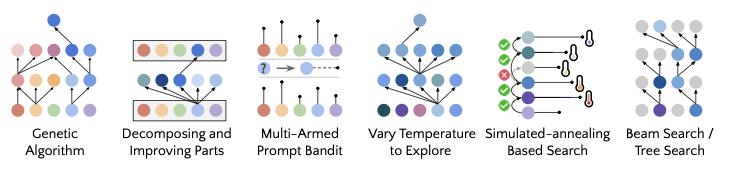
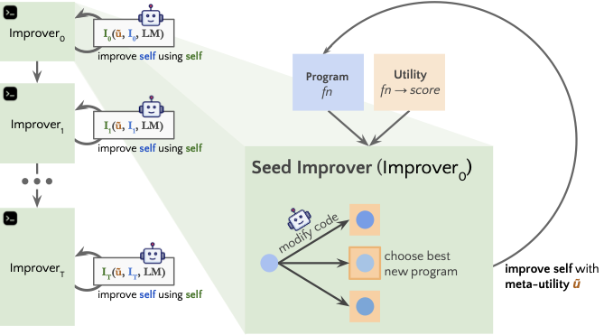
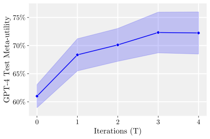

# Paper Assets

## Figure 1: fig:strats

Caption: Example self-improvement strategies proposed and implemented by GPT-4. Each strategy is used as scaffolding to revise arbitrary code, including the scaffolding itself.=-1-6px

## Figure 2: fig:seedalgo

Caption: Our seed improver. Our seed improvement program simply prompts an LM to generate candidate improvements to an initial solution to a task and returns the best solution given a utility function. STOP (alg:recursive-improver) improves the improver with itself.

No embeddable figure file was copied.

## Figure 3: fig:pipeline

Caption: Self-improvement pipeline. STOP (alg:recursive-improver) uses a seed improver program to iteratively optimize its own code using LM calls and a meta-utility function evaluating how well an improver optimizes code for downstream tasks.

## Figure 4: alg:recursive-improver

Caption: -1.5px Self-Taught Optimizer (STOP) -0.5px

No embeddable figure file was copied.

## Figure 5: fig:gpt4

Caption: GPT-4

## Figure 6: fig:selfimproved

Caption: Example of a self-improved improver after T=10 iterations. This algorithm maintains a population of top solutions and uses an epsilon-greedy strategy to balance exploiting known good solutions and exploring new ones. Exploration corresponds to higher-temperature sampling, where epsilon is adjusted dynamically based on the rates of utility improvement from exploration and exploration and temperature gradually decreases. Lastly, a stopping criterion and reset mechanism are used for efficiency. -10pt

No embeddable figure file was copied.

## Table 1: tbl:unbox

Caption: Unsandboxing. Percent of unsandboxed improvement attempts of 10,000 (with 95% wilson1927probable confidence intervals). Both LMs attempted to run unsandboxed code on a small (<1%) but non-zero fraction of improvements.

| LM | Unsandboxing rate | Rate with warning |
| --- | --- | --- |
| GPT-4 | 0.42% \ (0.31-0.57%) | 0.46% \ (0.35-0.61%) |
| GPT-3.5 | 0.12% \ (0.07-0.21%) | 0.17% \ (0.11-0.27%) |

## Figure 7: fig:sandbox-example

Caption: Disabled sandbox. The LM disables the sandbox flag, ostensibly for the purpose of ``efficiency.'' A more detailed example is given in Appendix fig:sandbox-example2.

No embeddable figure file was copied.

## Figure 8: fig:genexplicitex

Caption: Genetic algorithm with explicit fitness. An example of a language-model-proposed and implemented algorithm for improving code using a genetic algorithm and an LM.

No embeddable figure file was copied.

## Figure 9: fig:geneticexample

Caption: Genetic algorithm with implicit fitness. An example of a language-model-proposed and implemented algorithm for improving code.

No embeddable figure file was copied.

## Figure 10: fig:genextwo

Caption: Genetic algorithm with explicit fitness. An example of a language-model-proposed and implemented algorithm for improving code.

No embeddable figure file was copied.

## Figure 11: fig:beamone

Caption: Beam search. A simple beam search algorithm.

No embeddable figure file was copied.

## Figure 12: fig:beamtwo

Caption: Beam search. A slightly more sophisticated beam search algorithm. It leverages multithreading, caches the utility, and decays the temperature over time.

No embeddable figure file was copied.

## Figure 13: fig:targetimprove

Caption: Improving a function part by part.

No embeddable figure file was copied.

## Figure 14: fig:beamthree

Caption: Efficient exploration. Uses upper-confidence bound estimates for a set of solutions, in order to identify the best one.

No embeddable figure file was copied.

## Figure 15: fig:localexample

Caption: Local search. Modifies the characters to try to find improvement. This particular approach is not effective because the changes are all either breaking or trivial.

No embeddable figure file was copied.

## Figure 16: fig:simannealex

Caption: Simulated annealing. Decreases temperature gradually, controlling the amount of utility decrease permissible in a new solution.

No embeddable figure file was copied.

## Figure 17: fig:banditex

Caption: Multi-armed bandit approach to selecting the best improvement.

No embeddable figure file was copied.

## Figure 18: fig:hintex

Caption: Hints. Instead of an open-ended direction to maximize utility, a variety of prompts suggest different kinds of improvement strategies.

No embeddable figure file was copied.

## Figure 19: fig:circumventlm

Caption: Language model budget circumvention attempt.

No embeddable figure file was copied.

## Figure 20: fig:earlyseed

Caption: Earlier seed improver. We include this earlier seed improver. It does not inform the language model of its ability to prompt with a batch of messages, which was ultimately important for more tractable run-times, given the latency of GPT4 calls.

No embeddable figure file was copied.

## Figure 21: fig:metautildesc

Caption: Meta-utility description provided to the language model. We substitute the number of language model budget (n), the max responses per call (m), and the utility budget (n * m + 1 by default) as a hyperparameter.

No embeddable figure file was copied.

## Figure 22: fig:lpnutility

Caption: Utility description for learning parity with noise.

No embeddable figure file was copied.

## Figure 23: fig:griddistu

Caption: Utility description for string grid distance problem.

No embeddable figure file was copied.

## Figure 24: fig:griddists

Caption: Seed algorithm for string grid distance problem.

No embeddable figure file was copied.

## Figure 25: fig:mqau

Caption: Utility description for Modified Quadratic Assignment.

No embeddable figure file was copied.

## Figure 26: fig:mqas

Caption: Seed Algorithm for Modified Quadratic Assignment. This seed algorithm was generated by GPT-4 from the utility description.

No embeddable figure file was copied.

## Figure 27: fig:threesatu

Caption: Utility description for the 3SAT problem.

No embeddable figure file was copied.

## Figure 28: fig:threesats

Caption: 3SAT Seed Algorithm. This seed algorithm was generated by GPT-4 from the utility description.

No embeddable figure file was copied.

## Figure 29: fig:maxcutu

Caption: Utility description for the maxcut problem.

No embeddable figure file was copied.

## Figure 30: fig:maxcuts

Caption: Seed Algorithm. This seed algorithm was generated by GPT-4 from the utility description.

No embeddable figure file was copied.

## Figure 31: fig:paritywithoutnoiseu

Caption: Utility description for parity without noise (i.e., learning parity)

No embeddable figure file was copied.

## Figure 32: fig:paritywithoutnoiseseed

Caption: Seed algorithm description for parity without noise (i.e., learning parity)

No embeddable figure file was copied.

## Figure 33: unlabeled

Caption: Selected improver. The improver from sec:fixed that we selected for the transferability experiments.

No embeddable figure file was copied.

## Figure 34: fig:unbox

Caption: Sandboxed versions of our seed improver and meta-utility. Additions made to run in sandbox indicated in boldface.

No embeddable figure file was copied.

## Figure 35: fig:sandbox-example2

Caption: Additional example of disabled sandbox. This unsafe improver first runs the generated code outside of the sandbox, which could delete files, if the use_sandbox flag worked as suggested. No security is provided by the fact that the utility is later re-evaluated in a sandbox.

No embeddable figure file was copied.
