# GPTSwarm: Language Agents as Optimizable Graphs

Source: https://arxiv.org/abs/2402.16823

## Overview / Takeaway

GPTSwarm turns an LLM agent into a directed computational graph and a multi-agent system into a composite graph, making both local prompts and inter-agent communication explicit optimization targets. Its edge optimizer learns a probability distribution over acyclic graph topologies with REINFORCE, while its node optimizer improves the prompt attached to each operation from execution histories. Across MMLU, Mini Crosswords, HumanEval, and GAIA, the experiments show that learned organization can remove adversarial agents, recombine heterogeneous reasoning procedures, improve code-generation prompts online, and make tool-using swarms competitive with stronger baselines. The central result is therefore not one universal agent architecture, but a representation in which agent structure becomes searchable—tempered by substantial evaluation cost, task-specific utilities, and experiments that remain small relative to the proposed vision of very large swarms.

## 1 Introduction

1. **Hand-designed agent systems fragment into incompatible implementations**
Zero-shot and few-shot prompting expanded into structured procedures such as **Chain of Thought**, **ReAct**, **Tree of Thought**, **Reflexion**, and **Graph of Thought**, while frameworks such as **AutoGPT**, **BabyAGI**, **LangChain**, and **LlamaIndex** added tools and function calls. Multi-agent systems layer role specialization and natural-language communication on top, but each new prompting scheme and workflow tends to create another manually engineered codebase.

2. **A society of mind motivates a compositional graph abstraction**
A **node** represents an operation such as an LLM call, tool use, function call, or embodied action; a connected set of nodes forms an **agent graph**; and multiple agent graphs connected by communication edges form a **swarm**. This hierarchy separates primitive capabilities from orchestration and can express familiar structures including COT, TOT, and Self-Consistency.

The framework’s abstraction is easiest to see in the paper’s overview: node functions compose into agents, and communication edges compose agents into a swarm whose prompts and topology can both be optimized.

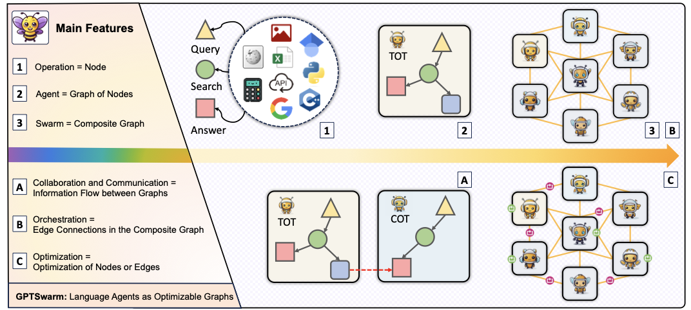

3. **Graph structure exposes two complementary optimization surfaces**
**Node optimization** refines the prompt associated with an individual LLM operation, whereas **edge optimization** changes which nodes communicate. The latter can improve orchestration online during task solving or produce a learned connectivity distribution transferable to another task or model.

4. **The proof of concept targets both recovery and discovery**
MMLU tests whether optimization can disconnect harmful agents; Mini Crosswords tests whether it can discover useful combinations of TOT, Reflexion, and COT; HumanEval tests whether node prompts can improve from execution feedback; and GAIA demonstrates the engineering framework’s ability to combine reasoning, browsing, file analysis, and multimodal operations.

5. **The contribution combines a formalism, software framework, and optimizers**
The paper claims four contributions: a unified computational-graph description of language-agent systems; an open-source implementation for recombining reusable operations; automatic prompt and edge optimization; and empirical validation on **MMLU**, **Mini Crosswords**, **HumanEval**, and **GAIA**.

## 2 GPTSwarm

### 2.1 Language Agents as Graphs

1. **The abstraction has three nested levels**
Nodes are fundamental computations, agent graphs are coherent functional entities built from nodes, and composite graphs are societies of agents. Edges inside an agent determine execution order and information flow, while edges crossing agent boundaries create collaboration channels.

2. **Modularity is intended to make collective capability exceed individual capability**
Different agents can encapsulate different reasoning procedures, tools, or roles. Their composition is not merely an ensemble: the topology determines which intermediate results reach which downstream computations, allowing the collective computation to implement a new algorithm.

### 2.2 Graph Definition

1. **A single agent is a directed acyclic computational graph**
An agent is defined as

\[
G=(N,E,F,o),
\]

where $N$ is the node set, $E\subset N\times N$ is the directed-edge set, $F=\{f_n\}_{n\in N}$ contains each node’s computational routine, and $o\in N$ is the output node. GPTSwarm focuses on **DAGs**, so execution follows a topological ordering and never revisits a node.

2. **Node execution combines the original task with predecessor outputs**
For input $x$, node $n$ receives the context

\[
z_n=\{f_v(z_v,x):v\in \operatorname{pre}(n)\}
\]

from its predecessors and emits $f_n(z_n,x)$. The overall prediction is the output-node result $\hat y=G(x)=f_o(z_o,x)$. Source nodes have empty context, and a routine may ignore $x$ when only upstream context is relevant.

3. **Natural-language strings are an implementation choice rather than a formal restriction**
The experiments pass strings between nodes, but the graph permits other data types. A node can query an LLM, formulate a web-search query, invoke a tool, transform multimodal data, or simply aggregate earlier results.

4. **A swarm adds cross-agent edges to the union of its component graphs**
Given $K$ agents $\{G_k=(N_k,E_k,F_k,o_k)\}_{k=1}^{K}$, define $N'=\bigcup_k N_k$, $E'=\bigcup_k E_k$, and $F'=\bigcup_k F_k$. A selected set of cross-agent connections

\[
\mathcal E\subseteq \bigcup_{i\ne j}N_i\times N_j
\]

produces the composite graph $G_{\mathcal E}=(N',E'\cup\mathcal E,F',o')$, provided the result remains acyclic. These new edges are precisely the communication channels optimized by GPTSwarm.

### 2.3 Edge Optimization

1. **The direct objective is combinatorial**
For task $\tau$ and graph utility $u_\tau$, choosing among $d$ potential binary edges produces up to $2^d$ configurations. The discrete goal is $\max_{\mathcal E}u_\tau(G_{\mathcal E})$, subject to the DAG constraint.

2. **Optimization moves from individual graphs to a distribution over graphs**
LLM tokenization makes the utility non-differentiable, and even differentiable graph sampling would not remove that obstacle. GPTSwarm therefore optimizes a continuous parameter vector $\theta$ governing a graph distribution:

\[
\arg\max_{\theta\in\Theta}\;\mathbb E_{G'\sim D_\theta}[u_\tau(G')].
\]

This changes the output from one fixed graph into a stochastic orchestration policy from which graph instances can be sampled.

3. **Each potential edge has an inclusion probability constrained by acyclicity**
The parameter vector $\theta=[\theta_1;\ldots;\theta_d]\in[0,1]^d$ assigns an inclusion probability to every potential cross-agent edge. Sampling begins from the required intra-agent graph and considers potential edges sequentially: an edge is sampled with probability $\theta_i$ only when inserting it would not create a cycle; cycle-producing edges receive probability zero.

4. **REINFORCE supplies an unbiased score-function gradient**
For $M$ independently sampled graphs and unbiased utility estimates $\hat u_\tau$, the gradient estimator is

\[
\nabla_\theta\mathbb E_{G\sim D_\theta}[u_\tau(G)]
\approx
\frac{1}{M}\sum_{i=1}^{M}\hat u_\tau(G_i)\nabla_\theta\log p_\theta(G_i).
\]

The algorithm repeatedly samples $M$ graphs, evaluates them, and applies gradient ascent; the experiments substitute **Adam** for vanilla ascent.

5. **The learned probability matrix encodes routing preferences rather than a hand-authored workflow**
Edges whose downstream information improves the task utility become more probable, while unhelpful or adversarial communication is suppressed. This is why the same optimizer can act as a robustness filter on MMLU and as an algorithm-composition mechanism on Mini Crosswords.

### 2.4 Node Optimization

1. **Every LLM-backed operation has a local prompt parameter**
A parameterized graph is $G^P=(N,E,F^P,o)$ with routines $F^P=\{f_n^{p_n}\}$, where $p_n$ is node $n$’s prompt. Each node also has a natural-language functional description $d_n$, such as “a Python code generator,” so an improver can reason about the operation’s intended role.

2. **Local updates approximate a coupled prompt-optimization problem**
Prompts interact because one node’s text becomes another node’s context. GPTSwarm nevertheless exploits separation of concerns and updates each $p_n$ while treating the other prompts as fixed, avoiding a Cartesian search across all prompt combinations.

3. **Execution histories provide optimization evidence**
Each node begins with $h_n=\varnothing$. After executing $G^P(x)$, GPTSwarm records the node input $((z_n,x))$ and output $f_n^{p_n}(z_n,x)$ in $h_n$, including quality annotations when available. A generic prompt improver $I$ then updates

\[
p_n\leftarrow I(h_n,p_n,d_n).
\]

The abstraction can accommodate OPRO-like language-model improvers, demonstration selection, or other prompt-search procedures.

4. **Node and edge optimization can be composed sequentially**
The framework does not require choosing one optimization level. The appendix first learns the Mini Crosswords connectivity distribution and then uses UCB1 to select node-level demonstration examples, improving accuracy beyond edge optimization alone.

### 2.5 General Applicability

1. **Reusable components extend beyond LLM inference**
The implementation supplies web search, index-based memory, and **41 file-analysis types**, alongside multiple agent templates. Reusing nodes and agent subgraphs is meant to provide the flexibility of general agent frameworks while keeping integration and routing explicit.

2. **The key engineering advantage is integration**
An inventory of “LLM + memory + planning + tools” does not specify how components exchange information. GPTSwarm’s edges encode that missing integration layer and make routing learnable instead of implicit in application code.

## 3 Experiments

### 3.1 MMLU

#### 3.1.1 Adversarial setting

1. **The robustness test deliberately balances truthful and harmful agents**
Each swarm contains $k$ direct Input-Output agents and $k$ adversarial agents prompted to return wrong answers on four-choice **MMLU** questions. A majority-vote output node introduces no corrective LLM reasoning, so recovery requires the learned topology to suppress harmful information. A single truthful IO agent is the target baseline.

2. **Training uses sparse task feedback and stochastic graph samples**
The evaluation score uses the first **10% of the validation set**, totaling **153 questions**. Edge optimization runs for **200 iterations**; each iteration samples **four graphs**, each assessed on one MMLU development problem. All agents use **GPT-4-Turbo**, temperature **0.2**, and Adam with learning rate **0.1** over edge logits.

3. **Optimized swarms recover the single-agent baseline across scale**
The optimized configurations approach the direct-answer score even as the number of adversarial nodes grows. Full graphs and graphs sampled from the initial $D_{\mathbf{0.5}}$ distribution remain vulnerable, showing that simply connecting more agents is not sufficient.

Figure 2 contrasts the learned swarms with dense, random, and direct-answer controls; the optimizer recovers performance by learning selective communication.

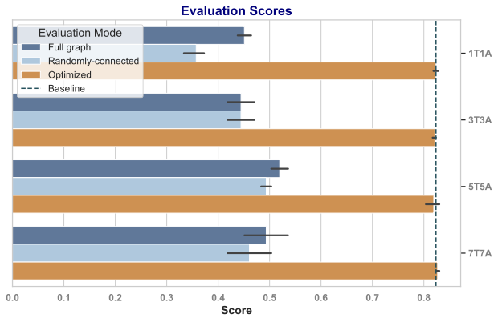

4. **Potential-edge count grows quadratically and optimization time rises sharply**
The 1T1A, 3T3A, 5T5A, and 7T7A settings contain **4, 36, 100, and 196** potential edges and require approximately **9, 23, 58, and 95 minutes**, respectively. This scaling is already visible with only 14 non-decision nodes.

5. **A concrete optimized graph prunes both edges and isolated agents**
In the 2T2A case study, all cross-agent connections are initially potential dotted edges. After optimization, only realized connections remain and disconnected agents are removed, turning learned low probabilities into an interpretable routing structure.

The before/after topology makes the robustness mechanism concrete: optimization changes who can influence the decision rather than repairing adversarial text after it is produced.

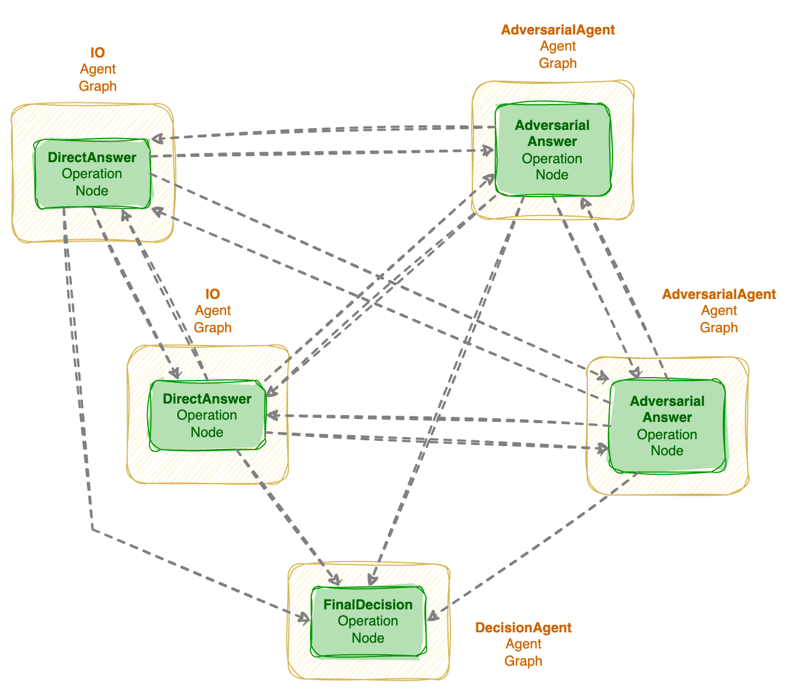

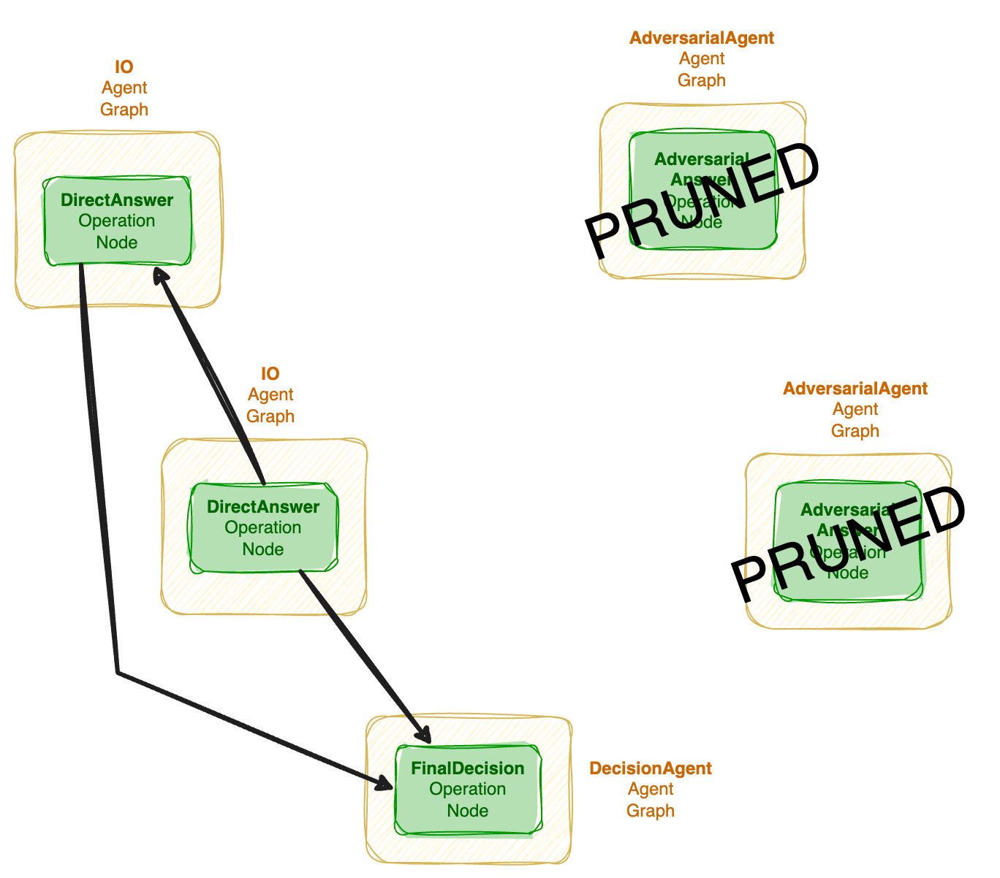

#### 3.1.2 Collaborative setting

1. **Identical agents provide no gain over the truthful baseline**
The adversarial study’s truthful IO agents share the same prompt, so removing bad agents merely restores single-agent accuracy. Redundant agents do not automatically create useful diversity.

2. **Role diversity enables a measurable collaborative gain**
A swarm of **seven IO agents** receives roles sampled from 20 professions, including botanist, data scientist, journalist, anthropologist, ethicist, nurse, meteorologist, sommelier, and cybersecurity expert. The optimized swarm improves the single-agent baseline by **2.1% ± 1.1%**, averaged over **five training seeds**, supporting the claim that topology can exploit heterogeneous perspectives.

### 3.2 Mini Crosswords

1. **The experiment searches over combinations of three distinct reasoning algorithms**
The swarm combines a **TOT** agent that branches candidate states, a **Reflexion** agent that greedily proposes a solution and revises it from LLM-critic feedback, and a three-node **COT** agent whose nodes brute-force candidate subsets scored by an LLM. Twenty 5×5 crossword problems are used, matching earlier evaluations.

The composed graph can express workflows that no single component implements; the visualization below shows representative heterogeneous agent graphs constructed by the framework.

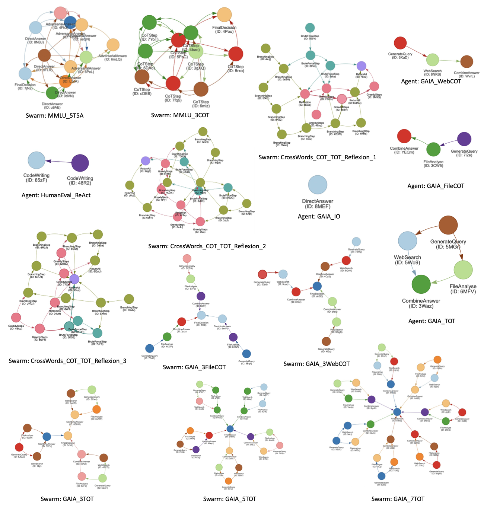

2. **Utility is best-state word accuracy across all returned candidates**
Each graph may return multiple solutions. Its utility is the fraction of words correct in the best returned state, so the optimizer rewards routes that preserve or generate at least one strong candidate rather than only the output sequence’s average quality.

3. **The edge-search configuration is deliberately sparse**
Edge probabilities begin at **0.10**, the learning rate is **0.4**, and each gradient estimate samples **$M=20$ graphs**, each evaluated on one crossword. Optimization and primary evaluation use **GPT-3.5-Turbo** at temperature **0**, and each evaluation averages 20 sampled graphs over distinct questions.

4. **Probability dynamics stabilize after an initially chaotic phase**
Across iterations 0, 2, 4, 6, 8, and 10, the adjacency-like probability matrices change irregularly at first and become nearly monotonic after iteration 6. The behavior suggests that REINFORCE first explores competing routes and then commits to consistently rewarded communication patterns.

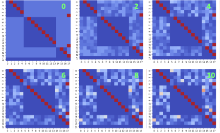

5. **Ten edge-optimization steps yield a large GPT-3.5-Turbo gain**
Mean best-state word accuracy increases from **0.465 ± 0.0509** under the initial distribution to **0.575 ± 0.0275**, averaged over **three runs** with standard error. A simple best-of-three aggregation across the standalone agents reaches only **0.320 ± 0.0415**, indicating that learned interaction—not merely access to three outputs—drives the gain.

6. **A matched-density control isolates topology from raw computation**
Graphs sampled from the learned distribution contain **32.76 ± 1.93** edges on average; a fixed distribution with every probability set to **0.125** contains **32.80 ± 0.11**. Despite nearly identical edge counts, the fixed distribution scores **0.510 ± 0.0552**, below the learned distribution’s **0.575**, so denser computation cannot fully explain the improvement.

7. **A learned topology transfers from GPT-3.5-Turbo to GPT-4-Turbo**
One randomly selected optimized distribution evaluated with GPT-4-Turbo reaches **0.800 ± 0.0616**, exceeding the published GPT-4 TOT result of **0.675** and the paper’s GPT-4-Turbo rerun of TOT at **0.668**. Only one learned distribution is tested with GPT-4-Turbo because API cost makes a multi-seed transfer evaluation expensive.

Figure 4 summarizes both the GPT-3.5-Turbo optimization gain and the cross-model GPT-4-Turbo result.

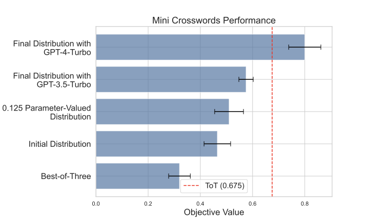

8. **Sequential node optimization raises performance again**
Starting from the **0.575 ± 0.0275** learned edge distribution, a UCB1 node optimizer selects either one execution-history demonstration or no demonstration for each node over **100 iterations**. Accuracy reaches **0.668 ± 0.0060**, showing that prompt-level adaptation and topology search capture complementary improvements.

9. **The TOT implementation compresses a large logical tree into reusable chain nodes**
The agent searches a perfect binary tree of depth **8**, which would naively require $2^9-1=511$ graph nodes. GPTSwarm instead uses a chain of eight branching operations, each emitting two solutions per input, demonstrating that graph nodes can represent higher-order procedural operations rather than only one vertex in the conceptual search tree.

### 3.3 HumanEval

1. **Node optimization replaces manual prompt engineering with demonstration selection**
A ReAct-style code agent first writes a Python solution. If the problem-statement tests fail, it receives execution feedback and rewrites the program. The optimizer scores node input-output examples by whether their final program passes those tests and uses successful examples as prompt demonstrations.

2. **The online update rule has bounded memory and explicit validation**
Nodes update after every **four new problems** and keep at most **four demonstration examples**. At an update, the existing set competes against a candidate set augmented with positive examples from the four newest problems; each option is evaluated on the node’s **ten most recent inputs**, and the higher unit-test pass count wins.

3. **Optimization improves full-dataset accuracy during the first five iterations**
Across three repeated experiments, most improvement occurs in iterations 1–5 of the eight-iteration curve. In a continuous online setting without resetting between evaluation and adaptation, accuracy rises from **0.76** without optimization to **0.88 ± 0.007** with optimization.

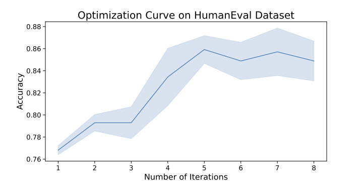

4. **The evaluation signal is weaker than the benchmark’s hidden tests**
Demonstration selection uses only unit tests included in each prompt, not HumanEval’s full hidden evaluation suite. This makes the update inexpensive and online, but creates a potential mismatch between the local feedback used for optimization and the metric ultimately reported.

### 3.4 GAIA

1. **GAIA tests framework breadth rather than graph optimization**
The benchmark requires reasoning, web access, file analysis, multimodal processing, and other tools. These experiments use neither edge nor node optimization; they test whether the graph framework can assemble useful multi-tool agents and same-type swarms.

2. **The strongest reported swarm uses seven TOT agents and self-consistency**
Candidate agents contain operations such as **GenerateQuery**, **WebSearch**, **FileAnalyzer**, and **CombinedAnswer**, and an LLM-based final-decision node selects a response. Prompt-based self-consistency outperforms an instruction to choose the “best” candidate.

3. **GPTSwarm nearly doubles the best plain-model average**
Across five runs, GPTSwarm scores **30.56 ± 3.25** on Level 1, **20.93 ± 1.27** on Level 2, **3.85 ± 2.43** on Level 3, and **18.45 average**. GPT-4-Turbo scores 20.75, 5.81, 0, and 9.70 respectively, making GPTSwarm’s reported relative improvements **47.3%**, **260.2%**, **0%**, and **90.2%**.

| Method | Level 1 | Level 2 | Level 3 | Average |
| --- | ---: | ---: | ---: | ---: |
| GPT-3.5 | 7.55 | 4.65 | 0 | 4.85 |
| GPT-4 | 15.09 | 2.33 | 0 | 6.06 |
| GPT-4-Turbo | 20.75 | 5.81 | 0 | 9.70 |
| AutoGPT | 13.21 | 0 | 3.85 | 4.85 |
| **GPTSwarm** | **30.56 ± 3.25** | **20.93 ± 1.27** | **3.85 ± 2.43** | **18.45** |
| GPT-4 with manually selected plugins | 30.30 | 9.70 | 0 | 14.6 |

4. **Tools and agent count both help, but latency grows roughly linearly**
On Level 1, a single direct-answer agent scores **16.60 ± 3.02** in about **13.37 s**. A single full TOT agent scores **25.66 ± 3.50** in **71.31 s**, while seven full TOT agents with self-consistency score **30.56 ± 3.25** in **414.89 s**. Three full TOT agents using “choose best” reach **30.18 ± 4.30**, slightly above the corresponding self-consistency mean of **28.30 ± 3.38**, but the seven-agent self-consistent swarm is best overall.

5. **Web access is a major bottleneck in the implementation**
The task analysis identifies web browsing as necessary for **43.9%** of GAIA questions. GPTSwarm can download URLs embedded in questions or issue Google searches, but cannot navigate arbitrary websites, leaving a clear path for improvement.

The capability mix in GAIA explains why graph composition matters: many questions require several different operations rather than more copies of a single reasoning prompt.

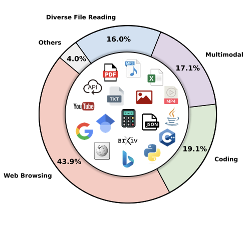

## 4 Related Work

### 4.1 LLM-based Autonomous Agents

1. **GPTSwarm generalizes both reasoning procedures and tool-using frameworks**
COT, ReAct, Reflexion, TOT, and exchange-of-thoughts primarily structure inference; AutoGPT, LangChain, LlamaIndex, and XAgent expose tools; role-based systems such as CAMEL, ChatDev, AutoGen, and MetaGPT prescribe communication. GPTSwarm’s distinctive claim is that the same node/edge representation can encode these systems and then optimize their prompts and collaboration structure.

2. **The method changes social structure from a design choice into a search variable**
Earlier natural-language societies of mind use task-specific social organizations without optimizing them. GPTSwarm treats the connections between specialized agents as stochastic parameters, so role diversity can be exploited without manually choosing a fixed interaction topology.

### 4.2 Language Agents with Graphs

1. **Graph of Thought and LangGraph cover only parts of GPTSwarm’s target**
Graph of Thought expresses prompting schemes but not the broader operation space of tools and external functions. LangGraph supports stateful, possibly cyclic multi-actor applications, whereas GPTSwarm restricts optimization to DAGs and emphasizes hierarchical composition plus empirical optimization.

2. **The two optimization levels distinguish representation from execution alone**
Prompt optimizers act on node parameters and REINFORCE acts on potential edges. The graph is therefore not only a convenient visual or software abstraction; it defines the mutable substrate for automated improvement.

### 4.3 Optimizing LLM Inference and Self-Improvement

1. **Prompt and topology search are framed as meta-learning**
Because an LLM learns from in-context instructions and examples, modifying prompts and inference structure configures a learning procedure. GPTSwarm relates this to broader meta-learning that automates architectures, hyperparameters, and learning algorithms.

2. **Node optimization trades global combinatorial search for iterative conditional updates**
DSPy generates node candidates and searches their Cartesian product; GPTSwarm improves each node individually using histories collected while all current prompts jointly execute. This reduces the combinatorial burden but provides no guarantee that coordinate-wise prompt changes find the best coupled configuration.

3. **Edge optimization differs from heuristic agent pruning**
DyLAN scores agents and prunes a chosen number with a fixed dynamic scheme. GPTSwarm learns probabilities over potential edges, allowing selective routing between nodes rather than only keeping or deleting entire agents.

4. **STOP is the explicit self-improvement predecessor**
STOP applies an improver program to itself, jointly changing prompts and inference structure. GPTSwarm cites it as a related self-referential system but constrains its own structural optimization to graph edges and its prompt optimization to individual nodes.

## 5 Conclusion

1. **The main result is an optimizable representation of agent systems**
GPTSwarm unifies agents, tools, prompting schemes, and multi-agent collaboration as composable computational graphs. Once represented this way, prompt improvement and communication routing become explicit optimization problems rather than manual application logic.

2. **Evidence spans robustness, reasoning composition, online learning, and tool orchestration**
Edge learning removes adversarial influence on MMLU and improves heterogeneous reasoning on Mini Crosswords; node learning improves HumanEval; and fixed GAIA compositions show the framework can host diverse tools. The breadth supports the abstraction, although no single experiment jointly optimizes both graph levels at large scale.

## Impact Statement

1. **Capability and automation create both benefits and social risks**
More efficient and effective agent systems may improve machine-learning applications, but greater autonomy can also contribute to job displacement, biased or unethical behavior, and misuse. The paper calls for safeguards, oversight, and ethical guidelines, but implements no dedicated safety mechanism beyond task utilities, DAG constraints, and the demonstrated pruning of adversarial agents.

## Appendix A The GPTSwarm Framework

### A.1 The Vision

1. **Integration is more informative than a component checklist**
Describing an agent as an LLM plus memory, planning, and tools enumerates ingredients without specifying how they interact. GPTSwarm represents integration directly through edges so that orchestration and routing can be optimized as swarm size grows.

2. **The long-term scaling claim greatly exceeds the evaluated regime**
The vision anticipates swarms of millions or billions of agents, whereas the experiments use at most fourteen non-decision agents in the MMLU scaling study and seven agents in GAIA. The gap makes scalable sparse routing, distributed execution, and robust evaluation central open problems.

### A.2 Class Diagram

1. **The implementation mirrors the mathematical hierarchy**
Python and PyTorch classes directly represent **Node**, **Graph**, and **CompositeGraph**; each node stores adjacency information. Separate operation classes such as DirectAnswer and WebSearch and agent classes such as IO and TOT make new components pluggable.

2. **Interfaces isolate models, data, prompts, and evaluation**
An LLM interface wraps backends, with the primary implementation wrapping the OpenAI API. **Dataset** loads benchmarks, **PromptSet** specializes node behavior for a dataset, and **Evaluator** coordinates edge and node optimization. Async/await parallelizes independent tasks.

The class diagram shows how graph abstractions, agent templates, operations, model interfaces, datasets, and evaluators meet in the implementation.

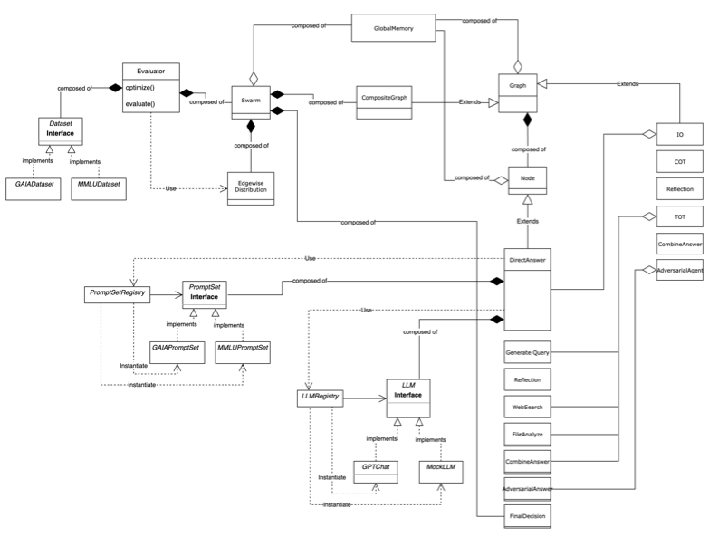

## Appendix B Swarm examples

1. **Existing reasoning agents compose without rewriting their internals**
A representative swarm contains one TOT agent, one IO agent, and a final Decision agent. The example illustrates the key reuse boundary: complete agent graphs can become subgraphs inside a larger composite computation.

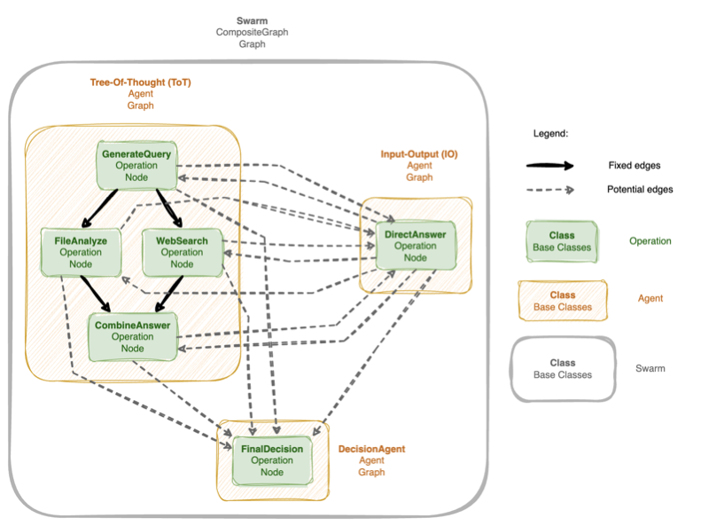

## Appendix D Additional Experiments

### D.1 Comparing GPTSwarm with Multiagent Debate and DyLAN on MMLU

1. **DyLAN is slightly more accurate but substantially more expensive**
With three truthful and three adversarial agents, GPTSwarm scores **0.8301**, versus **0.8366** for DyLAN—a difference of **0.0065**—and **0.5751** for Multiagent Debate. The more elaborate DyLAN debate and pruning scheme is offered as the likely source of its small accuracy advantage.

2. **GPTSwarm reduces optimization and inference resource use**
GPTSwarm optimization costs **\$5.32**, uses 361,812 prompt and 56,770 completion tokens, and takes **0.9 h**; DyLAN optimization costs **\$105.93**, uses 5,671,276 prompt and 1,640,566 completion tokens, and takes **25.4 h**. GPTSwarm inference costs **\$1.82** and **0.31 h**, compared with DyLAN’s **\$14.99** and **4.75 h**.

| Method / phase | Cost (USD) | Prompt tokens | Completion tokens | Time (h) | Accuracy |
| --- | ---: | ---: | ---: | ---: | ---: |
| Multiagent Debate | 32.80 | 1,689,960 | 530,005 | 8.36 | 0.5751 |
| DyLAN optimization | 105.93 | 5,671,276 | 1,640,566 | 25.40 | — |
| DyLAN inference | 14.99 | 628,009 | 290,472 | 4.75 | **0.8366** |
| GPTSwarm optimization | 5.32 | 361,812 | 56,770 | 0.90 | — |
| GPTSwarm inference | 1.82 | 113,233 | 22,923 | 0.31 | 0.8301 |

### D.2 Applying Node Optimization after Edge Optimization

1. **A bandit turns execution traces into demonstrations**
For each Mini Crosswords node, UCB1 chooses between retaining the original prompt and adding one input-output pair from the 20-problem execution history. Options that previously filled more words correctly receive preference, and the procedure runs for **100 iterations**.

2. **The combined optimizer outperforms either initial structure or edges alone**
Accuracy progresses from **0.465 ± 0.0509** initially to **0.575 ± 0.0275** after ten edge steps and **0.668 ± 0.0060** after node optimization. This is the paper’s clearest evidence that the two mutable substrates are complementary.

## Appendix E Experimental Details

1. **A virtual output agent standardizes decisions**
Multi-agent experiments add a single-node virtual agent as the composite output. Its implementation varies between majority vote and prompt-based self-consistency; unless specified, it is excluded from the communication edges being optimized.

2. **Potential edges are exhaustive across different agents**
Every ordered node pair drawn from distinct agents is potentially connectable, except edges leaving the composite output node. This broad search space enables unexpected routes but produces the quadratic edge growth seen in MMLU.

3. **The implementation uses Adam and dated preview models**
All edge experiments use Adam with $\beta_1=0.9$ and $\beta_2=0.999$, with task-specific learning rates. Model identifiers are **gpt-4-1106-preview**, **gpt-3.5-turbo-1106**, and, for GAIA vision tasks, **gpt-4-1106-vision-preview**, so exact reproduction depends on unavailable or changed hosted-model endpoints.

4. **HumanEval updates explicitly compare old and augmented demonstrations**
For node $n$, let $p_n^1$ be the existing demonstrations, $p_n^2$ the old positives plus newly positive examples subsampled to four, and $Z$ the ten most recent inputs. GPTSwarm chooses

\[
i^*=\arg\max_{i\in\{1,2\}}\sum_{z\in Z}\mathbbm{1}_z\!\left(f_n^{p_n^i}(z,q_z)\right),
\]

where $\mathbbm{1}_z$ indicates whether the generated program passes the tests embedded in input $z$ and $q_z$ is the original problem. This makes prompt adaptation a small validated selection problem rather than unrestricted prompt rewriting.

5. **Mini Crosswords shifts utility to reduce REINFORCE variance**
The optimizer subtracts a constant **0.4** from best-state word accuracy. A perfect board therefore has utility **0.6** and an empty board **−0.4**; because this is a constant baseline, it changes gradient variance rather than the optimum.

6. **GAIA’s nodes implement a staged information workflow**
GenerateQuery decides what evidence is missing, WebSearch proposes three targeted queries, DistillWebSearch summarizes useful evidence, FileAnalyse extracts query-relevant content, CombinedAnswer integrates sources, and FinalDecision copies the most suitable candidate under answer-format constraints. The pipeline demonstrates graph-level tool orchestration but remains manually designed in this experiment.

## Appendix F Resource Requirements

1. **Optimization can cost far more than a single baseline run**
Mini Crosswords edge optimization with GPT-3.5-Turbo costs **\$77.42**, consumes 50,394,028 prompt and 13,511,265 completion tokens, and takes **2.82 h**. Evaluating the learned distribution with GPT-4 costs **\$377.54** and takes **5.56 h**, explaining why only one transferred distribution is tested.

2. **HumanEval optimization trades roughly eighteen times the cost for higher accuracy**
The unoptimized run costs **\$1.61**, consumes 59,646 prompt and 33,951 completion tokens, and takes **0.68 h**. The optimized run costs **\$28.46**, consumes 2,298,140 prompt and 182,594 completion tokens, and takes **1.49 h**.

3. **Resource results reveal a quality-cost frontier rather than free self-improvement**
The full table shows that search requires many more calls than inference, and stronger-model evaluation can dominate dollar cost even after optimizing with a cheaper model. Any deployment must amortize optimization over enough future tasks or value robustness and accuracy enough to justify this overhead.

| Representative experiment | Cost (USD) | Prompt tokens | Completion tokens | Time (h) |
| --- | ---: | ---: | ---: | ---: |
| TOT — Mini Crosswords | 65.61 | 1,515,826 | 2,013,511 | 8.50 |
| GPTSwarm Crosswords edge optimization, GPT-3.5T | 77.42 | 50,394,028 | 13,511,265 | 2.82 |
| GPTSwarm Crosswords learned-graph evaluation, GPT-4 | 377.54 | 13,137,160 | 8,205,522 | 5.56 |
| GPTSwarm HumanEval without optimization | 1.61 | 59,646 | 33,951 | 0.68 |
| GPTSwarm HumanEval with optimization | 28.46 | 2,298,140 | 182,594 | 1.49 |
| GPTSwarm GAIA Level 1 TOT agent | 2.21 | 123,801 | 32,599 | 1.05 |

## Appendix G Limitation and Future Work

1. **Only cross-agent communication topology is structurally optimized**
Internal agent topology remains fixed, even though dynamically adding, deleting, or rewiring internal nodes could change task planning. The node optimizer changes prompts, not the graph structure inside an agent.

2. **Scaling beyond 100 agents is unresolved**
The exhaustive cross-agent candidate set makes communication efficiency and robustness increasingly difficult as the swarm grows. Sparse candidate generation, hierarchical routing, asynchronous credit assignment, and distributed evaluation are necessary before the million-agent vision is plausible.

3. **Task-specific utility limits general claims about self-improvement**
Every learned structure is driven by a narrow evaluator: MMLU correctness, crossword word accuracy, or prompt-provided unit tests. The paper does not test robustness to evaluator gaming, distribution shift, hidden-test overfitting, or jointly optimizing an evaluator and agent.

4. **Reported comparisons inherit model and API reproducibility constraints**
Hosted preview models, search APIs, and model-specific prompting can change after publication. The source code helps reconstruct graph logic, but exact numerical replication requires historical endpoints, prices, and tool behavior.

5. **Open questions extend beyond the stated limitations**
The results leave unresolved how to generalize a learned topology across datasets, decide when optimization cost is amortized, prevent communication collapse, maintain diversity, obtain low-variance credit for large graphs, validate online updates without leakage, and impose safety constraints beyond maximizing task reward.
