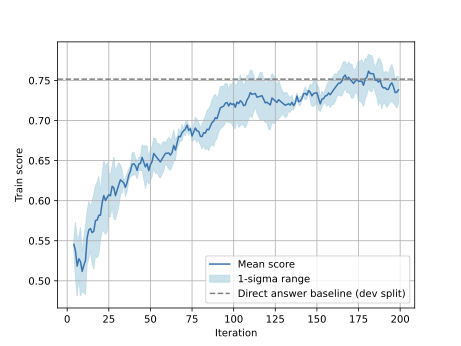

# Paper Assets

## Figure 1: fig:teaser

Caption: GPTSwarm is a framework that represents agents as graphs. In this framework, each node represents an operation (e.g., LLM inference or tool use). An agent is a graph composed of these nodes. An edge between two agent graphs characterizes a communication channel; each agent collaborates with others through different channels. When connected, multiple agents form a composite graph with a certain orchestration topology. This graph representation lends itself to optimization of nodes and edges via prompting and evolutionary or reinforcement learning techniques.

![GPTSwarm is a framework that represents agents as graphs. In this framework, each node represents an operation (e.g., LLM inference or tool use). An agent is a graph composed of these nodes. An edge between two agent graphs characterizes a communication channel; each agent collaborates with others through different channels. When connected, multiple agents form a composite graph with a certain orchestration topology. This graph representation lends itself to optimization of nodes and edges via prompting and evolutionary or reinforcement learning techniques.](figures/gptswarm_first.png)

## Figure 2: fig:adv_mmlu

Caption: Score recovery through edge optimization. ``T" denotes truthful and ``A" adversarial agents, e.g., a 3T3A swarm has 3 of each. Ablation studies include a ``full graph" and random graphs sampled according to distribution D_0.5. The dashed line corresponds to the direct answer baseline.


## Figure 3: fig:cw_heatmap

Caption: Visualizing the evolution of the probability distribution during optimization in adjacency-like matrices. In this figure, we show the probability parameters (one corresponds to an edge) in an adjacency-like matrix for iterations 0, 2, 4, 6, 8, and 10 of optimizing the objective for the Mini Crosswords task. We observe that the parameters first change chaotically. However, after iteration 6, the parameters change almost monotonically.


## Figure 4: fig:crosswords

Caption: Edge optimization on the Mini Crosswords dataset improves over standard methods The baseline methods are evaluated with GPT-3.5-Turbo. The optimized final distribution outperforms several baselines. When evaluating the already optimized edge distribution with GPT-4-Turbo, we achieve better results compared to the previous state-of-the-art method (Tree of Thought evaluated with GPT-4).


## Figure 5: fig:HumanEval

Caption: Optimization curve on HumanEval. Accuracy as a function of the number of iterations. We observe significant improvements during the first five iterations. The results, including the mean and standard errors, are based on three repeated experiments.


## Figure 6: fig:gaia_ratio

Caption: Solving a wide range of tasks requires many different tools. The GAIA benchmark mialon2023gaia tests for many of these capabilities by including questions that require several of these tools for successful completion.


## Table 1: tab:gaia

Caption: Performance on the GAIA Benchmark mialon2023gaia. Using our framework, we demonstrate significant improvements across several levels of difficulty. The `GPT-4 with plugins' baseline is less significant since it involves the manual selection of the appropriate tools per question. We report the mean and standard deviation across 5 runs.

| 1pt champagne Method | Level 1 | Level 2 | Level 3 | Avg. |
| --- | --- | --- | --- | --- |
| 1.2pt GPT-3.5 | 7.55 | 4.65 | 0 | 4.85 |
| gray!10GPT-4 | 15.09 | 2.33 | 0 | 6.06 |
| GPT-4-Turbo | 20.75 | 5.81 | 0 | 9.70 |
| gray!10 AutoGPT | 13.21 | 0 | 3.85 | 4.85 |
| GPTSwarm | 30.56_3.25 | 20.93_1.27 | 3.85_2.43 | 18.45 |
| gray!10 Improvement | green(pigment)47.3% | green(pigment)260.2% | green(pigment)0.0% | green(pigment)90.2% |
| black!50GPT4 with Plugins* | black!5030.30 | black!509.70 | black!500 | black!5014.6 |
| 1.2pt |  |  |  |  |

## Table 2: tab:gaia_abl

Caption: Ablations on the GAIA benchmark (Level 1 validation set) mialon2023gaia. DA = DirectAnswer, GQ = GenerateQuery, WS = WebSearch, FA = FileAnalyzer, CA = CombinedAnswer. `green(pigment)' indicates the presence of a specific feature in the corresponding framework, `darksalmon' its absence. Each type of experiment is run five times to record the mean, standard deviation, and best run (marked as Best). Self-Consistency describes prompt-based self-consistency wang2022self; Choose ``Best'' refers to the LLM's favorite answer among the different agents' answers. All agents and swarms are implemented using our GPTSwarm framework.

| 1.2pt champagne Agent or Swarm | DA | GQ | WS | FA | CA | Decision Strategy | Accuracy | Best | Duration (s) |
| --- | --- | --- | --- | --- | --- | --- | --- | --- | --- |
| 1.2pt (A) Agent: IO | green(pigment) | darksalmon | darksalmon | darksalmon | darksalmon | N/A | 16.60green(pigment)3.02 | 20.75% | 13.37 |
| gray!10(B) Agent: COT_web | darksalmon | green(pigment) | green(pigment) | darksalmon | green(pigment) | N/A | 18.87green(pigment)2.67 | 22.64% | 60.90 |
| (C) Agent: COT_FA | darksalmon | green(pigment) | darksalmon | green(pigment) | green(pigment) | N/A | 25.28green(pigment)3.50 | 30.18% | 56.42 |
| gray!10(D) Agent: TOT | darksalmon | green(pigment) | green(pigment) | green(pigment) | green(pigment) | N/A | 25.66green(pigment)3.50 | 30.18% | 71.31 |
| (E) Swarm_(3) | green(pigment) | darksalmon | darksalmon | darksalmon | darksalmon | Choose ``Best'' | 15.85green(pigment)0.92 | 18.87% | 45.65 |
| (F) Swarm_(3) | darksalmon | green(pigment) | green(pigment) | darksalmon | green(pigment) | Choose ``Best'' | 27.17green(pigment)3.29 | 32.08% | 152.89 |
| (G) Swarm_(3) | darksalmon | green(pigment) | green(pigment) | green(pigment) | green(pigment) | Choose ``Best'' | 30.18green(pigment)4.30 | 35.85% | 198.50 |
| gray!10(H) Swarm_(3) | green(pigment) | darksalmon | darksalmon | darksalmon | darksalmon | Self-Consistency | 18.11green(pigment)3.07 | 22.64% | 45.70 |
| gray!10(I) Swarm_(3) | darksalmon | green(pigment) | green(pigment) | darksalmon | green(pigment) | Self-Consistency | 27.17green(pigment)4.06 | 32.08% | 150.26 |
| gray!10(J) Swarm_(3) | darksalmon | green(pigment) | green(pigment) | green(pigment) | green(pigment) | Self-Consistency | 28.30green(pigment)3.38 | 32.08% | 181.15 |
| (K) Swarm_(5) | darksalmon | green(pigment) | green(pigment) | green(pigment) | green(pigment) | Self-Consistency | 29.06green(pigment)2.56 | 32.08% | 291.07 |
| gray!10(L) Swarm_(7) | darksalmon | green(pigment) | green(pigment) | green(pigment) | green(pigment) | Self-Consistency | 30.56green(pigment)3.25 | 35.85% | 414.89 |
| black!50(M) Human | black!30- | black!50- | blue!50- | black!50- | black!50- | black!50- | black!5094% | black!50- | black!50422.26 |
| 1.2pt |  |  |  |  |  |  |  |  |  |

## Figure 7: fig:class_diagram

Caption: The class diagram of the GPTSwarm framework.


## Figure 8: fig:example_tot_io

Caption: A simple example of a swarm consisting of one Tree-of-Thought, one Input-Output, and the Decision agent.


## Figure 9: fig:all_swarm_examples

Caption: Different agents or swarms implemented by GPTSwarm.


## Table 3: tab:MMLU

Caption: Results of the Multiagent Debate, DyLAN, and our method on MMLU. We report the performance and computational cost of these methods applied to an LLM-based multiagent system with adversaries. Computational cost for optimization and inference is presented separately except for the Multiagent Debate, where there is no explicit separation. DyLAN is reported as an average over five different choices for the number of pruned agents.

| 1.2pt champagne Methods | Cost (USD) | # Prompt Tokens | # Completion Tokens | Time (h) | Accuracy |
| --- | --- | --- | --- | --- | --- |
| 1.2pt Multiagent Debate | 32.8 | 1,689,960 | 530,005 | 8.36 | 0.5751 |
| gray!10 DyLAN optimization | 105.93 | 5,671,276 | 1,640,566 | 25.4 | - |
| DyLAN inference | 14.99 | 628,009 | 290,472 | 4.75 | 0.8366 |
| gray!10 GPTSwarm optimization | 5.32 | 361,812 | 56,770 | 0.9 | - |
| GPTSwarm inference | 1.82 | 113,233 | 22,923 | 0.31 | 0.8301 |
| 1.2pt |  |  |  |  |  |

## Table 4: tab:adv_stats

Caption: Stats for the adversarial experiments. #Nodes means the number of nodes in the swarm excluding the final decision node. #Potential edges is the total number of edges that are optimized and potentially realized. The optimization time is measured as the wall clock time. #LLM inferences is the total number of LLM queries made during the optimization cycle when graph pruning is turned off.

| 1.2pt champagne Swarm configuration | #Nodes | #Potential edges | Optimization time, mins |
| --- | --- | --- | --- |
| 1.2pt 1 Trustful Agent + 1 Adversarial Agent | 2 | 4 | 9 |
| gray!103 Trustful Agents + 3 Adversarial Agents | 6 | 36 | 23 |
| 5 Trustful Agents + 5 Adversarial Agents | 10 | 100 | 58 |
| gray!10 7 Trustful Agents + 7 Adversarial Agents | 14 | 196 | 95 |
| 1.2pt |  |  |  |

## Figure 10: fig:adv_training

Caption: The training score during the optimization of the adversarial swarm (3T3A) on MMLU. We apply smoothing with an unbiased exponential moving average and the smoothness factor of 0.97.



## Table 5: tab:mmlu_prompts

Caption: Prompts for the Adversarial experiments on MMLU.

| |p0.7| 1.2pt champagne Prompt purpose | Prompt |
| --- | --- |
| 1.2pt System prompt | You are a knowledgeable expert in question answering. I will ask you a question. I will also give you 4 answers enumerated as A, B, C and D. Only one answer out of the offered 4 is correct. You must choose the correct answer to the question. Your response must be one of the 4 letters: A, B, C or D, corresponding to the correct answer. Only one letter (A, B, C or D) is allowed in your answer. |
| gray!10Direct answer template | \ |
| 1.2pt Adversarial answer template | Answer a lie to the following question: \. |
| 1.2pt Question template | -ended question\. Option A: A\, Option B: B\, Option C: C\, Option D: D\. |
| 1.2pt |  |

## Figure 11: fig:before_opt

Caption: An non-optimized swarm with 2 truthful agents and 2 adversarial agents. Dotted arrows depict potential edges.


## Table 6: tab:specialist_roles

Caption: Roles that can be assigned to IO agents.

| Botanist | Data Scientist | Social Worker | Journalist | Pilot |
| --- | --- | --- | --- | --- |
| Anthropologist | Fitness Coach | Politician | Artist | Marine Biologist |
| Ethicist | Entrepreneur | Linguist | Archaeologist | Nurse |
| Graphic Designer | Philanthropist | Meteorologist | Sommelier | Cybersecurity Expert |

## Table 7: tab:cw_prompts

Caption: Prompts for the Mini Crosswords Experiments.

| |p0.85| 1.2pt champagne Prompt purpose | Prompt |
| --- | --- |
| 1.2pt Candidate words generation prompt | Let's play a 5 x 5 mini crossword, where each word should have exactly 5 letters. board status\ Unfilled: clues\ Filled: clues\ Changed: clues\ Suggestions: generated by previous Reflection nodes\ Given the current status, list all possible answers for unfilled or changed words, and your confidence levels (certain/high/medium/low), using the format "h1. apple (medium)". Use "certain" cautiously and only when you are 100% sure this is the correct word. You can list more then one possible answer for each word. |
| 1.2pt Pruning prompt | Evaluate if there exists a five letter word of some meaning that fit some letter constraints (sure/maybe/impossible). Incorrect; to injure: w _ o _ g The letter constraint is: 5 letters, letter 1 is w, letter 3 is o, letter 5 is g. Some possible words that mean "Incorrect; to injure": wrong (w r o n g): 5 letters, letter 1 is w, letter 3 is o, letter 5 is g. fit! sure A person with an all-consuming enthusiasm, such as for computers or anime: _ _ _ _ u The letter constraint is: 5 letters, letter 5 is u. Some possible words that mean "A person with an all-consuming enthusiasm, such as for computers or anime": geek (g e e k): 4 letters, not 5 otaku (o t a k u): 5 letters, letter 5 is u sure Dewy; roscid: r _ _ _ l The letter constraint is: 5 letters, letter 1 is r, letter 5 is l. Some possible words that mean "Dewy; roscid": moist (m o i s t): 5 letters, letter 1 is m, not r humid (h u m i d): 5 letters, letter 1 is h, not r I cannot think of any words now. Only 2 letters are constrained, it is still likely maybe A woodland: _ l _ d e The letter constraint is: 5 letters, letter 2 is l, letter 4 is d, letter 5 is e. Some possible words that mean "A woodland": forest (f o r e s t): 6 letters, not 5 woods (w o o d s): 5 letters, letter 2 is o, not l grove (g r o v e): 5 letters, letter 2 is r, not l I cannot think of any words now. 3 letters are constrained, and _ l _ d e seems a common pattern maybe An inn: _ d _ w f The letter constraint is: 5 letters, letter 2 is d, letter 4 is w, letter 5 is f. Some possible words that mean "An inn": hotel (h o t e l): 5 letters, letter 2 is o, not d lodge (l o d g e): 5 letters, letter 2 is o, not d I cannot think of any words now. 3 letters are constrained, and it is extremely unlikely to have a word with pattern _ d _ w f to mean "An inn" impossible Chance; a parasitic worm; a fish: w r a k _ The letter constraint is: 5 letters, letter 1 is w, letter 2 is r, letter 3 is a, letter 4 is k. Some possible words that mean "Chance; a parasitic worm; a fish": fluke (f l u k e): 5 letters, letter 1 is f, not w I cannot think of any words now. 4 letters are constrained, and it is extremely unlikely to have a word with pattern w r a k _ to mean "Chance; a parasitic worm; a fish" impossible \ |
| 1.2pt Suggestion Prompt | You are playing a 5 x 5 mini crossword, where each word should have exactly 5 letters. Given the current status: board status \ The target words are classified as Impossible Words, Correct Words, and Incorrect Words. --- Impossible Words: clues\ Correct Words: clues \ Incorrect Words: clues \ Respond at most five sentences, one sentence per line. Do not include the phrase "next time" in your response. |
| 1.2pt |  |

## Table 8: tab:humaneval_prompts

Caption: Prompts for the Node Optimization experiments on HumanEval.

| |p0.7| 1.2pt champagne Prompt purpose | Prompt |
| --- | --- |
| 1.2pt System prompt | You are an AI that only responds with only Python code. |
| 1.2pt CodeWriting | You will be given a function signature and its docstring by the user. Write your full implementation (restate the function signature). Use a Python code block to write your response. For example: ```python print(`Hello world!') ''' \ statement\ |
| 1.2pt CodeWriting (ReAct) | You will be given a function signature and its docstring by the user. Write your full implementation (restate the function signature). Use a Python code block to write your response. For example: ```python print(`Hello world!') ''' \ Here is an unsuccessful attempt to solve the following question: Question: statement\ Attempted Solution: generated program\ Feedback: unit test results\ Rewrite the code based on the feedback and the following question: statement\ |
| 1.2pt |  |

## Table 9: tab:gaia_prompts1

Caption: Prompts for the Task-Solving experiments on GAIA (1).

| |p0.7| 1.2pt champagne Prompt purpose | Prompt |
| --- | --- |
| 1.2pt System prompt | You are a general AI assistant. I will ask you a question. Report your thoughts, and finish your answer with the following template: FINAL ANSWER: [YOUR FINAL ANSWER]. YOUR FINAL ANSWER should be a number OR as few words as possible OR a comma separated list of numbers and/or strings. If you are asked for a number, don't use comma to write your number neither use units such as or percent sign unless specified otherwise. If you are asked for a string, don't use articles, neither abbreviations (e.g. for cities), and write the digits in plain text unless specified otherwise. If you are asked for a comma separated list, apply the above rules depending of whether the element to be put in the list is a number or a string. |
| 1.2pt DirectAnswer | \ |
| 1.2pt GenerateQuery | # Information Gathering for Question Resolution Evaluate if additional information is needed to answer the question. If a web search or file analysis is necessary, outline specific clues or details to be searched for. ## Target Question: question ## Clues for Investigation: Identify critical clues and concepts within the question that are essential for finding the answer. |
| 1.2pt WebSearch | # Web Search Task ## Original Question: --- \ --- ## Targeted Search Objective: --- query --- ## Simplified Search Instructions: Generate three specific search queries directly related to the original question. Each query should focus on key terms from the question. Format the output as a comma-separated list. For example, if the question is 'Who will be the next US president?', your queries could be: 'US presidential candidates, current US president, next US president'. Remember to format the queries as 'query1, query2, query3'. |
| 1.2pt DistillWebSearch | ## Required Information for Summary: --- \ --- ## Analyzed Search Results: --- \ --- ## Instructions for Summarization: 1. Review the provided search results and identify the most relevant information related to the question and query. 2. Extract and highlight the key findings, facts, or data points from these results. 3. Organize the summarized information in a coherent and logical manner. 4. Ensure the summary is concise and directly addresses the query, avoiding extraneous details. 5. If the information from web search is useless, directly answer: \"No useful information from WebSearch\". |
| 1.2pt FileAnalyse | # File Analysis Task ## Information Extraction Objective: --- \ --- ## File Under Analysis --- \ --- ## Instructions: 1. Identify the key sections in the file relevant to the query. 2. Extract and summarize the necessary information from these sections. 3. Ensure the response is focused and directly addresses the query. Example: 'Identify the main theme in the text.'" |
| 1.2pt |  |

## Table 10: tab:gaia_prompts2

Caption: Prompts for the Task-Solving experiments on GAIA (2).

| |p0.7| 1.2pt champagne Prompt purpose | Prompt |
| --- | --- |
| 1.2pt CombinedAnswer | Reference information for FileAnalysis: --- _analysis\ --- Reference information for Websearch: --- _search\ --- Provide a specific answer. For questions with known answers, ensure to provide accurate and factual responses. Avoid vague responses or statements like 'unable to...' that don't contribute to a definitive answer. For example: if a question asks 'who will be the president of America', and the answer is currently unknown, you could suggest possibilities like 'Donald Trump', or 'Biden'. However, if the answer is known, provide the correct information." |
| 1.2pt FinalDecision (Self-Consistency) | # Self-Consistency Evaluation Task ## Question for Review: --- \ --- ## Reviewable Answers: --- _answers\ --- ## Instructions for Selection: 1. Read each answer and assess how it addresses the question. 2. Compare the answers for their adherence to the given question's criteria and logical coherence. 3. Identify the answer that best aligns with the question's requirements and is the most logically consistent. 4. Ignore the candidate answers if they do not give a direct answer, for example, using 'unable to ...', 'as an AI ...'. 5. Copy the most suitable answer as it is, without modification, to maintain its original form. 6. Adhere to the constraints: \. Note: If no answer fully meets the criteria, choose and copy the one that is closest to the requirements. |
| 1.2pt FinalDecision (Choose ``Best'') | ## Question: --- \ --- ## Candidate Answers for Evaluation: --- _answers\ --- ## Evaluation Instructions: 1. Examine the question closely to understand its requirements. 2. Read each candidate answer thoroughly and assess its relevance and accuracy about the question. 3. Choose the answer that most accurately and completely addresses the question. 4. Ignore the candidate answers if they do not give a direct answer, for example, using 'unable to ...', 'as an AI ...'. "5. Copy the chosen answer exactly as it is presented, maintaining its original format. 6. Adhere to the constraints: \. Note: If none of the answers fully meet the question's criteria, select the one closest to fulfilling them. |
| 1.2pt |  |

## Table 11: tab:cost

Caption: Cost, token consumption, and time requirements. The following experiments are performed with gpt-3.5-turbo-1106 if marked with GPT-3.5T, or gpt-4-1106-preview otherwise.

| 1.2pt champagne Experiment | Cost (USD) | # Prompt Tokens | # Completion Tokens | Time (h) |
| --- | --- | --- | --- | --- |
| 1.2pt TOT - Mini Crosswords | 65.61 | 1,515,826 | 2,013,511 | 8.5 |
| gray!10 GPTSwarm - Mini Crosswords Edge-Opt (GPT-3.5T) | 77.42 | 50,394,028 | 13,511,265 | 2.82 |
| GPTSwarm - Mini Crosswords Edge-Opt-Eval (GPT-3.5T) | 9.89 | 6,448,660 | 1,718,613 | 0.73 |
| gray!10 GPTSwarm - Mini Crosswords Edge-Opt-Eval | 377.54 | 13,137,160 | 8,205,522 | 5.56 |
| GPTSwarm - Mini Crosswords Node-Opt (GPT-3.5T) | 11.22 | 7,468,797 | 1,876,246 | 0.83 |
| gray!10 GPTSwarm - Mini Crosswords Node-Opt-Eval (GPT-3.5T) | 28.18 | 22,791,158 | 2,693,575 | 0.91 |
| GPTSwarm - HumanEval w/o Opt | 1.61 | 59,646 | 33,951 | 0.68 |
| gray!10 GPTSwarm - HumanEval w/ Opt | 28.46 | 2,298,140 | 182,594 | 1.49 |
| GPTSwarm - GAIA (Level 1) - Agent(TOT) | 2.21 | 123,801 | 32,599 | 1.05 |
| gray!10 LLM-Debate - MMLU (3A3T) | 32.8 | 1,689,960 | 530,005 | 8.36 |
| DyLAN - MMLU optimization (3A3T) | 105.93 | 5,671,276 | 1,640,566 | 25.4 |
| gray!10 DyLAN - MMLU inference (3A3T) | 14.99 | 628,009 | 290,472 | 4.75 |
| GPTSwarm - MMLU optimization (3A3T) | 5.32 | 361,812 | 56,770 | 0.9 |
| gray!10 GPTSwarm - MMLU inference (3A3T) | 1.82 | 113,233 | 22,923 | 0.31 |
| 1.2pt |  |  |  |  |
