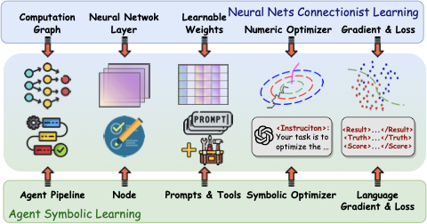
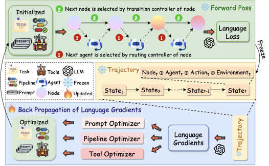
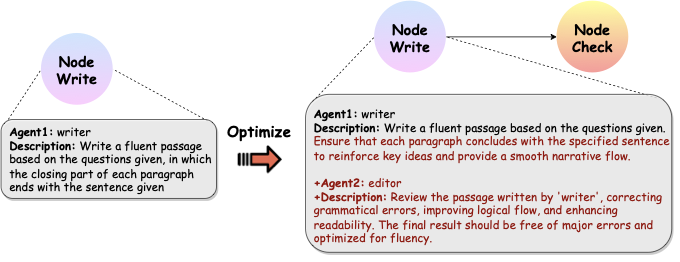

# Paper Assets

## Figure 1: fig:overview

Caption: Analogy between and neural nets connectionist learning.

## Figure 2: fig:workflow

Caption: Illustration of the framework.

## Table 1: tab:benchmark_results

Caption: Results on Standard LLM Benchmarks.

| 1.5pt Methods | 2c|HotPotQA | 2c|MATH | 2cHumanEval |  |  |  |
| --- | --- | --- | --- | --- | --- | --- |
| GPT-3.5 | GPT-4 | GPT-3.5 | GPT-4 | GPT-3.5 | GPT-4 |  |
| 1.5pt GPTs | 24 / 38.8 | 33 / 44.3 | 23.2 | 53.1 | 59.2 | 71.7 |
| Agents | 27 / 37.5 | 39 / 49.8 | 23.8 | 56.0 | 59.5 | 85.0 |
| Agents w/ AutoPE | 29 / 39.8 | 38 / 50.3 | 22.5 | 57.2 | 63.5 | 82.3 |
| DSPy | 35 / 43.9 | 40 / 50.5 | 17.3 | 48.4 | 66.7 | 77.3 |
| Ours | 35 / 44.8 | 41 / 54.0 | 38.8 | 60.7 | 64.5 | 85.8 |
| 1.5pt |  |  |  |  |  |  |

## Table 2: tab:software

Caption: Results on software development.

| 1.5pt Task | GPTs | Agents | Ours |
| --- | --- | --- | --- |
| Flappy bird | 2 | 2 | 3 |
| Tank battle game | 1 | 2 | 4 |
| 2048 game | 1 | 2 | 4 |
| Snake game | 2 | 3 | 4 |
| Brick breaker game | 2 | 3 | 4 |
| Average score | 1.6 | 2.4 | 3.8 |
| 1.5pt |  |  |  |

## Figure 3: fig:case

Caption: An case study conducted on creative writing task.

## Table 3: tab:prompt_language_loss

Caption: Prompt Template for Language Loss Function

| Prompt Template for Language Loss Function |
| --- |
| light-gray Loss with ground truth: |
| You are a fine-tuner of a large model. I will provide you with some output results from the model and the expected correct results. You need to evaluate these data and provide a score out of 10, please wrap the score using <score></score>. Additionally, please provide some suggestions for modifying the model's output, using <suggestion></suggestion> to wrap your suggestions. |
| Here is the model's output: |
| <result>result</result>; |
| The expected result is: |
| <ground_truth>ground_truth</ground_truth> |
| Please note: |
| 1. Ensure that the output is wrapped with <score></score> and <suggestion></suggestion> respectively. |
| 2. The output should be as consistent as possible with the expected result while being correct. For example, if the expected result is “BUST”, and the model's output is “The women's lifestyle magazine is 'BUST' magazine.”, even though the answer is correct, you should advise the model to be more concise. |
| 3. The standard for a score of 10 is that the model's output is exactly the same as the expected result in a case-insensitive manner, and without any unnecessary content. Even if the model's output is semantically correct, if it includes superfluous content, points should be deducted. |
| light-gray Loss with ground truth and score: |
| You are a large language model fine-tuner. I will provide you with a model's output and the expected correct result. You need to evaluate it and suggest modifications to the model's output. Please use `<suggestion></suggestion>` to enclose your feedback. |
| Below is the model's output: |
| <result>result</result> |
| The expected result is: |
| <ground_truth>ground_truth</ground_truth> |
| Here is the evaluation score for the model. Your goal is to optimize this score: |
| <score>score</score> |
| The relevant information about this score is as follows: |
| <evaluation_info>score_info</evaluation_info> |
| Note: |
| 1. Ensure that `<suggestion></suggestion>` exists and appears once. |
| 2. If the model's output is satisfactory, you can output <suggestion>The output is satisfactory, no additional requirements</suggestion>. |
| 3. The output should be as close to the expected result as possible while ensuring correctness. For example, if the expected result is "BUST" and the model's output is "The women's lifestyle magazine is 'BUST' magazine.", even though this answer is correct, you should remind the model to be concise. |

## Table 4: tab:prompt_back_propagation

Caption: Prompt Template for Gradient Back-propagation

| Prompt Template for Gradient Back-propagation |
| --- |
| light-gray Prompt-Level |
| You are now a prompt fine-tuner for a large language model. You are tasked with providing suggestions for optimizing the prompt template. |
| Please enclose your suggestions using <suggestion></suggestion>, for example, <suggestion>it could be made shorter</suggestion>. |
| The task is divided into multiple steps; I will provide you with the output from the previous step, the requirement proposed by the next step for the current output, the current output itself, and the prompt template. You need to suggest improvements for the current step's prompt template. |
| - The prompt template that needs optimization is: <prompt_template>prompt_template</prompt_template> |
| - The output from the previous step is: <previous_output>previous_output</previous_output> |
| - The current output is: <output>response</output> |
| - The requirement proposed by the next step for the current output is: <requirement>suggestion</requirement> |
| In addition to suggesting modifications for the current prompt template, you also need to propose requirements for the output of the previous step. Please wrap these using <suggestion></suggestion>, for example: <suggestion>the analysis should include a comparison of original data</suggestion>. |
| Note: |
| 1. Ensure that the results are wrapped with <suggestion></suggestion> and <suggestion></suggestion>, and each tag appears only once. |
| 2. If you are the first node, you can state within <suggestion></suggestion> “This is the first node.” |
| 3. Please note that during your analysis, remember that this prompt template will be applied to multiple different datasets, so your suggestions should be general and not solely focused on the examples provided here. |
| 4. Please analyze step by step. |
| light-gray Node-Level |
| You are a large model fine-tuner. Now you need to try to optimize the information of a node. For a complex task, it has been divided into multiple nodes, each of which contains multiple roles that work together to complete the task of this node. Each role is backed by an LLM Agent, and you need to optimize the configuration information of one of the nodes. |
| Here are the relevant explanations for the Node configuration: |
| - The fields in the "controller" indicate the scheduling method of the model. If there is only one role, this item does not need to be optimized: |
| - "route_type" indicates the scheduling method, which has three values: "random" means random scheduling, "order" means sequential scheduling, and "llm" means scheduling determined by the LLM model. |
| - "route_system_prompt" and "route_last_prompt" are used when "route_type" is "llm" and are respectively the system prompt and last prompt given to the LLM model responsible for scheduling. |
| - "begin_role" is a string indicating the name of the starting role of this node. |
| - "roles" is a dictionary where the key is the role name, and the value is the prompt used by this role. |
| You need to decide how to optimize the configuration of this node. Specifically, you need to try to provide suggestions in the following aspects: |
| 1. Update the node description field. This field describes the function of the node and is also an important indicator to measure the performance of a node. |
| 2. Update the scheduling method of the role. Note that if there is only one role, no optimization is needed. |
| 3. Add a new role, and you need to clearly describe the function of this role. |
| 4. Delete a role, and you need to clearly describe the reason for deleting this role. |
| 5. Update a role, and you need to indicate how to update the description of this role. |
| Next, I will give you a Node configuration, and you need to provide optimization suggestions based on the current Node configuration. Please use <suggestion>[put your suggestion here]</suggestion> to enclose your suggestions. |
| ## Current Node Config |
| _config\ |
| You need to first provide your analysis process, then give your optimized result. Please use <analyse></analyse> to enclose the analysis process. Please use <suggestion></suggestion> to enclose the optimization suggestions for the current node. Please use <suggestion></suggestion> to enclose the requirements for the previous node. |
| Note: The suggestions provided need to be in one or more of the five aspects mentioned above. |

## Table 5: tab:prompt_optimizers

Caption: Prompt Template for Optimizers

| Prompt Template for Optimizers |
| --- |
| light-gray Prompt Optimizer: |
| You are now a prompt fine-tuner for a large language model. I will provide you with a prompt template along with its corresponding input and output information. |
| Please modify the prompt based on the provided data: |
| - The current prompt template is: prompt_template. |
| Here is some information about the model when using this template: |
| # Example index |
| - Output result: <output>response</output> |
| - Suggestion: <suggestion>suggestion</suggestion> |
| You need to analyze the content above and input the optimized prompt result. Please wrap your analysis in <analyse></analyse> and the new prompt in <new_prompt></new_prompt>. |
| Please note: |
| 1. When actually using the prompt template, the Python format() method is employed to fill variables into the prompt. Therefore, please ensure that the content enclosed in in both the new and old prompts remains the same, with no variables added or removed. |
| 2. Ensure that your new prompt template can be directly converted to a dictionary using the json.loads() method. Therefore, you need to be careful to use double quotes and escape characters properly. |
| 3. Ensure that <analyse></analyse> and <new_prompt></new_prompt> each appear only once. |
| 4. If you believe that the current prompt template performs sufficiently well, leave <new_prompt></new_prompt> empty. |
| light-gray Node Optimizer: |
| You are a large model fine-tuner. Now you need to try to optimize the information of a node. For a complex task, it has been divided into multiple nodes, each containing multiple roles that work together to complete the task of this node. Each role is backed by an LLM Agent, and you need to optimize the configuration information of one of the nodes. |
| Here are the relevant explanations for the Node configuration: |
| - The fields in the "controller" indicate the scheduling method of the model. If there is only one role, this item does not need to be optimized: |
| - "route_type" indicates the scheduling method, which has three values: "random" means random scheduling, "order" means sequential scheduling, and "llm" means scheduling determined by the LLM model. |
| - "route_system_prompt" and "route_last_prompt" are used when "route_type" is "llm" and are respectively the system prompt and last prompt given to the LLM model responsible for scheduling. |
| - "begin_role" is a string indicating the name of the starting role of this node. |
| - "roles" is a dictionary where the key is the role name, and the value is the prompt used by this role. |
| Next, I will give you a Node configuration and several modification suggestions. You need to modify the Node configuration based on the suggestions: |
| ## Current Node Config |
| _config\ |
| ## Suggestions |
| \ |
| When providing the modification plan, you need to give the optimized result in the following format. It is a list, each element is a dict, and the dict contains an action field indicating the operation on the Node. |
| Your optimized result should be enclosed in <result></result>, that is, the content inside <result></result> should be a JSON-formatted list, which should be able to be directly loaded by json.loads(). |
| Note: |
| 1. If you think the current configuration is already excellent and does not need modification, you can directly output an empty list. |
| 2. The format of <result>[optimization method]</result> needs to strictly follow the given format, otherwise, it will be judged as incorrect. |
