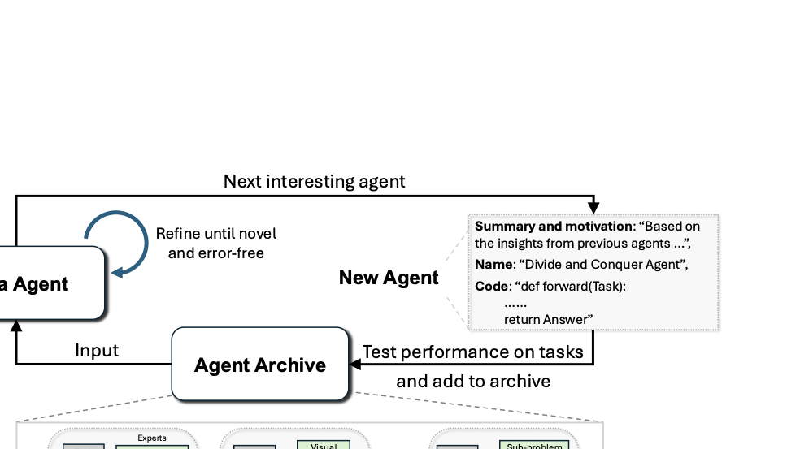
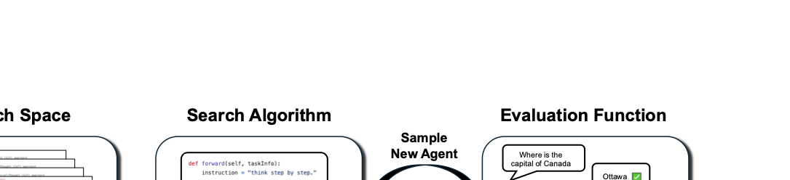
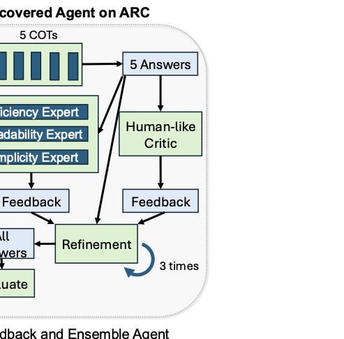

# Automated Design of Agentic Systems

Source: https://arxiv.org/abs/2408.08435

## Overview / Takeaway

Automated Design of Agentic Systems (ADAS) treats the prompts, tools, control flow, memory, roles, and other components surrounding a foundation model as an optimization target rather than a hand-engineered artifact. The paper’s Meta Agent Search instantiation asks a GPT-4o meta agent to write candidate agents as Python `forward` functions, evaluates them on validation tasks, and stores every design and score in a growing archive that conditions later proposals. Across ARC, DROP, MGSM, MMLU, and GPQA, the best searched agents outperform the reported hand-designed and prompt-optimization baselines, and several designs transfer effectively across datasets and foundation models. The results establish code-space search as a broad and practical design mechanism, while also exposing open problems in search efficiency, evaluator quality, multi-objective optimization, safety, reproducibility, and the gap between Turing-complete expressivity and actually exploring an enormous program space.

## 1 Introduction

1. **Compound agents compensate for limitations of one model call**
Reliable reasoning and planning often require multiple foundation-model calls arranged into a workflow, plus external capabilities such as search, code execution, or database queries. Chain-of-thought reasoning, memory, tool use, self-reflection, and multi-agent role assignment are examples of building blocks that can improve a model without changing its parameters.

2. **Manual design scales poorly across building blocks and applications**
Human researchers must invent useful components, tune them for a domain, and choose among a combinatorial number of interactions. Even if the community discovered most valuable components individually, configuring them for many real applications would remain slow and costly.

3. **The motivating historical pattern favors learned designs**
Handcrafted computer-vision features gave way to learned CNN features, manually designed neural architectures increasingly compete with neural architecture search, and foundation models have begun generating loss functions, optimization algorithms, scientific ideas, reward functions, and environments. ADAS extends this replacement of handcrafted artifacts to complete agentic systems.

4. **ADAS asks an optimizer to invent both components and compositions**
The research problem is broader than prompt optimization: an ADAS method may discover novel prompts, roles, tools, memories, workflows, feedback loops, and combinations of these elements. The intended benefit is not only reduced engineering effort but access to effective designs that humans have not proposed.

5. **Code is proposed as a maximally expressive agent representation**
Representing an agent as a program permits prompts, tool calls, loops, branching, parallel modules, ensembles, and arbitrary data flow in one substrate. Python’s Turing completeness means any computable agent design is representable in principle, but it does not imply that a finite search driven by one model can find every useful program.

6. **Coding priors make foundation models natural search operators**
Because foundation models have extensive code-generation experience, a meta agent can propose agent programs directly instead of operating in a custom graph or network encoding. Readable source code also supports inspection, debugging, reuse of existing frameworks, and more explicit safety auditing than an opaque learned representation.

7. **Meta Agent Search uses past discoveries as stepping stones**
Every candidate is evaluated and added to an archive with its score. Later proposals receive the archive and are instructed to synthesize an interesting new design from its successes, failures, and novel components, creating an open-ended accumulation process rather than isolated prompt tuning.

Figure 1 shows the complete loop and three representative designs: the meta agent proposes code, evaluation sends performance to the archive, and the archive becomes context for the next proposal.

8. **The evaluation spans invention, domain specialization, and transfer**
Experiments cover the ARC abstraction benchmark, four reasoning and problem-solving domains, transfer from MGSM to held-out math and non-math tasks, and transfer of ARC agents from GPT-3.5 to Claude and GPT-4-family models. This separates performance on the search domain from robustness of the learned design pattern.

## 2 Automated Design of Agentic Systems (ADAS)

1. **An agent is a workflow containing foundation-model modules**
The operational definition includes systems that plan, use tools, and execute multiple or iterative processing steps with one or more foundation models as modules. ADAS optimizes the workflow around those models rather than restricting “agent” to a single autonomous process or chat interface.

2. **The formulation has three independent design choices**
An ADAS method combines a **search space** defining representable agents, a **search algorithm** exploring that space, and an **evaluation function** measuring target objectives. A method can therefore fail because its representation excludes a useful design, its search cannot reach that design, or its evaluator rewards the wrong behavior.

Figure 2 separates these three components and emphasizes that broad representation alone is insufficient without effective exploration and evaluation.

3. **Restricted search spaces impose hard ceilings**
Prompt-only methods cannot change workflow; graph methods can rewire modules but may keep tool behavior fixed; feed-forward representations may exclude loops, mutable memory, and dynamic control. The discovered system can never contain a component that its representation cannot express.

4. **Search must balance exploitation and novelty**
Agent-program space is extremely large and potentially unbounded. Optimizing only known high-performing patterns risks a local optimum, whereas undirected novelty can consume evaluations without improving the objective; ADAS therefore inherits the exploration–exploitation problem from reinforcement learning and evolutionary search.

5. **Evaluation can target more than task performance**
Possible objectives include accuracy or F1, cost, latency, robustness, and safety. This paper optimizes only validation performance, making its implementation a single-objective demonstration rather than the full multi-objective ADAS formulation.

6. **Code space combines expressivity, interpretability, and prior knowledge**
Programs can reuse existing components from frameworks such as LangChain, expose control flow for human inspection, and exploit a coding model’s learned priors. The tradeoff is that executable code can be invalid or destructive and creates a substantially harder safety surface than choosing among fixed prompts.

## 3 Our Algorithm: Meta Agent Search

1. **A small framework bounds the meta agent’s programming task**
Instead of generating an entire application, the meta agent receives a framework of fewer than **100 executable lines** providing foundation-model queries and structured prompt formatting. A candidate is defined by one `forward(taskInfo)` function that consumes task information and returns an answer.

2. **The archive may begin from human-designed agents**
The default archive contains implementations such as Chain-of-Thought and Self-Refine. Seeding lets the model recombine known useful patterns and makes search more sample-efficient, although Appendix I shows that initialization can also anchor exploration.

3. **One iteration produces an idea, a name, and executable code**
Conditioned on the framework, domain description, output rules, and complete discovered-agent archive, the meta agent emits a JSON object containing design reasoning, an architecture name, and the exact Python `forward` function. Names such as **Dynamic Role-Playing Architecture** and **Structured Feedback and Ensemble Agent** are generated during search.

4. **Two reflection passes target novelty and implementation quality**
The first pass compares the candidate against archive entries, checks whether it is genuinely interesting, identifies bugs, and proposes performance improvements. The second pass focuses again on known implementation mistakes and returns revised code, reducing duplicate or malformed proposals before evaluation.

5. **Runtime repair is bounded at five attempts**
If candidate evaluation throws an error, the error message is returned to the meta agent for debugging. The same design may be repaired and reevaluated up to **five times** before the iteration ends.

6. **Validation performance supplies the numerical fitness signal**
Candidate success rate, accuracy, or F1 on the target validation set is recorded as the metric to maximize. The algorithm does not use detailed execution traces or textual failure analysis unless an exception occurs, leaving information in wrong-but-executable trajectories unused.

7. **Every refined design becomes archive context**
The code and evaluation metrics are appended whether or not the design beats the current best. Retaining low-performing but novel candidates matters because a component that is not immediately competitive can become a stepping stone in a later combination.

8. **The search operator is model-guided synthesis rather than fixed mutation**
No hand-coded mutation grammar chooses which prompt or edge to alter. The meta agent reads source programs and natural-language descriptions, then may borrow, recombine, or replace arbitrary logic; “interestingness” is enforced by prompting rather than a quantitative novelty measure.

## 4 Experiments

### 4.1 Case Study: ARC Challenge

1. **ARC tests few-shot induction of unseen transformations**
Each problem supplies input–output grid examples and a test input whose transformation rule is unique to that problem. Solving it requires inferring operations involving quantities, geometry, topology, colors, and output dimensions rather than applying one task-wide rule.

2. **The experiment narrows ARC to small easy-training grids**
Questions come from the **Public Training Set (Easy)** and are restricted to grid dimensions no larger than $5\times5$. The search uses **20 validation questions**, while the held-out test set contains **60 questions**.

3. **Agents solve ARC by synthesizing transformation code**
Candidates do not directly emit the output grid. The framework provides tools to run generated transformation code on demonstration grids, obtain feedback, and apply the final program to the test grid; exact match against the reference output defines accuracy.

4. **The meta model and evaluated model have different roles**
The meta agent is `gpt-4o-2024-05-13`, while discovered agents and baselines call `gpt-3.5-turbo-0125` to reduce cost. Each design is evaluated **five times** on validation and test sets to reduce stochastic variance, and search lasts **25 iterations**.

5. **Baselines cover five established design patterns**
The comparison includes Chain-of-Thought, five-sample Chain-of-Thought Self-Consistency, up-to-five-step Self-Refine, two-round LLM Debate, and a three-iteration Quality-Diversity agent. All are implemented in the same framework and also serve as default archive seeds.

6. **Test performance rises through identifiable stepping stones**
The search first tries high-level planning, then discovers a crucial iteration-3 pattern: generate multiple chain-of-thought candidates, refine them, and ensemble the best. Later designs introduce dynamic memory, scale the pattern, and add increasingly specialized feedback; the best reported test accuracy reaches approximately **13.7%**, versus **8.0%** for the strongest baseline median.

The search-progress curve shows improvement in discrete jumps rather than smooth ascent, and its confidence band reflects five stochastic evaluations of agents on the held-out set.

7. **The best ARC agent combines five proposals with layered critique**
Five initial chain-of-thought programs are tested on demonstrations. Surviving programs receive human-like feedback plus targeted feedback from efficiency, readability, and simplicity experts, undergo up to **three refinement rounds**, and are ranked by the number of demonstration examples solved before a final low-temperature module synthesizes the answer.

Figure 3b exposes how multiple feedback branches converge into iterative refinement and final evaluation.

8. **Complexity emerges by recombining discoveries that were not immediately best**
Diverse feedback, expert evaluation of specific traits, and simulated human feedback appear separately around iterations **5**, **11**, and **12**. Their later combination produces the strongest mechanism, illustrating why an archive of stepping stones can outperform keeping only one incumbent.

### 4.2 Reasoning and Problem-Solving Domains

1. **Four independent searches cover complementary capabilities**
**DROP** measures reading comprehension with discrete reasoning, **MGSM** measures multilingual grade-school mathematics, **MMLU** covers many academic subjects, and **GPQA Diamond** contains difficult graduate-level science questions. Meta Agent Search runs separately for each domain for **30 iterations**.

2. **Dataset splits and repetitions vary with benchmark cost**
DROP, MGSM, and MMLU use **128 validation** and **800 test** examples and are evaluated once. GPQA uses **32 validation** and **166 test** examples and is evaluated five times so that its total number of evaluations is comparable; DROP is one-shot, while the other domains are zero-shot.

3. **Reasoning-specific baselines expand the comparison**
Step-back Abstraction asks for governing principles before solving, and Role Assignment selects a persona before answering. OPRO supplies a prompt-optimization comparison, testing whether changing only the instruction can match code-level discovery of whole workflows.

4. **Reading comprehension and math show the largest gains**
Meta Agent Search reaches **79.4 ± 0.8 F1** on DROP, versus the strongest hand-designed baseline at **65.8 ± 0.9**, a **13.6-point** gain. On MGSM it reaches **53.4 ± 3.5%**, versus LLM Debate at **39.0 ± 3.4%**, a **14.4-point** gain.

5. **MMLU and GPQA gains are smaller but positive**
The searched agents score **69.6 ± 3.2%** on MMLU and **34.6 ± 3.2%** on GPQA. OPRO obtains **67.6 ± 3.2%** and **32.9 ± 3.2%**, while the best hand-designed results are **65.9 ± 3.2%** and **31.6 ± 3.2%**; the intervals substantially overlap in these two domains.

The full comparison shows large separations on DROP and MGSM and more modest, confidence-interval-overlapping differences on MMLU and GPQA.

| Agent design | DROP F1 | MGSM accuracy | MMLU accuracy | GPQA accuracy |
| --- | ---: | ---: | ---: | ---: |
| Chain-of-Thought | $64.2\pm0.9$ | $28.0\pm3.1$ | $65.4\pm3.3$ | $29.2\pm3.1$ |
| COT Self-Consistency | $64.4\pm0.8$ | $28.2\pm3.1$ | $65.9\pm3.2$ | $30.5\pm3.2$ |
| Self-Refine | $59.2\pm0.9$ | $27.5\pm3.1$ | $63.5\pm3.4$ | $31.6\pm3.2$ |
| LLM Debate | $60.6\pm0.9$ | $39.0\pm3.4$ | $65.6\pm3.3$ | $31.4\pm3.2$ |
| Step-back Abstraction | $60.4\pm1.0$ | $31.1\pm3.2$ | $65.1\pm3.3$ | $26.9\pm3.0$ |
| Quality-Diversity | $61.8\pm0.9$ | $23.8\pm3.0$ | $65.1\pm3.3$ | $30.2\pm3.1$ |
| Role Assignment | $65.8\pm0.9$ | $30.1\pm3.2$ | $64.5\pm3.3$ | $31.1\pm3.1$ |
| OPRO prompt optimization | $69.1\pm0.9$ | $30.6\pm3.2$ | $67.6\pm3.2$ | $32.9\pm3.2$ |
| **Meta Agent Search** | **$79.4\pm0.8$** | **$53.4\pm3.5$** | **$69.6\pm3.2$** | **$34.6\pm3.2$** |

6. **Agent design helps most when the model already contains the needed knowledge**
The proposed explanation is that workflow design can reduce calculation errors and hallucinations on math and reading tasks, whereas some MMLU and GPQA failures reflect missing foundation-model knowledge that orchestration cannot recover. This is a hypothesis rather than a controlled knowledge-versus-reasoning ablation.

7. **Code-space optimization beats prompt-only optimization in every reported domain median**
The margins over OPRO are **10.3 F1** on DROP, **22.8 accuracy points** on MGSM, **2.0** on MMLU, and **1.7** on GPQA. The last two margins are small relative to the reported 95% bootstrap intervals, so the evidence is stronger for representational advantage on DROP and MGSM than for universal statistical superiority.

### 4.3 Generalization and transferability

1. **Transfer tests separate a reusable architecture from task-specific search**
The top three agents found on MGSM are evaluated without a new search on GSM8K, GSM-Hard, MMLU, and DROP. A second study takes three ARC agents found with GPT-3.5 modules and replaces those modules with Claude Haiku, GPT-4o, or Claude Sonnet.

2. **Math-to-math transfer is strong across difficulty levels**
Dynamic Role-Playing Architecture scores **69.5 ± 3.2%** on GSM8K and **31.2 ± 3.2%** on GSM-Hard. The strongest hand-designed baselines score **43.6 ± 3.4%** and **18.0 ± 2.7%**, producing the reported gains of **25.9** and **13.2** points.

3. **Some math-discovered feedback loops generalize beyond math**
On DROP, the three transferred agents score **70.4**, **70.4**, and **71.9 F1**, all above the best hand-designed baseline at **65.8**. On MMLU, Structured Multimodal Feedback Loop scores **67.0%**, above the best hand-designed **65.9%**, but the other two searched agents score **62.4%** and **64.8%**.

4. **Transfer claims apply to the best searched designs, not every row**
The table caption broadly says searched agents consistently outperform baselines, yet individual transferred agents sometimes fall below the strongest baseline. The evidence supports the existence of transferable discovered architectures and strong best-of-three selection, not uniform dominance of every archived design.

| Design transferred from MGSM | MGSM | GSM8K | GSM-Hard | MMLU | DROP F1 |
| --- | ---: | ---: | ---: | ---: | ---: |
| Dynamic Role-Playing Architecture | $53.4\pm3.5$ | **$69.5\pm3.2$** | **$31.2\pm3.2$** | $62.4\pm3.4$ | $70.4\pm0.9$ |
| Structured Multimodal Feedback Loop | $50.2\pm3.5$ | $64.5\pm3.4$ | $30.1\pm3.2$ | **$67.0\pm3.2$** | $70.4\pm0.9$ |
| Interactive Multimodal Feedback Loop | $47.4\pm3.5$ | $64.9\pm3.3$ | $27.6\pm3.2$ | $64.8\pm3.3$ | **$71.9\pm0.8$** |
| Best hand-designed baseline | $39.0\pm3.4$ | $43.6\pm3.4$ | $18.0\pm2.7$ | $65.9\pm3.2$ | $65.8\pm0.9$ |

5. **ARC structures survive substantial model changes**
Dynamic Memory and Refinement Agent rises from **12.7 ± 3.9%** with GPT-3.5 to **37.0 ± 5.3%** with GPT-4o and **48.3 ± 5.7%** with Claude Sonnet. It also reaches **9.7 ± 3.3%** with Claude Haiku, compared with the best baseline at **6.3 ± 2.8%**.

6. **The best architecture changes with model capability**
Structured Feedback and Ensemble Agent is strongest among the three with GPT-3.5 at **13.7%**, while Dynamic Memory and Refinement is strongest with Haiku, GPT-4o, and Sonnet. A complex feedback committee may compensate for GPT-3.5’s weaker evaluation, whereas stronger models benefit more from repeated refinement with less elaborate feedback.

| ARC agent searched with GPT-3.5 | GPT-3.5 | Claude Haiku | GPT-4o | Claude Sonnet |
| --- | ---: | ---: | ---: | ---: |
| Structured Feedback and Ensemble | **$13.7\pm3.9$** | $5.0\pm2.5$ | $30.0\pm5.2$ | $38.7\pm5.5$ |
| Hierarchical Committee Reinforcement | $13.3\pm3.8$ | $8.3\pm3.2$ | $32.3\pm8.9$ | $39.7\pm5.5$ |
| Dynamic Memory and Refinement | $12.7\pm3.9$ | **$9.7\pm3.3$** | **$37.0\pm5.3$** | **$48.3\pm5.7$** |
| Best hand-designed baseline | $8.0\pm3.2$ | $6.3\pm2.8$ | $23.0\pm5.2$ | $39.3\pm5.5$ |

7. **Model-transfer superiority is also non-uniform by candidate**
Structured Feedback and Ensemble scores **5.0** on Haiku versus Self-Refine’s **6.3**, and **38.7** on Sonnet versus Self-Refine’s **39.3**, although the reported intervals overlap. The strongest discovered candidate leads each model, but not all three searched candidates beat all baselines.

## 5 Related Work

1. **ADAS generalizes a large catalogue of hand-designed components**
Prompting, planning, reflection, skill acquisition, external memory, retrieval, tools, role assignment, multi-agent collaboration, and self-instruction are individual coordinates in the design space. ADAS seeks both unobserved components and new arrangements of known ones.

2. **AI-generating algorithms supply the broader intellectual frame**
AI-GAs aim to learn architectures, learning algorithms, and learning environments or data. ADAS belongs primarily to architecture meta-learning and learning-to-learn, with the archive-conditioned meta agent performing adaptation through in-context code synthesis.

3. **Foundation-model code search has several direct precedents**
FunSearch and EoH generate optimization algorithms, DiscoPOP generates preference-learning losses, Eureka and language-to-reward generate reward functions, and OMNI-EPIC generates environments. Meta Agent Search applies the same basic capability—models writing executable code—to agents that themselves contain model calls.

4. **Prompt-only ADAS has a narrow mutable substrate**
OPRO, PromptBreeder, and related methods improve instruction wording or roles while keeping most program structure fixed. Their prompts can be strongly domain-specific, limiting transfer and preventing discovery of arbitrary loops, tools, ensembles, or dynamic memory.

5. **Graph and network methods broaden workflow search but retain constraints**
DyLAN optimizes node connections, DSPy and Trace search combinations of predefined nodes, and GPTSwarm uses reinforcement learning to optimize graph edges. These approaches can alter information flow but usually cannot invent all tool and program logic expressible in general-purpose code.

6. **Tool and holistic scaffold optimizers share ADAS’s motivation**
AgentOptimizer learns tools, AutoFlow introduces a workflow language, and Agent Symbolic Learning jointly changes prompts, tools, and workflows. The distinguishing claim for Meta Agent Search is not that earlier systems change nothing beyond prompts, but that a general-purpose code representation offers fewer hard representational exclusions and aligns with foundation-model coding priors.

## 6 Discussion and Conclusion

1. **Generated code is isolated and manually reviewed**
All candidate programs run in secure containers, the researchers manually inspect code for harmful behavior, and the released codebase warns users about generated-code risks. These controls address accidental destructive behavior but depend on human review and do not constitute an automated policy or proof of containment.

2. **Interpretable workflows can support safety and capability simultaneously**
Code exposes the agent’s control flow and can make harmful logic easier to audit than implicit behavior inside model parameters. ADAS could also optimize explicit safety objectives, but the demonstrated search uses only task performance and does not test whether capability optimization weakens safeguards.

3. **Accessibility increases both scientific value and governance urgency**
A capable ADAS loop can be implemented with model APIs and does not require local GPUs. Low infrastructure barriers make the method reproducible and broadly useful, while also making recursive capability-improvement techniques easier to deploy without strong oversight.

4. **Higher-order ADAS would optimize the optimizer**
The meta agent is itself an agentic system, so a future search could redesign the meta agent, then a meta-meta agent, creating self-referential levels of learned optimization. The paper proposes this direction but does not implement recursive self-modification.

5. **Online continual learning would move search into deployment**
User and environment feedback could drive ongoing post-deployment redesign. This requires stability, privacy, distribution-shift handling, safe rollback, and protection against malicious feedback, none of which are evaluated in the offline benchmark setting.

6. **Multi-objective ADAS is necessary for practical agents**
Accuracy alone can favor expensive, slow, or fragile committees. Cost, latency, robustness, privacy, and safety should become joint objectives, likely requiring Pareto or constrained optimization rather than one scalar validation score.

7. **Emerged architectures can diagnose foundation-model weaknesses**
The fact that GPT-3.5 benefits from elaborate expert feedback while stronger models prefer repeated refinement suggests that discovered scaffolds reveal where a backbone needs help. Architecture analysis could become an empirical probe of model reasoning, evaluation, and memory capabilities.

8. **The current tasks do not test interactive agency**
All experiments are single-step question-answering tasks, even when the internal program performs many calls. Real agents must act over time in changing environments, manage state, recover from tool failures, and trade off exploration with irreversible actions.

9. **Existing human tools should seed larger search spaces**
RAG, search engines, agent-framework libraries, multimodal modules, and multiple foundation models could become available primitives. Useful seeding reduces the burden of recreating components but may bias search toward known patterns, as the initialization ablation demonstrates.

10. **Search needs stronger novelty and exploration mechanisms**
The current algorithm relies on an instruction to propose an “interesting” design. Quality-diversity archives, explicit novelty measures, open-ended search, and principled exploration–exploitation algorithms could preserve more diverse stepping stones and use evaluation budgets better.

11. **Evaluation should exploit traces rather than one terminal score**
Execution logs contain which modules failed, which candidates agreed, and where tools returned errors. A learned evaluator could use this information for targeted debugging, support subjective tasks without ground truth, and search directly for generalists across multiple domains.

12. **Human-organization analogies motivate scientific analysis**
Multi-role agents communicate in natural language and can form structures resembling committees, companies, or peer-review processes. Observing how complexity emerges from a simple archive-and-search loop may offer hypotheses about coordination, specialization, and organizational design beyond benchmark optimization.

13. **The central empirical conclusion is best-of-search superiority**
The strongest discovered designs beat reported baselines across the search domains and transfer studies. This is evidence that automated code-level design can find useful scaffolds, not evidence that every generated agent is superior, that the search is compute-optimal, or that arbitrary agent code can be optimized safely.

14. **Reproducibility remains only partially characterized**
The paper reports 95% bootstrap confidence intervals for task evaluation but does not report multiple independent search runs, variability in which architecture is discovered, sensitivity to meta-agent sampling, or statistical comparisons of whole search procedures. Search-level uncertainty may therefore be larger than evaluation uncertainty for a chosen agent.

## Appendix A Generalization and Transferability

1. **Within-math transfer extends beyond the main two datasets**
The three MGSM agents also transfer to SVAMP and ASDiv. Structured Multimodal Feedback Loop leads SVAMP at **82.6 ± 2.6%**, while Dynamic Role-Playing Architecture leads ASDiv at **91.8 ± 1.8%**, compared with the best hand-designed results of **78.5 ± 2.8%** and **89.2 ± 2.2%**.

2. **Different architectures lead different target datasets**
Dynamic Role-Playing is strongest on MGSM, GSM8K, GSM-Hard, and ASDiv; Structured Multimodal Feedback leads SVAMP and MMLU; Interactive Multimodal Feedback leads DROP. The absence of one universally strongest design supports model and task conditionality rather than a single optimal scaffold.

| MGSM-discovered design | SVAMP | ASDiv | DROP F1 | MMLU | GPQA |
| --- | ---: | ---: | ---: | ---: | ---: |
| Dynamic Role-Playing | $81.5\pm2.6$ | **$91.8\pm1.8$** | $70.4\pm0.9$ | $62.4\pm3.4$ | $28.6\pm3.1$ |
| Structured Multimodal Feedback | **$82.6\pm2.6$** | $89.9\pm2.1$ | $70.4\pm0.9$ | **$67.0\pm3.2$** | $28.7\pm3.1$ |
| Interactive Multimodal Feedback | $80.6\pm2.8$ | $89.8\pm2.1$ | **$71.9\pm0.8$** | $64.8\pm3.3$ | $29.9\pm3.2$ |
| Best hand-designed baseline | $78.5\pm2.8$ | $89.2\pm2.2$ | $65.8\pm0.9$ | $65.9\pm3.2$ | $31.6\pm3.2$ |

3. **Science transfer matches by uncertainty rather than median**
All three MGSM agents have lower GPQA medians (**28.6–29.9%**) than the best hand-designed median (**31.6%**). The claim that they match science baselines relies on overlapping 95% bootstrap intervals, so it should not be read as a higher point estimate.

4. **Exact model versions define the transfer result**
Cross-model ARC uses `claude-3-haiku-20240307`, `gpt-4o-2024-05-13`, and `claude-3-5-sonnet-20240620`. This precision matters because agent–model compatibility and model behavior can change across releases.

## Appendix B Prompts

1. **The meta agent must emit well-formed structured output**
Every query receives a system instruction requiring JSON. The main response has exactly three conceptual fields: design reasoning, architecture name, and complete `forward` code, allowing the search runner to parse and execute the proposal.

2. **Archive context is both performance memory and design memory**
The main prompt contains the framework, domain description, output examples, and all previously discovered agents with their metrics. It asks the meta agent to extract insights and stepping stones, draw on research knowledge, maximize the target metric, and *“THINK OUTSIDE THE BOX.”*

3. **Known failure examples act as lightweight program constraints**
The output instruction includes common implementation mistakes gathered by the researchers. This improves code validity without defining a formal grammar, leaving the model free to write arbitrary control flow within the framework.

4. **Reflection explicitly checks novelty against implementation details**
The first reflection must compare the actual code with prior attempts, decide whether the architecture is innovative, debug errors, remove redundancy, and improve performance without needlessly duplicating archive entries. The second reflection concentrates on remaining implementation mistakes.

5. **Exception feedback preserves the intended design during debugging**
When execution fails, the error prompt asks the meta agent to repeat its prior design thought and provide separate debugging reasoning. This encourages code repair rather than silently switching to a different architecture, up to the five-repair limit.

## Appendix C Framework Code

1. **All inter-module data uses a common typed record**
An `Info` named tuple stores a value’s name, author, content, and iteration index. Foundation-model outputs, tool results, task descriptions, reasoning, answers, and feedback therefore share one message format.

2. **Foundation-model modules enforce named JSON outputs**
`FM_Module` declares output fields, role, model, temperature, and a unique identifier. It concatenates input `Info` records into a structured prompt, adds exact JSON output instructions, queries the model with rate-limit backoff, and returns one `Info` object per requested field.

3. **The candidate interface is intentionally small**
`AgentSystem.forward(taskInfo)` returns either an `Info` object or a string. A candidate can instantiate any number of model modules and orchestrate them using normal Python, but it cannot change the runner interface.

4. **The Self-Refine example demonstrates compositional primitives**
One chain-of-thought module produces reasoning and an answer; a critic returns feedback and a correctness flag; and the loop refines for at most **five iterations** with early stopping. Meta Agent Search can copy, modify, nest, or combine this code because the seed is provided directly in the archive.

## Appendix D Experiment Details for ARC Challenge

1. **ARC grids are serialized as integer matrices**
Colors are integers from 0 through 9, with 0 representing black. The prompt provides three demonstration pairs and one test input, asks for an unambiguous transformation, and explicitly permits a rule that need only fit the given examples and test rather than all possible inputs.

Figure 4 illustrates an ARC rule that expands marked cells into colored blocks, clarifying why exact-match grid prediction demands both induction and precise execution.

2. **Two tools close the loop between generated code and evidence**
One function runs a candidate transformation on demonstration grids and reports which examples it solves. A second applies the final code to the test input, letting an agent iterate on executable hypotheses rather than critique prose alone.

3. **The published best agent has five computational stages**
It generates five candidate programs at temperature **0.8**, drops programs that solve no demonstrations, adds human-like feedback, collects three expert critiques at temperature **0.6**, performs three refinement rounds at temperature **0.5**, and uses the top three programs in a final decision at temperature **0.1**.

4. **The implementation contains a weak feedback-deduplication heuristic**
Combined feedback is split into whitespace-separated tokens, converted to a set, and rejoined. This removes repeated words but also destroys word order and sentence structure, showing that discovered code can contain questionable implementation choices even when the overall architecture performs well.

## Appendix E Experiment Details for Reasoning and Problem-Solving Domains

1. **Search and test data are explicitly separated**
Validation metrics guide the archive and proposal loop, while the larger held-out set produces reported performance. The small GPQA validation set of **32** creates more risk of selection noise than the **128-example** validation sets used elsewhere.

2. **The task prompt withholds benchmark answers**
Domain descriptions include illustrative examples but label their answers as unavailable to the evaluated agent. MGSM presents multilingual questions, MMLU supplies multiple choices, DROP supplies a passage and free-form answer, and GPQA supplies expert science choices.

3. **Inference style differs for DROP**
DROP uses one-shot prompting, whereas MGSM, MMLU, and GPQA use zero-shot questions. This follows prior benchmark practice but means cross-domain scores do not share an identical prompting regime.

## Appendix F Baselines

1. **COT Self-Consistency ensembles five samples**
The implementation samples $N=5$ chain-of-thought answers and combines them through majority vote or a foundation-model query. Its additional inference cost makes it a stronger but more expensive comparison than a single Chain-of-Thought call.

2. **Self-Refine and Debate use bounded interaction**
Self-Refine permits five critic–revision iterations with early stopping. LLM Debate assigns domain roles such as physics or chemistry expert and runs exactly two debate rounds.

3. **Quality-Diversity and Role Assignment test diversity mechanisms**
The simplified Quality-Diversity baseline runs three iterations to solicit answers distinct from previous ones. Role Assignment first selects from predefined personas, then invokes another model call under the chosen role.

4. **Equal framework implementation controls one source of unfairness**
All baselines and discovered agents use the same `FM_Module` primitives and runner. They can still differ substantially in number of model calls, and performance comparisons are not normalized by cost or latency.

## Appendix G Example Agents

1. **Multi-Step Peer Review creates a cross-disciplinary committee**
Physics, chemistry, biology, and generalist modules each propose an answer. Every answer is critiqued by the other domain critics, its original expert revises from all peer feedback, and a low-temperature final module chooses among the four refined solutions.

2. **Divide and Conquer learns explicit task decomposition**
A decomposition module lists subproblems, specialized experts solve them, and an integration module composes the final answer. This design changes both information flow and role structure rather than merely altering an instruction.

3. **Verified Multimodal Agent builds and checks an intermediate representation**
A visual module translates a problem into a diagram or graph, a verification module corrects that representation, and a chain-of-thought module solves from the verified artifact. “Multimodal” here is a language-generated representation inside the same framework rather than evidence of a vision model consuming pixels.

4. **Readable programs reveal reusable design motifs**
Peer review, decomposition, intermediate-representation verification, dynamic memory, and iterative feedback can be inspected and transplanted into later agents. This interpretability is a concrete advantage of code-space search over an opaque architecture vector.

## Appendix H Pseudocode of the Meta Agent Search

1. **The algorithm returns an archive rather than one agent**
Inputs are target-domain validation data and maximum iteration count $N$; output is archive $\mathcal{A}$. Each of the $N$ iterations performs design, evaluation with bounded repair, and unconditional archive update.

2. **Novelty and correctness are handled before task evaluation**
The meta agent emits reasoning and code, then completes two reflection steps. Only after those passes does the runner execute validation tasks, reducing wasted evaluations on obvious duplicates or malformed proposals.

3. **Final deployment selection is outside the core pseudocode**
The algorithm records metrics for every candidate but does not specify a statistical selection rule, complexity penalty, cost constraint, or release gate. Experiments select top-performing agents after search.

## Appendix I Impact of Initialization

1. **Empty initialization still beats all hand-designed baselines**
Without any seed agents, search obtains **73.9 ± 0.9 F1** on DROP, **67.5 ± 3.3%** on MGSM, **68.5 ± 3.3%** on MMLU, and **32.7 ± 3.2%** on GPQA. Each median exceeds the strongest reported hand-designed median in its column.

2. **Seeding improves three of four domains**
Default initialization raises DROP from **73.9** to **79.4**, MMLU from **68.5** to **69.6**, and GPQA from **32.7** to **34.6**. Known building blocks therefore usually provide useful priors under a fixed iteration budget.

3. **Unseeded math search is dramatically better**
MGSM rises from **53.4 ± 3.5%** with baseline seeds to **67.5 ± 3.3%** with an empty archive, a **14.1-point** difference. The proposed explanation is that familiar designs constrained diversity, while starting from scratch encouraged broader reasoning strategies.

| Search condition | DROP F1 | MGSM | MMLU | GPQA |
| --- | ---: | ---: | ---: | ---: |
| Empty archive | $73.9\pm0.9$ | **$67.5\pm3.3$** | $68.5\pm3.3$ | $32.7\pm3.2$ |
| Seeded with baselines | **$79.4\pm0.8$** | $53.4\pm3.5$ | **$69.6\pm3.2$** | **$34.6\pm3.2$** |
| Best hand-designed baseline | $65.8\pm0.9$ | $39.0\pm3.4$ | $65.9\pm3.2$ | $31.6\pm3.2$ |

4. **Initialization creates a domain-dependent exploration tradeoff**
Seeds accelerate reuse but can anchor the meta agent around established patterns. A stronger algorithm could mix seeded and unseeded niches, preserve novelty explicitly, or schedule exploitation only after broad exploration.

## Appendix J Cost of Experiments

1. **ARC search and evaluation cost approximately \$500 per run**
The cost includes the GPT-4o meta-agent loop and repeated GPT-3.5 evaluation across 25 candidates, 20 validation problems, 60 test problems, and five stochastic passes.

2. **A reasoning-domain run costs approximately \$300**
Each DROP, MGSM, MMLU, or GPQA search is independent, so reproducing all four domain searches plus ARC requires multiple paid runs rather than one shared search.

3. **Candidate evaluation dominates expenditure**
Most cost comes from `gpt-3.5-turbo-0125` calls inside discovered agents. The paper notes that a newer `gpt-4o-mini` endpoint was less than one-third as expensive while performing better, and argues that trace-aware evaluation could reduce cost further; this projection is not experimentally validated in the reported runs.
