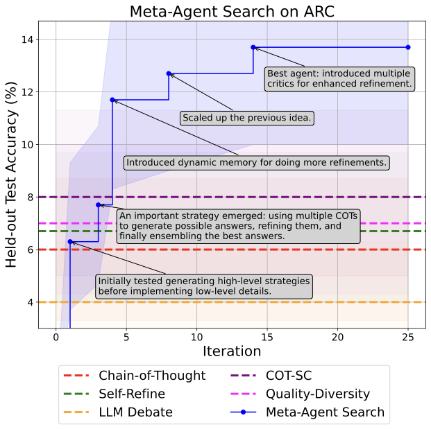
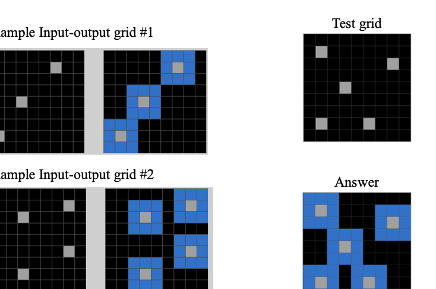

# Paper Assets

## Figure 1: fig:algo

Caption: Overview of the proposed algorithm and examples of discovered agents. In our algorithm, we instruct the ``meta'' agent to iteratively program new agents, test their performance on tasks, add them to an archive of discovered agents, and use this archive to inform the meta agent in subsequent iterations. We show three example agents across our runs, with all names generated by the meta agent. The detailed code of example agents can be found in append_section:example_agents.

## Figure 2: fig:problem

Caption: The three key components of (). The search space determines which agentic systems can be represented in . The search algorithm specifies how the method explores the search space. The evaluation function defines how to evaluate a candidate agent on target objectives such as performance.

## Figure 3: subfig:arc_search_progress_plot

Caption: No caption extracted.

## Table 1: tab:various_domains

Caption: Performance comparison between and state-of-the-art hand-designed agents across multiple domains. discovers superior agents compared to the baselines in every domain. We report the test accuracy and the 95% bootstrap confidence interval on held-out test sets. The search is conducted independently for each domain. Here, and in all tables below, we bold the entry with the highest performance for each domain, as well as all entries whose median falls within the 95% confidence interval of the highest-performing treatment.

| p6cmcccc 2*Agent Name | 1cF1 Score | 3cAccuracy (%) |  |  |
| --- | --- | --- | --- | --- |
| (lr)2-2(lr)3-5 | Reading Comprehension | Math | Multi-task | Science |
| gray!20 5>16.3cmState-of-the-art Hand-designed Agents 0.1cm |  |  |  |  |
| Chain-of-Thought wei2022chain | 0pt2.2ex64.2 0.9 | 28.0 3.1 | 65.4 3.3 | 29.2 3.1 |
| COT-SC wang2023selfconsistency | 0pt2.2ex64.4 0.8 | 28.2 3.1 | 65.9 3.2 | 30.5 3.2 |
| Self-Refine madaan2024self | 0pt2.2ex59.2 0.9 | 27.5 3.1 | 63.5 3.4 | 31.6 3.2 |
| LLM Debate du2023improving | 0pt2.2ex60.6 0.9 | 39.0 3.4 | 65.6 3.3 | 31.4 3.2 |
| Step-back Abstraction zheng2023stepback | 0pt2.2ex60.4 1.0 | 31.1 3.2 | 65.1 3.3 | 26.9 3.0 |
| Quality-Diversity lu2024intelligent | 0pt2.2ex61.8 0.9 | 23.8 3.0 | 65.1 3.3 | 30.2 3.1 |
| Role Assignment xu2023expertprompting | 0pt2.2ex65.8 0.9 | 30.1 3.2 | 64.5 3.3 | 31.1 3.1 |
| gray!20 5>16.3cm on Different Domains 0.1cm |  |  |  |  |
| Prompt Optimization yang2024OPRO | 0pt2.2ex69.1 0.9 | 30.6 3.2 | 67.6 3.2 | 32.9 3.2 |
| Meta Agent Search (Ours) | 0pt2.2ex79.4 0.8 | 53.4 3.5 | 69.6 3.2 | 34.6 3.2 |

## Table 2: tab:transferability

Caption: Performance on held-out math and non-math domains when transferring top agents from MGSM (Math). GSM8K and GSM-Hard are the held-out math domains, while MMLU is for Multi-task, and DROP is for Reading Comprehension. Agents discovered by consistently outperform the baselines across all domains. We report the test accuracy and the 95% bootstrap confidence interval. The names of the top agents are generated by .

| p6cmc|cc|cc 2*Agent Name | 4cAccuracy (%) | 1cF1 Score |  |  |  |
| --- | --- | --- | --- | --- | --- |
| (lr)2-5(lr)6-6 | MGSM | GSM8K | GSM-Hard | MMLU | DROP |
| gray!20 6>16.2cmManually Designed Agents 0.1cm |  |  |  |  |  |
| Chain-of-Thought wei2022chain | 0pt2.2ex28.0 3.1 | 34.9 3.2 | 15.0 2.5 | 65.4 3.3 | 64.2 0.9 |
| COT-SC wang2023selfconsistency | 0pt2.2ex28.2 3.1 | 37.8 3.4 | 15.5 2.5 | 65.9 3.2 | 64.4 0.8 |
| Self-Refine madaan2024self | 0pt2.2ex27.5 3.1 | 38.9 3.4 | 15.1 2.4 | 63.5 3.4 | 59.2 0.9 |
| LLM Debate du2023improving | 0pt2.2ex39.0 3.4 | 43.6 3.4 | 17.4 2.6 | 65.6 3.3 | 60.6 0.9 |
| Step-back Abstraction zheng2023stepback | 0pt2.2ex31.1 3.2 | 31.5 3.3 | 12.2 2.3 | 65.1 3.3 | 60.4 1.0 |
| Quality-Diversity lu2024intelligent | 0pt2.2ex23.8 3.0 | 28.0 3.1 | 14.1 2.4 | 65.1 3.1 | 61.8 0.9 |
| Role Assignment xu2023expertprompting | 0pt2.2ex30.1 3.2 | 37.0 3.4 | 18.0 2.7 | 64.5 3.3 | 65.8 0.9 |
| gray!20 2>8cmTop Agents Searched on MGSM (Math) | 2>3.7cmTransferred within Math Domains | 2>3.5cmTransferred beyond Math Domains 0.1cm |  |  |  |
| Dynamic Role-Playing Architecture | 0pt2.2ex53.4 3.5 | 69.5 3.2 | 31.2 3.2 | 62.4 3.4 | 70.4 0.9 |
| Structured Multimodal Feedback Loop | 0pt2.2ex50.2 3.5 | 64.5 3.4 | 30.1 3.2 | 67.0 3.2 | 70.4 0.9 |
| Interactive Multimodal Feedback Loop | 0pt2.2ex47.4 3.5 | 64.9 3.3 | 27.6 3.2 | 64.8 3.3 | 71.9 0.8 |

## Table 3: tab:transfer_model

Caption: Performance on ARC when transferring top agents from GPT-3.5 to other FMs. Agents discovered by consistently outperform the baselines across different models. We report the test accuracy and the 95% bootstrap confidence interval. The names of top agents are generated by . manually changed this name because the original generated name was confusing.

| p6.5cmc|ccc 2*Agent Name | 4cAccuracy on ARC (%) |  |  |  |
| --- | --- | --- | --- | --- |
| (lr)2-5 | GPT-3.5 | Claude-Haiku | GPT-4 | Claude-Sonnet |
| gray!20 5>15.8cmManually Designed Agents |  |  |  |  |
| Chain-of-Thought wei2022chain | 0pt2ex 06.0 2.7 | 4.3 2.2 | 17.7 4.4 | 25.3 5.0 |
| COT-SC wang2023selfconsistency | 0pt2ex 08.0 3.2 | 5.3 2.5 | 19.7 4.5 | 26.3 4.9 |
| LLM Debate du2023improving | 0pt2ex 04.0 2.2 | 1.7 1.5 | 19.0 4.5 | 24.7 4.8 |
| Self-Refine madaan2024self | 0pt2ex 06.7 2.7 | 6.3 2.8 | 23.0 5.2 | 39.3 5.5 |
| Quality-Diversity lu2024intelligent | 0pt2ex 07.0 2.9 | 3.3 2.2 | 23.0 4.7 | 31.7 5.3 |
| gray!20 2>8.6cmTop Agents Searched with GPT-3.5 | 3>6.9cmTransferred to Other FMs 0.1cm |  |  |  |
| Structured Feedback and Ensemble Agent | 0pt2ex 13.7 3.9 | 5.0 2.5 | 30.0 5.2 | 38.7 5.5 |
| Hierarchical Committee Reinforcement Agent | 0pt2ex 13.3 3.8 | 8.3 3.2 | 32.3 8.9 | 39.7 5.5 |
| Dynamic Memory and Refinement Agent | 0pt2ex 12.7 3.9 | 9.7 3.3 | 37.0 5.3 | 48.3 5.7 |

## Table 4: tab:transfer_dataset

Caption: Performance on different math domains when transferring top agents from MGSM to other math domains. Agents discovered by consistently outperform the baselines across different math domains. We report the test accuracy and the 95% bootstrap confidence interval. The names of top agents are generated by .

| p7cmc|cccc 2*Agent Name | 5cAccuracy (%) |  |  |  |  |
| --- | --- | --- | --- | --- | --- |
| (lr)2-6 | MGSM | GSM8K | GSM-Hard | SVAMP | ASDiv |
| gray!20 6>18cmManually Designed Agents 0.1cm |  |  |  |  |  |
| Chain-of-Thought wei2022chain | 0pt2.2ex28.0 3.1 | 34.9 3.2 | 15.0 2.5 | 77.8 2.8 | 88.9 2.2 |
| COT-SC wang2023selfconsistency | 0pt2.2ex28.2 3.1 | 37.8 3.4 | 15.5 2.5 | 78.2 2.8 | 89.0 2.1 |
| Self-Refine madaan2024self | 0pt2.2ex27.5 3.1 | 38.9 3.4 | 15.1 2.4 | 78.5 2.8 | 89.2 2.2 |
| LLM Debate du2023improving | 0pt2.2ex39.0 3.4 | 43.6 3.4 | 17.4 2.6 | 76.0 3.0 | 88.9 2.2 |
| Step-back Abstraction zheng2023stepback | 0pt2.2ex31.1 3.2 | 31.5 3.3 | 12.2 2.3 | 76.1 3.0 | 87.8 2.3 |
| Quality-Diversity lu2024intelligent | 0pt2.2ex23.8 3.0 | 28.0 3.1 | 14.1 2.4 | 69.8 3.2 | 80.1 2.8 |
| Role Assignment xu2023expertprompting | 0pt2.2ex30.1 3.2 | 37.0 3.4 | 18.0 2.7 | 73.0 3.0 | 83.1 2.6 |
| gray!20 2>9.1cmTop Agents Searched on MGSM (Math) | 4>8.45cmTransferred within Math Domains 0.1cm |  |  |  |  |
| Dynamic Role-Playing Architecture | 0pt2.2ex53.4 3.5 | 69.5 3.2 | 31.2 3.2 | 81.5 2.6 | 91.8 1.8 |
| Structured Multimodal Feedback Loop | 0pt2.2ex50.2 3.5 | 64.5 3.4 | 30.1 3.2 | 82.6 2.6 | 89.9 2.1 |
| Interactive Multimodal Feedback Loop | 0pt2.2ex47.4 3.5 | 64.9 3.3 | 27.6 3.2 | 80.6 2.8 | 89.8 2.1 |

## Table 5: tab:transfer_other_domians

Caption: Performance across multiple domains when transferring top agents from the Math (MGSM) domain to non-math domains. Agents discovered by in the math domain can outperform or match the performance of baselines after being transferred to domains beyond math. We report the test accuracy and the 95% bootstrap confidence interval.

| p7cmc|ccc 2*Agent Name | 1cAccuracy (%) | 1cF1 Score | 2cAccuracy (%) |  |
| --- | --- | --- | --- | --- |
| (lr)2-2 (lr)3-3 (lr)4-5 | Math | Reading Comprehension | Multi-task | Science |
| gray!20 5>18.9cmManually Designed Agents |  |  |  |  |
| Chain-of-Thought wei2022chain | 0pt2ex 28.0 3.1 | 64.2 0.9 | 65.4 3.3 | 29.2 3.1 |
| COT-SC wang2023selfconsistency | 0pt2ex 28.2 3.1 | 64.4 0.8 | 65.9 3.2 | 30.5 3.2 |
| Self-Refine madaan2024self | 0pt2ex 27.5 3.1 | 59.2 0.9 | 63.5 3.4 | 31.6 3.2 |
| LLM Debate du2023improving | 0pt2ex 39.0 3.4 | 60.6 0.9 | 65.6 3.3 | 31.4 3.2 |
| Step-back Abstraction zheng2023stepback | 0pt2ex 31.1 3.2 | 60.4 1.0 | 65.1 3.3 | 26.9 3.0 |
| Quality-Diversity lu2024intelligent | 0pt2ex 23.8 3.0 | 61.8 0.9 | 65.1 3.1 | 30.2 3.1 |
| Role Assignment xu2023expertprompting | 0pt2ex 30.1 3.2 | 65.8 0.9 | 64.5 3.3 | 31.1 3.1 |
| gray!20 2>9.7cmTop Agents Searched on Math (MGSM) | 3>8.7cmTransferred beyond Math Domains 0.1cm |  |  |  |
| Dynamic Role-Playing Architecture | 0pt2.2ex53.4 3.5 | 70.4 0.9 | 62.4 3.4 | 28.6 3.1 |
| Structured Multimodal Feedback Loop | 0pt2.2ex50.2 3.5 | 70.4 0.9 | 67.0 3.2 | 28.7 3.1 |
| Interactive Multimodal Feedback Loop | 0pt2.2ex47.4 3.5 | 71.90.8 | 64.8 3.3 | 29.9 3.2 |

## Figure 4: append_fig:arc_example

Caption: An example task from the ARC challenge chollet2019measure. Given the input-output grid examples, the AI system is asked to learn the transformation rules and then apply these learned rules to the test grid to predict the final answer.

## Table 6: tab:empty_init

Caption: Performance comparison of Meta Agent Search with and without initial agent designs across multiple domains. The results show that even without initialization, Meta Agent Search outperforms hand-designed baselines in all domains. However, incorporating initial solutions generally leads to better performance, except in the math domain, where starting without initialization yields superior results.

| p6cmcccc 2*Agent Name | 1cF1 Score | 3cAccuracy (%) |  |  |
| --- | --- | --- | --- | --- |
| (lr)2-2(lr)3-5 | Reading Comprehension | Math | Multi-task | Science |
| gray!20 5>16.3cmState-of-the-art Hand-designed Agents 0.1cm |  |  |  |  |
| Chain-of-Thought wei2022chain | 0pt2.2ex64.2 0.9 | 28.0 3.1 | 65.4 3.3 | 29.2 3.1 |
| COT-SC wang2023selfconsistency | 0pt2.2ex64.4 0.8 | 28.2 3.1 | 65.9 3.2 | 30.5 3.2 |
| Self-Refine madaan2024self | 0pt2.2ex59.2 0.9 | 27.5 3.1 | 63.5 3.4 | 31.6 3.2 |
| LLM Debate du2023improving | 0pt2.2ex60.6 0.9 | 39.0 3.4 | 65.6 3.3 | 31.4 3.2 |
| Step-back Abstraction zheng2023stepback | 0pt2.2ex60.4 1.0 | 31.1 3.2 | 65.1 3.3 | 26.9 3.0 |
| Quality-Diversity lu2024intelligent | 0pt2.2ex61.8 0.9 | 23.8 3.0 | 65.1 3.3 | 30.2 3.1 |
| Role Assignment xu2023expertprompting | 0pt2.2ex65.8 0.9 | 30.1 3.2 | 64.5 3.3 | 31.1 3.1 |
| gray!20 5>16.3cm on Different Domains 0.1cm |  |  |  |  |
| Meta Agent Search (Empty Initialization) | 0pt2.2ex73.9 0.9 | 67.5 3.3 | 68.5 3.3 | 32.7 3.2 |
| Meta Agent Search | 0pt2.2ex79.4 0.8 | 53.4 3.5 | 69.6 3.2 | 34.6 3.2 |
