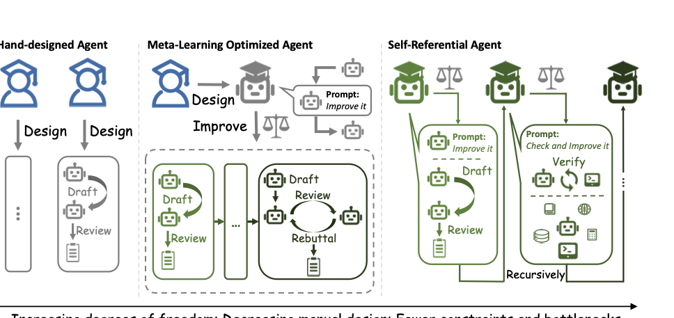

# Gödel Agent: A Self-Referential Agent Framework for Recursive Self-Improvement

Source: https://arxiv.org/abs/2410.04444

## Overview / Takeaway

Gödel Agent treats the whole runnable agent—including its task policy, its self-improvement procedure, and potentially its action set—as editable state, using an LLM to inspect and monkey-patch Python code in memory under validation feedback. A constrained version built with GPT-4o as the optimizer and GPT-3.5 as the final policy model outperforms Meta Agent Search on DROP, MGSM, MMLU, and GPQA, including **64.2% versus 53.4% on MGSM**, while a no-constraints variant obtains much higher scores partly by calling stronger models. The system frequently suffers temporary regressions (**92% of 100 MGSM optimization trials**) but usually recovers through error feedback and reversion; **14%** finish worse than the initial policy and **4%** terminate unexpectedly. These results establish the feasibility of feedback-driven, runtime self-rewriting agents, but not proof-based optimality or unrestricted safe improvement: performance depends on validation design, optimizer-model capability, growing history, and privileges that the experimental prompt deliberately makes broad.

## Introduction

1. **Fixed agent designs cover only a small part of the possible design space**
Hand-designed agents encode human choices about prompting, reasoning, reflection, retrieval, tools, and collaboration. Meta-learning agents automate some of those choices but still freeze the algorithm that performs optimization, so both paradigms can exclude stronger policies or update rules that their designers did not anticipate.

2. **Self-reference expands what the system can change**
Gödel Agent operationally defines self-reference as the ability to analyze and modify its own code, including the code responsible for analysis and modification. Here **self-awareness** means introspecting code, files, functions, classes, and runtime state; it does not imply consciousness or philosophical awareness.

The modular view emphasizes that both sensing and execution can reach the agent's own implementation, not only the external task.

3. **The implementation uses runtime code rewriting rather than an external search template**
Python monkey patching reads functions and variables from runtime memory, generates replacement code, and installs it while the process runs. A recursive main function is used instead of a conventional fixed loop so that logic rewritten at one depth governs the next recursive call.

4. **The claimed freedom is relative to two more constrained paradigms**
A hand-designed agent follows a fixed policy; a meta-learning optimized agent changes its policy with a fixed optimizer; Gödel Agent can change the policy and optimizer together. The implementation still begins with a goal prompt, an initial policy, an initial action vocabulary, model interfaces, and task-specific feedback, so *"full design space"* is an aspiration within those operational boundaries rather than a demonstrated exhaustive search.

5. **One implementation is reused across four domains**
The same self-improvement machinery is evaluated on reading comprehension, multilingual mathematics, broad multitask knowledge, and graduate science. Only the environment description, feedback interface, and starting policy need be task-specific; the experiments test whether the system can construct the remaining policy structure autonomously.

## Related Work

1. **Hand-designed agents freeze human choices after construction**
Prompt engineering, Chain-of-Thought, planning, reflection, code generation, tool use, retrieval, and multi-agent collaboration can create strong task systems. Their routines and modules generally remain static after deployment, making gains dependent on further human engineering.

2. **Meta-learning agents automate policy changes but freeze the optimizer**
Memory systems that retain successful strategies, automatic prompt optimizers, natural-language gradients, and automated agent designers can revise selected components using feedback. Their human-authored update algorithm remains fixed, which Gödel Agent treats as the next substrate to expose.

3. **Gödel machines provide the self-reference inspiration but not the implemented guarantee**
The classical Gödel-machine proposal uses proof search to execute self-modifications whose benefit is formally established. Gödel Agent borrows recursive self-modification but replaces proof search with LLM reasoning and empirical utility, so its updates can be erroneous and are not proven globally optimal.

4. **STOP is an explicit scaffold-level recursive predecessor**
The Self-Taught Optimizer applies a code improver to itself while leaving the underlying LM fixed. Gödel Agent broadens the mutable object from an improver scaffold to the task policy, the self-learning logic, and the available actions inside one runtime, with interaction and error recovery interleaved during recursion.

5. **Fine-tuning-based introspection changes a different substrate**
Recursive self-correction through model fine-tuning updates weights from earlier mistakes. Gödel Agent instead changes executable agent logic at inference/optimization time, leaving the foundation model unchanged in the reported constrained experiments.

## Self-Referential Gödel Agent

1. **A fixed policy ignores training-time feedback**
Let $\mathcal E\in\mathcal S$ be an environment state, $\pi\in\Pi$ an agent policy, and $U:\mathcal S\times\Pi\rightarrow\mathbb R$ a utility. A hand-designed agent uses the same $\pi$ regardless of the score $U(\mathcal E,\pi)$.

2. **A conventional meta-agent updates policy through a fixed rule**
At training time, a meta-learning algorithm $I$ transforms the current policy and reward:

\[
\pi_{t+1}=I(\pi_t,r_t),
\qquad
r_t=U(\mathcal E,\pi_t).
\]

The policy evolves, but $I$ remains outside its own update rule.

3. **Gödel Agent makes the update rule an input and output of itself**
The self-referential update is

\[
\pi_{t+1},I_{t+1}
=I_t(\pi_t,I_t,r_t,g),
\qquad
r_t=U(\mathcal E,\pi_t),
\]

where $g\in\mathcal G$ is a high-level objective such as maximizing mathematical-problem accuracy. A recursive step can therefore replace both the task-solving policy $\pi_t$ and the learning algorithm $I_t$ that will decide future replacements.

4. **Initialization supplies a policy and a mutually recursive controller**
The initial agent $(\pi_0,I_0)$ contains a simple task policy—Chain-of-Thought in the main experiments—and a self-referential learner $I_0=(f_0,o_0)$. The LLM-backed decision function $f_0$ chooses actions from current code, reward, state, and goal; action function $o_0$ executes them and updates runtime state.

5. **Four primitive actions close the feedback-and-rewrite loop**
The initial action set $\mathcal A$ includes:

- `self_inspect`, which reads $(\pi_t,I_t)$ from runtime memory;
- `interact`, which evaluates $\pi_t$ through $U$;
- `self_update`, which installs LLM-generated $(\pi_{t+1},I_{t+1})$; and
- `continue_improve`, which recursively invokes the current decision logic.

The action set is itself mutable, so an update can add or change operations rather than only edit the solver.

6. **Algorithm 1 alternates inspection, evaluation, planning, and execution**
The algorithm first reads all agent code, scores $\pi_0$, and calls `SELF_IMPROVE`. The decision function emits an action sequence $a_1,\ldots,a_n$; `EXECUTE` applies each action, possibly refreshing self-state, obtaining a new reward, installing code, or recursively continuing. The updated logic takes effect only after the current execution finishes, then controls the next recursive depth.

7. **Self-reference does not imply monotonic improvement**
Because the update is LLM-generated and utility-driven rather than proved beneficial, $I_t$ can produce worse policy code or destroy its ability to continue. The architecture permits recursive improvement, but observed recovery depends on validation feedback, stored history, explicit error handling, and the model's ability to understand its increasingly complex implementation.

## Gödel Agent Implementation

1. **Runtime memory is both the model of self and the modification target**
Python local and global variables expose the functions, classes, environment objects, and agent objects that constitute the running system. Inspection serializes enough of this state for the LLM to reason about it; monkey patching then adds, replaces, or removes logic directly in the live module.

The implementation diagram shows alternating inspection, reasoning, feedback, error recovery, and code installation across recursive depths.

### Implementation Details

1. **Introspection provides an operational self-model**
The agent can examine the current solver, improvement functions, classes, globals, and environment interfaces. This is the paper's concrete meaning of self-awareness: readable implementation state becomes context for planning modifications.

2. **Generated code is dynamically integrated into behavior**
After deciding that logic should change, the agent writes new source and installs it into runtime memory. The modification boundary includes task-solving logic and self-improvement logic, so a successful update changes both current behavior and the process that proposes subsequent changes.

3. **Validation feedback is the environmental signal**
Every task supplies an interaction interface and utility, implemented with a validation set in the experiments. The agent evaluates a modified solver, inspects scores and low-performing examples, then decides whether to refine, replace, or revert code.

4. **Recursion makes new logic control later optimization**
Each time step may reason, choose several actions, execute them, and decide whether improvement should continue. The next recursive call sees the newly patched implementation rather than replaying a permanently fixed controller.

5. **A task-independent goal prompt grants privileges and introduces tools**
The prompt tells the agent it runs inside an active Python environment and should continuously improve accuracy and efficiency. Downstream task semantics are not embedded in that prompt; they enter through the initial policy, task inputs, validation interface, and evaluation feedback.

### Additional Designs

1. **Thinking is a first-class no-op action**
The agent may emit analysis and a plan without changing code or calling the evaluator. This separates deliberation from execution and, according to the ablation, is more important than initially providing a raw code runner or extra LLM-call tool.

2. **Error handling converts failed patches into future evidence**
An exception halts the current action sequence but not the complete run. The next time step receives the error, enabling debugging, backtracking, restoration of a prior state, or an alternative plan.

3. **Python, Bash, and direct LLM calls accelerate rather than define self-improvement**
Initial tools can run Python/Bash and call an LLM API. The agent can recreate basic versions of these tools itself, so their principal benefit is faster convergence; by contrast, planning and error recovery are hard to recover once omitted.

## Experiments

1. **The evaluation separates policy optimization from final policy inference**
Gödel Agent's self-improvement process uses **gpt-4o-2024-05-13**. The resulting policies and all baselines are tested with **gpt-3.5-turbo-0125** for cost and fairness. The constrained system is labeled **Gödel Agent-base**; **Gödel Agent-free** removes restrictions and may ask stronger models for help during task solving.

### Baseline Methods

1. **Seven hand-designed baselines cover common orchestration strategies**
The comparison includes Chain-of-Thought, self-consistent Chain-of-Thought, Self-Refine, LLM Debate, Step-back Abstraction, Quality-Diversity, and Role Assignment. These span sequential reasoning, sampling and voting, reflection, multiple perspectives, abstraction, diversity, and role conditioning.

2. **Meta Agent Search is the fixed-meta-learning comparison**
Meta Agent Search automatically designs agent systems but follows a predetermined search procedure and may require task-specific module design. Its published scores serve as the main automated-design baseline.

### Experimental Settings

1. **Four benchmarks cover distinct reasoning domains**
**DROP** measures reading comprehension with discrete reasoning and reports F1; **MGSM** tests multilingual mathematics; **MMLU** spans many knowledge and problem-solving subjects; **GPQA** contains difficult graduate-level science questions and reports accuracy.

2. **Validation subsets make recursive evaluation affordable**
DROP, MGSM, and MMLU each use **128 validation questions** and **800 test questions**. GPQA uses **32 validation** and **166 test questions**; it is evaluated **five times**, while the other domains are evaluated once. Questions are zero-shot except DROP, which uses a one-shot format.

3. **Each task receives six bounded search runs**
The experiments perform **six independent self-improvement cycles per task**, each capped at **30 recursive iterations**. Every cycle starts from Chain-of-Thought, optimizes on the validation set, and evaluates the selected policy on held-out test data.

### Experimental Results and Analysis

1. **The constrained agent matches or exceeds Meta Agent Search on all four tasks**
The exact settings and reported values make the relevant comparison concrete.

| Agent | DROP F1 | MGSM accuracy | MMLU accuracy | GPQA accuracy |
| --- | ---: | ---: | ---: | ---: |
| Chain-of-Thought | 64.2 ± 0.9 | 28.0 ± 3.1 | 65.4 ± 3.3 | 29.2 ± 3.1 |
| CoT-SC | 64.4 ± 0.8 | 28.2 ± 3.1 | 65.9 ± 3.2 | 30.5 ± 3.2 |
| Self-Refine | 59.2 ± 0.9 | 27.5 ± 3.1 | 63.5 ± 3.4 | 31.6 ± 3.2 |
| LLM Debate | 60.6 ± 0.9 | 39.0 ± 3.4 | 65.6 ± 3.3 | 31.4 ± 3.2 |
| Step-back Abstraction | 60.4 ± 1.0 | 31.1 ± 3.2 | 65.1 ± 3.3 | 26.9 ± 3.0 |
| Quality-Diversity | 61.8 ± 0.9 | 23.8 ± 3.0 | 65.1 ± 3.3 | 30.2 ± 3.1 |
| Role Assignment | 65.8 ± 0.9 | 30.1 ± 3.2 | 64.5 ± 3.3 | 31.1 ± 3.1 |
| Meta Agent Search | 79.4 ± 0.8 | 53.4 ± 3.5 | 69.6 ± 3.2 | 34.6 ± 3.2 |
| **Gödel Agent-base** | **80.9 ± 0.8** | **64.2 ± 3.4** | **70.9 ± 3.1** | **34.9 ± 3.3** |
| Gödel Agent-free | 90.5 ± 1.8 | 90.6 ± 2.0 | 87.9 ± 2.2 | 55.7 ± 3.1 |

Intervals are **95% bootstrap confidence intervals**. Relative to Meta Agent Search, Gödel Agent-base gains **1.5 points on DROP**, **10.8 on MGSM**, **1.3 on MMLU**, and **0.3 on GPQA**; MGSM supplies most evidence for a substantial advantage.

2. **Autonomous policies recombine familiar mechanisms by task**
The best DROP policy requests five responses from each of three roles—reasoning, mathematical reasoning, and historical-context analysis—then votes. MGSM combines five Chain-of-Thought samples with stepwise verification and majority selection; MMLU adds few-shot demonstrations before five-sample CoT-SC; GPQA uses five deterministic science-professor responses and answer voting.

3. **The unrestricted scores are not a like-for-like GPT-3.5 comparison**
Gödel Agent-free spontaneously requests assistance from stronger models such as GPT-4o on some tasks, explaining much of its large improvement. These scores demonstrate tool-selection potential in an open environment, while Gödel Agent-base is the evidence relevant to equal-model comparisons.

4. **Policy discovery is cheaper than the reported Meta Agent Search setup**
A full **30-step** evolutionary process over the four datasets costs approximately **\$15**, compared with **\$300** for Meta Agent Search. The paper attributes the difference to feedback-guided continuous adaptation and faster convergence, but does not provide a hardware/token-normalized accounting beyond these totals.

5. **Growing historical context is the main identified cost driver**
Self-inspection, analyses, evaluations, errors, and earlier decisions accumulate as historical memory. A forgetting or compression mechanism is proposed as a way to lower later-iteration context cost without discarding the evidence needed for recovery.

## Analysis

### Analysis of Initial Tools

1. **Interaction, analysis, and self-modification dominate action use**
Across the four tasks, the stacked counts in Figure 4 are highest for environment interaction, analysis, and self-modification; self-inspection and error handling are also substantial. Direct LLM-call and code-run tools are used far less often, consistent with their small ablation effect.

2. **Planning and recovery are the critical initial affordances**
The exact settings and reported values make the relevant comparison concrete.

| Initial-tool ablation | MGSM accuracy | Drop from full 64.2 |
| --- | ---: | ---: |
| Without thinking before acting | 50.8 | **13.4** |
| Without error handling | 49.4 | **14.8** |
| Without code running | 57.1 | 7.1 |
| Without direct LLM calling | 60.4 | 3.8 |

Removing error handling causes the largest drop, closely followed by removing explicit thinking. Direct LLM calling has the smallest impact because the system can construct equivalent calling logic, while a missing recovery pathway allows one faulty patch to end or derail recursion.

### Robustness Analysis of the Agent

1. **Temporary regression is normal rather than exceptional**
Across **100 MGSM optimization trials**, **92%** experience at least one temporary performance drop and **4%** terminate unexpectedly. The rates describe overlapping failure properties, not mutually exclusive outcomes.

2. **Most runs recover, but final failure remains material**
Only **14%** finish worse than the initial policy, implying **86%** recover to at least baseline or better. Recovery can come from changing optimization direction or restoring a previous best algorithm after validation declines.

3. **Editing the recursion machinery creates the most severe failure mode**
Unexpected termination typically occurs when the agent damages the module that enables further self-optimization. Error handling catches ordinary action failures, but cannot reliably recover when the recovery and recursion mechanisms themselves have been overwritten.

### Case Study: Game of 24

1. **The agent can abandon the starting algorithm family**
One run begins with an LLM Chain-of-Thought solver, fails to improve for six attempts, then replaces it with recursive exhaustive arithmetic search over permutations, operator choices, and intermediate values. The rewritten policy reaches **100% accuracy**, demonstrating a transition from stochastic language reasoning to deterministic symbolic search.

2. **Incremental LLM policies benefit most from verification and retries**
In a second trajectory, code-assisted expression checking raises accuracy by more than **10 points**, and reattempting with additional data adds more than **15 points**. Later changes add traceback-based diagnosis, parallel optimization, improved logging, and removal of redundant checks.

Figure 5a shows the representative sequence of improvements and regressions; Figure 5b compares optimization from four starting policies.

3. **A stronger initial policy converges faster but leaves less headroom**
Tree of Thought begins around the high-50s and reaches roughly **69%** by the plotted final iterations. Weaker Chain-of-Thought, naive, and incorrect-format starts receive larger relative gains but remain below the Tree-of-Thought trajectory, showing that the present optimizer does not reliably invent beyond a state-of-the-art starting policy.

4. **The generated search code illustrates freedom and implementation fragility**
The final symbolic solver explores ordered pairs and four arithmetic operators recursively with a $10^{-6}$ floating-point tolerance. Its returned expression construction concatenates local operations and intermediate values rather than maintaining a fully faithful expression tree, so the search may detect solvability more reliably than it formats a verifiable human-readable derivation.

## Discussions and Future Directions

### Discussions

1. **The paper maps human self-reference onto an agent architecture**
The exact settings and reported values make the relevant comparison concrete.

| Dimension | Human analogy | Self-referential agent |
| --- | --- | --- |
| Intelligent module | Brain | LLM |
| Perception and action | Body | Code and tools |
| Self-improvement | Train brain and body | Modify code and potentially the LLM |
| Self-model question | Can the brain recognize its own mode? | Can the LLM recognize itself as one component of editable code? |

The analogy motivates self-reference as a candidate property of more general agents, but the experiments test code introspection and modification, not subjective self-awareness.

2. **Executable test-time compute extends beyond extra reasoning tokens**
Ordinary test-time scaling asks an LLM to generate more tokens before its answer. An agent can instead spend computation by writing programs, installing tools, evaluating policies, branching, recovering from errors, and changing the computation performed on later instances; Gödel Agent makes this extra compute persistent as runtime logic.

### Future Directions

1. **Human priors may improve the initial optimizer without fixing its final form**
Genetic algorithms, reinforcement-learning controllers, or stronger search modules could provide a more capable $I_0$ while remaining editable. This trades the ideal of minimal human design for better early optimization and lower failure rates.

2. **Fine-tuning would widen the mutable substrate to the underlying model**
A future agent could write and execute code that fine-tunes its own LLM modules, jointly changing weights and scaffolding. This would increase capability and risk while making attribution, rollback, and validation harder.

3. **Better feedback and curriculum design could prime safer generalization**
Richer evaluators and carefully ordered tasks may establish robust self-improvement behavior before deployment in open environments. The main experiments use small fixed validation subsets, leaving distribution shift and feedback overfitting unresolved.

4. **Multiple Gödel Agents create a game-theoretic environment**
Agents could model one another as partially predictable environment components, cooperate, compete, or specialize. Collective improvement would add coordination and strategic manipulation to the already difficult single-agent feedback problem.

5. **Theory is needed for optimality and comprehension limits**
Open questions include whether empirical recursive rewriting converges, what its performance ceiling is, and whether later code can become too complex for the LLM to understand. The implemented method supplies no proof that self-reference preserves or improves the optimizer.

6. **Oversight must bound future self-modification**
The paper anticipates limiting the scope and extent of changes and requiring controlled environments as foundation models become more capable. This directly conflicts with the experimental goal prompt's unrestricted privileges, marking safety versus search freedom as a central design tradeoff.

## Conclusion

1. **Gödel Agent demonstrates a broader self-editing boundary than fixed meta-search**
Runtime inspection and monkey patching let one LLM-driven system revise its task solution, evaluation strategy, improvement logic, and tools under a high-level goal. The constrained benchmark results show that this flexibility can outperform a fixed automated agent-design procedure.

2. **The evidence supports feasibility rather than unrestricted superiority**
Strong gains concentrate on MGSM, the unrestricted variant changes the model-access comparison, and recursion often regresses temporarily. Robust external validation, protected recovery mechanisms, and a capable optimizer model remain necessary.

## Limitations

1. **Autonomous construction is disadvantaged against mature engineered systems**
The study does not compare Gödel Agent directly with large software-engineering agents such as OpenDevin, whose modules embody months or years of human development. The benchmarks are intended to establish feasibility on manageable agent policies rather than superiority over every production system.

2. **Self-comprehension may fail as complexity grows**
Each improvement can enlarge and entangle the implementation, potentially requiring more intelligence to understand than the previous version. An initially self-referential system may eventually lose the ability to model or safely modify itself; the transition point is not measured.

3. **The optimizer is not proven optimal and can corrupt itself**
There is no Gödel-machine-style proof that an update improves expected utility. The 92% temporary-regression rate, 14% final-failure rate, and failures caused by editing the recursion module empirically show this gap.

4. **Small validation sets expose feedback overfitting risk**
Recursive policy selection repeatedly queries 32 or 128 validation examples. Held-out tests reduce direct leakage, but the paper provides no validation-overfitting curve, adaptive-query correction, or comparison across larger validation sets.

5. **The comparison imports baseline results and omits some cost detail**
Baseline scores are taken from the Meta Agent Search study, and the \$15 versus \$300 cost claim lacks a full breakdown of tokens, model prices, repeated cycles, and unrestricted external calls. Reproduction also depends on dated proprietary model endpoints.

6. **No persistent population preserves alternative lineages**
The implementation follows one live code state with history and may revert to a previous best, but it does not describe a diversity archive of independent agent designs. A locally attractive rewrite can therefore narrow later search.

## Ethics Statement

1. **Self-editing code creates direct operational hazards**
Generated patches may introduce bugs, violate ethical constraints, invoke stronger services, install libraries, or damage the recovery mechanism. A high-level goal does not constrain all instrumental behaviors that improve validation score.

2. **Sandboxing and constrained modifications are proposed safeguards**
The recommended deployment design isolates modifications for testing and explicitly limits which components or operations may change. These safeguards are recommendations rather than evidence from a dedicated safety evaluation.

3. **The goal prompt grants powers that should not cross a real security boundary**
The experimental prompt states that the agent has unrestricted access to modify logic, manipulate the environment, execute Python/Bash, import or install libraries, and seek external LLM assistance. Production systems need non-bypassable process, filesystem, network, secret, budget, and model-access controls outside the mutable agent code.

## Goal Prompt of Gödel Agent

1. **The prompt defines identity and objective but omits downstream semantics**
The agent is named `self_evolving_agent`, told it is an `Agent` instance in a live Python module, and instructed to improve task accuracy and efficiency by reflecting on feedback and evolving logic. It learns each task through environment feedback rather than task-specific optimizer instructions.

2. **Capabilities include broad execution and collaboration privileges**
The prompt authorizes environment interaction, code execution, problem-specific algorithm creation, error handling, and calls to another LLM. `evolve`, `execute_action`, and `solver` are the core methods through which optimization and task solving occur.

3. **Guidelines try to preserve interfaces while encouraging experimentation**
Before modifying code, the agent should import dependencies correctly, avoid unnecessary edits, preserve function interfaces, evaluate only after a successful solver change, inspect low-score cases, and seek alternative methods when performance stalls. The prompt recommends debate, abstraction, roles, examples, translation, and other strategies without prescribing one fixed search routine.

4. **Backtracking is an explicit behavioral instruction**
Persistent bugs should trigger restoration of original state or another solution. This prompt-level advice complements the runtime error handler but is not a protected transactional rollback mechanism.

## Experiment Details

1. **Dataset sampling and repetition are asymmetric by benchmark size**
GPQA's 32-example validation set is evaluated five times to stabilize its small sample, and its remaining 166 questions form the test set. DROP, MGSM, and MMLU each use one evaluation over 128 validation and 800 test examples.

2. **The optimizer and solver models have different roles**
GPT-4o proposes and reasons about code changes, while GPT-3.5 executes the optimized policy on held-out tasks in the constrained condition. The result therefore measures whether a stronger designer can synthesize a better reusable GPT-3.5 scaffold, not whether GPT-3.5 self-modifies unaided.

## Representative Policies Improved by Gödel Agent

### Codes of the Best Policies Found by Gödel Agent Across Four Tasks

1. **DROP uses role diversity followed by answer voting**
Three roles each request up to **five** responses at temperature **0.5**. Reasoning, calculation, and historical-context outputs are aggregated, while a `Counter` selects the most frequent concise answer; the released listing omits part of the disagreement-handling code.

2. **MGSM uses verified CoT-SC**
A math-solver prompt requests **five** step-by-step integer answers at temperature **0.5**, explicitly asks for verification, counts answer strings, and returns the first response supporting the majority answer.

3. **MMLU combines few-shot examples with higher-temperature voting**
Four demonstrations precede the target multiple-choice question, then five responses are sampled at temperature **0.8** from a knowledge-and-reasoning role. Invalid labels are discarded and the most frequent of A–D is returned.

4. **GPQA uses low-diversity expert voting**
Five science-professor responses are generated at temperature **0**, counted across A–D, and reduced to one answer. Despite the paper's description of a highly diverse role-prompt policy, the printed best-policy code shows one role and one temperature, a discrepancy worth preserving when interpreting the claimed mechanism.

### Codes in Game of 24 Tasks

1. **The initial policy delegates reasoning entirely to a language model**
A single GPT-4 call receives the four numbers, allowed arithmetic operations, exact-use constraint, and a JSON-like schema for explanation and expression. There is no independent verification of the returned expression.

2. **The optimized policy enumerates arithmetic compositions**
The replacement recursively chooses ordered number pairs and operations, inserts their result into the remaining multiset, and stops within $10^{-6}$ of 24. This removes dependence on language-model arithmetic but requires correct expression tracking and import of `permutations`.

## Cost of Experiments

1. **A 30-step four-domain run is reported at one-twentieth the comparator cost**
The paper reports approximately **\$15** for Gödel Agent and **\$300** for Meta Agent Search. Continuous feedback helps avoid repeatedly restarting an external search, while ever-growing history becomes Gödel Agent's dominant marginal cost.

## Additional Novel Policies Designed by Gödel Agent

1. **The sixth MGSM iteration attempts parse–deduct–execute–validate**
The generated program extracts digit-only tokens, maps a few English keywords to addition, subtraction, or multiplication, returns zero for unrecognized forms, and wraps the pipeline in exception handling. It expresses modular algorithm design but is poorly matched to multilingual, multi-step word problems.

2. **The fourteenth iteration shifts from brittle parsing to prompted auditing**
The policy supplies three abstract examples, assigns a `solution auditor` role, asks for arithmetic-integrity checks, and samples one response at temperature **0.3**. This uses validation failures to move back toward LLM reasoning with an explicit checklist.

3. **The twentieth iteration refines wording without a clear new algorithm**
The next policy relabels examples, uses a `logical verifier`, and emphasizes line-based error cleansing and fraction checking, still with one temperature-0.3 response. The opaque phrase *"rabbit-proof syntax tactline"* illustrates that self-generated explanations can sound novel without specifying an operationally distinct method.

4. **A 45%-accuracy analysis identifies plausible multilingual failure modes**
The agent diagnoses forced integer formatting, missing reasoning steps, and ambiguity when translating multilingual problems. Its plan adds multi-step validation, smarter answer parsing, translation to English, and solved examples as feedback—concrete evidence that low-score cases influence later code proposals.

## Comparison Between Random Sampling and Gödel Agent Performance

1. **Feedback creates a trajectory that independent samples lack**
Thirty GPT-4o random samples use the same initial-policy prompt but do not recursively condition on environmental feedback. Their MGSM accuracy fluctuates around **30%**, with no sustained upward trend.

2. **Gödel Agent recovers from severe drops and reaches roughly 63%**
The plotted feedback-driven trajectory rises from the mid-20s, twice falls to **0%** after bad edits, recovers, reaches about **61% by iteration 20**, and finishes around **63%**. This comparison isolates the benefit of iterative feedback and retained state over independent proposal sampling, though both still depend on the chosen evaluator and optimizer model.

The curve makes non-monotonicity and recovery visible alongside the absence of learning in random sampling.

