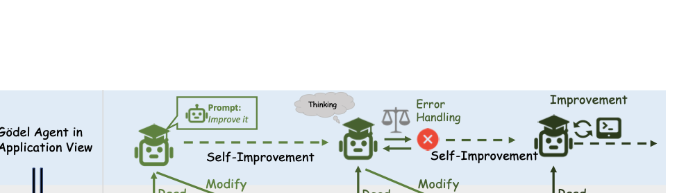
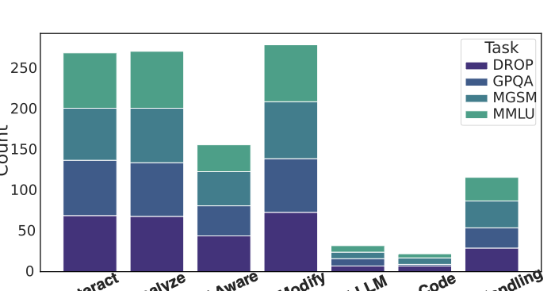
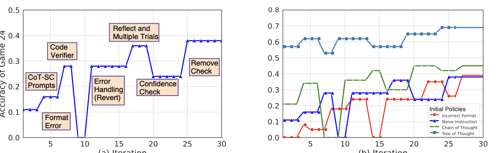
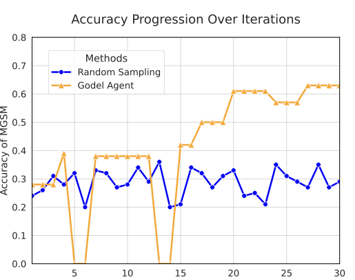

# Paper Assets

## Figure 1: fig:module

Caption: Modular demonstration of . Compared with traditional agents, its sensor and executor can read and write all of its own code.


## Figure 2: fig:compare

Caption: Comparison of three agent paradigms. Hand-designed agents rely on human expertise which are limited in scope and labor-intensive. Meta-learning optimized agents are constrained by a fixed meta-learning algorithm, restricting their search space and optimization potential. In contrast, self-referential agent () can recursively improve itself without any limitation. Its optimization capabilities are constantly being enhanced by itself. Consequently, in return, it can continue to optimize itself better.

![Comparison of three agent paradigms. Hand-designed agents rely on human expertise which are limited in scope and labor-intensive. Meta-learning optimized agents are constrained by a fixed meta-learning algorithm, restricting their search space and optimization potential. In contrast, self-referential agent () can recursively improve itself without any limitation. Its optimization capabilities are constantly being enhanced by itself. Consequently, in return, it can continue to optimize itself better.](figures/compare.png)

## Figure 3: fig:method

Caption: An illustration of our implementation of . It employs monkey patching to directly read and modify its own code in runtime memory, enabling self-awareness and self-modification.



## Table 1: tab:main

Caption: Results of three paradigms of agents on different tasks. The highest value is highlighted in bold, and the second-highest value is underlined. -base is the constrained version of , allowing for fair comparisons with other baselines. -free represents the standard implementation without any constraints, whose results are italicized. We report the test accuracy and the 95% bootstrap confidence interval on test sets.

| p5.2cm >1.7cm >1.7cm >1.7cm >1.7cm 2*Agent Name | F1 Score | 3cAccuracy (%) |  |  |
| --- | --- | --- | --- | --- |
| (lr)2-5 | DROP | MGSM | MMLU | GPQA |
| 0.9 5cHand-Designed Agent Systems |  |  |  |  |
| Chain-of-Thought wei2022chain | 64.2 0.9 | 28.0 3.1 | 65.4 3.3 | 29.2 3.1 |
| COT-SC wang2023selfconsistencyimproveschainthought | 64.4 0.8 | 28.2 3.1 | 65.9 3.2 | 30.5 3.2 |
| Self-Refine madaan2024self | 59.2 0.9 | 27.5 3.1 | 63.5 3.4 | 31.6 3.2 |
| LLM Debate du2023improvingfactualityreasoninglanguage | 60.6 0.9 | 39.0 3.4 | 65.6 3.3 | 31.4 3.2 |
| Step-back-Abs zheng2024stepbackevokingreasoning | 60.4 1.0 | 31.1 3.2 | 65.1 3.3 | 26.9 3.0 |
| Quality-Diversity lu2024aiscientistfullyautomated | 61.8 0.9 | 23.8 3.0 | 65.1 3.3 | 30.2 3.1 |
| Role Assignment xu2023expertpromptinginstructinglargelanguage | 65.8 0.9 | 30.1 3.2 | 64.5 3.3 | 31.1 3.1 |
| 0.9 5cMeta-Learning Optimized Agents |  |  |  |  |
| Meta Agent Search hu2024automated | 79.4 0.8 | 53.4 3.5 | 69.6 3.2 | 34.6 3.2 |
| 0.9 5c (Ours) |  |  |  |  |
| -base (Closed-book; GPT-3.5) | 80.9 0.8 | 64.2 3.4 | 70.9 3.1 | 34.9 3.3 |
| -free (No constraints) | 90.5 1.8 | 90.6 2.0 | 87.9 2.2 | 55.7 3.1 |

## Figure 4: fig:num

Caption: The number of actions taken by varies across different tasks.



## Figure 5: fig:case_start

Caption: (a) One representative example of Game of 24. (b) Accuracy progression for different initial policies.



## Table 2: tab:ab_tool

Caption: Ablation study on initial tool configuration. "think" refers to "thinking", "err" to "error handling", "run" to "code running", and "LLM" to "LLM calling".

| Ablation | MGSM | Ablation | MGSM |
| --- | --- | --- | --- |
| w/o think | 50.8↓13.4 | w/o run | 57.1↓-7.1 |
| w/o err | 49.4↓-14.8 | w/o LLM | 60.4↓-3.8 |

## Table 3: tab:self_reference_analogy

Caption: An analogy of self-reference for both humans and agents

```tex
[t]
\centering

\newcolumntype{L}{>{\RaggedRight\arraybackslash}X}

\begin{tabularx}{\textwidth}{@{}lL L@{}} 
\toprule
                          & \textbf{Human}                                                                         & \textbf{Self-Referential Agent}                                                                 \\ \midrule
Intelligent Module        & brain                                                                                  & LLM                                                                                             \\
Perceptual and Action Module    & body                                                                                   & code and tool                                                                                   \\
Self-Referential Feature  & Humans can train their brain and body to improve, thus becoming better                 & Self-referential agents can modify their code, even the underlying LLM, to improve themselves \\
Self-Awareness Question           & Can the brain recognize itself as a brain? Can it perceive its own mode?               & Can LLM understand that it is one part of the modified codes?                               \\ \bottomrule
\end{tabularx}
\caption{An analogy of self-reference for both humans and agents}
\label{tab:self_reference_analogy}
```

## Figure 6: fig:curve

Caption: Accuracy progression for and random sampling.



## Figure 7: tab:roleprompt

Caption: No caption extracted.

No embeddable figure file was copied.

## Figure 8: unlabeled

Caption: No caption extracted.

No embeddable figure file was copied.

## Figure 9: unlabeled

Caption: No caption extracted.

No embeddable figure file was copied.

## Figure 10: unlabeled

Caption: No caption extracted.

No embeddable figure file was copied.

## Figure 11: unlabeled

Caption: No caption extracted.

No embeddable figure file was copied.

## Figure 12: unlabeled

Caption: No caption extracted.

No embeddable figure file was copied.

## Figure 13: unlabeled

Caption: No caption extracted.

No embeddable figure file was copied.

## Figure 14: unlabeled

Caption: No caption extracted.

No embeddable figure file was copied.

## Figure 15: unlabeled

Caption: No caption extracted.

No embeddable figure file was copied.

## Figure 16: unlabeled

Caption: No caption extracted.

No embeddable figure file was copied.

## Figure 17: unlabeled

Caption: No caption extracted.

No embeddable figure file was copied.
