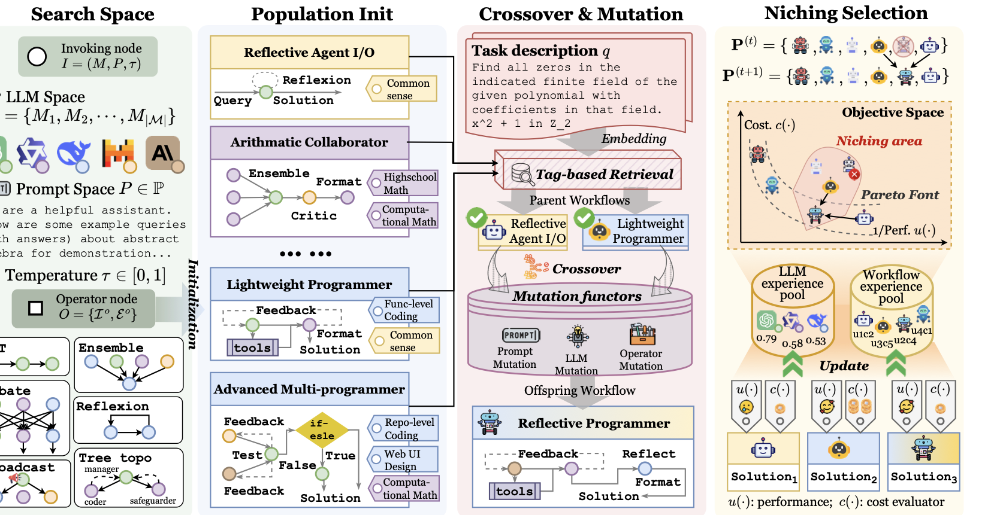

# EvoFlow: Evolving Diverse Agentic Workflows On The Fly

Source: https://arxiv.org/abs/2502.07373

## Overview / Takeaway

EvoFlow replaces the search for one maximally accurate agent workflow with multi-objective evolution of a population spanning different models, topologies, prompts, costs, and complexity levels. Incoming training queries retrieve semantically relevant parents, an LLM crosses them over and mutates their models, prompts, and operators, and a local niching rule retains solutions that improve the cost–performance frontier without collapsing population diversity. With a homogeneous GPT-4o-mini backbone, EvoFlow leads all compared methods on six benchmarks; with a four-model open-source pool, it reaches 72.90% on MATH, exceeding o1-preview’s 70.20% at 12.4% of its reported overall cost. The strongest idea is resource-aware pluralism—preserving cheap simple workflows as well as expensive strong ones—but the evidence also exposes reproducibility gaps, task-specific evaluators, expensive search, and internal inconsistencies in the paper’s benchmark counts and selection notation.

## 1 Introduction

1. **Agent workflows can exceed individual-model limitations**
Structured interactions among LLM agents have improved question answering, data analysis, decision-making, code generation, game playing, and embodied planning. The remaining design problem is not whether agents should collaborate, but how to choose their models, prompts, roles, tools, topology, and computational budget without extensive manual engineering.

2. **Agent automation has progressed from parameters to whole workflows**
Early multi-agent frameworks manually specified roles and communication; later systems automated prompts, agent profiles, or inter-agent topology; and recent automated-design systems generate complete workflows. EvoFlow treats this progression as another instance of machine learning replacing handcrafted artifacts with optimizable ones.

3. **Homogeneous workflows ignore complementary model strengths**
Most automated systems instantiate every agent with one preselected model, often an expensive GPT-family model. EvoFlow instead treats the model identity as part of each invoking node, motivated by the observation that smaller or specialized LLMs may match or beat a larger model on particular subtasks at much lower cost.

4. **Single-objective search tends toward one over-complex solution**
Optimizing accuracy alone rewards ensembles, repeated reflection, and multi-turn debate even when a query could be solved by direct input/output. Because real query streams mix easy and hard tasks, EvoFlow seeks a population that retains both cheap simple routines and expensive high-capability workflows.

Figure 1 contrasts the paradigms: prior automation produces one homogeneous “best” workflow, while EvoFlow preserves a heterogeneous Pareto set and routes each query toward a suitable cost–complexity region.

5. **The research question joins diversity, heterogeneity, and adaptation**
The target is an automatically optimized set of workflows that varies in LLM composition and structural complexity and can serve queries with different domains and difficulty. This is broader than finding the most accurate architecture under one fixed backbone.

6. **Four mechanisms implement the proposed paradigm**
EvoFlow assigns utility-indicator tags to workflows, retrieves relevant parents for each incoming query, applies LLM-facilitated crossover plus **LLM**, **prompt**, and **operator** mutation, and performs local niching-based environmental selection. The result is a population updated one query at a time rather than a single incumbent.

7. **The headline claim combines performance and economy**
The homogeneous experiments report gains of **1.23–29.86 percentage points** over compared or vanilla configurations, depending on the stated comparison. In the heterogeneous MATH experiment, four weaker open-source models collectively reach **72.90%**, versus **70.20%** for o1-preview, at an overall cost of **0.97258** versus **7.84051** dollars in the table’s scaled units—**12.4%** of o1-preview’s cost.

8. **The paper is inconsistent about how many benchmarks were evaluated**
The abstract and contribution list say **seven benchmarks**, while the experiment setup, tables, dataset appendix, and conclusion identify exactly **six**: GSM8K, MATH, MultiArith, HumanEval, MBPP, and ALFWorld. All evidence in these notes therefore treats the empirical corpus as six benchmarks.

## 2 Related Work

### LLM-based Autonomous Agents

1. **Manual multi-agent systems motivate workflow-level automation**
Early systems demonstrated that agents with distinct roles and interactions can outperform single agents, but their manually chosen configurations limit adaptation to new tasks. EvoFlow retains the reusable ideas in those systems as operator templates while moving their assembly into a search process.

### Automated Agentic Workflows

1. **Prior automation usually changes only part of an agent system**
PromptBreeder and DSPy optimize prompts; GPTSwarm, DyLAN, EvoMAC, and G-Designer optimize communication topology; AgentVerse and EvoAgent modify profiles; ADAS, AgentSquare, and AFlow search larger workflow designs. EvoFlow claims coverage of prompt, topology, profile, LLM backbone, and complexity adaptation in one framework.

2. **ADAS establishes the workflow-design problem that EvoFlow broadens**
Automated Design of Agentic Systems formalizes whole-agent design, followed by modular and graph-based search in AgentSquare and AFlow. EvoFlow’s change is to search a population rather than one workflow and to include multiple LLM sources and cost as first-class variables.

3. **Fixed workflows cannot allocate computation by query difficulty**
Even when prior methods discover a strong architecture, one workflow is applied across the test distribution. EvoFlow’s tagged Pareto population instead creates a routing layer: similar simple queries can retrieve cheap workflows, while hard queries retrieve more complex ones.

### Evolutionary Algorithm

1. **Earlier LLM evolution is narrower than workflow evolution**
Evolutionary methods have been applied to prompts, code, planning, inference scaling, and agent personas. EvoPrompt and EvoAgent employ genetic operations on prompts or profiles, but do not jointly evolve heterogeneous LLM assignments, composite operators, and workflow topology.

2. **Niching is used to prevent population collapse**
Standard fitness optimization risks converging toward one expensive high-performing architecture. EvoFlow borrows niching from multi-objective evolutionary search so selection competes within neighborhoods of similar domain tags and costs rather than globally eliminating every lower-cost individual.

## 3 Preliminary

1. **Invoking nodes expose model, prompt, and temperature as search variables**
The basic unit is

\[
I_i=(M_i,P_i,\tau_i),\qquad P_i\in\mathcal P,\quad \tau_i\in[0,1],
\]

where $P_i$ is the prompt and $M_i=(|M_i|,C_i,L_i)$ records the model’s size, token cost, and inference delay. With model pool $\mathcal M$, the invoking-node space is $\mathcal I=\mathcal M\times\mathcal P\times\mathbb R_{[0,1]}$; including $\mathcal M$ distinguishes EvoFlow from systems that preselect one backbone.

2. **Operator nodes package reusable multi-call reasoning structures**
An operator is

\[
O_j=(\mathcal I_j^o,\mathcal E_j^o),\qquad
\mathcal E_j^o\subseteq\mathcal I_j^o\times\mathcal I_j^o,
\]

so one operator may contain several invoking nodes and internal connections. CoT, Self-Refine, debate, ensembles, and ReAct are operator templates rather than indivisible model calls.

3. **A workflow is a graph of operator graphs**
For selected operators $\mathcal O^S$ and cross-operator edges $\mathcal E^a$,

\[
\begin{aligned}
\mathcal G
&=(\mathcal O^S,\mathcal E^a)\\
&=(\mathcal I^S,\mathcal E^o),\qquad
\mathcal I^S=\bigcup_{j=1}^{m}\mathcal I_j^o,\quad
\mathcal E^o=\left(\bigcup_{j=1}^{m}\mathcal E_j^o\right)\cup\mathcal E^a.
\end{aligned}
\]

This hierarchy shrinks the search space by reusing proven composite structures while still allowing their model assignments, prompts, membership, and connectivity to mutate.

Figure 2 maps invoking nodes into operators and operators into a full workflow, clarifying which graph level each mutation changes.

4. **Traditional workflow search is formulated as single-objective maximization**
Given task domain $T$ and performance evaluator $u$, the conventional target is one workflow

\[
\mathcal G^*=\underset{\mathcal G\in\mathcal H(\mathcal I,\mathcal E)}{\arg\max}\;u(\mathcal G,T).
\]

This formulation has no reason to preserve a slightly less accurate but dramatically cheaper workflow.

5. **EvoFlow seeks a Pareto set over utility and negative cost**
Its multi-objective target is

\[
\mathcal G^\star=\underset{\mathcal G\in\mathcal H(\mathcal O,\mathcal E^a)}{\arg\max}
\left[u(\mathcal G,T),-c(\mathcal G,T)\right]^\top,
\]

where $c$ measures system cost. $\mathcal G^\star$ denotes a set of non-dominated workflows spread near the cost–performance frontier, not one scalar optimum.

6. **Dominance requires no loss in either objective and a strict gain in one**
Workflow $\mathcal G_1$ dominates $\mathcal G_2$ when it is at least as good in utility and negative cost and strictly better in at least one. The Pareto set contains every workflow for which no dominating alternative exists, and its mapped objective vectors form the Pareto front.

## 4 Methodology

1. **The optimization loop follows the lifecycle of each incoming query**
The population starts with diverse tagged workflows. For query $q_t$, tag similarity retrieves parents, an LLM synthesizes and mutates an offspring, relevant workflows execute to obtain environmental feedback, and niching selection replaces the worst local individual while keeping the population size fixed.

Figure 3 shows the whole data flow: hierarchical workflow initialization, query-conditioned retrieval, crossover and three mutation types, evaluation, and niching-based population update.

### 4.1 Population Initialization

1. **The initial repository contains established reasoning and tool operators**
The configured pool includes **CoT**, **LLM-Debate**, **Take-a-step-back**, **Self-Consistency**, **Self-Refine**, **Ensemble**, **ReAct**, and **ExpertPrompting**. The main-text set is summarized as

\[
\mathcal O^{(0)}=\{O_{\mathrm{CoT}},O_{\mathrm{Reflexion}},\ldots,O_{\mathrm{Debate}}\}.
\]

Practitioners can add templates, and operator mutation can create structures not present initially.

2. **Random initialization varies operators, models, prompts, and edges**
For population size $N$, every workflow samples $m$ operator templates, model subsets from $\mathcal M$, prompt subsets from $\mathcal P$, temperature, and cross-operator connectivity. This injects heterogeneity before evolutionary feedback begins.

3. **Each workflow receives five semantic utility tags**
An LLM function $f_{\mathrm{tag}}$ produces $\kappa$ labels:

\[
\{\varkappa_1^k,\ldots,\varkappa_\kappa^k\}\leftarrow f_{\mathrm{tag}}(\mathcal G_k).
\]

The prompt asks for exact discipline and difficulty descriptors—such as number theory or advanced combinatorics—and explicitly rejects generic tags such as “AI” or “problem solving.”

### 4.2 Retrieval, Crossover, and Mutation

1. **Query-conditioned retrieval prevents every workflow from serving every task**
For each population member, EvoFlow sums cosine similarities between the query embedding and all $\kappa$ tag embeddings:

\[
\mathcal S(\mathcal G_i\mid q_t)=
\sum_{j=1}^{\kappa}
\frac{\mathbf v(\varkappa_{i,j})\cdot\mathbf v(q_t)}
{\|\mathbf v(\varkappa_{i,j})\|\,\|\mathbf v(q_t)\|}.
\]

The **Top-$K$** workflows become parents. Experiments use **all-MiniLM-L6-v2**, $K=3$, and $\kappa=5$.

2. **Crossover is an LLM-mediated program-synthesis operation**
The parents and current query are given to an LLM that is instructed to extract useful mechanisms, design an efficient novel architecture, and return a workflow in a specified JSON/program structure:

\[
\mathcal G_\circ^{(t)}\leftarrow
\operatorname{Crossover}(\mathcal G_{t1},\ldots,\mathcal G_{tK}).
\]

Unlike classical fixed-length chromosome crossover, semantic recombination depends on the generating LLM’s ability to understand several workflow programs.

3. **LLM mutation changes which model executes an invoking node**
$\mu^l$ can replace a weak model on a difficult subtask or substitute a cheaper model when its capability is sufficient. The mutation prompt restricts choices to **Llama-3.1-70B-Instruct**, **Qwen-2.5-72B-Instruct**, **DeepSeek-V2.5**, and **Hermes-3-Llama-3.1-70B** and consults the LLM experience pool.

4. **Prompt mutation changes instructions and demonstrations**
$\mu^p$ may clarify a task, add few-shot examples, or explain how one operator should consume another’s output. It uses workflow-history feedback to rewrite node prompts while leaving the selected models and current graph structure intact.

5. **Operator mutation changes architecture and topology**
$\mu^o$ may add or delete operators and recompute their connections. Examples include removing a redundant reflection loop or adding a formatter for code generation; this is the mechanism responsible for structural novelty beyond the initial repository.

6. **The three mutation levels separate capability, behavior, and organization**
Model replacement alters underlying capability/cost, prompt mutation alters local behavior, and operator mutation alters the computation graph. Their combination lets evolution search heterogeneous workflows without asking one monolithic rewrite to solve every design dimension at once.

### 4.3 Niching-based Selection

1. **Global accuracy selection would erase useful low-complexity workflows**
High-accuracy workflows often accumulate more calls, discussion rounds, and API cost. EvoFlow instead restricts competition to a niche of workflows near the offspring in semantic function and cost, allowing multiple domains and budget levels to survive.

2. **A niche combines tag similarity rank and cost-distance rank**
For new offspring $\mathcal G_{\circledcirc}^{(t)}$, each population member receives

\[
\operatorname{Rank}(\mathcal G_i)=
\operatorname{Rank}_{\mathcal S}(\mathcal G_i)+
\operatorname{Rank}_{c}(\mathcal G_i),
\]

where the first term ranks tag similarity to the offspring and the second ranks $|c(\mathcal G_{\circledcirc}^{(t)})-c(\mathcal G_i)|$. The top $E$ by negative total rank form $\mathbf P^{NA}$; experiments set **$E=5$**.

3. **Only parents, offspring, and niche members are evaluated on the query**
This local execution rule avoids activating the entire $N=15$ population. EvoFlow updates each evaluated workflow’s cumulative cost and performance from its new result on $q_t$, using an execution-count variable $t_i'$.

4. **Indicator-based fitness approximates multi-objective environmental selection**
Within the niche plus offspring, a Pareto dominance-preserving binary indicator $\mathbf I$ is exponentiated and summed with scale $\varphi=0.05$. Smaller fitness is better, and the largest-fitness workflow is removed; an offspring that dominates nothing is therefore unlikely to enter the population.

5. **The fitness presentation contains a direction inconsistency**
The main text says $\mathcal G_1$ dominates $\mathcal G_2$ when **both** $c(\mathcal G_1)<c(\mathcal G_2)$ and $p(\mathcal G_1)<p(\mathcal G_2)$. Because $p$ is introduced as performance, the second inequality should point upward under the stated objective. Appendix C gives the coherent definition—utility no lower and cost no higher—so the main-text condition appears to be a typographical error.

6. **The running-average equation is also ambiguous as written**
The update divides $c^{(t-1)}t_i'+c(\mathcal G_i\mid q_t)$ by $t_i'$. If $t_i'$ denotes the count *before* adding the new execution, the denominator should be $t_i'+1$; if it denotes the updated count, the previous average should be multiplied by $t_i'-1$. The implementation is needed to disambiguate the paper’s formula.

### 4.4 Discussion

1. **Evolution is continual during optimization but inference is retrieval from the learned population**
Training proceeds query by query and updates the population after every training example. The deployment description retrieves a domain-relevant, complexity-adapted workflow from the optimized population; it does not establish that production test queries continue to mutate the system.

2. **Population diversity is functional rather than merely structural**
Tags, model assignments, cost neighborhoods, and operator graphs jointly define niches. A retained cheap workflow may be structurally simple because it is the right design for a class of easy queries, not because it failed to evolve.

## 5 Experiments

### 5.1 Experiment Setup

1. **Six benchmarks cover three represented task families**
Math reasoning uses **GSM8K**, a hard **MATH** subset, and **MultiArith**; code generation uses **HumanEval** and **MBPP**; embodied planning uses **ALFWorld**. Although the paper says “four domains,” the enumerated list contains three categories.

2. **The MATH subset emphasizes difficult competition problems**
The 617 selected Level-5 problems cover combinatorics and probability, number theory, pre-algebra, and pre-calculus. The split is **119 train / 486 test**, with the remaining discrepancy from 617 not explained by the table.

3. **Dataset splits are small and optimization-heavy**
HumanEval uses **33/131** train/test; MBPP **86/341**; GSM8K **264/1,055**; MATH **119/486**; MultiArith **150/600**; and ALFWorld **230/327**. Most datasets follow an approximate **1:4** split; metrics are pass@1 for code, accuracy for math, and success ratio for ALFWorld.

| Domain | Dataset | Train | Test | Metric |
| --- | --- | ---: | ---: | --- |
| Code generation | HumanEval | 33 | 131 | pass@1 |
| Code generation | MBPP | 86 | 341 | pass@1 |
| Math reasoning | GSM8K | 264 | 1,055 | Accuracy |
| Math reasoning | MATH | 119 | 486 | Accuracy |
| Math reasoning | MultiArith | 150 | 600 | Accuracy |
| Embodied planning | ALFWorld | 230 | 327 | Success ratio |

4. **Baselines span manual and automated workflow design**
Manual or fixed baselines include vanilla, CoT, ComplexCoT, Self-Consistency, MultiPersona, LLM-Debate, LLM-Blender, DyLAN, AgentVerse, and MacNet. Automated baselines include AutoAgents, GPTSwarm, ADAS, AgentSquare, and AFlow.

5. **Homogeneous and heterogeneous experiments use different model regimes**
Homogeneous comparison fixes all methods to **gpt-4o-mini-0718**. Heterogeneous search uses four API-served open models—Llama-3.1-70B, Qwen-2.5-72B, DeepSeek-V2.5, and Hermes-3-70B—at temperature **1**.

6. **Core evolutionary hyperparameters are modest**
The population has **$N=15$** workflows, each receives **$\kappa=5$** tags, each query retrieves **$K=3$** parents, and selection compares the offspring within a niche of **$E=5$** population members.

### 5.2 Performance Analysis

#### Homogeneous Performance

1. **EvoFlow leads every benchmark with GPT-4o-mini**
Its scores are **92.90** GSM8K, **57.70** MATH, **98.80** MultiArith, **92.85** HumanEval, **84.50** MBPP, and **68.57** ALFWorld, averaging **82.55**. AFlow, the strongest average baseline, scores **78.40**.

| Method | GSM8K | MATH | MultiArith | HumanEval | MBPP | ALFWorld | Average |
| --- | ---: | ---: | ---: | ---: | ---: | ---: | ---: |
| Vanilla | 87.45 | 46.29 | 96.85 | 87.08 | 71.83 | 38.71 | 71.37 |
| DyLAN | 89.98 | 48.63 | 97.12 | 90.42 | 77.30 | 53.32 | 76.13 |
| GPTSwarm | 89.14 | 47.88 | 96.79 | 89.32 | 77.43 | 53.19 | 75.63 |
| AgentSquare | 87.62 | 48.51 | 97.77 | 89.08 | 78.46 | 66.42 | 78.14 |
| AFlow | 91.16 | 51.28 | 96.22 | 90.93 | 81.67 | 59.16 | 78.40 |
| **EvoFlow** | **92.90** | **57.70** | **98.80** | **92.85** | **84.50** | **68.57** | **82.55** |

2. **The largest absolute gain occurs on embodied planning**
ALFWorld improves by **29.86 points** over vanilla and **2.15 points** over runner-up AgentSquare. MATH improves by **11.41 points** over vanilla and **6.42 points** over AFlow, showing that the reported gain range sometimes refers to vanilla rather than the strongest baseline.

3. **Automated design does not uniformly beat manual workflows**
ADAS averages **70.88**, below vanilla’s **71.37**, and MacNet averages **70.45**. EvoFlow’s advantage therefore cannot be attributed simply to using an automated search label; the search objective and population mechanisms matter.

#### Heterogeneous Performance

1. **No individual open model matches o1-preview on MATH**
Qwen-2.5-72B is the strongest single open model at **63.80%**; AFlow with Qwen reaches **66.38%**. o1-preview scores **70.20%**, while the heterogeneous EvoFlow population reaches **72.90%**, a **2.70-point** advantage.

2. **The MATH gain comes with a much lower reported cost**
Costs are reported in $10^{-3}$ dollars. EvoFlow training/inference/overall are **459.24 / 513.34 / 972.58**, corresponding to approximately **\$0.459 / \$0.513 / \$0.973**. o1-preview inference/overall is **7,840.51**, or **\$7.841**, so EvoFlow’s overall cost is **12.4%** as large.

3. **Heterogeneous MBPP is competitive but does not beat o1-preview**
EvoFlow reaches **87.62% pass@1** at overall cost **565.15×10⁻³ dollars**, compared with **89.65%** for o1-preview at **3,209.44×10⁻³ dollars**. The abstract’s statement that EvoFlow surpasses o1-preview therefore applies to the reported MATH comparison, not every heterogeneous benchmark.

4. **EvoFlow also beats homogeneous AFlow at lower cost**
On MATH, AFlow-Qwen reaches **66.38%** at overall cost **3,846.10×10⁻³ dollars** and 8,614,237 inference tokens; EvoFlow reaches **72.90%** at **972.58×10⁻³ dollars** and 1,660,284 tokens. Its training cost is **37.5%** and inference cost **19.5%** of AFlow-Qwen’s corresponding values.

| System | MATH score | MATH overall cost (10⁻³ USD) | MATH tokens | MBPP score | MBPP overall cost (10⁻³ USD) |
| --- | ---: | ---: | ---: | ---: | ---: |
| Qwen-2.5-72B single | 63.80 | 32.30 | 85,436 | 69.76 | 9.18 |
| o1-preview | 70.20 | 7,840.51 | 186,701 | **89.65** | 3,209.44 |
| AFlow-Qwen | 66.38 | 3,846.10 | 8,614,237 | 80.84 | 1,598.11 |
| DyLAN-Qwen | 64.17 | 16,863.69 | 15,242,982 | 75.63 | 8,972.72 |
| **EvoFlow model pool** | **72.90** | **972.58** | **1,660,284** | 87.62 | **565.15** |

5. **One introduction number does not match the heterogeneous table**
The introduction says EvoFlow surpasses AFlow on MATH by **5.91%**, but the heterogeneous table’s scores are 72.90 and 66.38, a difference of **6.52 percentage points**. The source does not reconcile these figures.

#### Cross-domain Performance

1. **Single-workflow baselines degrade under joint MATH+MBPP training**
With DeepSeek, GPTSwarm falls from **45.36/77.52** in separate MATH/MBPP optimization to **39.18/74.09** jointly. DyLAN drops from **46.20/80.13** to **43.85/78.62**, and AFlow from **48.65/79.14** to **43.22/77.02**.

2. **EvoFlow preserves MATH and improves MBPP under joint training**
Separate optimization yields **72.90 MATH / 87.62 MBPP**; joint optimization yields **72.69 / 88.35**. MATH decreases slightly by **0.21 points**, while MBPP increases by **0.73**, supporting the population’s cross-domain resilience but not an across-the-board gain.

### 5.3 Cost Analysis & Case Study

1. **The evolved population traces a useful cost–accuracy frontier**
The cheapest illustrated workflow combines basic I/O and Self-Refine at **38.7% accuracy** and **\$0.00018 per query**. More elaborate workflows add model diversity, debate, feedback, conditional routing, ensembling, iterative generation, Python execution, and formatting, reaching **72.57%** at **\$0.0037 per query**.

Figure 4 makes the population-level result visible: EvoFlow workflows span the red Pareto frontier, whereas the single AFlow and DyLAN workflows occupy only one fixed operating point each.

2. **Model routing is the main cost-control mechanism**
High-performing workflows do not call Qwen-2.5-72B everywhere. They route subtasks to Llama, Hermes, or DeepSeek where those models are sufficient, reserving stronger or costlier calls for subproblems that justify them.

3. **Cheap population members remain valuable after stronger ones emerge**
Because selection is local to cost/domain niches, a basic workflow is not automatically removed when a complex workflow attains higher global accuracy. Retrieval can continue using the inexpensive member for queries whose tags suggest low complexity.

### 5.4 Framework Analysis

#### Ablation Study

1. **Tag retrieval and LLM mutation stabilize evolution**
Replacing semantic parent retrieval with random selection and removing model mutation both reduce performance and enlarge variance. Without tags, evolution is driven by arbitrary parent combinations; without LLM mutation, initial random backbone choices have lasting influence.

2. **Operator mutation supplies the largest explicitly quantified structural gain**
Removing operator mutation reduces performance by **3.5–7.3 points**, because evolution can no longer invent operators or restructure topology beyond crossover and prompt/model changes.

3. **Prompt mutation helps but is less decisive in the shown ablation**
The prompt-free variant falls below full EvoFlow in both plotted tasks, yet its reduction is smaller than the strongest removals. The paper does not provide exact numeric bars in the prose.

Figure 5 compares full EvoFlow with removal of tags and each mutation operator; the error bars expose both mean degradation and instability.

#### Sensitivity Analysis

1. **Three parents balance diversity and synthesis difficulty**
Performance rises sharply from $K=2$ to **$K=3$**, remains similar through $K=5$, and falls at $K=6$. Too few parents limit diversity; too many overload the LLM crossover step.

2. **Tag count has a broad middle optimum**
The figure tests $\kappa\in\{2,4,6,8,10\}$: performance is lowest at 2, peaks around 6, and declines at 8–10 while cost rises. The chosen **$\kappa=5$** lies near this middle regime even though it is not one of the plotted tick values.

3. **Larger populations improve accuracy at a direct serving cost**
Increasing $N$ from **5 to 25** raises performance by **3.1 points** but increases per-query cost from roughly **$0.8\times10^{-3}$ to $2.0\times10^{-3}$ dollars**. The default **$N=15$** is a cost–performance compromise.

Figure 6 shows the coupled sensitivity of performance and per-query cost to $K$, $\kappa$, and $N$.

## 6 Conclusion

1. **EvoFlow reframes automation as portfolio construction**
The system’s output is a set of heterogeneous, complexity-adapted workflows rather than a single architecture. Cost is an optimization objective and routing variable, not merely a post-hoc measurement.

2. **The empirical result supports the portfolio idea across several regimes**
EvoFlow leads the six homogeneous benchmarks, beats o1-preview on heterogeneous MATH at much lower cost, and is more robust than fixed-workflow baselines to joint MATH+MBPP training. Ablations tie these gains to semantic retrieval, model mutation, and structural mutation.

3. **The conclusions remain bounded by narrow evaluators and modest populations**
The largest reported default population contains 15 workflows, the optimization datasets are small, and each domain supplies an automatic correctness or success metric. Scaling to open-ended tasks with subjective feedback, tool side effects, or adversarial evaluators is untested.

## Impact Statement

1. **The paper asserts no ethical concern without analyzing mutation-specific risks**
The stated ethical assessment is that motivation, design, experiments, and data usage pose no concern. It does not examine generated workflow code, unsafe tool calls, model-routing privacy, prompt injection, evaluator gaming, or the possibility that cost optimization routes sensitive tasks to less capable models.

2. **The positive societal claim is adaptive and affordable deployment**
A model-diverse population could make capable agents cheaper and easier to customize under different operational constraints. Realizing that benefit safely would require controls absent from the reported framework, including sandboxing, policy constraints, audit logs, and held-out safety evaluators.

## Appendix A Notations

1. **The notation distinguishes the current population from the desired frontier**
$\mathbf P^{(t)}=\{\mathcal G_1,\ldots,\mathcal G_N\}$ is the finite population after query $t$, while $\mathcal G^\star$ denotes the ideal Pareto-optimal set. Retrieval score $\mathcal S$, niche $\mathbf P^{NA}$, experience pools, and fitness $\mathcal F$ govern how the former approximates the latter.

## Appendix B Algorithm Table

1. **The complete algorithm has one replacement opportunity per training query**
After $N$ workflows and tags are initialized, each $q_t\in\mathcal D_{\mathrm{train}}$ selects parents, creates and mutates one offspring, evaluates parents/niche/offspring, removes the largest-fitness individual, and inserts the offspring. The output after all training examples is $\mathbf P^{|\mathcal D_{\mathrm{train}}|}$.

2. **An unsuccessful offspring is usually rejected locally rather than globally**
If the new workflow does not Pareto-dominate any local individual, its indicator fitness tends to be poor and it is likely to be the removed member. Novelty alone is therefore insufficient; it must offer a cost or performance advantage within its niche.

3. **The algorithm does not specify caching, evaluation noise, or failure recovery**
The pseudocode treats workflow execution as a successful scalar cost/performance observation. It does not define timeouts, invalid generated programs, API failures, stochastic reevaluation, confidence intervals, or how many repeated executions are needed before replacement.

## Appendix C Optimization Objective

1. **Pareto optimality preserves operational choice**
If one workflow is more accurate but more expensive than another, neither dominates, so both can remain in the frontier. This property is the mathematical basis for complexity-adaptive retrieval.

2. **The objective does not itself determine a deployment policy**
A Pareto set describes available tradeoffs, but the paper’s semantic tags—not an explicit user budget or constrained optimizer—select workflows for individual queries. Users cannot directly specify a maximum cost, latency, privacy tier, or minimum accuracy in the reported interface.

## Appendix D Operator Repository

1. **The repository actually lists eight types despite saying seven**
The enumerated operators are CoT, LLM-Debate, Take-a-step-back, Self-Consistency, Self-Refine, Ensemble, ReAct, and ExpertPrompt—eight entries. This is another minor internal reporting inconsistency.

2. **Default operator budgets embed substantial computation**
LLM-Debate initializes **three debaters** for up to **two rounds**; Self-Consistency aggregates **five CoT paths**; Self-Refine permits up to **five iterations**; and Ensemble queries **three models** and pairwise-ranks their answers. Evolution can reduce or combine these structures, but initial templates are already nontrivial.

3. **ReAct and ExpertPrompt expand the search beyond text-only reasoning**
ReAct can invoke a code interpreter, web search, and external knowledge, while ExpertPrompt dynamically selects an expert. Their inclusion means operator mutation may affect external-tool behavior, although experiments beyond ALFWorld do not analyze tool safety.

## Appendix E Prompt Repository

1. **Tags are supervised indirectly by one successful task example**
The tag prompt receives workflow name, description, code, and a task it solved, then demands exactly five discipline/difficulty tags. This can create useful routing metadata but may over-specialize tags to a single observed example.

2. **Crossover asks the LLM to optimize the exact current query**
The generation prompt includes the query and parent workflows and explicitly asks for an architecture that surpasses them in accuracy, efficiency, and economy. Query-specific synthesis increases adaptation but also creates a route for overfitting each training example.

3. **Mutation is constrained by templates but still generates executable workflow code**
LLM mutation uses a closed four-model list; prompt mutation writes new instructions and data flow; operator mutation adds/removes components and initializes them in code. The prompt warns about quoting and placeholder errors, indicating that syntactic failures are a recognized implementation hazard even though failure rates are not reported.

## Appendix F History Management of EvoFlow

### F.1 LLM Experience Pool

1. **Model selection uses both correctness and textual role feedback**
For model $M_i$ within workflow $\mathcal G_k$, $\mathcal R_{LLM}\in\{\text{Positive},\text{Negative},\text{None}\}$ records whether its contribution was correct or unused, while $\mathcal C_{LLM}$ describes how it helped or hurt. The pool aggregates these records across models, workflows, and tasks for later LLM mutation.

2. **Credit assignment is qualitative and potentially evaluator-dependent**
The system must infer which model inside a multi-agent workflow contributed to the final success. The paper defines the labels but does not report how reliably the textual evaluation attributes credit in long or conflicting interactions.

### F.2 Workflow Experience Pool

1. **Workflow history stores successes, failures, and explanatory feedback**
$\mathcal P_{WF}$ contains triplets $(\mathcal G_k,q,\mathcal E_{WF})$, where $\mathcal E_{WF}$ combines a Positive/Negative result with qualitative comments about effectiveness, efficiency, and limitations. Prompt and operator mutations condition on this history.

2. **The pools form the system’s long-term evolutionary memory**
The live population stores current candidates, tags, and cumulative objectives; the two experience pools retain evidence about how models and full workflows behaved. No bounded-memory, deduplication, forgetting, or privacy policy is specified.

## Appendix G Experimental Details

### G.1 Dataset Statistics and Splits

1. **Training examples serve as evolutionary interactions rather than gradient data**
Every training query can trigger crossover, mutation, execution of several workflows, and one population update. The small train splits therefore correspond to dozens or hundreds of expensive architecture-evaluation rounds rather than conventional minibatch optimization.

2. **Test sets are held out, but tuning exposure is incompletely documented**
The paper reports train/test counts and uses training queries for evolution. It does not state whether sensitivity analysis, operator selection, prompt design, or early stopping used an additional validation set, creating uncertainty about hyperparameter selection leakage.

### G.2 Baseline Setups

1. **Homogeneous fairness requires material modifications to some baselines**
AFlow originally uses GPT-4o-mini plus Claude-3.5-Sonnet, but the homogeneous comparison restricts it to GPT-4o-mini and sets **max_iteration=20**. LLM-Debate uses five same-model roles and two rounds; AgentSquare uses GPT-4o-mini and early-stopping patience 5; MacNet uses its dense MESH variant.

2. **The heterogeneous LLM-Blender baseline is manually mixed**
It uses two GPT-4o-mini instances, one Qwen-2.5-72B, and one Llama-3.1-70B. This demonstrates model diversity but does not search model placement, prompts, or structure as EvoFlow does.

3. **Hosted APIs limit exact reproducibility**
The results depend on versioned and unversioned API endpoints, provider pricing, stochastic temperature-1 generation, and generated workflow code. The paper reports no random-seed protocol or number of repeated full evolutionary runs for its main tables.

## Appendix H Supplementary Results

1. **Population search is uniquely stable in the joint-domain table**
Across DeepSeek and Qwen versions of DyLAN, GPTSwarm, and AFlow, joint MATH+MBPP training lowers both task scores relative to separate training. EvoFlow’s model-pool population stays nearly flat on MATH and improves MBPP, consistent with separate niches retaining domain specialists.

2. **Cross-domain evidence is limited to two datasets**
The experiment mixes one math and one code benchmark. It does not test whether the same population can preserve specialists across all six benchmarks, handle conflicting tools, or scale tag retrieval as the number of domains grows.

3. **Open questions center on reliable and safe population management**
Important unresolved problems include allocating a user-specified budget rather than inferring complexity from tags, validating generated workflow code, preventing evaluator and tag gaming, measuring population diversity formally, handling noisy feedback, limiting memory growth, supporting model churn, and proving that long-run evolution does not forget rare domains.
