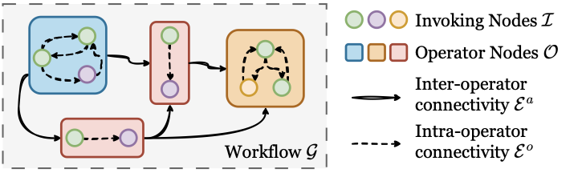
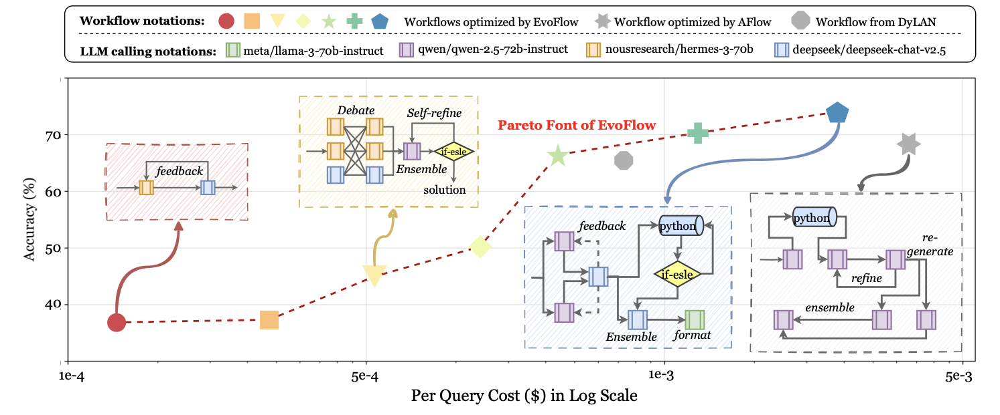
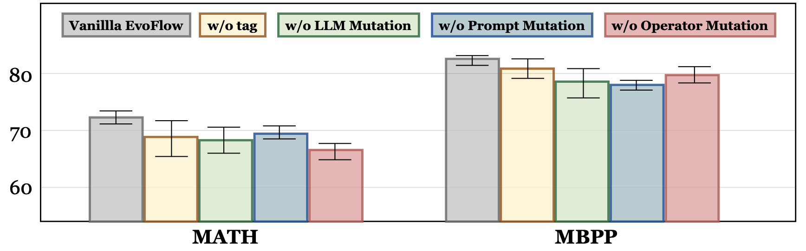
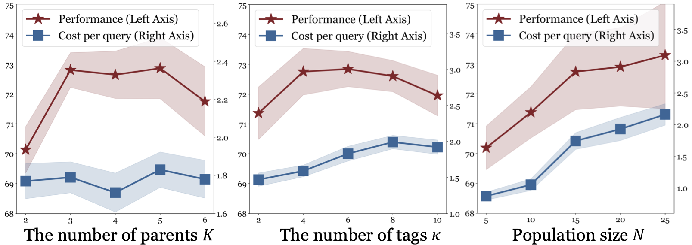

# Paper Assets

## Figure 1: fig:intro

Caption: Paradigm comparison. Baseline methods seek a ``one-size-fits-all'' complex homogenoues workflow, while optimizes a Pareto set of diverse, heterogenous workflows.

## Table 1: tab:intro_compare

Caption: Comparison among different automation techniques.

| Method | [c]Prompt |
| --- | --- |
| Optimize | [c]Agent |
| Topology | [c]Agent |
| Profile | [c]LLM |
| Backbone | [c]Complexity |
| Adaptivity |  |
| AgentVerse |  |
| GPTSwarm |  |
| EvoMAC |  |
| EvoAgent |  |
| EvoPrompt |  |
| ADAS |  |
| AFlow |  |
| AgentSquare |  |

## Figure 2: fig:notations

Caption: The visualization of notations in .

## Figure 3: fig:framework

Caption: The overall framework of . The fundamental unit is the invoking nodes, which collectively form the operator node. initializes the population by combining multiple operator nodes into a workflow (individual), followed by tag-based retrieval and crossover & mutation to generate novel offspring workflows. The population is updated via niching-based selection.

## Table 2: tab:rq1_homo

Caption: Performance comparison with single agent, hand-craft multi-agent systems, and automated agentic workflows. The base LLM is consistently set as get-4o-mini for all baselines. We bold the best results and underline the runner-ups.

| 1.2pt CadetBlue!20 Method | GSM8K | MATH | MultiArith | HumanEval | MBPP | ALFWorld | Avg. |
| --- | --- | --- | --- | --- | --- | --- | --- |
| 1.2pt Vanilla | 87.45 | 46.29 | 96.85 | 87.08 | 71.83 | 38.71 | 71.37 |
| gray!10CoT cot | 87.100.35 | 46.400.11 | 96.310.54 | 88.131.05 | 71.830.00 | 39.921.21 | 71.620.25 |
| ComplexCoT fu2022complexity | 86.890.56 | 46.530.24 | 96.700.15 | 87.490.41 | 72.360.53 | 41.682.97 | 71.940.57 |
| gray!10SC (CoT 5) wang2023selfconsistency | 87.570.12 | 47.911.62 | 96.580.27 | 88.601.52 | 73.601.77 | 40.551.84 | 72.471.10 |
| MultiPersona multi-persona | 87.500.05 | 45.430.86 | 97.490.64 | 88.321.24 | 73.191.36 | 39.100.39 | 71.840.47 |
| gray!10LLM-Debate arXiv2023_MultiAgent-Debate | 89.472.02 | 48.542.25 | 97.330.48 | 88.681.60 | 70.291.54 | 44.685.97 | 73.171.80 |
| LLM-Blender blender | 88.350.90 | 46.920.63 | 97.290.44 | 88.801.72 | 77.055.22 | 43.795.08 | 73.702.33 |
| gray!10DyLAN arXiv2023_Dynamic-LLM-Agent | 89.982.53 | 48.632.34 | 97.120.27 | 90.423.34 | 77.305.47 | 53.3214.61 | 76.134.76 |
| AgentVerse chen2023agentverse | 89.912.46 | 47.351.06 | 97.500.65 | 89.292.21 | 74.282.45 | 45.036.32 | 73.892.52 |
| gray!10MacNet qian2024scaling | 87.950.50 | 45.181.11 | 96.030.82 | 84.572.51 | 65.286.55 | 43.664.95 | 70.450.92 |
| AutoAgents chen2023autoagents | 87.690.24 | 45.320.97 | 96.420.43 | 87.640.56 | 71.950.12 | 46.157.44 | 72.531.16 |
| gray!10GPTSwarm zhuge2024gptswarm | 89.141.69 | 47.881.59 | 96.790.06 | 89.322.24 | 77.435.60 | 53.1914.48 | 75.634.26 |
| ADAS hu2024adas | 86.121.33 | 43.183.11 | 96.020.83 | 84.192.89 | 68.133.70 | 47.668.95 | 70.880.49 |
| gray!10AgentSquare shang2024agentsquare | 87.620.17 | 48.512.22 | 97.770.92 | 89.083.00 | 78.466.63 | 66.4227.71 | 78.146.77 |
| AFlow zhang2024aflow | 91.163.71 | 51.283.31 | 96.220.63 | 90.933.85 | 81.679.84 | 59.1620.45 | 78.407.03 |
| gray!10 (Ours) | 92.904.85 | 57.7011.41 | 98.801.95 | 92.855.77 | 84.5010.34 | 68.5729.86 | 82.5511.18 |
| 1.2pt |  |  |  |  |  |  |  |

## Table 3: tab:heterogeneous

Caption: Heterogeneous experiments on MATH and MBPP. ``DyLANQwen'' indicates that only Qwen-2.5-72b was used to optimize DyLAN. For comparison, we included results from o1-preview, although exclusively utilized four open-source LLMs. We shade the values of the lowest overall cost, the lowest inference token, and the highest performance for both single agents and workflows.

| 1.2pt 2c2*Model | 5cMATH | 5cMBPP |  |  |  |  |  |  |  |  |  |
| --- | --- | --- | --- | --- | --- | --- | --- | --- | --- | --- | --- |
| (lr)3-7 (lr)8-12 |  |  |  |  |  |  |  |  |  |  |  |
| cost (10^-3 ) |  |  |  |  |  |  |  |  |  |  |  |
| cost (10^-3 ) |  |  |  |  |  |  |  |  |  |  |  |
| cost (10^-3 ) |  |  |  |  |  |  |  |  |  |  |  |
| token | . |  |  |  |  |  |  |  |  |  |  |
| (%) |  |  |  |  |  |  |  |  |  |  |  |
| cost (10^-3 ) |  |  |  |  |  |  |  |  |  |  |  |
| cost (10^-3 ) |  |  |  |  |  |  |  |  |  |  |  |
| cost (10^-3 ) |  |  |  |  |  |  |  |  |  |  |  |
| token | @1 |  |  |  |  |  |  |  |  |  |  |
| (%) |  |  |  |  |  |  |  |  |  |  |  |
| 2mm5*90Single | Llama-3.1-70b | - | 24.50 | 24.50 | 90,678 | 31.93% | - | 10.67 | 10.67 | 38,653 | 65.11% |
| Qwen-2.5-72b | - | 32.30 | 32.30 | 85,436 | 63.80% | - | 9.18 | gray!259.18 | gray!2524,253 | 69.76% |  |
| Deepseek-V2.5 | - | 25.89 | 25.89 | 98,986 | 41.17% | - | 11.93 | 11.93 | 44,589 | 76.74% |  |
| Hermes-3-70b | - | 18.11 | gray!2518.11 | gray!25 68,994 | 22.60% | - | 9.49 | 9.49 | 30,328 | 63.28% |  |
| (lr)2-12 | o1-preview | - | 7840.51 | 7840.51 | 186,701 | gray!25 70.20% | - | 3209.44 | 3209.44 | 81,334 | gray!2589.65% |
| 2mm8*90Homogeneous | AFlowLlama | 653.97 | 1304.07 | 1958.05 | 6,054,698 | 36.97% | 383.40 | 356.88 | 740.29 | 1,510,058 | 67.42% |
| AFlowQwen | 1223.46 | 2622.63 | 3846.10 | 8,614,237 | 66.38% | 824.48 | 773.63 | 1598.11 | 2,258,279 | 80.84% |  |
| AFlowDeepseek | 815.96 | 1945.90 | 2761.86 | 8,693,402 | 48.65% | 456.96 | 418.33 | 875.29 | 1,733,829 | 79.14% |  |
| AFlowHermes | 572.09 | 1045.20 | 1617.29 | 4,886,371 | 32.14% | 353.04 | 339.71 | 692.75 | 1,289,901 | 66.13% |  |
| (lr)2-12 | DyLANLlama | 9317.07 | 2676.03 | 11993.10 | 11,258,530 | 38.19% | 5817.09 | 966.12 | 6783.21 | 4,879,526 | 69.92% |
| DyLANQwen | 12847.72 | 4015.97 | 16863.69 | 15,242,982 | 64.17% | 7491.78 | 1480.94 | 8972.72 | 3,386,087 | 75.63% |  |
| DyLANDeepseek | 10388.54 | 2375.11 | 12763.64 | 13,282,450 | 46.20% | 6209.41 | 1084.34 | 7293.45 | 4,296,199 | 80.13% |  |
| DyLANHermes | 7103.88 | 2106.35 | 9210.23 | 8,129,786 | 30.14% | 3965.38 | 714.55 | 4679.93 | 4,150,887 | 65.29% |  |
| 459.24 | 513.34 | gray!25 972.58 | gray!251,660,284 | gray!2572.90% | 479.10 | 286.05 | gray!25565.15 | gray!25 8,193,669 | gray!2587.62% |  |  |
| 1.2pt |  |  |  |  |  |  |  |  |  |  |  |

## Figure 4: fig:pareto

Caption: The cost-performance plane of workflows from , DyLAN, and AFlow.

## Figure 5: fig:ablation

Caption: The ablation study of .

## Figure 6: fig:sensi

Caption: The parameter sensitivity analysis of . The unit of cost per query (right) and performance (left) is 10^-3 and accuracy (%), respectively.

## Table 4: tab:notations

Caption: Notation and Definitions

| Notation | Definition |
| --- | --- |
| I_i | An LLM-invoking node |
| P_i | The prompt content of I_i |
| P | The feasible prompt space |
| M_i | The base LLM invoked by I_i |
| _i | Temperature of M_i |
| M = _1, , M_|M|\ | LLM pool |
| I = M P R_[0,1] | The feasible space for invoking nodes |
| O_j = (I^o_j, E^o_j) | An operator node composed of multiple invoking nodes |
| I^o_j = _1, , I_n\ | The selected invoking nodes in O_j |
| E^o_j I^o_j I^o_j | The connectivity of operator nodes in O_j |
| O | The feasible space of operator nodes |
| G = (O^S, E^a) = (I^S, E^o) | An agentic workflow |
| O^S O | A subset of operator nodes used in G |
| I^S I | A subset of invoking nodes selected in G |
| u(G, T) | An evaluator function assessing G's performance in task domain T |
| c(G, T) | An evaluator function assessing G's cost in task domain T |
| G^* | The best workflow searched by baseline methods |
| G^ | The Pareto-optimal set of agentic workflows balancing cost and performance |
| P^(t) = _1, G_2, , G_N\ | A population of N agentic workflows at the t-th iteration |
| ^k_i | The i-th tag of workflow G_k |
| v() | Text embedding function |
| S(G | q) | The similarity score of workflow G with respect to query q |
| G_^(t) | The generated offspring workflow at the t-th iteration |
| ^l() | LLM mutation function |
| ^p() | Prompt mutation function |
| ^o() | Operator mutation function |
| G | A mutated workflow |
| G^(t)_ | A mutated workflow at the t-th iteration |
| P^NA = _q1, , G_qE\ | The identified niche area comprising E individuals |
| c^(t)(G_i) | The cumulative cost of G_i at the t-th iteration |
| u^(t)(G_i) | The cumulative performance of G_i at the t-th iteration |
| I(, ) | Pareto dominance-preserving binary indicator |
| F(G) | The fitness value of G |

## Table 5: tab:dataset

Caption: Dataset Statistics.

| Domain | Dataset | #Train | #Test | Metric |
| --- | --- | --- | --- | --- |
| 2*Code Generation | HumanEval | 33 | 131 | pass@1 |
| MBPP | 86 | 341 | pass@1 |  |
| 3*Math Reasoning | GSM8K | 264 | 1055 | Accuracy |
| MATH | 119 | 486 | Accuracy |  |
| MultiArith | 150 | 600 | Accuracy |  |
| Embodied | ALFWorld | 230 | 327 | Success ratio |

## Table 6: tab:dylan_comparison

Caption: Performance comparison of different methods using various LLM backbones and training datasets. ‘’MATH'' and ``MBPP'' represent individual training datasets, while ``MATH+MBPP'' indicates training using both datasets combined. The two values under ``MATH+MBPP'' represent the performance on MATH and MBPP, respectively.

| 1.2pt CadetBlue!20 Method | LLM Backbone | MATH | MBPP | MATH+MBPP |
| --- | --- | --- | --- | --- |
| 1.pt 2*DyLAN | Deepseek-V2.5 | 46.20 | 80.13 | 43.85/78.62 |
| QWen-2.5-72b | 64.17 | 75.63 | 60.84/71.34 |  |
| 2*GPTSwarm | Deepseek-V2.5 | 45.36 | 77.52 | 39.18 / 74.09 |
| QWen-2.5-72b | 65.22 | 72.48 | 64.15 / 70.90 |  |
| 2*AFlow | Deepseek-V2.5 | 48.65 | 79.14 | 43.22 / 77.02 |
| QWen-2.5-72b | 66.38 | 80.84 | 64.71 / 74.90 |  |
| LLM Pool | 72.90 | 87.62 | 72.69 / 88.35 |  |
| 1.2pt |  |  |  |  |
