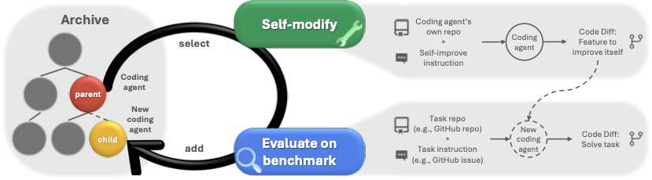
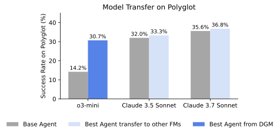

# Paper Assets

## Figure 1: fig:conceptual

Caption: Darwin G\"odel Machine. The DGM iteratively builds a growing archive of agents by interleaving self-modification with downstream task evaluation. Agents in the archive are selected for self-modification through open-ended exploration.

## Figure 2: fig:dgm-comparisons-swe

Caption: Self-improvement and open-ended exploration enable the DGM to continue making progress and improve its performance. The DGM automatically discovers increasingly better coding agents and performs better on both (Left) SWE-bench and (Right) Polyglot. It outperforms baselines that lack either self-improvement or open-ended exploration, showing that both components are essential for continual self-improvement. These scores are obtained from evaluating on the benchmark subsets detailed in sec:benchmarks.

![Self-improvement and open-ended exploration enable the DGM to continue making progress and improve its performance. The DGM automatically discovers increasingly better coding agents and performs better on both (Left) SWE-bench and (Right) Polyglot. It outperforms baselines that lack either self-improvement or open-ended exploration, showing that both components are essential for continual self-improvement. These scores are obtained from evaluating on the benchmark subsets detailed in sec:benchmarks.](figures/dgm_comparisons.png)

## Figure 3: fig:dgm-archive

Caption: The DGM automatically self-improves to become a better coding agent. (Left) Archive of coding agents generated during the DGM run on SWE-bench. Each node represents a coding agent, with node 0 corresponding to the base agent. Node color indicates performance on SWE-bench (percentage of solved tasks), while border color reflects the number of tasks for which the agent was evaluated. Edges show which agents self-modified to produce the offsprings. Many paths to innovation traverse lower-performing nodes, and key innovations (like node 24) lead to an explosion of innovations built on top of them. Both properties underscore the benefits of open-ended search. (Right) Progress plot of the DGM on SWE-bench. The light blue line shows the average score of all agents possessing basic codebase-editing functionality. The blue line tracks the best score achieved by any agent in the archive at each iteration. The dark line shows the lineage of the final best-discovered agent and its precursor nodes, which includes two performance dips. This illustrates the benefits of open-ended search, which explores a diverse set of interesting stepping stones instead of focusing only on branching off the best solution found so far.

![The DGM automatically self-improves to become a better coding agent. (Left) Archive of coding agents generated during the DGM run on SWE-bench. Each node represents a coding agent, with node 0 corresponding to the base agent. Node color indicates performance on SWE-bench (percentage of solved tasks), while border color reflects the number of tasks for which the agent was evaluated. Edges show which agents self-modified to produce the offsprings. Many paths to innovation traverse lower-performing nodes, and key innovations (like node 24) lead to an explosion of innovations built on top of them. Both properties underscore the benefits of open-ended search. (Right) Progress plot of the DGM on SWE-bench. The light blue line shows the average score of all agents possessing basic codebase-editing functionality. The blue line tracks the best score achieved by any agent in the archive at each iteration. The dark line shows the lineage of the final best-discovered agent and its precursor nodes, which includes two performance dips. This illustrates the benefits of open-ended search, which explores a diverse set of interesting stepping stones instead of focusing only on branching off the best solution found so far.](figures/dgm_archive.png)

## Figure 4: fig:transfer-overview

Caption: Transfer between Models, Benchmarks, and Tasks. The superior performance of DGM-discovered agents can be transferred across (Left) different models, (Middle) benchmarks, and (Right) different programming language tasks in Polyglot, such as from Python tasks to C++ tasks.

## Figure 5: fig:dgm-no-selfimprove

Caption: DGM without self-improving agents. Keeping the meta-agent that is modifying and producing the next coding agents the same, DGM w/o self-improve is unable to continuously improve over time. (Left) Archive of coding agents generated during the DGM w/o self-improve run on SWE-bench. Each node represents a coding agent, with node 0 corresponding to the base agent. Node color indicates performance on SWE-bench (percentage of solved tasks), while border color reflects the number of tasks for which the agent was evaluated. Edges show which agents self-modified to produce the offsprings. (Right) Progress plot of the DGM w/o self-improve on SWE-bench. The light green line shows the average score of all agents possessing basic codebase-editing functionality. The green line tracks the best score achieved by any agent in the archive at each iteration. The dark line shows the lineage of the final best-discovered agent and its precursor nodes.

![DGM without self-improving agents. Keeping the meta-agent that is modifying and producing the next coding agents the same, DGM w/o self-improve is unable to continuously improve over time. (Left) Archive of coding agents generated during the DGM w/o self-improve run on SWE-bench. Each node represents a coding agent, with node 0 corresponding to the base agent. Node color indicates performance on SWE-bench (percentage of solved tasks), while border color reflects the number of tasks for which the agent was evaluated. Edges show which agents self-modified to produce the offsprings. (Right) Progress plot of the DGM w/o self-improve on SWE-bench. The light green line shows the average score of all agents possessing basic codebase-editing functionality. The green line tracks the best score achieved by any agent in the archive at each iteration. The dark line shows the lineage of the final best-discovered agent and its precursor nodes.](figures/dgm_wo_selfimprove.png)

## Figure 6: fig:dgm-no-openended

Caption: DGM without open-ended exploration. Removing the archive, DGM w/o open-ended exploration always uses the most recent agent to self-modify and makes very little progress on SWE-bench. (Left) Archive of coding agents generated during the DGM w/o open-ended exploration run on SWE-bench. Each node represents a coding agent, with node 0 corresponding to the base agent. Node color indicates performance on SWE-bench (percentage of solved tasks), while border color reflects the number of tasks for which the agent was evaluated. Edges show which agents self-modified to produce the offsprings. (Right) Progress plot of the DGM w/o open-ended on SWE-bench. The orange line shows the average score of all agents possessing basic codebase-editing functionality. The light orange line tracks the best score achieved by any agent in the archive at each iteration. The dark line shows the lineage of the final best-discovered agent and its precursor nodes.

![DGM without open-ended exploration. Removing the archive, DGM w/o open-ended exploration always uses the most recent agent to self-modify and makes very little progress on SWE-bench. (Left) Archive of coding agents generated during the DGM w/o open-ended exploration run on SWE-bench. Each node represents a coding agent, with node 0 corresponding to the base agent. Node color indicates performance on SWE-bench (percentage of solved tasks), while border color reflects the number of tasks for which the agent was evaluated. Edges show which agents self-modified to produce the offsprings. (Right) Progress plot of the DGM w/o open-ended on SWE-bench. The orange line shows the average score of all agents possessing basic codebase-editing functionality. The light orange line tracks the best score achieved by any agent in the archive at each iteration. The dark line shows the lineage of the final best-discovered agent and its precursor nodes.](figures/dgm_wo_openended.png)

## Figure 7: fig:transfer-model-polyglot

Caption: Transfer between Models on Polyglot

## Table 1: tab:DGM-greedy

Caption: Comparison of DGM, its ablations, and baselines on SWE-bench and Polyglot benchmarks.

| Method | SWE-bench | Polyglot |
| --- | --- | --- |
| DGM | 50.0% | 38.0% |
| DGM w/o Open-ended exploration | 23.0% | 14.0% |
| DGM w/o Self-improve | 39.0% | 28.0% |
| DGM Greedy | 39.7% | 30.0% |

## Table 2: tab:code_editing

Caption: Percentage of generated agents with basic code-editing functionality on SWE-bench.

| Method | Percentage with Basic Code-Editing Functionality |
| --- | --- |
| DGM | 51.3% |
| DGM w/o Open-ended exploration | 32.5% |
| DGM w/o Self-improve | 32.5% |

## Table 3: tab:fm-hyperparam

Caption: Foundation models used in each experiment setting.

| lll@ Benchmark | SWE-bench | Polyglot |
| --- | --- | --- |
| Self-modification | Claude 3.5 Sonnet (New) | Claude 3.5 Sonnet (New) |
| Evaluation | Claude 3.5 Sonnet (New) | o3-mini |

## Table 4: unlabeled

Caption: No caption extracted.

| cccc@ LLM | Benchmark | Number of Tasks | Cost Estimate (USD) |
| --- | --- | --- | --- |
| Claude 3.5 Sonnet (New) | SWE-bench | 60 | 350 |
| o3-mini | Polyglot | 60 | 5 |

## Figure 8: fig:dgm-halluc

Caption: The DGM solving hallucination of tool use in FMs. Archive of coding agents generated during the DGM run on SWE-bench to solve hallucination from FMs. Each node represents an agent, with node 0 corresponding to the base agent. Node color indicates solved hallucination score, while border color reflects whether the agent has basic codebase-editing functionality. Edges show which agents self-modified to produce the offsprings.

