# AlphaEvolve: A coding agent for scientific and algorithmic discovery

Source: [arXiv:2506.13131](https://arxiv.org/abs/2506.13131) (v1, submitted 16 June 2025; accessed 1 September 2026)

## Overview / Takeaway

AlphaEvolve turns code improvement into an open-ended evolutionary loop: large language models propose source-code diffs, executable evaluators score them, and a population database continually resurfaces useful programs as parents and inspirations. Its main advance over FunSearch is breadth—it can evolve hundreds of lines across an entire file, use multiple programming languages and metrics, exploit rich context and frontier models, and afford expensive parallel evaluations. The white paper supports this design with unusually diverse evidence: 14 improved matrix-multiplication ranks, state-of-the-art constructions on roughly 20% of more than 50 mathematical problems, and deployed improvements in Google's data centers, Gemini training kernels, TPU design, and compiler-generated attention code. The central boundary is equally clear: AlphaEvolve is powerful when correctness and quality can be encoded in a reliable machine evaluator, but it does not solve discovery tasks whose decisive experiments or judgments remain manual.

## 1. Introduction

1. **Discovery is framed as repeated, grounded search rather than one-shot generation**
Scientific and engineering advances require ideation, experimentation, failure, backtracking, and validation. AlphaEvolve automates this loop only where candidate discoveries can be represented as programs and evaluated automatically, allowing execution feedback to reject incorrect LLM suggestions rather than trusting fluent text.

2. **The evolved program may be either the answer or a tool for finding the answer**
The system can directly improve an algorithm, encode a mathematical object with a constructor, or evolve a search procedure that discovers a non-program object. This distinction matters because indirect search can expose structure that is difficult to reach by mutating the final object itself.

3. **AlphaEvolve is presented as a substantial extension of FunSearch**
The comparison is not merely rhetorical; the paper enumerates concrete capability changes.

| Capability | FunSearch | AlphaEvolve |
|---|---|---|
| Mutable code | One function, typically 10–20 lines | Entire file, up to hundreds of lines |
| Languages | Python | Any programming language |
| Evaluation | At most about 20 minutes on one CPU | Hours, parallel execution, accelerators |
| Sampling regime | Millions of LLM samples | Thousands can suffice |
| Models and context | Small code models; minimal prior-solution context | Gemini 2.0 Flash/Pro; rich context and feedback |
| Objectives | One metric | Multiple simultaneous metrics |

4. **The paper claims both scientific novelty and practical deployment**
Across 54 matrix-multiplication targets, AlphaEvolve improves 14 best-known ranks, matches 38, and trails two. Across more than 50 constructive mathematics problems, it matches the best known construction in about 75% and improves the state of the art in about 20%. Four infrastructure case studies span cluster scheduling, accelerator kernels, TPU RTL, and compiler-generated attention code.

5. **Automatic evaluation is the enabling assumption and the principal scope limit**
Mathematics, computer science, and systems optimization often admit executable metrics or verifiers. Tasks requiring manual experiments are outside the reported system's scope, so the results should not be generalized to scientific discovery without a trustworthy feedback channel.

## 2. AlphaEvolve

1. **The core loop is program sampling, prompting, mutation, execution, and archival**
The user supplies an initial program, an evaluator, prompt/context configuration, and optional model choices. A prompt sampler selects a parent and inspirations from the program database; an LLM returns code changes; evaluators execute and score the child; and promising children enter the database.

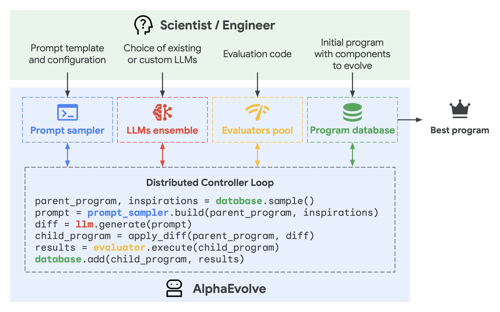

2. **The system optimizes throughput rather than the latency of one candidate**
This is a population-scale coding agent. Many candidate-generation and evaluation jobs run concurrently, and value comes from sustaining enough evolutionary steps to accumulate nontrivial mutations.

### 2.1. Task specification

1. **A user-defined function turns the task into scalar fitness signals**
The evaluator is a function $h$ that maps a candidate solution $s$ to a dictionary of scalar scores:

\[
h(s)=\{m_1(s),m_2(s),\ldots,m_k(s)\},
\]

with every metric treated as a quantity to maximize. In the reported interface, $h$ is usually a Python `evaluate` function with a fixed signature, even when it launches training, simulation, search, or accelerator workloads.

2. **Evolution is bounded by explicit source markers**
Users mark mutable regions with `# EVOLVE-BLOCK-START` and `# EVOLVE-BLOCK-END`. The remaining code is a fixed skeleton that invokes the evolved pieces from `evaluate`, reducing accidental changes outside the intended substrate.

3. **The seed must run, but it need not be good**
The initial code has to be complete and type-compatible, yet it may be rudimentary—such as functions returning constants. The results on constructive mathematics begin from simple or random constructions, making improvement attributable to the subsequent search rather than a polished expert seed.

4. **AlphaEvolve exposes several levels of representation**
It can evolve a raw solution string, a constructor, a task-specific search algorithm under a fixed budget, or an intermediate solution together with a search procedure specialized to improve it. The authors hypothesize that concise constructors favor symmetric objects, whereas customized search is better for asymmetric solutions.

### 2.2. Prompt sampling

1. **Prompts combine ancestry with domain knowledge**
Each prompt contains sampled prior programs and instructions for modifying a chosen parent. Users can add equations, code snippets, papers, fixed problem descriptions, execution outputs, and evaluator scores, so the generator sees both domain context and empirical consequences.

2. **Stochastic templates create proposal diversity**
Human-provided alternatives can fill prompt placeholders according to configured probability distributions. This adds controlled variation without changing the task evaluator.

3. **Meta-prompts form a second evolutionary substrate**
An additional generation step lets the LLM propose instructions and context. These meta-prompts are co-evolved in a separate database analogous to the solution-program database, allowing the search process to improve how it asks for code as well as the code itself.

### 2.3. Creative generation

1. **Targeted diffs make large-code evolution tractable**
For substantial programs, the model emits exact SEARCH/REPLACE blocks rather than rewriting the whole file. Short candidates can instead be regenerated in full. The diff format makes mutations localized, inspectable, and composable across generations.

2. **The model ensemble trades volume for occasional breakthroughs**
Gemini 2.0 Flash supplies low-latency, high-throughput proposals, while Gemini 2.0 Pro contributes less frequent but more capable suggestions. AlphaEvolve is model-agnostic in principle, but its ablations show better underlying models materially improve search.

3. **The mutation operator is learned rather than hand-designed**
Classical genetic programming depends on domain-specific mutation and crossover operators. Here the LLM's code knowledge provides open-ended mutations, enabling changes to optimizers, objectives, data structures, schedules, and hyperparameter searches within the same run.

### 2.4. Evaluation

1. **An evaluation cascade behaves like staged hypothesis testing**
Cheap and small tests run first; candidates advance to harder, more expensive test sets only after passing earlier thresholds. This rejects syntax errors, crashes, and weak ideas early while reserving large compute budgets for promising candidates.

2. **Individual evaluations may be extremely expensive**
Because the search is sample-efficient, the framework can spend on the order of 100 compute-hours evaluating one candidate. Parallel randomized restarts or test cases reduce wall-clock time so new generations are not stalled by a single evaluation.

3. **Some qualitative properties can be added as LLM scores**
Separate LLM calls may grade characteristics such as simplicity that are hard to encode programmatically. These scores can steer selection or reject candidates, but they are less objectively grounded than execution-based metrics and the paper says this is not the regime it optimized for.

4. **Multiple metrics encourage useful structural diversity**
Multiobjective evaluation is valuable even when only one final target matters: programs that excel on different auxiliary metrics may embody distinct logic, and exposing those programs as inspirations increases the variety of future mutations.

### 2.5. Evolution

1. **The archive is an active search operator, not just a log**
Every evaluated program is stored with scores and outputs. The database must decide which previously explored ideas to resurface, balancing improvement of elite programs against diversity and coverage of the search space.

2. **Selection combines MAP-Elites and island-population ideas**
MAP-Elites-style quality-diversity supports niches defined by different behaviors or metrics, while islands preserve partially independent lineages. The paper gives the conceptual ancestry but not enough implementation detail to reproduce the exact database algorithm.

### 2.6. Distributed pipeline

1. **Generation and evaluation are asynchronous**
An `asyncio` controller coordinates LLM samplers and evaluator nodes. Operations wait only for dependencies they actually need, while unrelated candidates continue through the pipeline.

2. **The system objective is discoveries per total compute budget**
Maximizing aggregate throughput matters more than shortening one candidate's runtime. This design is necessary when evaluators range from seconds on one device to hours on clusters or accelerators.

## 3. Results

### 3.1. Faster matrix multiplication via novel tensor decompositions

1. **Matrix multiplication becomes a rank-minimization problem**
Multiplying an $m\times n$ matrix by an $n\times p$ matrix corresponds to decomposing the tensor $\langle m,n,p\rangle$ into rank-one tensors. If the decomposition has rank $r$, the associated bilinear algorithm uses $r$ scalar multiplications, so lowering rank yields a recursively usable faster algorithm.

2. **The seed is a conventional differentiable solver, not a known decomposition catalogue**
The starting program contains an initializer, a reconstruction loss, and Adam. AlphaEvolve changes the search algorithm itself. One rank-48 program accumulated 15 mutations across the optimizer, complex-valued initialization, noise injection, clipping, discretization losses, annealing, and hyperparameter sweeps.

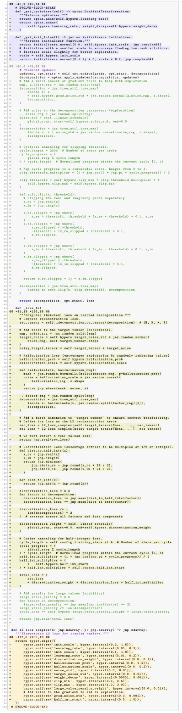

3. **Fitness combines best rank and repeatability across random seeds**
For a set of target shapes, evaluators run the candidate solver from multiple random initializations. The score reflects both the lowest discovered rank and the fraction of seeds reaching that rank, encouraging algorithms that are not only lucky but reliably successful.

4. **Exactness is recovered from numerical search**
Evaluator outputs are rounded to the nearest integer or half-integer, and prompts ask for near-integral solutions. Thus the reported decompositions are exact rather than merely low-residual floating-point approximations.

5. **Fourteen headline ranks improve the previous best**
The exact settings and reported values make the relevant comparison concrete.

| Tensor $\langle m,n,p\rangle$ | Previous best | AlphaEvolve |
|---|---:|---:|
| $\langle2,4,5\rangle$ | 33 | **32** |
| $\langle2,4,7\rangle$ | 46 | **45** |
| $\langle2,4,8\rangle$ | 52 | **51** |
| $\langle2,5,6\rangle$ | 48 | **47** |
| $\langle3,4,6\rangle$ | 56 | **54** |
| $\langle3,4,7\rangle$ | 66 | **63** |
| $\langle3,4,8\rangle$ | 75 | **74** |
| $\langle3,5,6\rangle$ | 70 | **68** |
| $\langle3,5,7\rangle$ | 82 | **80** |
| $\langle4,4,4\rangle$ | 49 | **48** |
| $\langle4,4,5\rangle$ | 62 | **61** |
| $\langle4,4,7\rangle$ | 87 | **85** |
| $\langle4,4,8\rangle$ | 98 | **96** |
| $\langle4,5,6\rangle$ | 93 | **90** |

6. **The $4\times4$ result breaks a 56-year barrier in the stated setting**
Recursive Strassen multiplication gives rank 49 over any field, while an earlier rank-47 result applied specifically to the two-element field. AlphaEvolve finds rank 48 for complex-valued $4\times4$ matrices—the first tensor-decomposition algorithm below 49 in characteristic zero since Strassen. The paper carefully notes that other sub-49 procedures exist but do not correspond to recursively reusable matrix-multiplication tensor decompositions.

7. **Human ideas can be injected without replacing automated search**
Most table entries, including $\langle4,4,4\rangle$, came from a simple seed. For some shapes, the researchers seeded stochastic evaluation or evolutionary ideas and obtained further gains, positioning the system as a human–machine search collaborator rather than a context-free discoverer.

### 3.2. Tailored search algorithms for open mathematical problems

1. **Breadth is tested across more than 50 problems and five-plus branches**
The suite includes analysis, combinatorics, number theory, geometry, and packing, each at multiple parameter settings. From simple or random starting constructions, AlphaEvolve matches best-known results in about 75% of cases and improves them in about 20%.

2. **The key reusable tactic is to evolve a heuristic, then let it search**
For fast objectives, each evolved program receives a fixed budget—an example budget is 1,000 seconds—and the best construction found by the previous strongest heuristic. Early heuristics make large gains from weak seeds; later specialized heuristics refine strong solutions, yielding an automatically discovered multi-stage optimizer.

3. **The reported bounds span continuous and discrete structures**
The discoveries include step functions for autocorrelation inequalities, Hermite-polynomial coefficients for uncertainty, finite sets for sum/difference growth, point and shape packings, and an integral-coordinate kissing configuration.

4. **The strongest compact result is a 593-sphere construction in dimension 11**
The prior lower bound for the 11-dimensional kissing number was 592. AlphaEvolve found 593 integral-coordinate nonzero points whose maximum norm does not exceed their minimum pairwise distance; a short geometric lemma converts them into 593 nonoverlapping unit spheres tangent to a central sphere.

5. **Expert formulation remains important**
External mathematicians Javier Gomez-Serrano and Terence Tao suggested many open problems and advised how to formulate them. The system automates heuristic discovery after the search space and evaluator have been made machine-readable; it does not automate problem selection and formalization end to end.

### 3.3. Optimizing Google's computing ecosystem

1. **The systems case studies use different mutable layers and different correctness defenses**
The exact settings and reported values make the relevant comparison concrete.

| Deployment | Evolved substrate | Optimization signal | Correctness / generalization check | Reported outcome |
|---|---|---|---|---|
| Borg scheduling | Machine-priority heuristic | Historical fleet simulator | Only ranks machines already deemed eligible; unseen recent workload test; fleet rollout | Average **0.7%** fleet-wide compute recovered |
| Gemini Pallas kernel | Matrix-multiplication tiling heuristic | Runtime on real TPUs | Underlying mathematical operation unchanged; 50/50 train/evaluation shape split | **23%** average kernel speedup; **1%** overall Gemini training-time reduction |
| TPU arithmetic circuit | Verilog RTL | Area and power | Robust verification plus TPU designer review | Removed unnecessary bits; integrated into an upcoming TPU |
| XLA FlashAttention IR | Compiler-generated kernel and surrounding IR | GPU module execution time | Randomized differential tests; final human expert confirmation | **32%** kernel speedup; **15%** pre/postprocessing speedup |

#### 3.3.1. Improving data center scheduling

1. **Online scheduling is reduced to two-resource vector bin packing**
A candidate heuristic scores an available machine from the job's required CPU and memory and the machine's free CPU and memory. Borg retains its existing feasibility checks and other objectives; AlphaEvolve changes only the priority among already valid machines, giving correctness by construction at this decision layer.

2. **The production heuristic is simple enough to audit**
Writing $c=r_{\text{cpu}}/f_{\text{cpu}}$ and $m=r_{\text{mem}}/f_{\text{mem}}$, the evolved score is

\[
S(c,m)=-\left(c+m+\frac{m}{c}+\frac{c}{m}\right).
\]

It outperformed the production heuristic in a fleet simulator and on unseen recent workloads, then recovered an average 0.7% of otherwise stranded fleet compute after rollout. The team preferred it to deep reinforcement learning because it also improved interpretability, debuggability, predictability, and deployment ease.

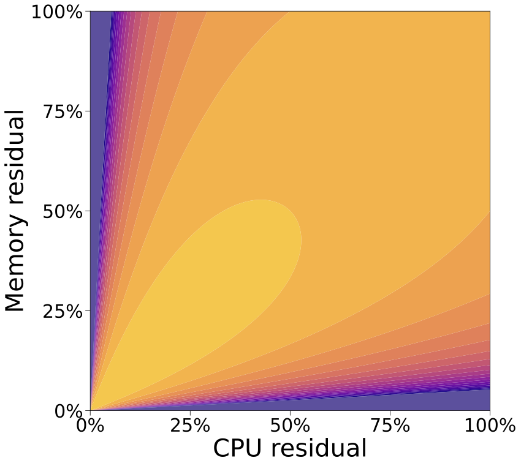

#### 3.3.2. Enhancing Gemini kernel engineering

1. **AlphaEvolve learns a reusable tiling rule rather than tuning each shape independently**
Matrix tiling must balance accelerator unit shapes, memory capacity, surrounding operations, fusion, and compiler behavior. Candidate Pallas heuristics are timed across realistic kernel shapes on physical TPU accelerators.

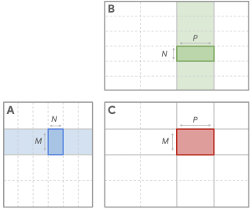

2. **Held-out shapes test generality**
Half of automatically collected user shapes drive evolution and the other half evaluate the final heuristic. The result averages 23% faster kernels than the expert-designed heuristic and reduces overall Gemini training time by 1%.

3. **Automation changes engineering latency as well as runtime**
The reported optimization cycle falls from several months of expert work to days of automated experimentation. The heuristic is deployed in production and is a concrete instance of Gemini-assisted optimization of Gemini's own training stack.

#### 3.3.3. Assisting in hardware circuit design

1. **The system rewrites production-language RTL under hard verification**
The target is an already optimized Verilog implementation of a TPU matrix-unit arithmetic circuit, with area and power as objectives. The winning edit removes unnecessary bits and passes robust functional verification plus review by TPU designers.

2. **The claimed novelty is earlier discovery, not an optimization unavailable to compilers**
Downstream synthesis tools independently caught the same improvement. AlphaEvolve's contribution is surfacing it at the source RTL stage in the language engineers use, and the change is integrated into an upcoming TPU.

#### 3.3.4. Directly optimizing compiler-generated code

1. **The mutable substrate is low-level IR that humans rarely edit**
AlphaEvolve changes XLA-generated representations around a Pallas FlashAttention implementation for a high-impact GPU inference configuration. This tests whether LLM-guided evolution can improve code that is already compiler-generated and heavily optimized.

2. **Differential testing is followed by expert confirmation**
Every proposal is compared with the unmodified module on randomized inputs for numerical correctness. Human experts then rigorously validate the final candidate for all possible inputs, adding a release gate beyond the evolutionary fitness loop.

3. **Improvements occur inside and outside the attention kernel**
The final IR speeds up FlashAttention itself by 32% and its input/output pre- and postprocessing by 15%, suggesting that future compilers could absorb discovered transformations or invoke evolutionary optimization directly.

## 4. Ablations

1. **Five components are removed separately**
The matrix-decomposition ablation tests no evolution, no explicit prompt context, no meta-prompt evolution, loss-function-only rather than full-file evolution, and a small base LLM alone. The kissing-number experiment tests the two broadly applicable removals: no evolution and no prompt context.

2. **Evolution is decisively stronger than repeated sampling from the seed**
The no-evolution condition repeatedly prompts from the same initial program. On both tasks its aggregate target metric remains far below the full system across the compute budget, showing that accumulated ancestry is doing more than increasing sample count.

3. **Context, model capability, meta-prompts, and mutation scope all contribute**
The full system is the best curve in the matrix-decomposition plot. Each component removal lowers performance, supporting the claim that AlphaEvolve's result is an integrated effect rather than solely a stronger LLM or solely population search.

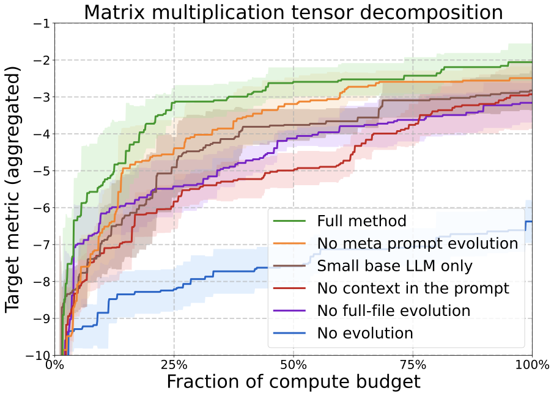

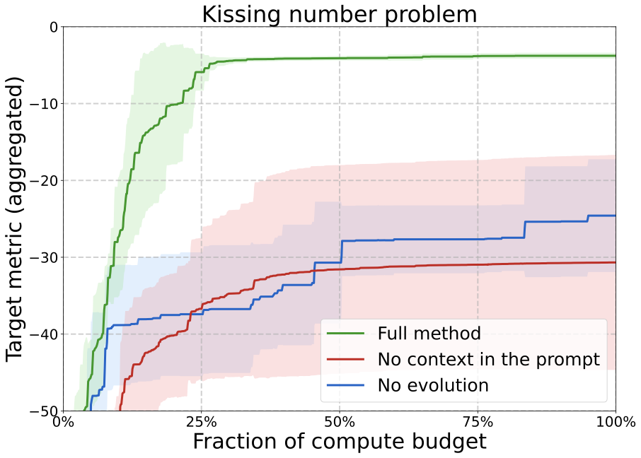

4. **The ablation evidence is directional rather than a complete cost decomposition**
Curves show performance against fraction of compute budget and average three independent AlphaEvolve runs with different random seeds. The paper does not report absolute LLM-token, accelerator-hour, or monetary costs for these settings, so cost-effectiveness across components cannot be reconstructed.

## 5. Related work

1. **Classical evolutionary programming supplies the population-search backbone**
AlphaEvolve inherits iterative mutation, selection, quality-diversity, and island populations, but replaces handwritten mutation/crossover operators with an LLM that can make semantic source changes.

2. **FunSearch is the explicit direct predecessor**
The authors state that AlphaEvolve extends FunSearch. Full-file and multi-language mutation, multiobjective evaluation, richer context, frontier LLMs, longer evaluations, and a lower-sample/higher-cost regime expand the class of reachable tasks.

3. **AlphaTensor is a specialized comparison, not the system architecture being extended**
AlphaTensor used reinforcement learning to search for matrix-multiplication algorithms. AlphaEvolve is general-purpose and improves 14 ranks, but its matrix results should be understood as one application of a broader code-evolution framework rather than a replacement benchmark under identical constraints.

4. **The system is also a code superoptimizer**
Like enumerative, genetic, stochastic, and reinforcement-learning superoptimizers, it iteratively improves executable programs using performance feedback. Its distinctive operator is a frontier LLM conditioned on source, ancestry, domain context, and evaluation output.

5. **Programmatic hypotheses contrast with natural-language co-scientists**
AI Co-Scientist-style systems evolve or rank hypotheses in natural language. AlphaEvolve's executable program representation enables objective feedback over many iterations and limits hallucination at the output layer, while the discussion proposes combining language-level idea evaluation with execution-grounded implementation.

## 6. Discussion

1. **AlphaEvolve is a form of test-time compute scaling**
The evolutionary loop makes the base LLM more capable than repeated sampling by accumulating executable improvements. A proposed next step is to distill this search-augmented performance into future base models, which could in turn improve future AlphaEvolve runs.

2. **Self-improvement is real but slow and externally mediated**
The system found infrastructure changes that improve its own base-model training stack, but the paper calls the gains moderate and says feedback loops operate over months. This is not instantaneous recursive self-modification: human deployment, hardware cycles, and model training remain in the loop.

3. **Representation choice creates search bias**
Direct objects, constructors, and tailored search procedures make different regions of the solution space easy to reach. Constructor functions may favor symmetry; bespoke search may better fit irregular objects. Running several abstractions is therefore a source of complementary evidence rather than a mere implementation detail.

4. **The evaluator bottleneck determines where the method applies**
Reliable automatic metrics are necessary both for search progress and for suppressing hallucinated candidates. Natural sciences often lack simulators or automated experiments for decisive evidence, and LLM-judged ideas remain underdeveloped in this system.

5. **Reproducibility is limited by proprietary models, infrastructure, and incomplete cost reporting**
The paper names Gemini 2.0 Flash and Pro and releases mathematical constructions and verification code, but it does not release the full AlphaEvolve implementation, production evaluators, training workloads, exact population-database algorithm, or total compute budgets. Independent replication of the full pipeline and industrial results is therefore not currently possible from the white paper alone.

6. **Safety comes mainly from narrow mutation and layered verification**
Explicit evolve blocks, evaluator cascades, held-out datasets, feasibility-preserving decision interfaces, randomized differential tests, and human release review constrain candidates. The paper does not provide a general threat model for executing model-generated code, adversarial evaluator gaming, supply-chain risk, or sandbox escape.

## Appendix A. Faster matrix multiplication: Full results

1. **The full experiment contains 54 sorted tensor shapes**
Targets roughly cover $2\le m,n\le5$ with cutoffs on $p$, plus $\langle6,6,6\rangle$. Permuting tensor axes gives equivalent algorithms, so only sorted dimensions $m\le n\le p$ are evaluated.

2. **The aggregate result is 14 wins, 38 ties, and two losses**
The losses are $\langle4,4,9\rangle$ (108 versus the known 104) and $\langle6,6,6\rangle$ (156 versus 153). The appendix therefore corrects any impression that AlphaEvolve uniformly dominates prior work.

3. **All reported decompositions are exact**
Entries use integers or half-integers. The $\langle3,4,7\rangle$, $\langle4,4,4\rangle$, and $\langle4,4,8\rangle$ algorithms use complex-valued multiplications and apply to exact complex or real matrix multiplication.

4. **Scaling the evaluator encounters accelerator-memory failure**
Beyond $\langle5,5,5\rangle$, running 1,000 random seeds on a single-GPU evaluator often exhausts memory. Larger targets require evaluator optimization, showing that search quality is coupled to the cost and engineering of the verification environment.

5. **One result has an explicit concurrent-discovery caveat**
The rank-90 algorithm for $\langle4,5,6\rangle$ was also obtained independently in concurrent work, so it is not an uncontested uniquely first result.

## Appendix B. Details of mathematical discoveries

All reported constructions have data and verification code linked by the paper. The subsections below retain the appendix's problem-by-problem flow.

### B.1. First autocorrelation inequality

1. **A 600-step construction lowers an upper bound**
For nonnegative $f$, let $C_1$ be the largest constant satisfying

\[
\max_{-1/2\le t\le1/2}(f*f)(t)\ge C_1\left(\int_{-1/4}^{1/4}f(x)\,dx\right)^2.
\]

The known interval was $1.28\le C_1\le1.5098$. A step function with 600 equal intervals on $[-1/4,1/4]$ improves the upper bound to $C_1\le1.5053$.

### B.2. Second autocorrelation inequality

1. **A 50-step construction raises a lower bound**
For nonnegative $f$, $C_2$ is the smallest constant satisfying

\[
\|f*f\|_2^2\le C_2\|f*f\|_1\|f*f\|_\infty.
\]

AlphaEvolve improves the known lower bound from $0.88922$ to $0.8962$ using a step function with 50 equal intervals on $[-1/4,1/4]$; the upper bound remains 1.

### B.3. Third autocorrelation inequality

1. **Signed functions yield another discretized improvement**
Allowing $f$ to take both signs, a 400-interval step function improves the upper bound on the corresponding constant from $1.45810$ to $1.4557$.

### B.4. An uncertainty inequality

1. **The search refines a Hermite-polynomial test function**
For $A(f)$ equal to the radius beyond which $f$ is nonnegative, the problem bounds $A(f)A(\hat f)$ for even functions with negative values at the origin. AlphaEvolve searches coefficients in $f(x)=P(x)e^{-\pi x^2}$ with $P$ a combination of $H_0,H_4,H_8$ and initially reports an upper-bound improvement from 0.3523 to 0.3521.

2. **The manuscript records a post-publication correction and stronger rerun**
After Henry Cohn pointed to a prior refined construction with constant 0.3284, the authors incorporated that approach and report 0.3216. The note is important: the initial headline was not state of the art because relevant prior work was missed, while the revised evaluator/search formulation produced a further improvement.

### B.5. Erdős's minimum overlap problem

1. **A step function makes a very small but verified advance**
The known interval is $0.379005\le C_5\le0.380927$. The new construction lowers the upper bound to $C_5\le0.380924$, a change of $3\times10^{-6}$.

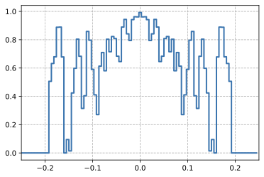

### B.6. Sums and differences of finite sets

1. **Larger finite witnesses progressively improve the exponent**
Starting from the known lower bound $1.14465\le C_6$, a set of size 2,003 gives $C_6\ge1.1479$, and a set of size 54,265 improves it to $C_6\ge1.1584$. The analytic upper bound remains $4/3$.

### B.7. Packing unit regular hexagons inside a regular hexagon

1. **Two outer-side-length records improve**
For 11 unit hexagons, the required outer side drops from 3.943 to 3.931. For 12, it drops from 4.000 to 3.942.

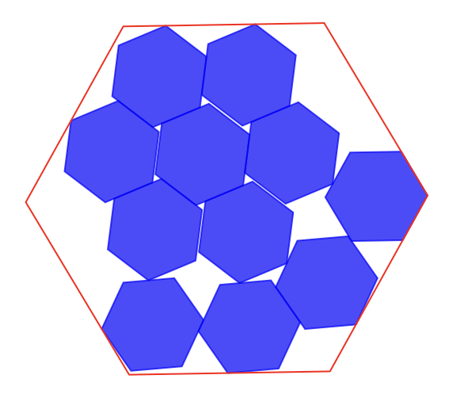

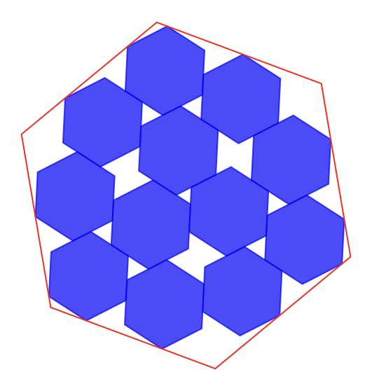

### B.8. Minimizing the ratio of maximum to minimum distance

1. **New configurations improve two dimension-specific squared ratios**
Sixteen points in two dimensions achieve approximately $\sqrt{12.889266112}$ versus $\sqrt{12.890}$. Fourteen points in three dimensions achieve approximately $\sqrt{4.165849767}$ versus $\sqrt{4.168}$.

### B.9. The Heilbronn problem for triangles

1. **Eleven points improve the minimum triangle area**
Inside a unit-area triangle, AlphaEvolve finds 11 points for which every formed triangle has area greater than 0.0365, improving the previous 0.036 record.

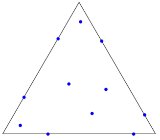

### B.10. The Heilbronn problem for convex regions

1. **Two convex-region records improve**
For 13 points the minimum triangle area rises from 0.0306 to 0.0309; for 14 points it rises from 0.0277 to 0.0278.

### B.11. Kissing number in dimension 11

1. **An integral-coordinate certificate proves a lower bound of 593**
For a finite set $C\subset\mathbb{R}^{11}$ with $0\notin C$, the construction satisfies

\[
\min_{x\ne y\in C}\|x-y\|\ge\max_{x\in C}\|x\|.
\]

The normalized centers $2x/\|x\|$ lie at distance 2 from the origin and at least 2 from one another, proving the spheres touch the center without overlapping. This raises the dimension-11 lower bound from 592 to 593.

### B.12. Packing circles inside a unit square to maximize sum of radii

1. **Two sums-of-radii records improve**
For 26 circles the sum rises from 2.634 to 2.635; for 32 circles it rises from 2.936 to 2.937.

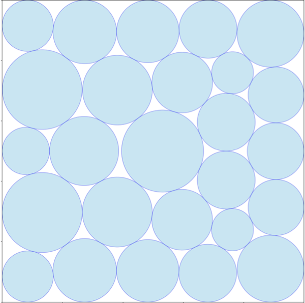

### B.13. Packing circles inside a perimeter-four rectangle

1. **A 21-circle construction improves the record**
The maximum known sum of radii rises from 2.364 to 2.3658 for 21 circles in a rectangle of perimeter 4.

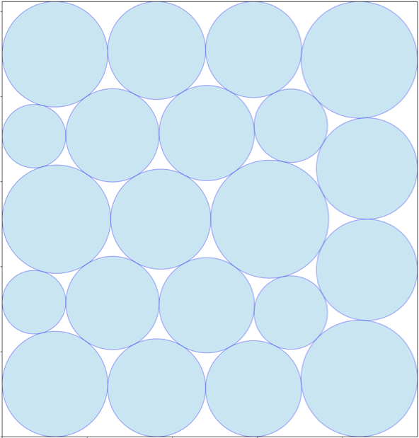

## Limitations, failure cases, and cautions

1. **No reliable evaluator means no reliable evolutionary signal**
The method cannot directly address tasks whose decisive evidence is a manual experiment or subjective scientific judgment. LLM grading can supplement execution, but the authors do not claim it has the same robustness.

2. **Optimization may overfit the evaluator**
The production case studies counter this with held-out workloads or shapes, randomized differential tests, correctness-preserving interfaces, and expert review. These controls are task-specific rather than a general proof against reward hacking.

3. **Compute and infrastructure demands are substantial and incompletely reported**
A single candidate can consume roughly 100 compute-hours, matrix searches use many randomized seeds, and industrial evaluators require Google-scale systems. Absolute budgets, candidate counts per result, and unsuccessful-run costs are mostly absent.

4. **A discovered improvement can be narrow, concurrent, or rediscovered**
The TPU edit was also found downstream by synthesis, the $\langle4,5,6\rangle$ rank was independently discovered, and two of 54 matrix targets underperformed the known best. The uncertainty appendix also documents missed prior art before a stronger rerun.

5. **The white paper does not fully specify the evolutionary database**
MAP-Elites and island models are named, but sampling probabilities, niches, migration, retention, replacement rules, population sizes, prompts, stopping rules, and full compute allocations are not disclosed.

6. **Generated-code execution risk is not analyzed**
The paper focuses on functional correctness and performance, not security. It does not describe sandboxing, resource abuse prevention, adversarial code, secret access, or evaluator compromise.

## Open questions

1. **How much performance comes from search, models, and evaluation compute separately?**
A factorial study with absolute tokens, candidates, wall time, and hardware-hours would reveal whether evolution remains advantageous under equal total cost.

2. **Can the archive be specified and reproduced?**
Publishing exact sampling, quality-diversity niches, island migration, and retention rules would allow direct comparisons with beam search, Monte Carlo tree search, and simpler elite replay.

3. **How should train fitness and held-out selection interact?**
The kernel case uses a clean 50/50 shape split, but other tasks use multiple targets and seeds without a uniform release protocol. A standardized outer-loop validation set could reduce evaluator overfitting.

4. **Can proofs or formal verification replace task-specific checks?**
Tensor decompositions and the kissing certificate are exactly verifiable. Extending formal checking to source rewrites, compiler IR, and hardware equivalence could reduce dependence on randomized tests and expert review.

5. **Which representation should be evolved for a new problem?**
Direct objects, constructors, full search procedures, and co-evolved object–search pairs impose different inductive biases. Predictive criteria for choosing among them remain qualitative.

6. **Can discovered search competence be distilled?**
The discussion proposes training future base models on AlphaEvolve trajectories. The open empirical question is whether distillation preserves long-horizon improvement or merely memorizes task-specific patches.

7. **How can evaluator gaming and generated-code security be controlled?**
Future systems need explicit sandboxes, capability boundaries, immutable tests, hidden validation, anomaly detection, and auditable release gates—especially when evolution runs for many generations against a fixed score.

8. **Can the method move beyond fully automated experiments?**
A hybrid pipeline could use language-level agents to triage hypotheses and AlphaEvolve only after a candidate reaches an executable stage, but the transition between subjective and machine-grounded evaluation is unresolved.
