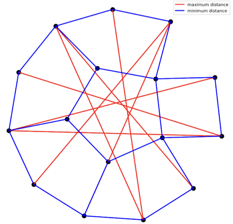

# Paper Assets

## Table 1: tab:funsearch-vs-alphaevolve

Caption: Capabilities and typical behaviours of and our previous agent.

| FunSearch paredes2023mathematical |  |
| --- | --- |
| evolves single function | evolves entire code file |
| evolves up to 10-20 lines of code | evolves up to hundreds of lines of code |
| evolves code in Python | evolves any language |
| needs fast evaluation ( 20min on 1 CPU)\;\; | can evaluate for hours, in parallel, on accelerators |
| millions of LLM samples used | thousands of LLM samples suffice |
| small LLMs used; no benefit from larger | benefits from SOTA LLMs |
| minimal context (only previous solutions) | rich context and feedback in prompts |
| optimizes single metric | can simultaneously optimize multiple metrics |

## Figure 1: fig:method

Caption: Expanded view of the discovery process. The user provides an initial program (with components to evolve marked), evaluation code, and optional configurations (subsec:specification). then initiates an evolutionary loop. The Prompt sampler uses programs from the Program database to construct rich prompts (subsec:prompting). Given these prompts, the LLMs generate code modifications (diffs), which are applied to create new programs (subsec:generation). These are then scored by Evaluators (subsec:evaluation), and promising solutions are registered back into the Program database (subsec:evolution), driving the iterative discovery of better and better programs.

![Expanded view of the discovery process. The user provides an initial program (with components to evolve marked), evaluation code, and optional configurations (subsec:specification). then initiates an evolutionary loop. The Prompt sampler uses programs from the Program database to construct rich prompts (subsec:prompting). Given these prompts, the LLMs generate code modifications (diffs), which are applied to create new programs (subsec:generation). These are then scored by Evaluators (subsec:evaluation), and promising solutions are registered back into the Program database (subsec:evolution), driving the iterative discovery of better and better programs.](figures/method_detailed.png)

## Figure 2: fig:grounding-api

Caption: justification=centering, singlelinecheck=false

## Table 2: tab:relaxed-opt-results

Caption: Upper bounds on the rank of the tensor m,n,p representing the product of an m n matrix and an n p matrix, i.e. the number of scalar multiplications required to compute this matrix product. Beyond the examples shown here, for all parameters m,n,p 5, either matched or surpassed the best known solutions, and provided exact algorithms (see tab:relaxed-opt-results-appendix in appendix for full results). For 3, 4, 7, 4, 4, 4, and 4, 4, 8, the algorithms discovered by use complex-valued multiplications which can be used for exact multiplication of complex or real-valued matrices. The decompositions shown in this table can be found in .

| m, n, p | best known [reference] |  |
| --- | --- | --- |
| 2, 4, 5 | 33 hopcroft | 32 |
| 2, 4, 7 | 46 smirnov2013bilinear | 45 |
| 2, 4, 8 | 52 smirnov2013bilinear | 51 |
| 2, 5, 6 | 48 smirnov2013bilinear | 47 |
| 3, 3, 3 | 23 laderman | 23 |
| 3, 4, 6 | 56 Kauers_2025 | 54 |
| 3, 4, 7 | 66 smirnov2021 | 63 |
| 3, 4, 8 | 75 smirnov2021 | 74 |
| 3, 5, 6 | 70 Kauers_2025 | 68 |
| 3, 5, 7 | 82 smirnov2021 | 80 |
| 4, 4, 4 | 49 strassen1969gaussian | 48 |
| 4, 4, 5 | 62 kauers2023flip | 61 |
| 4, 4, 7 | 87 smirnov2013bilinear | 85 |
| 4, 4, 8 | 98 strassen1969gaussian | 96 |
| 4, 5, 6 | 93 Kauers_2025 | 90 |
| 5, 5, 5 | 93 flip_graphs_with_symmetry | 93 |

## Figure 3: fig:relaxed-opt-diff

Caption: Changes proposed by to discover faster matrix multiplication algorithms. The full diff is outlined on the left (see magnified version in fig:relaxed-opt-diff-appendix-1,fig:relaxed-opt-diff-appendix-2,fig:relaxed-opt-diff-appendix-3) and some excerpts are highlighted on the right. In this example, proposes extensive changes across several components, including the optimizer and weight initialization (top right), the loss function (middle right), and hyperparameter sweep (bottom right). These changes are highly non-trivial, requiring 15 mutations during the evolutionary process.

![Changes proposed by to discover faster matrix multiplication algorithms. The full diff is outlined on the left (see magnified version in fig:relaxed-opt-diff-appendix-1,fig:relaxed-opt-diff-appendix-2,fig:relaxed-opt-diff-appendix-3) and some excerpts are highlighted on the right. In this example, proposes extensive changes across several components, including the optimizer and weight initialization (top right), the loss function (middle right), and hyperparameter sweep (bottom right). These changes are highly non-trivial, requiring 15 mutations during the evolutionary process.](figures/diff_full.png)

## Figure 4: fig:math_sota_examples

Caption: Examples of SOTA-breaking mathematical constructions discovered with . The versatility of allows us to tackle problems in analysis (autocorrelation and uncertainty inequalities), geometry (packing and minimum/maximum distance problems) and combinatorics (Erdos's minimum overlap problem and sums and differences of finite sets).

## Figure 5: fig:alphaevolve_heuristic

Caption: Left: The heuristic function discovered by , tailored to Google’s workloads and capacity. Right: Visualization of the heuristic scoring function. Yellow regions represent high scores, while purple regions represent low scores.

## Figure 6: fig:tiling_heuristic

Caption: Visualization of the tiling heuristic problem for a matrix product AB = C. Creating a heuristic that automatically chooses the right tile size (M, N, P) for all input shapes is difficult because one has to know the matrix multiplication unit’s optimal shapes and memory capacity, the memory requirements of surrounding operations, extra operations that are fused into the kernel, and low-level compiler intricacies, among other details.

## Figure 7: fig:ablations_rewrite

Caption: Left: Ablations of on the problem of finding low-rank tensor decomposition for faster matrix multiplication. Right: Ablations of on the problem of finding sphere packings for improving kissing numbers. Each curve shows the performance of an individual setting with increasing compute budget, averaged over all considered targets (higher values on the target metric are better). The shades indicate intra-target standard deviation, averaged over three independent runs of , initialized with different random seeds.

![Left: Ablations of on the problem of finding low-rank tensor decomposition for faster matrix multiplication. Right: Ablations of on the problem of finding sphere packings for improving kissing numbers. Each curve shows the performance of an individual setting with increasing compute budget, averaged over all considered targets (higher values on the target metric are better). The shades indicate intra-target standard deviation, averaged over three independent runs of , initialized with different random seeds.](figures/ablation_matmul.png)

## Table 3: tab:relaxed-opt-results-appendix

Caption: Full version of tab:relaxed-opt-results, showing the best ranks obtained by for tensor decomposition for all considered parameters. Of the 54 targets, matches the state of the art in 38 cases, surpasses it in 14 cases (green), and falls behind in 2 cases (red). In all cases, provides exact algorithms, using integer or half-integer entries in the decomposition. For 3, 4, 7, 4, 4, 4, and 4, 4, 8, the algorithms discovered by use complex-valued multiplications which can be used for exact multiplication of complex or real-valued matrices. The decompositions shown in this table can be found in .

| m, n, p | known |  |
| --- | --- | --- |
| [reference] |  |  |
| 2, 2, 2 | 7 strassen1969gaussian | 7 |
| 2, 2, 3 | 11 smirnov2013bilinear | 11 |
| 2, 2, 4 | 14 smirnov2013bilinear | 14 |
| 2, 2, 5 | 18 smirnov2013bilinear | 18 |
| 2, 2, 6 | 21 smirnov2013bilinear | 21 |
| 2, 2, 7 | 25 smirnov2013bilinear | 25 |
| 2, 2, 8 | 28 smirnov2013bilinear | 28 |
| 2, 2, 9 | 32 smirnov2013bilinear | 32 |
| 2, 2, 10 | 35 smirnov2013bilinear | 35 |
| 2, 2, 11 | 39 smirnov2013bilinear | 39 |
| 2, 2, 12 | 42 smirnov2013bilinear | 42 |
| 2, 2, 13 | 46 smirnov2013bilinear | 46 |
| 2, 2, 14 | 49 smirnov2013bilinear | 49 |
| 2, 2, 15 | 53 smirnov2013bilinear | 53 |
| 2, 2, 16 | 56 smirnov2013bilinear | 56 |
| 2, 3, 3 | 15 smirnov2013bilinear | 15 |
| 2, 3, 4 | 20 smirnov2013bilinear | 20 |
| 2, 3, 5 | 25 smirnov2013bilinear | 25 |

## Figure 8: fig:relaxed-opt-diff-appendix-1

Caption: Magnified version of fig:relaxed-opt-diff(left), giving the program that discovers a faster algorithm to multiply 44 matrices (1/3).

No embeddable figure file was copied.

## Figure 9: fig:relaxed-opt-diff-appendix-2

Caption: Magnified version of fig:relaxed-opt-diff(left), giving the program that discovers a faster algorithm to multiply 44 matrices (2/3).

No embeddable figure file was copied.

## Figure 10: fig:relaxed-opt-diff-appendix-3

Caption: Magnified version of fig:relaxed-opt-diff(left), giving the program that discovers a faster algorithm to multiply 44 matrices (3/3). Here hyper is a user-provided library for generating hyperparameter sweeps.

No embeddable figure file was copied.

## Figure 11: fig:erdos

Caption: Construction found by for the minimum overlap problem of Erdos.

## Figure 12: fig:hexagons

Caption: Constructions of the packing problems found by . Left: Packing 11 unit hexagons into a regular hexagon of side length 3.931. Right: Packing 12 unit hexagons into a regular hexagon of side length 3.942.

## Figure 13: fig:distance_ratios

Caption: Left: 16 points in 2 dimensions achieving a ratio of maximum distance to minimum distance of 12.889266112. Right: 14 points in 3 dimensions achieving a ratio of 4.165849767. Both constructions improve the best known bounds.

## Figure 14: fig:heilbronn

Caption: New constructions found by improving the best known bounds on two variants of the Heilbronn problem. Left: 11 points in a unit-area triangle with all formed triangles having area 0.0365. Middle: 13 points inside a convex region with unit area with all formed triangles having area 0.0309. Right: 14 points inside a unit convex region with minimum area 0.0278.

## Figure 15: fig:circle_packing

Caption: New constructions found by improving the best known bounds on packing circles to maximize their sum of radii. Left: 26 circles in a unit square with sum of radii 2.635. Middle: 32 circles in a unit square with sum of radii 2.937. Right: 21 circles in a rectangle with perimeter 4, with sum of radii 2.365.

