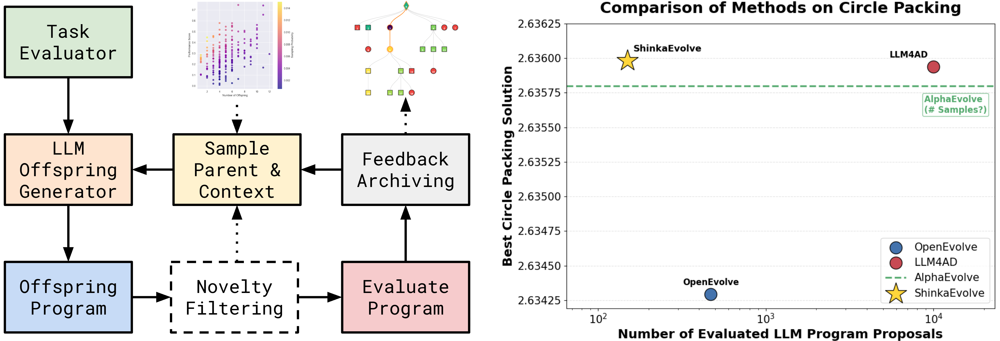
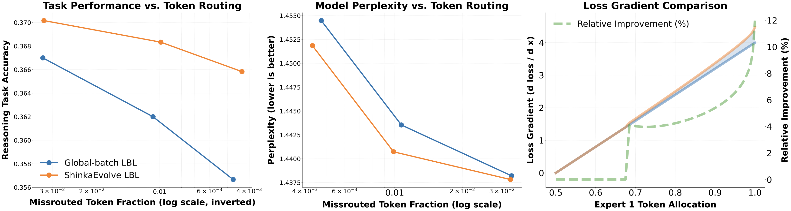
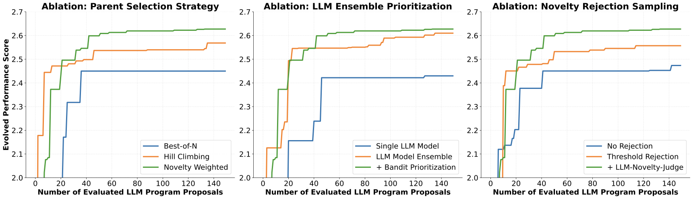

# ShinkaEvolve: Towards Open-Ended And Sample-Efficient Program Evolution

Source: https://arxiv.org/abs/2509.19349

## Overview / Takeaway

ShinkaEvolve is an open-source, LLM-guided program-evolution framework designed to spend expensive evaluator calls on diverse, promising candidates rather than near-duplicate code. It combines fitness-and-novelty-weighted parent sampling, island archives, diff/full/crossover mutations, embedding-plus-LLM novelty rejection, UCB1-style model selection, textual evaluator feedback, and a periodically revised meta-scratchpad. Across circle packing, AIME agent scaffolds, ALE-Bench heuristic programming, and mixture-of-experts load-balancing-loss discovery, it finds strong solutions with 20–150 proposed generations per task; its clearest headline is a 26-circle packing sum of **2.6359830990** under a $10^{-6}$-slack verifier, made exact at **2.6359828390** by shrinking every radius by $10^{-8}$. The work demonstrates a practical, reusable evolutionary engine, but *"open-ended"* remains aspirational: objectives and evaluators are manually specified, evaluations can still be extremely costly, several comparisons lack statistical testing, and parts of the results and configuration tables disagree.

Figure 1 captures the full loop and the paper’s central empirical comparison: sample a parent and context, generate an offspring, filter it for novelty, execute it, and archive its feedback.

## 1 Introduction

1. **Program evolution turns inference-time compute into a scientific search process**
LLMs act as mutation and recombination operators over executable programs, while an external evaluator supplies the selection signal. Successful variants propagate through an evolutionary tree, letting the system search competitive-programming algorithms, mathematical constructions, agent scaffolds, or even training objectives without gradient-updating the proposal models.

2. **The target bottleneck is evaluator sample efficiency**
Earlier code-evolution systems commonly require thousands of evaluated candidates. That is particularly costly when one evaluation means solving 30 competition-math problems three times or pretraining a 556M-parameter mixture-of-experts model on **2.10B tokens**, so reducing redundant proposals matters more than merely reducing prompt tokens.

3. **Closed implementations impede reproduction and extension**
ShinkaEvolve releases its implementation under **Apache 2.0**, including a visualization tool. This makes the orchestration code inspectable, although many reported runs still depend on proprietary GPT, Claude, Gemini, or o-series APIs and therefore are not an entirely open computational stack.

4. **Three algorithmic changes target different sources of waste**
Weighted parent sampling avoids both uniform random search and pure hill climbing; novelty rejection avoids executing semantically redundant code; and a bandit reallocates proposal probability toward LLMs that recently produced improvements. These act before, during, and after mutation respectively.

5. **The evaluation deliberately spans four distinct mutable artifacts**
The system evolves a numerical optimizer for **26-circle packing**, a seven-call reasoning scaffold for **AIME**, C++ heuristic solvers for **10 ALE-Bench LITE** tasks, and a PyTorch load-balancing loss for a sparse MoE. Breadth is an important part of the contribution because the framework is intended as a generic program optimizer rather than a domain-specific solver.

6. **The paper’s *"open-ended"* claim is a direction, not an achieved property**
Every reported task begins with a human-written initial program, objective, validation protocol, and bounded mutation region. The Discussion explicitly lists self-generated objectives and true open-endedness as future work, so the current system is best understood as open-ended-style archive search inside a manually scoped task.

## 2 Related Work

1. **ShinkaEvolve directly extends archive-based LLM code optimization**
The closest named systems are **AlphaEvolve**, **OpenEvolve**, and **LLM4AD**. All use LLMs to mutate or recombine programs under automated fitness evaluation; ShinkaEvolve’s claimed extension is the combination of sample-efficient parent selection, novelty rejection, adaptive LLM prioritization, and online meta-scratchpad drafting.

2. **The archive behaves like population-based tree search**
Nodes are executable programs, edges are diff edits, rewrites, or crossovers, and fitness controls which branches receive further mutations. Unlike one-path iterative refinement, the archive retains multiple stepping stones that can later be recombined.

3. **Island populations preserve separate discovery substreams**
The island model follows earlier evolutionary program search: independent populations begin from the same seed, evolve in parallel, and occasionally exchange non-elite members. Keeping each island’s best solution from migrating protects some local identity while still allowing useful code patterns to diffuse.

4. **Learned semantic novelty supplements classical behavior descriptors**
Traditional novelty search needs an explicit diversity metric. ShinkaEvolve embeds mutable code and, for sufficiently similar proposals, asks another LLM whether the semantic change is meaningful; this substitutes pretrained representation and judgment for a handcrafted behavior space.

5. **Darwin Gödel Machine supplies the weighted-parent precedent**
The performance-and-offspring-count sampler is explicitly described as inspired by Darwin Gödel Machine. ShinkaEvolve applies the idea to fixed-size island archives and combines it with code-embedding rejection and adaptive multi-model mutation.

6. **Several supporting mechanisms are borrowed explicitly**
Targeted SEARCH/REPLACE mutations and immutable `EVOLVE-BLOCK` markers follow AlphaEvolve; parsing-feedback resampling uses the Reflexion pattern; the model-selection controller is based on **UCB1**; and the public Python interface roughly adopts OpenEvolve’s high-level API.

## 3 Method

1. **The algorithm closes a three-stage evolutionary loop**
First, an island, parent, and inspiration programs are sampled from the archive. Second, an LLM generates a diff, full rewrite, or crossover and novelty filtering may reject it before execution. Third, the task evaluator returns fitness, public metrics, and text feedback that update the archive, model-selection statistics, and periodic meta-scratchpad.

2. **Only evaluator-visible outcomes determine whether an idea survives**
The proposal LLM can reason about prior programs and their textual feedback, but it cannot directly know whether new code works. Executing code against a task-specific world converts syntactic hypotheses into measured evidence.

3. **The framework separates the mutable block from evaluation infrastructure**
`EVOLVE-BLOCK-START` and `EVOLVE-BLOCK-END` markers define what the LLM may rewrite. The evaluator, experiment harness, validators, private metrics, and aggregation logic can remain immutable, reducing accidental corruption of the benchmark.

### 3.1 Parent and inspiration sampling

1. **A fixed-size archive stores programs, scores, and mutation context**
Each archived program includes scalar fitness, exposed public metrics, textual feedback, and metadata. An elite-size constraint preserves high performers, while bounded archive sizes range from **20** for MoE-loss search to **50** for ALE-Bench.

2. **Sampling is hierarchical within an island**
The island identifier is sampled uniformly, then the parent and inspiration programs come from that subpopulation. Mutation context mixes a primary parent, random archive samples, and top-$k$ programs, so the LLM sees both proven code and less-explored alternatives.

3. **Migration shares knowledge without moving island champions**
Islands can exchange members every **10 generations** in AIME, ALE, and MoE configurations, at migration rate **0.1**. Circle packing also uses a 10-generation interval but sets migration rate to **0.0**; the best member of any island is never eligible to migrate.

4. **Power-law rank sampling interpolates between exploration and hill climbing**
For fitness rank $r_i$, where $r_i=1$ is best, the parent probability is

\[
p_i=\frac{r_i^{-\alpha}}{\sum_{j=1}^{n}r_j^{-\alpha}}.
\]

Setting $\alpha=0$ gives uniform selection, while $\alpha\rightarrow\infty$ always selects the incumbent best. Intermediate $\alpha$ values bias toward quality without fully collapsing search.

5. **Weighted sampling combines relative fitness with branch underuse**
Let $F(P_i)$ be parent $P_i$’s fitness, $N(P_i)$ its offspring count, and

\[
\alpha_0=\operatorname{median}\{F(P_1),\ldots,F(P_n)\}.
\]

The performance and novelty terms are

\[
s_i=\sigma\!\left(\lambda(F(P_i)-\alpha_0)\right),\qquad
h_i=\frac{1}{1+N(P_i)},
\]

and final sampling uses

\[
w_i=s_i h_i,\qquad p_i=\frac{w_i}{\sum_{j=1}^{n}w_j}.
\]

The sigmoid favors above-median fitness, while $h_i$ explicitly discounts already-prolific branches. All reported weighted configurations use selection pressure $\lambda=10$.

Figure 2 shows why weighted sampling is not merely a softened hill climber: it can assign high probability to strong programs with few descendants and suppress overexpanded lineages.

6. **Offspring count is only a structural proxy for novelty**
A low-child parent is treated as underexplored even if its code is semantically close to many other archive members. Code-level novelty filtering later adds a representation-based check, but the parent sampler itself does not measure behavioral or semantic distance.

### 3.2 Program mutation and novelty assessment

1. **The proposal pool spans models and sampling parameters**
ShinkaEvolve can sample GPT, Gemini, Claude, and DeepSeek-family models together with temperature and reasoning budget. Reported configurations use temperatures **0.0, 0.5, and 1.0**, maximum output **16,384 tokens**, and task-specific subsets of available models.

2. **Three mutation scopes trade precision for structural freedom**
**Diff edits** use SEARCH/REPLACE blocks for focused changes; **full rewrites** can replace the mutable region wholesale; and **crossover** samples another archived program and asks the LLM to combine both. Circle, AIME, and ALE use diff/full/crossover probabilities of either **0.45/0.45/0.10** or **0.60/0.30/0.10**; MoE search uses only diff and full rewrites at **0.50/0.50**.

3. **Invalid mutations are rejected before task evaluation**
The framework checks that immutable code is unchanged and resamples malformed patches with parsing feedback. Most tasks allow **3 patch attempts and 3 resamples**; MoE search increases both limits to **10**, reflecting the high cost of wasting a pretraining evaluation on unusable code.

4. **Embedding rejection adds a cheap gate before expensive execution**
The mutable code is embedded with `text-embedding-3-small` where enabled, cosine similarity is computed against the island, and a proposal with maximum similarity over $\eta=0.95$ enters a secondary novelty judgment. A non-novel proposal is resampled rather than executed.

5. **An LLM resolves high-similarity false positives**
Lexically similar code can still implement a meaningful algorithmic change, so a dedicated novelty model makes the final decision for threshold-triggered candidates. Circle uses `gpt-5-nano`; AIME and MoE use `gpt-4.1`; ALE disables embedding and novelty-model filtering entirely.

Figure 3 makes the rejection path explicit: embedding similarity is a triage stage, while semantic novelty is an LLM judgment.

6. **Novelty is assessed in source space, not behavior space**
Two programs with different code but identical behavior may pass, while a concise refactor of a useful algorithm may be rejected as similar. No behavioral descriptor, test-output diversity measure, or novelty-judge calibration study is reported.

### 3.3 Execution and world feedback

1. **Evaluation returns one selection score plus richer context**
Each program produces scalar fitness $r_i$, public metrics, and textual feedback. Despite the *"multi-objective assessment"* terminology, the selection equations use a scalar fitness; additional metrics principally enrich later LLM prompts rather than define a reported Pareto archive.

2. **Public and private metrics can separate search from audit**
The evaluation API supports `public` metrics visible to ShinkaEvolve, `private` metrics hidden from it, arbitrary serialized data, multiple runs, result aggregation, and an optional validation function. This is a useful anti-overfitting interface, though the strength of the split is task-dependent.

3. **Bandit rewards measure improvement over a changing baseline**
For mutation $i$, the update reward is

\[
r_i^u=\exp\!\left(\max(r_i-r_i^b,0)\right)-1,
\]

where $r_i^b$ is the larger of the parent’s fitness and the initial program’s fitness. Negative or non-improving mutations receive zero credit, while unusually large gains are exponentially amplified.

4. **UCB1 adapts the proposal-model distribution**
Each LLM has a visit counter and estimated expected improvement. At generation boundaries, normalized $r_i^u$ values update UCB1-style selection, balancing under-sampled models with those that have recently produced strong relative gains.

5. **The reward is intentionally high-risk/high-reward**
Clipping at zero and exponentiating positive improvement promotes models that occasionally make large jumps over models that produce steady small gains. This can accelerate breakthroughs, but it discards information about harmful mutations and may become sensitive to noisy outliers.

6. **A meta-scratchpad converts local outcomes into shared strategy**
Every $T$ generations, a meta-agent summarizes recent programs, identifies successful and ineffective patterns, and appends implementation recommendations to future mutation prompts. Reported intervals are **10 generations** for Circle, AIME, and MoE and **5** for ALE, with at most **5 recommendations**.

Figure 4 shows the memory hierarchy: individual summaries feed global insights, ineffective-approach notes, implementation lessons, performance analysis, and actionable next-step recommendations.

7. **The scratchpad is editable model-generated memory**
Because one LLM summarizes evaluator traces for another, useful knowledge can diffuse across otherwise separate branches. The paper does not measure factual drift, prompt growth, contradictory recommendations, or whether outdated advice is forgotten.

## 4 Results

1. **The four tasks stress different evaluator costs and generalization risks**
Circle packing has a fast numerical verifier, AIME executes multiple LLM calls, ALE compiles and tests C++ heuristic programs, and MoE-loss evaluation pretrains a model. Treating *"one evaluation"* as a uniform unit therefore supports within-task sample-efficiency comparisons but not direct cross-task cost comparison.

2. **Most headline curves report one discovery run**
The paper shows candidate trajectories and final comparisons but provides no full multi-seed distribution for circle packing, ALE, or MoE evolution. AIME evaluates each candidate across three independent task runs, which reduces within-candidate stochasticity but is not the same as repeating the whole evolutionary search.

### 4.1 Circle Packing: Reproducing & Improving AlphaEvolve Results

1. **The task maximizes total radius for 26 non-overlapping circles**
All circles must lie inside the unit square and cannot overlap. The continuous, constrained landscape has many local optima, making initialization, feasible perturbation, global exploration, and local polishing jointly important.

2. **The main run reaches the reported frontier within 150 proposals**
The best score rises rapidly above **2.4** by roughly 40 evaluated proposals and finishes near **2.636**. The plotted cumulative proposal-API cost is approximately **\$12**, although evaluator compute and engineering cost are not included.

3. **The relaxed-verifier solution slightly exceeds the named baselines**
The main solution scores **2.635983099011548** with $10^{-6}$ constraint slack. Figure 1 places AlphaEvolve around **2.6358**, LLM4AD around **2.63594**, and OpenEvolve around **2.6343**, but AlphaEvolve’s number of evaluated proposals is shown as unknown, limiting a controlled sample-efficiency comparison.

4. **A trivial radius reduction yields a verified exact state of the art**
Shrinking each of 26 radii by $10^{-8}$ changes the sum to **2.6359828390115476**, a relative reduction below $10^{-6}$. This explicitly checks that the reported improvement is not just exploitation of the relaxed numerical tolerance.

5. **A separate exact-verifier evolution reaches a slightly lower score**
Using AlphaEvolve’s exact verifier throughout produces **2.63597770931127**, requires about **500 evaluated proposals**, and the appendix curve reaches roughly **\$43** in cumulative proposal-API cost. The gap demonstrates the benefit—and accounting ambiguity—of evolving under a relaxed surrogate and post-processing for exactness.

Figure 5 shows the relaxed main run and its branching program lineage; the blue path composes distinct stepping stones rather than following only the best incumbent.

The appendix’s exact-verification run converges more slowly and at higher proposal cost.

6. **The discovered solver composes several optimization families**
It initializes centers with a golden-angle spiral plus corner and edge placements, derives feasible radii, uses **SLSQP** for constraint-aware local refinement, and applies simulated annealing to local circle moves and global ring rotations. Adaptive cooling, reheating after stagnation, and final SLSQP polishing help escape and then refine local optima.

7. **The evolution tree exposes invalid-program attrition**
Red crosses in Figure 5 mark incorrect candidates among diff edits, full rewrites, and crossovers. Invalid proposals still occur despite patch checking, and the paper does not quantify their fraction, evaluator time, or whether failures cluster by mutation type or model.

### 4.2 AIME: Evolving Agent Scaffolds for Math Reasoning

1. **AIME 2024 is both search task and in-distribution evaluation set**
The search uses all **30 AIME 2024 problems**, a `gpt-4.1-nano` base model, at most **10 model calls per problem**, **75 generations**, and **three independent evaluations of every candidate**. No held-out subset within 2024 is reserved for scaffold selection.

2. **The evolved Pareto set improves accuracy while using seven calls**
The initial one-call program scores **24.4%**. Pareto-optimal points reach **25.6%** at two calls, roughly **33.3%** at four calls, and **34.4%** at seven and ten calls; the seven-call solution therefore dominates the ten-call solution on call count at equal displayed accuracy.

3. **The discovered architecture is generate–review–synthesize**
Three personas independently solve at temperature **0.7**: a meticulous stepwise mathematician, an intuitive pattern finder, and an algorithmic computer-science-oriented mathematician. Three skeptical reviews run at **0.1**, followed by an editor-in-chief synthesis at **0.0**, totaling **3+3+1=7 calls**.

4. **Failure handling is part of the evolved scaffold**
If synthesis produces no `\boxed{000..999}` answer, it majority-votes reviewed answers, then original answers, then emits `\boxed{000}`. Query exceptions degrade gracefully by retaining the remaining agents rather than aborting the problem.

5. **Cross-year transfer is positive against the base but not uniformly best**
The exact settings and reported values make the relevant comparison concrete.

| AIME year | Base agent | Majority@5 | ShinkaEvolve |
| --- | ---: | ---: | ---: |
| 2023 | 18.4% | 21.8% | **23.0%** |
| 2024 | 24.4% | 32.2% | **34.4%** |
| 2025 | 11.1% | **25.6%** | 20.0% |

The scaffold improves over the base in every year, including **+8.9 points** on the unseen 2025 set, but loses to Majority@5 by **5.6 points** there. The paper notes that smaller gains on 2023 may reflect training-data contamination; it does not directly test that hypothesis.

6. **The scaffold transfers across stronger base models**
The exact settings and reported values make the relevant comparison concrete.

| Base LLM on AIME 2024 | Base agent | Majority@5 | ShinkaEvolve |
| --- | ---: | ---: | ---: |
| gpt-4.1-mini | 44.4% | 60.0% | **65.6%** |
| gpt-4.1 | 46.7% | 60.0% | **65.6%** |
| o4-mini | 80.0% | 88.9% | **94.4%** |

The same scaffold adds **21.2**, **18.9**, and **14.4 percentage points** over the respective base agents, evidence that its peer-review topology is not specific to `gpt-4.1-nano`.

Figure 6 combines the call-budget frontier, cross-year transfer, and cross-model transfer.

7. **The comparison does not normalize token cost or latency**
Calls have different prompt lengths: synthesis receives six long solution/review traces, so seven calls are not equivalent to seven independent short votes. The reported frontier uses number of LLM calls, not tokens, dollars, latency, or parallelizable wall time.

### 4.3 ALE-Bench: Evolving Programs for Combinatorial Optimization

1. **Search begins from an already strong ALE-Agent solution**
For each of **10 ALE-Bench LITE** AtCoder heuristic tasks, ShinkaEvolve evolves the best ALE-Agent C++ program for **50 generations**. Public test scores supply fitness; the best selected program is then submitted to the private test set.

2. **Average private score improves by approximately 2.3%**
The exact settings and reported values make the relevant comparison concrete.

| Selection/reporting rule | Mean score over 10 tasks |
| --- | ---: |
| ALE-Agent best initialization | 1,879.3 |
| ShinkaEvolve: max-public top-1 | 1,923.5 |
| ShinkaEvolve: max-public top-5 | 1,927.9 |
| ShinkaEvolve: maximum private, retrospective | 1,932.1 |

The deployable top-1 rule gains **44.2 points**, or about **2.35%**, over ALE-Agent. Maximum-private selection is an oracle analysis rather than a selection rule available before private evaluation.

3. **The appendix reports a conflicting top-5 number**
It states that top-5 public selection changes the private average from **1,923.5 to 1,927.0**, whereas Figure 7 labels the top-5 mean **1,927.9**. The difference is small but should be resolved before treating that decimal-level result as exact.

4. **Public-to-private transfer shows limited aggregate overfitting**
Selecting among the top five public candidates barely changes average private score relative to selecting the top one. The appendix interprets this as no significant evidence of public-test overfitting, although it provides no per-run uncertainty or hypothesis test.

5. **The largest concrete case moves from hypothetical fifth to second place**
On `ahc039`, ALE-Agent’s simulated-annealing/kd-tree solver scores **2,880**; ShinkaEvolve’s version scores **3,140**. Had it entered the original contest, the reported ranking would move from **5th to 2nd**.

6. **The ahc039 improvement is implementation-focused**
The evolved code augments kd-tree nodes with cached bounding boxes and fish counts, caches perimeter and local intersection information, and adds a targeted edge move that chooses a misclassified fish and moves the nearest axis-aligned polygon edge toward correcting it.

7. **The ahc025 solver changes its search regime**
It accelerates comparison caching, improves fallback weight estimation, and replaces broad simulated annealing with greedy moves plus targeted local search for partitioning unknown-weight items into balanced groups under a fixed comparison budget.

Figure 7 separates aggregate improvement from per-task private performance and makes `ahc039` the dominant visible jump.

8. **Initialization anchoring remains a real limitation**
The generated solvers stay algorithmically close to ALE-Agent on many tasks. This is useful for local optimization but suggests that even novelty-weighted evolutionary search may inherit the seed’s conceptual basin and miss radically different human strategies.

### 4.4 LLM Training: Evolving Losses for Balanced and Effective Experts

1. **The mutable program is an auxiliary router loss**
Sparse MoE layers choose only the top $K$ experts for each token. Since hard top-$K$ selection can starve experts of tokens, an auxiliary load-balancing loss must discourage routing collapse without suppressing useful specialization.

2. **The MoE routing computation is sparse**
For token representation $x$ at layer $\ell$,

\[
y_\ell(x)=\sum_{i=1}^{N_E}g_{\ell,i}(x)E_{\ell,i}(x),
\]

with

\[
g_{\ell,i}(x)=
\begin{cases}
\dfrac{e^{h_{\ell,i}(x)}}{\sum_{j\in\mathcal T_K(x)}e^{h_{\ell,j}(x)}} & i\in\mathcal T_K(x),\\
0 & \text{otherwise},
\end{cases}
\]

where $\mathcal T_K(x)$ contains the top-$K$ router-logit indices and $E_{\ell,i}$ is expert $i$.

3. **Evolution uses a small but still expensive pretraining proxy**
Each candidate loss trains a **556M-parameter**, 12-layer MoE with **64 experts**, **8 active experts**, and **82M active non-embedding parameters**. Training uses FineWeb, sequence length **1,024**, global batch **1,024 sequences**, **1,048,576 tokens/step**, **2,000 steps**, and **2.10B total tokens**.

4. **Fitness explicitly trades language modeling against routing balance**
With $f_{\ell,i}$ the fraction of tokens sent to expert $i$,

\[
L_{\mathrm{imb}}=\frac12\sum_{i=1}^{N_E}\left|f_{\ell,i}-\frac1{N_E}\right|,
\qquad
r=-(L_{\mathrm{CE}}+L_{\mathrm{imb}}).
\]

Cross-entropy is averaged over the last **10M tokens** to reduce local noise. The evolution run uses $\lambda=0.01$ for the candidate load-balancing term.

5. **Large-scale validation multiplies model and token budgets**
The selected loss is retrained in a **2.7B-parameter**, 16-layer MoE with **404M active non-embedding parameters**, global batch **2,048 sequences**, **2,097,152 tokens/step**, **14,000 steps**, and **29.36B FineWeb tokens**. It is tested at $\lambda\in\{0.001,0.01,0.1\}$.

6. **The baseline global-batch loss matches use and router confidence**
For $L$ layers and $N_E$ experts,

\[
L_{\mathrm{LB}}=
N_E\frac1L\sum_{\ell=1}^{L}\sum_{i=1}^{N_E}f_{\ell,i}P_{\ell,i},
\]

where $f_{\ell,i}$ is observed selection frequency and $P_{\ell,i}$ is average router probability.

7. **The evolved loss adds an entropy-gated minimum-usage floor**
Define

\[
s(P_\ell)=0.5+\left(1-\frac{H(P_\ell)}{\log N_E}\right),
\qquad
\tau=\frac{0.064}{N_E}.
\]

ShinkaEvolve discovers

\[
\begin{aligned}
L_{\mathrm{LBL}}
&=
N_E\frac1L\sum_{\ell=1}^{L}\sum_{i=1}^{N_E}f_{\ell,i}P_{\ell,i}\\
&\quad+
\frac{0.1}{L}\sum_{\ell=1}^{L}s(P_\ell)
\sum_{i=1}^{N_E}\max(0,\tau-f_{\ell,i}).
\end{aligned}
\]

The added term activates only for underused experts and becomes stronger when routing entropy is low, then vanishes once each expert crosses the floor.

8. **The new term addresses a blind spot in the dot-product baseline**
$f\!\cdot\!P$ can appear acceptable even when some experts receive almost no tokens. The thresholded term directly supplies gradient pressure to *"dead"* experts without continuously regularizing already balanced layers.

9. **The scaled model improves downstream accuracy at every coefficient**
The exact settings and reported values make the relevant comparison concrete.

| Auxiliary coefficient $\lambda$ | Global-batch LBL | ShinkaEvolve LBL | Gain |
| ---: | ---: | ---: | ---: |
| 0.001 | 0.3670 | **0.3702** | +0.0032 |
| 0.01 | 0.3620 | **0.3683** | +0.0063 |
| 0.1 | 0.3567 | **0.3658** | +0.0091 |

These plotted means cover **CommonSenseQA, HellaSwag, OpenBookQA, PIQA, SIQA, WinoGrande, and ARC**, truncating large benchmarks to **1,000 questions**. The advantage grows as the auxiliary coefficient becomes more influential.

10. **Perplexity also improves, but effect sizes are small**
Approximate plotted global/Shinka perplexities are **1.4544/1.4518** at $\lambda=0.1$, **1.4436/1.4407** at $\lambda=0.01$, and **1.4383/1.4378** at $\lambda=0.001$. No confidence intervals or repeated-pretraining variance are reported.

Figure 8 links routing imbalance to task accuracy and perplexity and illustrates the extra gradient in a two-expert example.

The appendix replots performance, perplexity, and missrouting directly against $\lambda$.

11. **The MoE reporting contains several ambiguities**
The main text says evolution ran for **30 iterations**, while the task hyperparameter table says **20 generations**. The architecture table labels both total and active parameter rows *"Model parameters,"* and the appendix’s *"fraction of missrouted tokens"* axis is around **1.004–1.034**, which exceeds the range of a literal fraction and is not explained.

12. **The figure-order description is reversed in one paragraph**
The main prose points to Figure 8’s left panel for perplexity and center for downstream performance, while the caption and actual graphic put downstream performance on the left and perplexity in the middle. The numerical trends remain visible, but the textual reference is wrong.

## 5 Ablations & Analysis

1. **Weighted parent sampling sustains improvement after greedy search plateaus**
On circle packing, final plotted scores are approximately **2.63** for novelty-weighted selection, **2.57** for hill climbing, and **2.45** for Best-of-N/random search. Hill climbing leads early but stops improving around 45 evaluations; weighted selection continues to find gains through 150.

2. **Adaptive model choice adds a smaller gain than model diversity itself**
The plotted final scores are roughly **2.43** for a single GPT-5-nano proposal model, **2.61** for a uniformly sampled ensemble, and **2.63** with bandit prioritization. The figure supports a large ensemble-diversity benefit and a comparatively small adaptive-prioritization increment.

3. **Novelty rejection produces the largest ablation gap**
Final plotted scores are about **2.47** with no rejection, **2.56** with embedding-threshold rejection, and **2.63** when the LLM novelty judge is added. Preventing near-duplicate executions is therefore central to the sample-efficiency claim.

Figure 9 places the three ablations on the same 150-proposal circle-packing horizon.

4. **The prose overstates the scope of the displayed ablations**
It says weighted sampling outperforms alternatives *"across all tasks,"* but Figure 9 is explicitly a circle-packing study and no equivalent curves for AIME, ALE, or MoE are provided. Likewise, *"significantly outperforms"* is used without statistical tests.

5. **The LLM judge’s marginal-cost conclusion is not fully quantified**
The paper calls the judge’s improvement marginal and notes its extra compute, but reports neither rejection counts nor extra LLM calls, dollars, latency, false-positive rates, or novelty-decision agreement. The curve establishes performance benefit, not net cost effectiveness.

6. **Ablations are component removals, not interaction studies**
The experiments do not test whether weighted sampling is still helpful without rejection, whether scratchpad memory adds value, whether full rewrites or crossover are necessary, or whether UCB’s exponential reward shaping outperforms simpler relative improvement.

## 6 Discussion

### Summary

1. **ShinkaEvolve’s strongest contribution is evaluator-aware search discipline**
Rather than relying on a single *"smart"* mutation prompt, it coordinates archive structure, parent allocation, duplicate filtering, model routing, evaluator feedback, and shared memory. This modularity explains why the same engine can mutate Python optimization code, an LLM-agent class, C++ contest programs, and a training loss.

2. **Sample efficiency does not imply inexpensive discovery**
Circle packing needs only 150 proposals, yet its plotted proposal-API cost is around \$12; exact evolution approaches \$43. More importantly, one MoE evaluation consumes 2.10B training tokens, making 20 or 30 iterations an enormous compute campaign even if the candidate count is small.

### Limitations

1. **Exploration and exploitation remain manually configured**
Archive size, island count, migration, mutation probabilities, selection pressure, novelty threshold, model pool, temperature pool, and scratchpad interval all vary by task. The bandit adapts model choice, but the broader search policy is fixed by humans.

2. **Task definition and evaluation require expert engineering**
Humans supply the objective, initial solution, mutable boundary, validator, aggregation rule, public/private metrics, and failure policy. Problems without reliable numerical feedback fall outside the demonstrated scope.

3. **The archive can optimize evaluator artifacts**
Slack in circle verification, AIME exposure to all 2024 search questions, ALE public-test selection, and the small-MoE proxy each create routes for overfitting. Exact verification, cross-year/model transfer, private tests, and scale-up validation mitigate this risk but do not eliminate it.

4. **Stochastic uncertainty is underreported**
Main result curves generally omit repeated evolutionary runs, seeds, confidence intervals, and statistical tests. AIME repeats candidate evaluation three times, but the corpus does not show whether search outcomes are stable under different archive or LLM samples.

5. **The paper has several reproducibility inconsistencies**
MoE evolution is described as 30 iterations but configured as 20 generations; ALE top-5 private mean is 1,927.0 in prose and 1,927.9 in the figure; Figure 8’s panel order is reversed in prose; one MoE architecture row is mislabeled; and an appendix missrouting *"fraction"* exceeds one.

6. **Open source does not remove provider dependence**
The code is Apache-licensed, but many runs use proprietary models, APIs, prices, and model versions. Reproducing model proposals and dollar costs after provider updates may be impossible without archived responses.

7. **Generated-code execution creates unaddressed safety risks**
Immutable-block checking protects experiment integrity, not the host system. The paper does not specify sandboxing, filesystem/network permissions, dependency controls, secret isolation, malicious-code detection, resource quotas, human approval, or rollback for LLM-generated programs.

### Future Directions

1. **Automatic task generation would move toward genuine open-endedness**
A future system could invent objectives and evaluators rather than only optimize human-scoped programs. That increases autonomy but also raises the risk of meaningless, gameable, or unsafe self-generated goals.

2. **Self-referential refinement could improve the search engine itself**
The current mutable substrate is task code, not ShinkaEvolve’s own optimizer. Allowing it to rewrite parent selection, novelty thresholds, archive policies, or model-routing logic would connect it to self-improving-agent research, but require held-out metaevaluation and strict release controls.

3. **Asynchronous execution needs principled treatment**
The implementation normally generates proposals sequentially and queues evaluations so every mutation sees all completed history. A fully asynchronous proposal queue improves throughput but causes *"off-archiveness"*: proposals are based on stale archives and faster LLMs gain implicit priority.

4. **Surrogates may be essential for expensive evaluators**
Circle packing shows that a relaxed verifier can guide search before exact post-processing. Similar progressive evaluation, uncertainty-aware surrogates, or early stopping may be necessary to make model-training or scientific-simulation evolution economically viable.

5. **Archive memory needs measurement, not only anecdotes**
Useful next studies would quantify semantic and behavioral diversity, stepping-stone reuse, migration effects, scratchpad factuality, forgetting, branch collapse, and novelty-judge calibration over longer runs.

### Broader Impact & Ethical Considerations

1. **Lower proposal counts broaden access to algorithm discovery**
An inspectable implementation and fewer wasted evaluations can help smaller teams experiment with program evolution. The framework also produces concrete, human-readable solutions rather than only model weights.

2. **API and evaluator costs still concentrate capability**
The proposal ensemble includes expensive frontier models, and the MoE experiment requires billions of training tokens per candidate. Cost reductions in one part of the pipeline do not guarantee equitable access to the whole system.

3. **Domain-neutral optimization is dual use**
The same machinery that improves numerical algorithms or training losses can optimize unsafe code, exploit flawed evaluators, or discover strategies whose side effects are difficult to audit. The paper offers no domain policy or deployment governance beyond task-specific validation.

## Appendix A Shinka Implementation Details

1. **The default runner is queue-based and history-consistent**
LLM proposals are generated sequentially, added to an evaluation queue, and based on every completed job currently in the database. This sacrifices proposal throughput to reduce stale-context mutations.

2. **Fully asynchronous generation introduces off-archiveness**
A separate proposal queue can keep evaluators busy but generates code before earlier jobs finish. It also favors models with shorter response latency because their mutations enter the evaluation queue first, confounding model quality with speed.

3. **The public API separates evolution, database, and job configuration**
`EvolutionRunner` receives an `EvolutionConfig`, `DatabaseConfig`, and local or remote job configuration. A minimal run needs an initial program and evaluator path, while the evaluation script can aggregate several runs and expose public, private, extra, and textual results.

4. **Validation is optional rather than mandatory**
The provided evaluation API accepts `validate_fn`, but a task can omit it. Strong correctness therefore depends on each domain author choosing and implementing a robust validator.

## Appendix B Task Implementation Details

### B.1 Circle Packing Problem

1. **Relaxed and exact protocols are both documented**
The main run uses OpenEvolve’s $10^{-6}$ numerical slack, then checks the solution with AlphaEvolve’s exact code after a $10^{-8}$ per-radius reduction. A second run evolves directly against the exact verifier, producing the slightly lower **2.6359777093** solution.

2. **The main configuration emphasizes parallel proposal evaluation**
Circle uses archive **40**, elite ratio **0.3**, **2 islands**, no migration, **4 random** and **2 top-$k$ inspirations**, 150 generations, and up to **5 parallel jobs**. Mutations use diff/full/crossover at **0.45/0.45/0.10**, UCB1 coefficient **1.0**, and no fixed cap on novelty attempts.

### B.2 AIME Math Reasoning Agentic Harness

1. **Candidate evaluation is deliberately repeated**
Each scaffold runs three times across the complete 30-question set to reduce LLM stochasticity. The search archive is **40**, with **4 islands**, migration rate **0.1**, **75 generations**, and only **1 parallel job**.

2. **AIME disables dynamic LLM selection despite the general method**
Its configuration sets dynamic selection to `null` and exploration coefficient **0.0**, using Gemini-2.5-Pro, Claude-Sonnet-4, and o4-mini as proposal models. Thus, AIME supports the archive/mutation framework but not the paper’s bandit component.

### B.3 ALE-Bench Problems

1. **ALE disables semantic novelty filtering**
The C++ configuration has no embedding model, no novelty threshold, and no novelty LLM. It uses archive **50**, **2 islands**, 50 generations, migration **0.1**, UCB1 coefficient **1.0**, and a six-model proposal ensemble spanning Gemini, Claude, o4-mini, GPT-5, and GPT-5-mini.

2. **Top-5 analysis is diagnostic rather than contest-realistic**
Evaluating five publicly selected candidates on the private set and taking their best reveals generalization potential, but a real contestant could not use private labels to choose among them. The top-1 public rule is the appropriate deployable comparison.

### B.4 Mixture-of-Experts Load Balancing Loss

1. **Small and large MoEs differ by more than parameter count**
The exact settings and reported values make the relevant comparison concrete.

| Setting | Evolution MoE | Evaluation MoE |
| --- | ---: | ---: |
| Total / active non-embedding parameters | 556M / 82M | 2.7B / 404M |
| Layers; hidden size; expert hidden size | 12; 512; 384 | 16; 1,024; 768 |
| Attention heads / KV heads | 8 / 8 | 16 / 8 |
| Experts / active per token | 64 / 8 | 64 / 8 |
| Learning rate | $1.0\times10^{-3}$ | $3.0\times10^{-4}$ |
| Warmup / maximum steps | 70 / 2,000 | 490 / 14,000 |
| Tokens per step / total | 1,048,576 / 2.10B | 2,097,152 / 29.36B |
| Auxiliary coefficient | 0.01 | 0.001, 0.01, 0.1 |

Both use AdamW with $(\beta_1,\beta_2,\epsilon)=(0.9,0.95,10^{-8})$, weight decay **0.1**, cosine decay, sequence length **1,024**, bfloat16, RoPE $\theta=10^6$, and FineWeb.

2. **The search configuration is small but highly expensive per candidate**
MoE uses archive **20**, **2 islands**, elite ratio **0.3**, migration **0.1**, diff/full mutations only, one parallel job, and three proposal models: Gemini-2.5-Pro, Claude-Sonnet-4, and GPT-4.1. The table says **20 generations**, while prose says **30 iterations**.

3. **The generalization claim is bounded**
The selected loss transfers from 556M to 2.7B and across three $\lambda$ values, but the architectures share expert count, top-$K$, data family, optimizer family, and overall design. Transfer to larger production MoEs, other routers, multilingual/code data, and much longer schedules remains untested.

## Appendix C ShinkaEvolve Discovered Solutions

### C.1 Circle Packing Problem

1. **The complete discovered Python solver is released**
The mutable code implements golden-angle initialization, feasibility constraints, SLSQP refinement, simulated annealing, temperature decay and reheating, local perturbations, global ring rotations, and deterministic seeding. Releasing the artifact permits exact verification beyond the plotted score.

### C.2 AIME Math Reasoning Agentic Harness

1. **The full scaffold makes its resilience mechanisms auditable**
It constrains answers to three digits in `\boxed{}`, catches failed generation and review calls, counts total cost, and uses staged majority-vote fallbacks. These operational details are important because benchmark accuracy can depend on parsing and API failure behavior, not only reasoning quality.

### C.3 ALE-Bench Problems

1. **The appendix provides complete ahc039 and ahc025 C++ programs**
Their size and task-specific optimizations illustrate that program evolution produces deployable implementation patches, not merely natural-language algorithm descriptions. The discovered code also remains close enough to its ALE-Agent seeds that provenance and initialization bias should be tracked.

### C.4 Mixture-of-Experts Load Balancing Loss

1. **The released loss matches the reported conceptual design**
It computes global-batch selection/probability mismatch, normalizes per-expert usage, measures router entropy, sets a scaled minimum-use threshold, and adds a **0.1**-weighted ReLU penalty for underused experts.

2. **Code and equation use equivalent entropy scaling**
The implementation uses `1.5 - entropy / log(num_experts)`, which equals the paper’s $0.5+(1-H/\log N_E)$. The threshold is coded as $0.01(64/N_E)$, equal to $0.64/N_E$, whereas the paper’s displayed equation states $\tau=0.064/N_E$; this is a **factor-of-ten discrepancy** between released code and manuscript that directly affects the discovered regularizer and requires clarification.

3. **The threshold discrepancy is more consequential than typographic figure errors**
For $N_E=64$, code sets $\tau=0.01$, while the equation gives $\tau=0.001$. Because the penalty activates only below $\tau$, the two definitions regularize different sets of experts and are not interchangeable.
