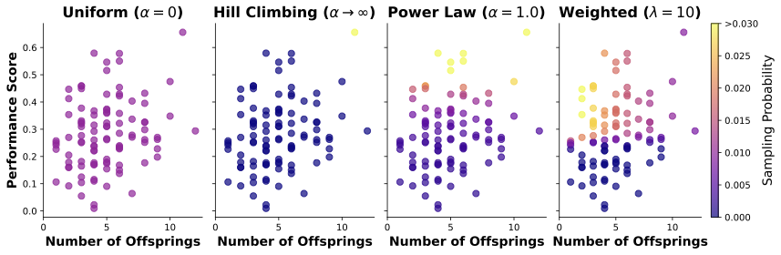
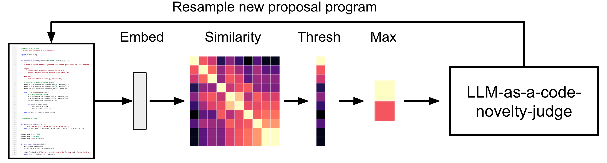
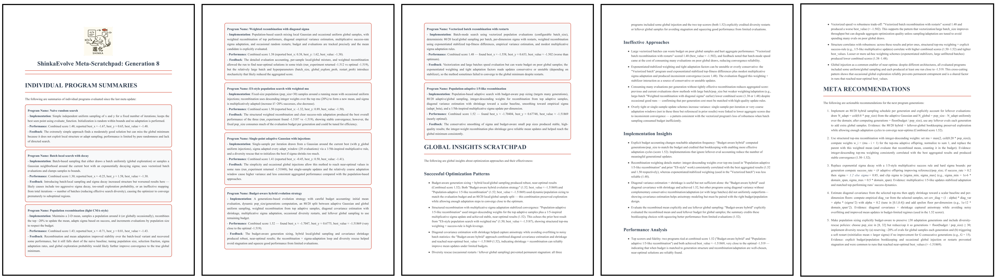
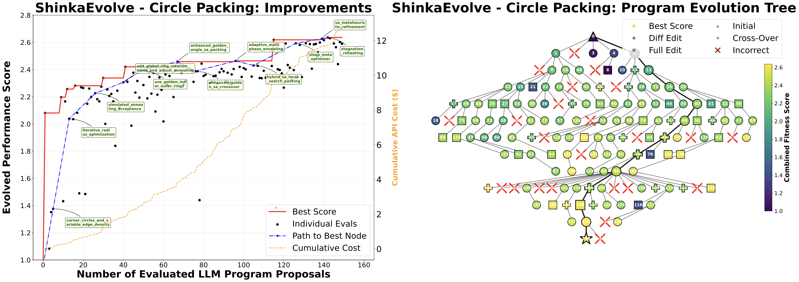
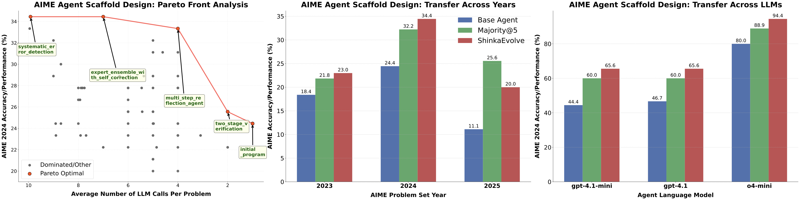
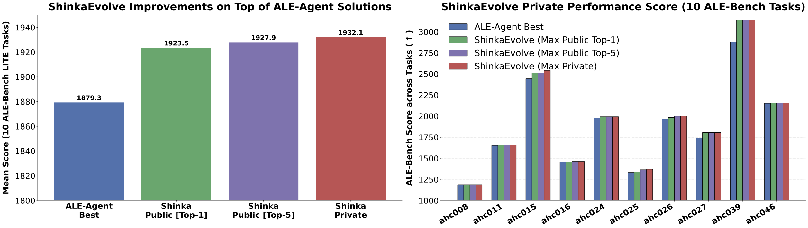
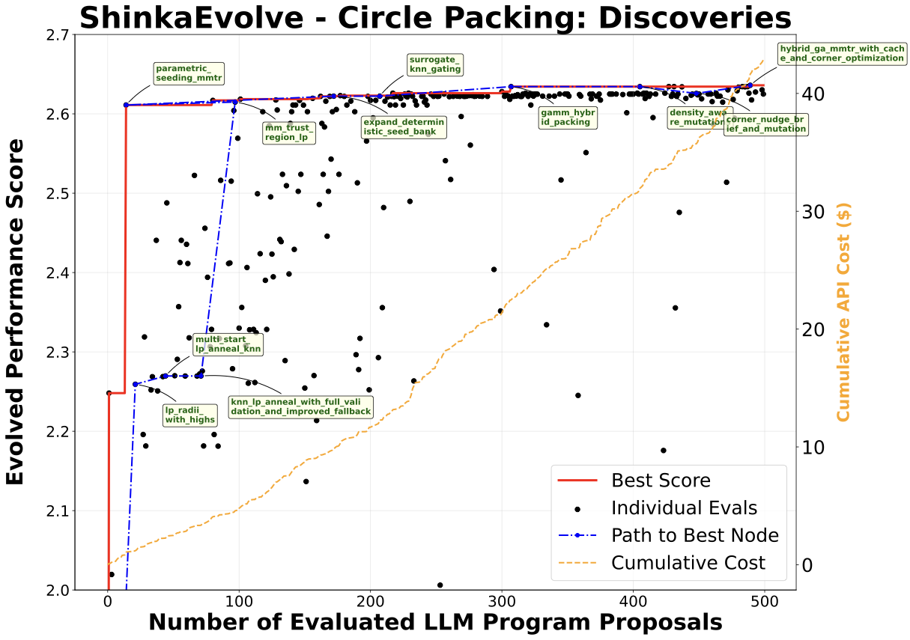
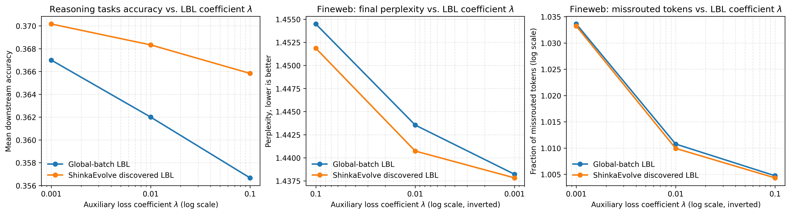

# Paper Assets

## Figure 1: fig:conceptual

Caption: High-level overview of . Left: The framework constructs an archive of evaluated programs, rejection-samples new programs, and evaluates their fitness. Right: provides a sample efficient alternative to AlphaEvolve and outperforms its Circle Packing solution.

## Figure 2: fig:parent_sampling

Caption: Parent Sampling. The strategies range from pure exploration (uniform sampling) to pure exploitation (hill-climbing) to a combination of performance and novelty.

## Figure 3: fig:novelty_rejection_sampling

Caption: Program Novelty Rejection Sampling. embeds mutable code snippets, computes similarities across the archive; if the maximal score exceeds a threshold, another LLM is queried to assess whether the program is meaningfully novel.

## Figure 4: fig:meta_scratchpad

Caption: A Meta-Scratchpad. It consists of individual program summaries, global insights, and implementation recommendations, which are appended to the mutation prompt.

## Figure 5: fig:results_circle_packing

Caption: on Circle Packing Task. Left: outperforms AlphaEvolve's solution within less than 150 program evaluations. Right: 's program evolution tree demonstrates the iterative composition of stepping stones into high-performing solutions.

## Figure 6: fig:results_aime

Caption: for Agent Scaffold Design. Left: discovers a Pareto frontier between performance and LLM query budget. Middle: The discovered scaffold generalizes to unseen AIME problems. Right: The scaffold improves performance regardless of the underlying LLM.

## Figure 7: fig:results_alebench

Caption: for Improving ALE-Bench solutions. Left: improves the solutions discovered by ALE-Agent by 2.3%. Right: On one task, ahc039, the solution improved from 5th to 2nd place submission on the AtCoder leaderboard if it had participated in the contest.

## Figure 8: fig:results_moe

Caption: for discovering Mixture-of-Experts Load Balancing Loss Functions. Left: Downstream task performance across seven benchmarks. Middle: Final perplexity across different missroute fractions. Right: Load imbalance gradient as a function of the token allocation.

## Figure 9: fig:ablations

Caption: Method Ablation Studies on Circle Packing. Left: Weighted parent sampling outperforms random search and hill climbing. Middle: Bandit-based LLM ensembling slightly improves the performance over a fixed uniform ensemble distribution. Right: Embedding-based rejection sampling with LLM as a novelty judge strongly outperforms no rejection sampling.

## Figure 10: fig:circle_packing_async

Caption: Circle packing asynchronous evolution results for exact circle packing verification showing convergence behavior and solution quality over time.

## Table 1: tab:hyperparams_circle

Caption: hyperparameter configuration for the Circle Packing task.

| Parameter | Value | Parameter | Value |
| --- | --- | --- | --- |
| 4lDatabase configuration |  |  |  |
| Archive size | 40 | Elite selection ratio | 0.3 |
| Archive inspirations | 4 | Top-k inspirations | 2 |
| Migration interval | 10 | Migration rate | 0.0 |
| Island elitism | true | Parent selection strategy | weighted |
| Parent selection | 10.0 | Number of islands | 2 |
| 4lEvolution configuration |  |  |  |
| Patch types | [diff, full, cross] | Patch type probs | [0.45, 0.45, 0.1] |
| Generations | 150 | Max parallel jobs | 5 |
| Max patch resamples | 3 | Max patch attempts | 3 |
| Meta recommendation interval | 10 | Max meta recommendations | 5 |
| Embedding model | text-embedding-3-small | Max novelty attempts | None |
| Code embed sim threshold | 0.95 | Problem implementation | Python |
| LLM dynamic selection | ucb1 | Exploration coefficient | 1.0 |
| 4lLLM models |  |  |  |
| gemini-2.5-pro | gemini-2.5-flash |  |  |
| claude-sonnet-4 | o4-mini |  |  |
| gpt-5 | gpt-4.1-nano |  |  |
| gpt-4.1 | gpt-4.1-mini |  |  |
| 4lLLM settings |  |  |  |
| Temperatures | [0.0, 0.5, 1.0] | Max tokens | 16,384 |
| Meta models | [gpt-5-nano] | Meta temperatures | [0.0] |
| Novelty models | [gpt-5-nano] | Novelty temperatures | [0.0] |

## Table 2: tab:hyperparams_aime

Caption: Hyperparameter Configuration for the Math Reasoning Agentic Harness.

| Parameter | Value | Parameter | Value |
| --- | --- | --- | --- |
| 4lDatabase configuration |  |  |  |
| Archive size | 40 | Elite selection ratio | 0.3 |
| Archive inspirations | 4 | Top-k inspirations | 2 |
| Migration interval | 10 | Migration rate | 0.1 |
| Island elitism | true | Parent selection strategy | weighted |
| Parent selection | 10.0 | Number of islands | 4 |
| 4lEvolution configuration |  |  |  |
| Patch types | [diff, full, cross] | Patch type probs | [0.6, 0.3, 0.1] |
| Generations | 75 | Max parallel jobs | 1 |
| Max patch resamples | 3 | Max patch attempts | 3 |
| Meta recommendation interval | 10 | Max meta recommendations | 5 |
| Embedding model | text-embedding-3-small | Max novelty attempts | 3 |
| Code embed sim threshold | 0.95 | Problem implementation | Python |
| LLM dynamic selection | null | Exploration coefficient | 0.0 |
| 4lLLM models |  |  |  |
| gemini-2.5-pro | gemini-2.5-flash |  |  |
| claude-sonnet-4 | o4-mini |  |  |
| gpt-5 | gpt-5-nano |  |  |
| gpt-4.1 | gpt-4.1-mini |  |  |
| 4lLLM settings |  |  |  |
| Temperatures | [0.0, 0.5, 1.0] | Max tokens | 16,384 |
| Meta models | [gpt-4.1] | Meta temperatures | [0.0] |
| Novelty models | [gpt-4.1] | Novelty temperatures | [0.0] |

## Table 3: tab:hyperparams_ale

Caption: Hyperparameter Configuration for the ALE-Bench Problems.

| Parameter | Value | Parameter | Value |
| --- | --- | --- | --- |
| 4lDatabase configuration |  |  |  |
| Archive size | 50 | Elite selection ratio | 0.3 |
| Archive inspirations | 2 | Top-k inspirations | 2 |
| Migration interval | 10 | Migration rate | 0.1 |
| Island elitism | true | Parent selection strategy | weighted |
| Parent selection | 10.0 | Number of islands | 2 |
| 4lEvolution configuration |  |  |  |
| Patch types | [diff, full, cross] | Patch type probs | [0.6, 0.3, 0.1] |
| Generations | 50 | Max parallel jobs | 1 |
| Max patch resamples | 3 | Max patch attempts | 3 |
| Meta recommendation interval | 5 | Max meta recommendations | 5 |
| Embedding model | None | Max novelty attempts | None |
| Code embed sim threshold | None | Problem implementation | C++ |
| LLM dynamic selection | ucb1 | Exploration coefficient | 1.0 |
| 4lLLM models |  |  |  |
| gemini-2.5-pro | gemini-2.5-flash |  |  |
| claude-sonnet-4 | o4-mini |  |  |
| gpt-5 | gpt-5-mini |  |  |
| gpt-4.1 | gpt-4.1-mini |  |  |
| 4lLLM settings |  |  |  |
| Temperatures | [0.0, 0.5, 1.0] | Max tokens | 16,384 |
| Meta models | [gpt-5-mini] | Meta temperatures | [0.0] |
| Novelty models | None | Novelty temperatures | None |

## Table 4: tab:moe_hparams

Caption: MoE architectures and training setup.

| Hyperparameter | Small MoE (evolution) | Large MoE (evaluation) |
| --- | --- | --- |
| 3lModel architecture |  |  |
| Model parameters | 556M | 2.7B |
| Model parameters | 82M | 404M |
| Number of experts (N_E) / active per token (K) | 64 / 8 | 64 / 8 |
| Hidden size | 512 | 1024 |
| Hidden size in each MoE expert | 384 | 768 |
| Number of hidden layers | 12 | 16 |
| Number of attention heads | 8 | 16 |
| Number of key--value heads | 8 | 8 |
| Head dimension | 128 | 128 |
| Attention bias | false | false |
| Attention dropout | 0.0 | 0.0 |
| Initializer range | 0.02 | 0.02 |
| RoPE | 1,000,000 | 1,000,000 |
| Tied word embeddings | true | true |
| Output router logits | true | true |
| Decoder sparse step | 1 | 1 |
| Router auxiliary loss coefficient () | 0.01 | 0.001, 0.01, 0.1 |
| Computation dtype | bfloat16 | bfloat16 |
| 3lTraining setup |  |  |
| Optimizer | AdamW | AdamW |
| Learning rate | 1.010^-3 | 3.010^-4 |
| Weight decay | 0.1 | 0.1 |
| Adam parameters (_1,_2,) | (0.9, 0.95, 1\!\!10^-8) | (0.9, 0.95, 1\!\!10^-8) |
| Learning rate scheduler | Cosine decay | Cosine decay |
| Warmup steps | 70 | 490 |
| Maximum sequence length | 1024 | 1024 |
| Global train batch size (sequences) | 1024 | 2048 |
| Tokens per training step | 1,048,576 | 2,097,152 |
| Maximum steps | 2000 | 14,000 |
| Total tokens | 2.10B | 29.36B |
| Dataset | fineweb | fineweb |

## Figure 11: fig:results_moe_app

Caption: Mixture-of-Experts LBL design additional results.

## Table 5: tab:hyperparams_moe

Caption: Hyperparameter Configuration for the MoE LBL Discovery.

| Parameter | Value | Parameter | Value |
| --- | --- | --- | --- |
| 4lDatabase configuration |  |  |  |
| Archive size | 20 | Elite selection ratio | 0.3 |
| Archive inspirations | 4 | Top-k inspirations | 2 |
| Migration interval | 10 | Migration rate | 0.1 |
| Island elitism | true | Parent selection strategy | weighted |
| Parent selection | 10.0 | Number of islands | 2 |
| 4lEvolution configuration |  |  |  |
| Patch types | [diff, full] | Patch type probs | [0.5, 0.5] |
| Generations | 20 | Max parallel jobs | 1 |
| Max patch resamples | 10 | Max patch attempts | 10 |
| Meta recommendation interval | 10 | Max meta recommendations | 5 |
| Embedding model | text-embedding-3-small | Max novelty attempts | 3 |
| Code embed sim threshold | 0.95 | Problem implementation | Python |
| LLM dynamic selection | ucb1 | Exploration coefficient | 1.0 |
| 4lLLM models |  |  |  |
| gemini-2.5-pro | gemini-2.5-flash |  |  |
| claude-sonnet-4 | o4-mini |  |  |
| gpt-5 | gpt-5-nano |  |  |
| gpt-4.1 | gpt-4.1-mini |  |  |
| 4lLLM settings |  |  |  |
| Temperatures | [0.0, 0.5, 1.0] | Max tokens | 16,384 |
| Meta models | [gpt-4.1] | Meta temperatures | [0.0] |
| Novelty models | [gpt-4.1] | Novelty temperatures | [0.0] |
