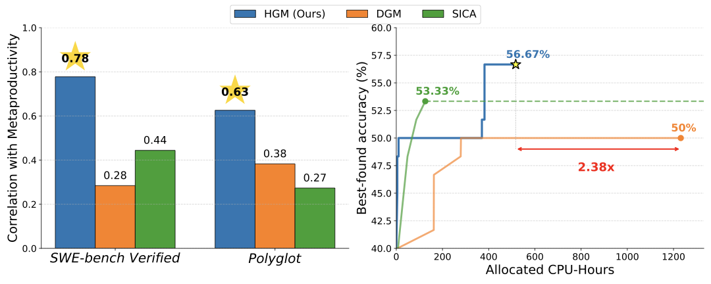

# Huxley-Gödel Machine: Human-Level Coding Agent Development by an Approximation of the Optimal Self-Improving Machine

Source: [arXiv:2510.21614](https://arxiv.org/abs/2510.21614) (v3, revised 29 October 2025; accessed 1 September 2026)

## Overview / Takeaway

Huxley-Gödel Machine (HGM) changes how self-modifying coding-agent trees are searched: it selects parents using the observed success of their whole descendant clades rather than the parent's current benchmark score. This targets a Metaproductivity–Performance Mismatch—the empirical finding that a strong agent need not produce strong descendants—while Thompson sampling and an adaptive expansion/evaluation schedule allocate a fixed budget across uncertain agents. Under restrictive assumptions, an oracle for true clade metaproductivity is sufficient to reproduce the Gödel Machine's accept/reject decisions; practical HGM estimates that oracle with aggregated benchmark outcomes and is not itself proven optimal. Across SWE-bench and Polyglot experiments, HGM reports better final agents with fewer allocated CPU-hours than Darwin Gödel Machine (DGM) and SICA, and its agent design transfers across both dataset and backbone changes, reaching 57.0% on standard SWE-bench Lite with GPT-5 versus 56.7% for the contemporary SWE-agent reference.

## 1. Introduction

1. **Self-improvement needs a criterion for choosing modifications**
Self-modifying agents can alter both their problem-solving code and how they make later modifications. The theoretical Gödel Machine accepts a rewrite only after proving that it improves expected long-term utility, but proof search is difficult to operationalize in modern coding agents.

2. **Immediate benchmark performance may be a poor proxy for future improvement**
DGM and SICA grow trees of coding-agent variants and preferentially expand agents with better software-engineering scores. HGM identifies the failure mode: a high-scoring parent may seed a stagnant lineage, while a weaker parent may generate much stronger descendants. The paper calls this the **Metaproductivity–Performance Mismatch (MPM)**.

3. **Clade-Metaproductivity shifts credit from nodes to lineages**
Inspired by a biological clade—a common ancestor and its descendants—Clade-Metaproductivity ($\mathrm{CMP}$) scores an agent through the downstream success of the subtree rooted at that agent. The target is not merely *what this agent solves now*, but *what continued self-modification from this agent can eventually produce*.

4. **HGM is an explicit change to the DGM/SICA search policy**
It retains the self-referential code-editing tree and execution-grounded task evaluations, but replaces parent selection based on immediate score with a clade-based estimate. It also separates the decision to create a child from the decision to evaluate an existing agent, enabling single agent–task evaluations and asynchronous execution.

5. **The headline evidence combines alignment, optimization, and transfer**
HGM's $\widehat{\mathrm{CMP}}$ correlates more strongly with retrospectively measured clade performance than DGM or SICA scores. Under 800-evaluation budgets it reaches 56.7% on SWE-Verified-60 and 30.5% on Polyglot, and a larger 8,000-evaluation run improves a 53.2% full SWE-bench Verified ancestor to 61.4%.

6. **“Human-level” refers to coding-agent design under a dated leaderboard comparison**
The phrase does not mean human-level general software engineering. It means the automatically designed scaffold, when paired with GPT-5, matches or narrowly exceeds the best officially checked human-engineered agent scaffold on standard SWE-bench Lite as of 24 October 2025: 57.0% versus 56.7%.

## 2. Self-Improvement as Tree-Search

1. **The archive is a rooted tree of executable coding agents**
Let $\mathcal{T}_t$ be the agent archive at iteration $t$, initialized as $\mathcal{T}_0=\{a_0\}$. Every modification creates a child of its selected parent, preserving ancestry and making the archive a search tree rather than an unstructured population.

2. **The action space contains modifications and evaluations**
At time $t$, the policy samples an action from

\[
\mathcal{A}_t=\mathcal{M}_t\cup V_t,
\qquad
\mathcal{M}_t=\{m_a:a\in\mathcal{T}_t\},
\qquad
V_t=\{v_a:a\in\mathcal{T}_t\}.
\]

Action $m_a$ asks agent $a$ to self-modify and appends the result as its child; action $v_a$ evaluates $a$ on one additional downstream task.

3. **The objective is final-agent quality under a finite search budget**
After the terminal iteration $B$, a policy-specific score selects one agent from the final tree. The search objective is

\[
J(\pi)=\mathbb{E}[U(a_{\mathrm{final}})],
\qquad
a_{\mathrm{final}}=\arg\max_{a\in\mathcal{T}_B}Score_\pi(a),
\]

where $U$ is the average binary success rate across downstream tasks. This is fixed-budget best-agent identification, not cumulative reward maximization during search.

4. **A compound policy contains three distinct decisions**
The **selection policy** chooses expansion or evaluation, the **expansion policy** selects a parent, and the **evaluation policy** selects an agent–task pair. Treating these separately exposes a control problem that DGM and SICA largely hard-code.

5. **DGM and SICA couple creation to immediate evaluation**
A newly generated child monopolizes the next evaluations even after repeated failures, while a promising older agent may remain under-tested. HGM can stop spending on the weak child and resume evaluating another node.

6. **The three systems instantiate materially different tree policies**
The exact settings and reported values make the relevant comparison concrete.

| Subpolicy | SICA | DGM | HGM |
|---|---|---|---|
| Select expansion vs. evaluation | Alternates | Alternates | Adapts using a widening condition |
| Choose parent to expand | Greedy best current performance; full history exposed | Probabilistic from evaluation score and child count | Thompson sampling from clade statistics |
| Choose agent to evaluate | Newest child on full evaluation set | Newest child on progressively larger subsets | Any eligible agent, one task at a time |

## 3. Huxley-Gödel Machine

1. **Global and clade metaproductivity separate two notions of long-term value**
Global Metaproductivity ($\mathrm{GMP}$) asks how expanding one agent affects the best final agent available anywhere in the archive. Clade-Metaproductivity ($\mathrm{CMP}$) localizes the same idea to descendants of that agent, making lineage evidence more operational.

2. **Practical HGM approximates an oracle rather than proving rewrites**
The theoretical argument concerns exact $\mathrm{CMP}$ under a specialized setting. The implemented system estimates it from partial binary task outcomes, uses that estimate for stochastic tree search, and inherits estimation error, benchmark noise, and evaluator bias.

### 3.1. Gödel Machine in the self-improving coding agent development setting

1. **The original Gödel Machine solves a broader and harder problem**
It searches for formal proofs that a code rewrite increases expected utility after accounting for proof-search time, rewrite computation, environmental change, and its single nonrepeatable lifetime. Once proven, a modification executes permanently.

2. **The paper's coding-agent setting removes several original complications**
Its theoretical result assumes:

- utility depends only on the agent selected at termination;
- agent–task trials are repeatable and independent of time or prior events;
- the proof process consumes no budget;
- each self-modification costs exactly one budget unit.

The appendix additionally makes the finite budget known, assumes a static benchmark and environment, and gives the prover full knowledge of the utility function.

3. **The specialized Gödel policy sees only a parent, child, and remaining budget**
It accepts or rejects the child in a partially observable Markov decision process, then creates another modification from the chosen parent. At termination, it can return only the final parent or current child in the proof construction used by the theorem.

4. **The theorem should not be read as a global optimality proof for HGM-Async**
The result is: under the stated assumptions, access to the **true**, policy-dependent $\mathrm{CMP}$ oracle suffices to implement Gödel-Machine accept/reject behavior. It does not prove that the empirical estimator equals true $\mathrm{CMP}$, that HGM's Thompson-sampling policy is optimal, or that real software development satisfies the assumptions.

### 3.2. Metaproductivity and Clade-Metaproductivity

1. **Global metaproductivity is an archive-level state–action value**
For policy $\pi$, current tree $\mathcal{T}$, and candidate parent $a$,

\[
\mathrm{GMP}_\pi(\mathcal{T},a)=
\mathbb{E}_{\mathcal{T}_B\sim p_\pi(\cdot\mid\mathcal{T},a)}
\left[
U\!\left(\arg\max_{a'\in\mathcal{T}_B}Score_\pi(a')\right)
\right].
\]

It is analogous to an RL $Q$-value whose state is the entire archive and whose action is the agent to expand. It can value a modification that first improves the ability to self-improve and only later raises task performance.

2. **Clade metaproductivity restricts final selection to one lineage**
Let $C(\mathcal{T}_B,a)$ be the subtree rooted at $a$. Then

\[
\mathrm{CMP}_\pi(\mathcal{T},a)=
\mathbb{E}_{\mathcal{T}_B\sim p_\pi(\cdot\mid\mathcal{T},a)}
\left[
U\!\left(\arg\max_{a'\in C(\mathcal{T}_B,a)}Score_\pi(a')\right)
\right].
\]

If $Score=U$, this becomes the expected maximum utility attainable in the future clade. Unlike current node accuracy, it contains non-greedy information about later descendants.

3. **The proof equates specialized CMP with the Gödel POMDP's action value**
Because only the accepted lineage remains reachable and terminal selection is restricted to the final parent or child, the appendix shows $\mathrm{CMP}_\pi=Q_\pi$ for that construction. Selecting the larger exact value then supplies the accept/reject decision that a proof would certify.

4. **The practical estimator is an evaluation-weighted clade mean**
For each agent, aggregate success and failure counts over its current clade:

\[
n^C_{\mathrm{success}}(a)=\sum_{a'\in C(a)}n_{\mathrm{success}}(a'),
\qquad
n^C_{\mathrm{failure}}(a)=\sum_{a'\in C(a)}n_{\mathrm{failure}}(a').
\]

HGM estimates

\[
\widehat{\mathrm{CMP}}(a)=
\frac{n^C_{\mathrm{success}}(a)}
{n^C_{\mathrm{success}}(a)+n^C_{\mathrm{failure}}(a)}.
\]

This is not an estimator of an expected maximum without further assumptions; it is a weighted mean over observed descendants. The evaluation policy preferentially samples strong agents, which the authors intend to make that mean behave like a soft maximum.

5. **Clade aggregation improves sample reuse but creates shared evidence**
Every descendant evaluation updates all ancestors, giving higher-level nodes many more samples than an isolated node receives. This can reduce variance under partial evaluation, but related ancestors' estimates are statistically dependent and prolific clades can dominate the evidence.

### 3.3. Algorithm

#### Expansion policy

1. **Thompson sampling turns clade counts into a stochastic parent choice**
HGM samples a Beta posterior-like score for every candidate parent and chooses the maximum. With an increasing concentration scheduler $\tau$,

\[
a^*\sim TS\!\left(
\left\{
\bigl(\tau(1+n^C_{\mathrm{success}}(a)),
\tau(1+n^C_{\mathrm{failure}}(a))\bigr)
:a\in\mathcal{T}_t
\right\}
\right).
\]

Early sampling remains diffuse; later sampling polarizes toward the estimated strongest clades.

#### Evaluation policy

1. **Agent-level Thompson sampling approximates a soft maximum within each clade**
Evaluation uses each agent's own success/failure counts rather than its ancestors' aggregate counts. Favoring high-performing agents causes their observations to receive more weight in ancestral $\widehat{\mathrm{CMP}}$, intentionally shifting the clade average toward its best members.

2. **Evaluation granularity is one agent–task pair**
This permits early stopping and reallocation after poor outcomes. It is a key operational difference from SICA's full-dataset evaluation and DGM's progressive evaluation of the most recently created child.

#### Selection policy

1. **An infinite-armed-bandit rule decides when to create a new agent**
Evaluations sample known “arms,” while expansions introduce new arms. Following UCB-Air, HGM expands when

\[
N_t^\alpha\ge |\mathcal{T}_t|,
\]

where $N_t$ is the number of completed evaluations, $|\mathcal{T}_t|$ is the number of agents, and $\alpha\in[0,1]$ controls tree widening. Otherwise it evaluates an existing agent.

#### Final agent selection strategy

1. **The returned agent maximizes a posterior belief criterion**
At budget exhaustion, HGM returns

\[
\arg\max_{a\in\mathcal{T}_B}
I_\epsilon\!\left(1+n_{\mathrm{success}}(a),1+n_{\mathrm{failure}}(a)\right),
\]

described as the agent with the highest $\epsilon$ percentile of its utility posterior. The experiments set $\epsilon=1$. The text calls $I$ the regularized incomplete beta function, although a percentile normally requires its inverse; this notation/implementation boundary is not fully clarified in the paper.

#### Asynchronous implementation

1. **HGM-Async fills every available CPU slot**
Each CPU runs one expansion or evaluation; as soon as it finishes, another starts from the latest shared state. Selection accounts for outstanding expansion and evaluation jobs so already committed resources are not ignored.

2. **Decoupling enables both parallelism and better allocation**
HGM's efficiency gain is not isolated to $\mathrm{CMP}$. It also comes from asynchronous scheduling and single-task evaluation, so the experiments do not separately attribute accuracy and CPU-hour improvements to the estimator versus the execution architecture.

## 4. Experimental Results

1. **Three questions structure the evaluation**
The experiments ask whether $\widehat{\mathrm{CMP}}$ predicts future clade quality, whether HGM produces better agents than DGM/SICA under matched evaluation budgets, and whether an HGM-designed agent competes with human-engineered scaffolds after dataset and model transfer.

2. **The datasets are SWE-bench Verified, SWE-bench Lite, and Polyglot**
SWE-Verified-60 is the 60-task subset used by the first two stages of DGM progressive evaluation; full SWE-bench Verified contains 500 tasks. SWE-bench Lite contains 300 tasks, 93 overlapping with Verified. Polyglot follows DGM's setting, hiding private tests and their outcomes from agents.

3. **The fixed HGM hyperparameters are disclosed**
Every HGM experiment uses HGM-Async, scheduler $\tau=B/b$ for total budget $B$ and remaining budget $b$, final-selection parameter $\epsilon=1$, and widening exponent $\alpha=0.6$.

4. **Baseline comparisons reuse DGM's initial agent**
HGM, DGM, and SICA start from the same official-DGM-derived ancestor for controlled tests. This makes DGM a direct implementation lineage as well as an experimental comparator.

### 4.1. Metaproductivity-Performance Mismatch

1. **Empirical CMP is reconstructed after the search tree is complete**
For each node, the target is the maximum observed mean accuracy among descendants, excluding the node itself. It therefore measures realized descendant quality in the particular sampled tree, not the counterfactual expected quality of all possible future clades.

2. **Leakage controls remove the target-producing branch from HGM's predictor**
When correlating $\widehat{\mathrm{CMP}}$ with empirical $\mathrm{CMP}$, the calculation excludes the evaluated node and the direct-child subtree containing the empirical maximum. This prevents the predictor from directly reusing the outcome that defines its target.

3. **HGM's estimator has the strongest reported correlations**
The exact settings and reported values make the relevant comparison concrete.

| Estimator | SWE-Verified-60 weighted | SWE-Verified-60 unweighted | Polyglot weighted | Polyglot unweighted |
|---|---:|---:|---:|---:|
| SICA node score | 0.444 | 0.444 | 0.274 | 0.274 |
| DGM node score | 0.285 | 0.406 | 0.383 | 0.357 |
| **HGM $\widehat{\mathrm{CMP}}$** | **0.778** | **0.512** | **0.626** | **0.873** |

Weighted Pearson correlations weight each prediction by how many evaluations it accessed. HGM improves weighted correlation by 0.334 over SICA on SWE-Verified-60 and by 0.243 over DGM on Polyglot.

4. **The source contains a numerical inconsistency**
Table 1 reports HGM's unweighted Polyglot correlation as **0.873**, while the surrounding prose says **0.8783**. The report retains the tabulated value because it is also the value extracted from the rendered table; the discrepancy should be resolved from code or raw outputs before reuse.

5. **Correlation supports the mismatch claim but is not causal evidence**
All targets are derived from search trees produced by the methods themselves, node observations are dependent through ancestry, and the paper reports no confidence intervals or repeated-run variability for the correlations. The result shows association within realized trees, not that the estimator alone causes better search.

### 4.2. Evaluating HGM self-improving capability

1. **The comparison fixes 800 benchmark task evaluations**
SWE-Verified uses GPT-5 for expansion and GPT-5-mini for task evaluation. Polyglot uses Qwen3-Coder-480B-A35B-Instruct for expansion and Qwen3-Coder-30B-A3B-Instruct for evaluation. All methods start at 40.0% on SWE-Verified-60 and 20.3% on Polyglot.

2. **HGM has the best final accuracy in both settings**
The exact settings and reported values make the relevant comparison concrete.

| Method | SWE-Verified-60 accuracy | SWE-Verified-60 allocated CPU-hours | Polyglot accuracy | Polyglot allocated CPU-hours |
|---|---:|---:|---:|---:|
| SICA | 50.0% (+10.0) | Did not complete; infinite loop | 25.4% (+5.1) | 572 |
| DGM | 53.3% (+13.3) | 1,231 | 27.1% (+6.8) | 2,385 |
| **HGM** | **56.7% (+16.7)** | **517** | **30.5% (+10.2)** | **347** |

3. **The CPU-hour ratios are large but combine algorithmic and systems changes**
HGM uses 2.38 times fewer allocated CPU-hours than DGM on SWE-Verified-60. On Polyglot it uses 6.86 times fewer than DGM and 1.65 times fewer than SICA. These gains reflect $\mathrm{CMP}$-guided allocation, single-task evaluation, and asynchronous execution together.

4. **SICA fails before the SWE-Verified budget is exhausted**
After 360 of 800 evaluations—45% of the budget—SICA repeatedly hits an LLM context-window-length error and stops making modifications. Its 50.0% score is therefore not a completed equal-budget result, and no finite 800-evaluation CPU-hour comparison with HGM is available for that setting.

5. **Only final best-belief outcomes are reported**
The paper does not give multiple independent search seeds, confidence intervals, or distributions over final agents. Software tasks are numerous, but tree-search stochasticity and LLM sampling variability are not separately quantified.

### 4.3. HGM vs. humans: on coding agents design

#### 4.3.1. Optimization on full SWE-bench Verified

1. **The full run scales to 500 tasks and 8,000 evaluations**
The starting scaffold is strengthened to 53.2% and each self-modification or task execution can run up to five hours. Removing the file-editing tool leaves only bash, intentionally minimizing initial scaffolding bias.

2. **HGM improves the full benchmark by 8.2 percentage points**
The selected agent solves 61.4% of SWE-bench Verified, becoming the highest-scoring checked GPT-5-mini system reported by the paper and entering the top ten checked submissions across all backbones at that time.

3. **The human comparison is model- and date-conditioned**
The strongest claim is competitive scaffold design under the same GPT-5-mini backbone. Systems using models such as Claude 3.7 may cost five times more, and the paper explicitly cautions that leaderboard scores can reflect benchmark overfitting by either human- or machine-designed agents.

#### 4.3.2. Generalization to SWE-bench Lite

1. **A filtered split removes all 93 overlapping tasks**
The filtered evaluation contains 207 unseen tasks; the standard evaluation retains all 300 tasks to match the official leaderboard protocol. This distinguishes dataset transfer from direct leaderboard comparability.

2. **The evolved GPT-5-mini scaffold improves over its ancestor and matched-backbone SWE-agent**
The exact settings and reported values make the relevant comparison concrete.

| Agent with GPT-5-mini | Filtered Lite | Standard Lite |
|---|---:|---:|
| HGM initial ancestor | 34.8% | 44.0% |
| SWE-agent | 39.6% | 47.6% |
| **HGM best-belief agent** | **40.1%** | **49.0%** |

The HGM design gains 5.3 points on unseen tasks and 5.0 points on the standard set over its ancestor. Against the locally adapted SWE-agent baseline, its margins are 0.5 and 1.4 points.

3. **The matched-backbone SWE-agent result is local, not an officially checked submission**
No checked GPT-5-mini SWE-bench Lite submission existed at the time. The authors replace Claude 4 Sonnet in the leading SWE-agent configuration with GPT-5-mini and run it locally, so this comparison does not have the same verification status as leaderboard entries.

4. **The scaffold transfers from GPT-5-mini to GPT-5**
The exact settings and reported values make the relevant comparison concrete.

| Agent with GPT-5 | Filtered Lite | Standard Lite |
|---|---:|---:|
| SWE-agent leaderboard reference | **48.3%** | 56.7% |
| HGM best-belief scaffold | 47.8% | **57.0%** |

On the 207-task filtered set, HGM is one task behind; on the full standard set, it is one task ahead. This is the evidence for “human-level coding agent design”: parity within one task against the best officially checked human-engineered scaffold at publication time.

5. **Transfer reduces but does not eliminate overfitting concerns**
The filtered gain shows improvement on tasks absent from the optimization set, and the GPT-5 result shows model transfer. Both evaluations still use SWE-bench repositories and issue-resolution conventions, so broader software-engineering generalization remains untested.

## 5. Related Works

1. **The theoretical lineage runs from self-referential learning to the Gödel Machine**
Early self-referential systems, the Success-Story Algorithm, and Fitness-Monotonic Execution preserve modifications associated with higher long-term reward or ancestral performance. The Gödel Machine supplies the idealized proof-based, globally optimal accept/reject mechanism that HGM approximates only in its restricted coding-agent setting.

2. **STOP and Gödel Agent precede repository-level self-modification**
These systems explore agents modifying their own scaffolding. DGM and SICA then operationalize self-modification as full software-engineering projects whose repositories are edited and execution-tested.

3. **DGM is HGM's closest direct systems predecessor**
HGM adopts DGM's tree-of-agents framing, official initial scaffold, progressive-evaluation benchmark subset, and baseline setup. It directly changes DGM's selection assumption: parent task score is replaced by descendant-clade evidence, evaluation is no longer tied to the newest child, and expansion/evaluation scheduling becomes adaptive.

4. **Bandit and tree-search literature explains the compound allocation problem**
Fixed-budget best-arm methods assume known arms; Monte Carlo Tree Search usually targets cumulative reward; infinite-armed bandits admit new arms but often ignore ancestry. HGM combines these motifs for a finite-budget final-choice objective over an expanding, hierarchically related set of noisy agents.

## 6. Conclusion

1. **The main conceptual result is to optimize evolvability rather than current fitness**
A node is useful if its lineage yields better agents, even when the node itself is modest. This corrects a greedy bias in score-based tree expansion and suggests that archive ancestry is a source of predictive information.

2. **The practical contribution is a coupled estimator and scheduler**
HGM combines clade aggregation, Thompson-sampled expansion, performance-focused evaluation, adaptive tree widening, posterior final selection, and asynchronous parallel execution. Reported gains cannot be assigned to any one component because no ablation separates them.

3. **The strongest evidence is transfer under matched scaffold comparison**
The evolved design improves unseen SWE-bench Lite tasks with GPT-5-mini and remains competitive after swapping to GPT-5. This supports design transfer, while the narrow margins and shared benchmark family counsel against broader claims of general coding intelligence.

## Appendix A. Gödel Machine with CMP oracle

1. **The appendix adds assumptions beyond the main theorem statement**
The environment and metric are static, evaluations reset independently, the prover knows the utility function, the finite budget is known, proofs are free, and every self-modification has unit cost. Evaluation actions are removed from the theoretical action space because the utility function is assumed known.

2. **The Gödel POMDP uses accept/reject transitions**
Its state includes the full tree, special parent and child agents, and remaining budget; observations expose only parent, child, and budget. Accept selects the child as next parent, reject keeps the parent, and each transition generates one new child.

3. **Terminal scoring is deliberately restrictive**
The score is an indicator choosing exactly one of the final observed parent or child, even though the state contains a larger tree. This makes earlier branches unreachable and is necessary for the clade value to collapse to the policy $Q$-value.

4. **The proof is an equivalence under construction, not an estimator guarantee**
With unreachable nonaccepted branches and restricted terminal choice, exact $\mathrm{CMP}_\pi$ equals $Q_\pi$. Comparing exact action values simulates the proof-backed decision and yields Bellman optimality. Nothing in the appendix bounds the error of $\widehat{\mathrm{CMP}}$ or shows HGM-Async converges to that oracle.

## Appendix B. Algorithm

1. **HGM alternates through a widening inequality rather than a fixed sequence**
If $|\mathcal{T}|\le n^\alpha$ and expandable parents exist, it samples clade-level Beta scores and creates a child; otherwise it samples agent-level Beta scores and evaluates one remaining task. Each outcome updates the agent and every ancestor's clade counts.

2. **Five parallel root expansions reduce startup bias**
In asynchronous execution, evaluations could otherwise concentrate on whichever early expansion finishes first, because later candidates do not yet exist. The implementation initializes five modifications of the root in parallel.

3. **Variable task duration creates an evaluation bias**
Easy tasks finish earlier, so agents with fewer completed evaluations can temporarily appear stronger. Many agents pass their first ten tasks and then decline as harder evaluations arrive; the authors say this bias is barely observed beyond 50 evaluations.

4. **The algorithm does not specify several reproducibility-critical details**
The paper omits the number of CPU slots, task-order randomization, Thompson-sampling tie handling, synchronization semantics, failure retries, and the concrete expansion prompt from the algorithm listing.

## Appendix C. Experimental details

### C.1. Initial agents

1. **The controlled ancestor is a minimal tool-using loop**
The DGM-derived agent repeatedly queries an LLM with two tools: file editing and bash execution. Minor changes add API compatibility, timeouts, and an interaction-length limit; each execution has a one-hour timeout.

2. **Dataset-specific ancestors differ in test tooling**
The Polyglot version adds commands for several programming languages. The SWE-bench version adds functions that summarize existing tests and run them with a generated report.

3. **The full-benchmark ancestor removes direct file editing**
For the human-design comparison, only bash remains so the starting scaffold imposes less inductive bias. Self-modification and task evaluation timeouts both rise to five hours.

### C.2. Other details

1. **Polyglot expansion uses a mixed-quantized model**
The exact expansion backbone is an AutoRound-generated mixed int4/int8 Qwen3-Coder-480B-A35B-Instruct; evaluation uses Qwen3-Coder-30B-A3B-Instruct.

2. **The aggregate experimental spend is approximately \$5,000**
This covers all three methods, but the paper does not break cost down by dataset, model calls, expansions, evaluations, or failed runs.

## Appendix D. Empirical CMP and its estimation

1. **The retrospective target is the best descendant's observed success rate**
The formal definition takes the maximum empirical success rate over every proper descendant of the ancestor.

\[
\mathrm{CMP}_{\mathrm{emp}}(a)=
\max_{a'\in C(a)\setminus\{a\}}
\frac{n_{\mathrm{success}}(a')}
{n_{\mathrm{success}}(a')+n_{\mathrm{failure}}(a')}.
\]

This excludes the ancestor itself but favors clades that received enough search effort to discover a high-scoring descendant.

2. **The leakage-controlled HGM predictor removes two sources**
It subtracts the evaluated ancestor's counts and the aggregate counts of child branch $b^*$ containing the empirical maximum from the numerator and denominator. SICA and DGM use the ancestor's benchmark performance as their corresponding predictors.

3. **The appendix formula appears to contain a selection-ratio irregularity**
The definition of $b^*$ identifies the maximum using $n_{\mathrm{success}}(n)/n_{\mathrm{failure}}(n)$ rather than the empirical mean used in the target. This is monotone-equivalent when failures are positive, but undefined for a zero-failure agent unless implementation smoothing is applied; no convention is stated.

## Appendix E. Baselines

1. **SICA is the greedy full-evaluation extreme**
It expands the current best agent with full history and evaluates every new child on the complete dataset, making it expensive and vulnerable to context growth.

2. **DGM supplies probabilistic lineage search with progressive child evaluation**
It considers node score and child count when sampling parents, then evaluates the latest child on progressively larger task subsets. HGM's methodological extension changes the selection criterion from current-node performance to clade statistics and permits returning evaluation attention to older nodes.

## Appendix F. Discovered agents

1. **One descendant implements iterative refinement inside one expansion**
Instead of producing only one modification per instruction, it performs multiple incremental self-modifications. The authors interpret this as self-initiated meta-improvement, although the appendix offers a qualitative code example rather than an evaluation isolating its benefit.

2. **Nested diff files become a lineage record and an interpretability problem**
Agents often edit a constant-named diff file; later edits to that file produce nested `+` and `-` markers describing modifications of modifications. The structure exposes long-range influence between rewrites but becomes difficult for humans to parse, underscoring the need for lineage-aware visualization and audit tools.

## Limitations, failure cases, and cautions

1. **The theoretical guarantee depends on an unavailable exact oracle**
True $\mathrm{CMP}$ requires expectations over future search trajectories. HGM substitutes an observed clade average whose bias and variance are not bounded, so “approximation of the optimal self-improving machine” is motivational rather than a proven property of the implemented algorithm.

2. **The assumptions exclude central costs of real self-improvement**
Proofs are free, modifications cost equally, utility is known, trials reset, the environment is static, and only terminal performance matters. Real coding systems have heterogeneous generation/evaluation costs, changing tools and dependencies, stateful failures, and safety consequences before termination.

3. **The evaluation lacks stochastic-search replication and component ablations**
No independent-run distributions or confidence intervals are given, and $\mathrm{CMP}$ selection is not isolated from asynchronous scheduling, single-task evaluation, adaptive widening, or final posterior selection.

4. **Empirical CMP is endogenous to the explored tree**
A clade looks productive only through descendants the policy chose to create and evaluate. Larger or more favored clades have more chances to realize an extreme score, so retrospective maximum performance is not an unbiased ground truth for latent evolvability.

5. **One baseline fails operationally**
SICA enters repeated context-window errors after 360 SWE-Verified-60 evaluations. This is a meaningful robustness failure but prevents a clean completed equal-budget comparison.

6. **The “human-level” margin is one task and benchmark-specific**
With GPT-5, HGM scores 57.0% versus 56.7% on the 300-task standard set and 47.8% versus 48.3% on the 207-task filtered set. It establishes parity with one human-designed scaffold under one publication-date snapshot, not a general human baseline.

7. **Several result-reporting details are inconsistent or ambiguous**
Table 1's 0.873 conflicts with prose's 0.8783; the final-selection function is described as a percentile but named as a regularized incomplete beta; allocated CPU-hours are sometimes discussed as wall-clock speed; and no uncertainty accompanies near-tied accuracies.

8. **Safety and security are not evaluated**
Agents receive bash access and rewrite agent code, yet the paper gives no threat model, sandbox description, secret isolation, adversarial-task analysis, rollback protocol, or audit of harmful self-modifications.

## Open questions

1. **Can metaproductivity be estimated without policy-induced target bias?**
Off-policy evaluation, matched subtree budgets, or randomized parent allocation could separate inherent lineage potential from search attention.

2. **Does CMP outperform node performance when systems effects are controlled?**
A factorial ablation should hold asynchrony, widening, evaluation granularity, final selection, prompts, and compute fixed while changing only the expansion score.

3. **What estimator best matches the expected future maximum?**
The current weighted mean is only encouraged to act like a soft maximum. Hierarchical Bayesian models, value learning over tree states, extreme-value estimators, or learned descendant-return predictors may better target the formal $\mathrm{CMP}$ definition.

4. **How robust are the findings across independent searches?**
Repeated trees with confidence intervals on final accuracy, CPU-hours, correlation, and lineage diversity are needed to distinguish persistent improvements from LLM and task-sampling variance.

5. **How should heterogeneous costs enter the policy?**
Expansion, easy tasks, hard tasks, and different agents have unequal runtimes and token costs. A cost-aware value-of-information objective could optimize quality per dollar, CPU-hour, or elapsed hour rather than counting evaluations.

6. **Can metaproductivity transfer beyond one benchmark family?**
The Lite split tests unseen issues but remains within SWE-bench. Evaluation on unrelated repositories, languages, long-horizon development, security repair, and interactive user tasks would test whether the scaffold truly generalizes.

7. **How can self-modification remain auditable?**
Nested diffs already challenge human interpretation. Structured provenance, semantic change summaries, invariant checks, and ancestry-aware rollback are prerequisites for safe deeper trees.

8. **Can the Gödel-Machine connection survive realistic assumptions?**
The next theoretical step is to include costly reasoning, nonrepeatable and changing environments, intermediate rewards and harms, imperfect utility knowledge, and unequal modification costs without reducing the guarantee to an inaccessible value oracle.
