# Live-SWE-agent: Can Software Engineering Agents Self-Evolve on the Fly?

**Source:** [arXiv:2511.13646v3](https://arxiv.org/abs/2511.13646)  
**Authors:** Chunqiu Steven Xia, Zhe Wang, Yan Yang, Yuxiang Wei, and Lingming Zhang  
**Latest revision read:** v3, 24 November 2025

## Overview / Takeaway

Live-SWE-agent augments a minimal bash-only coding agent with the ability to write, revise, and execute arbitrary Python helper tools while it is solving one software issue. A tool-creation instruction in the initial prompt and a reflection reminder after every environment response turn tool synthesis into an ordinary runtime action, requiring no separate offline search phase or model update. With one patch attempt per issue, the system reports 77.4% resolved on SWE-bench Verified using Gemini 3 Pro and 45.8% on SWE-Bench Pro using Claude 4.5 Sonnet; its strongest component result is 76.0% versus 62.0% without tool creation on a 50-task Verified subset. The term “self-evolution” should be read narrowly: the current implementation creates ephemeral per-task tool scripts while leaving the underlying loop unchanged, and persistence across tasks or rewriting prompts and workflows is explicitly future work.

## 1. Introduction

1. **Fixed action spaces constrain otherwise capable coding models**
Software-engineering agents commonly wrap an LLM with a terminal, editor, search commands, and a handcrafted loop. The model may choose actions autonomously, but the human designer fixes which actions exist before the issue is seen.

2. **Manual scaffold design explores an effectively unbounded space poorly**
Choosing tools, prompts, context policies, error messages, and workflows is costly, and a globally useful scaffold may still be mismatched to an individual repository or issue. Workflow-oriented systems simplify the loop, but their stages and interfaces also remain predetermined.

3. **Offline self-improvement solves a different adaptation problem**
Self-Improving Coding Agent, Darwin Gödel Machine, and Huxley-Gödel Machine evaluate scaffold changes on benchmark tasks before deployment. The resulting scaffold is then static at task time, and the search can require hundreds or thousands of hours; the paper highlights DGM’s reported approximately \$22,000 run cost.

4. **The proposed alternative moves adaptation inside the issue-solving trajectory**
Live-SWE-agent starts from mini-SWE-agent’s roughly 100-line, bash-only loop. As the issue reveals its own requirements, the same task-solving model can create and use a script that packages a useful operation.

5. **Runtime tool synthesis changes the available action space per task**
A generated editor, search utility, binary-format analyzer, or repository-specific checker becomes callable during the current trajectory. The agent can revise the tool after observing that its first implementation or interface is insufficient.

6. **The method adds reminders rather than a new optimizer**
The initial prompt explains how and why to create Python tools, and each environment response is followed by a reflection request asking whether a new tool would help. There is no population, archive, learned controller, weight update, or benchmark-fitness selection inside the method.

7. **The paper claims no offline cost, not zero runtime cost**
Tool creation consumes tokens, commands, and execution time during the issue. On full Verified, the additional average monetary cost ranges from a \$0.01 saving with GPT-5 to increases of \$0.01 with GPT-5-Mini, \$0.12 with Claude 4.5 Sonnet, and \$0.02 with Gemini 3 Pro.

8. **The headline setting excludes test-time scaling**
Each issue receives one trajectory and one submitted patch. The 77.4% Verified and 45.8% Pro scores therefore do not aggregate several independent samples, candidate patches, or model-voting passes.

9. **The strongest result is model-dependent**
Gemini 3 Pro supplies the 77.4% Verified headline, while Claude 4.5 Sonnet supplies the 45.8% Pro result. A six-model ablation later shows that tool synthesis can hurt weaker models severely, so “model agnostic” describes interface compatibility rather than uniformly positive performance.

10. **The current artifact is task-local rather than continually accumulated**
Tools persist within an issue’s shell environment and transcript, but are discarded after the task in the reported implementation. The discussion proposes saving tools and insights for later tasks, confirming that cross-task continual evolution is not evaluated here.

The paper’s opening result figure compares single-attempt systems and establishes the leaderboard context at the time of writing.

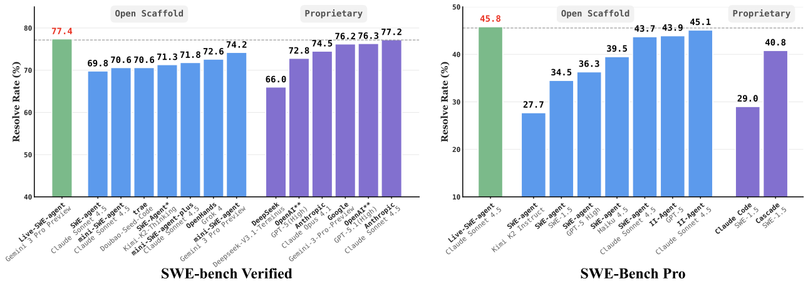

## 2. Approach

1. **Inputs are the repository and issue description**
The base agent receives the project codebase, the requested change, its initial instructions, and bash access. It can inspect files, run tests, edit code through shell commands, or create a helper program.

2. **Every step exposes two conceptual choices**
The model can issue an ordinary command, including invoking an existing tool, or write a custom Python script that expands its effective action repertoire. Both are expressed through the same one-command shell interface.

3. **A custom tool is simply an executable script**
There is no function-registration API or schema-learning stage. The model writes a file with command-line arguments and informative output, then calls it with `python` like any other program in the environment.

4. **Environment feedback drives both debugging and tool revision**
The return code and command output return to the model. The augmented feedback also requests reflection on whether a tool could make the next steps more reliable or efficient.

5. **The loop stops at ordinary patch submission**
Tool creation is interleaved with repository understanding, implementation, and testing until the agent submits its patch. Tools are means to solve the original issue, not independently scored deliverables.

6. **The overview reveals the narrow mutable boundary**
New files under the working environment are mutable; the mini-SWE-agent orchestration remains fixed. The paper motivates future prompt and workflow rewriting, but the evaluated algorithm does not perform it.

Figure 2 shows the full six-stage runtime loop and makes tool creation a peer of ordinary command execution.

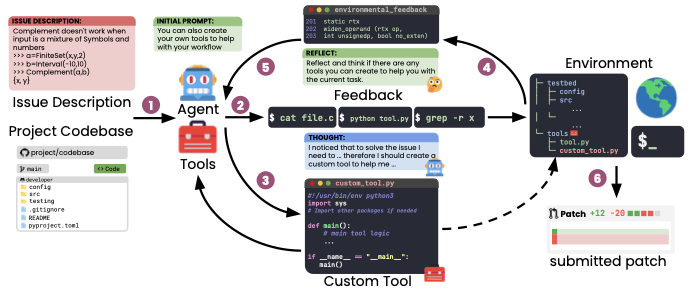

### 2.1 On-the-fly Self Evolution

1. **Two initial-prompt rules define the intended tool objective**
Created tools should improve progress on the software task, and they may be specific to the current issue rather than reusable. The prompt also requires Python, command-line execution, and useful success or error messages.

2. **The prompt explicitly asks for at least an editing tool**
This instruction means creation is not wholly emergent: the agent is directed to construct a simple general editor instead of relying only on bash. The remaining tool choices and implementations are generated from task context.

3. **Reflection is appended after every command response**
The model is reminded to examine its trajectory and decide whether creating a tool would help. This converts tool consideration from a one-time plan into a repeated decision as understanding changes.

4. **Reflection is motivational rather than evaluative**
No verifier tests whether a proposed tool is generally useful or selects among alternative tools. Utility is inferred indirectly from whether the agent later solves the issue, and malformed or distracting tools can consume the trajectory budget.

5. **Runtime creation supports iterative repair**
A tool can be executed, expose an implementation or interface problem, and then be edited during the same task. This is the concrete continuous element of the current system.

6. **The regular agent loop is unchanged**
The paper emphasizes that it does not impose a workflow, add an offline training phase, or rewrite orchestration. The same model–command–feedback protocol runs with modified prompt content.

7. **“Self” refers to one model acting on its own usable environment**
The task agent writes software that extends what it can do next. There is no separate meta-agent, but the generated helper is outside the persistent scaffold source and does not change model weights.

8. **Generality follows from a low-integration interface**
Any shell-capable scaffold can in principle adopt the instructions because tools are plain scripts. Empirical generality is shown across several LLM backends and three SWE-style benchmarks, not across fundamentally different agent architectures.

### 2.2 Custom Tool Synthesis

1. **Scripts reduce complex shell compositions to stable interfaces**
A repeated chain of `find`, `grep`, context extraction, exclusions, and result truncation can become one command with a small argument set. This reduces the number of reasoning turns and the risk of inconsistent flags.

2. **Informative errors are a capability improvement**
The example editor warns when replacement text is absent. A raw `sed` invocation can return success while changing nothing, causing the model to reason from a false assumption.

3. **The editor supports replacement, insertion, and deletion**
The generated script accepts an operation description, performs localized changes, and returns explicit success or failure information. It is both more constrained and more legible to the model than arbitrary shell editing.

Figure 3a shows the generated editing interface and its explicit missing-match warning.

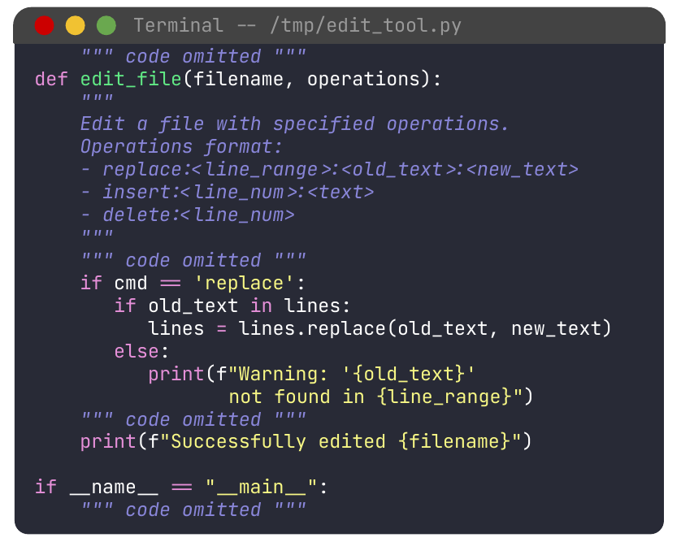

4. **Issue-specific tools can encode domain knowledge discovered mid-trajectory**
For an Open Library issue, the agent builds a MARC analyzer that reads XML or binary publication records and prints relevant fields in a human-readable form. The need becomes apparent only after inspecting the repository and test artifacts.

5. **The MARC tool makes otherwise opaque test data inspectable**
Its logic imports repository-specific record classes and extracts edition, language, and title information. This is not a generic coding tool and would be unlikely to appear in a fixed global toolbox.

Figure 3b illustrates the specialized MARC parser, the clearest example of problem-conditioned action-space growth.

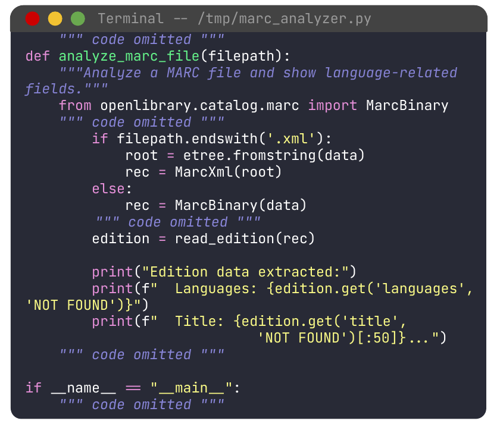

6. **Creating every possible tool up front is both impossible and undesirable**
The relevant abstraction is often unknown before diagnosis, and a large menu can distract the model. Runtime synthesis delays commitment until the issue supplies evidence about the operation worth packaging.

7. **Tool reuse within a task amortizes creation cost**
Search, view, edit, and analyzer scripts can be invoked repeatedly once created. Their benefit is greatest when an operation would otherwise require several long shell commands or repeated context-heavy reasoning.

8. **Tool code remains untrusted model output**
The paper permits arbitrary Python scripts in the task environment but provides no tool-specific static analysis, permission model, sandbox policy, or semantic verifier. Correctness depends on ordinary execution feedback and final benchmark tests.

## 3. Experimental Setup

1. **The implementation is built directly on mini-SWE-agent**
The base is approximately 100 lines and initially exposes bash rather than handcrafted editor/search functions. This makes changes attributable to prompt-driven tool creation, while limiting evidence about integration with more complex scaffolds.

2. **Resource limits follow the base framework**
Each issue has at most 250 agent steps and an average-cost cap of \$3. Tool creation competes with repository inspection, editing, and testing for the same step and token budget.

3. **The default backend is Claude 4.5 Sonnet**
Unless a table varies the model, experiments use `claude-sonnet-4-5-20250929`. Full Verified additionally evaluates GPT-5-Mini, GPT-5, and Gemini 3 Pro; the ablation adds GPT-5-Nano, Claude 3.7 Sonnet, and Claude 4 Sonnet.

4. **Every issue receives one patch sample**
This is a pass@1-style evaluation without independent reruns, best-of-N selection, or voting. Stochastic models still use their prescribed nonzero temperature.

5. **SWE-bench Verified contains 500 human-validated issues**
Each task provides a repository and a problem description judged to contain enough information for a developer to solve it. Resolution is determined by the benchmark’s executable tests.

6. **SWE-Bench Pro contributes 731 harder public problems**
The public set spans 11 repositories and Python, Go, TypeScript, and JavaScript. It targets more realistic, complex, and enterprise-oriented changes than Verified.

7. **SWE-bench Multilingual is tested only on 50 tasks**
The benchmark covers nine programming languages, but the paper reports an initial subset experiment rather than the complete benchmark. Appendix C lists the exact instances.

8. **The closest fixed-tool baseline is mini-SWE-agent**
Because Live-SWE-agent is implemented on top of it, paired comparisons isolate the prompt and runtime-tool mechanism more directly than comparisons to unrelated agents.

9. **Offline self-improvers are compared on a previously used 60-task subset**
SICA, DGM, HGM, and Live-SWE-agent all use GPT-5-Mini in the reported table. The baseline results and offline-cost figures are reused from prior publications rather than reproduced inside one common run.

10. **SWE-agent is the Pro baseline**
SWE-agent has manually engineered viewing and editing tools and roughly 7,000 lines of implementation. Both it and Live-SWE-agent use Claude 4.5 Sonnet for the table’s task-performance comparison.

## 4. Evaluation

1. **The evaluation asks three different questions**
Full benchmarks test practical resolution rate, the 60-task comparison contrasts runtime with offline self-improvement, and the 50-task ablations isolate reflection, tool creation, and model capability.

2. **Resolve rate is the primary selection-free outcome**
Live-SWE-agent does not optimize a benchmark score during an offline phase. Each issue independently produces a patch, and aggregate resolved percentage is calculated after runtime execution.

3. **Average model cost exposes immediate overhead**
Full Verified and Multilingual tables report average dollars per issue. Offline-comparison hours are a different quantity and should not be conflated with per-task inference cost.

### 4.1 Main Results

1. **Live-SWE-agent improves all four full-Verified model pairs**
The increases are 59.8% to 63.0% for GPT-5-Mini, 65.0% to 68.4% for GPT-5, 70.6% to 75.4% for Claude 4.5 Sonnet, and 74.2% to 77.4% for Gemini 3 Pro.

| Backend | mini-SWE-agent resolved | Live-SWE-agent resolved | mini cost | Live cost |
| --- | ---: | ---: | ---: | ---: |
| GPT-5-Mini | 59.8% | 63.0% | \$0.04 | \$0.05 |
| GPT-5 | 65.0% | 68.4% | \$0.28 | \$0.27 |
| Claude 4.5 Sonnet | 70.6% | 75.4% | \$0.56 | \$0.68 |
| Gemini 3 Pro | 74.2% | **77.4%** | \$0.46 | \$0.48 |

2. **Absolute improvements range from 3.2 to 4.8 percentage points**
GPT-5-Mini gains 3.2 points, GPT-5 gains 3.4, Claude 4.5 gains 4.8, and Gemini 3 Pro gains 3.2. The pattern supports the mechanism across strong models on the full benchmark.

3. **Cost changes are small in dollars but not uniformly negligible in percentage terms**
Claude 4.5 rises from \$0.56 to \$0.68, about a 21% increase, while GPT-5 saves \$0.01. Whether the overhead is worthwhile depends on the value of a resolved task and the deployment’s latency constraints.

4. **The Verified leaderboard margin is narrow**
Figure 1’s strongest proprietary comparison is 77.2%, versus Live-SWE-agent’s 77.4% at the time of writing. The contribution is more convincingly the open runtime-adaptation mechanism than a durable 0.2-point leaderboard lead.

5. **The Verified-60 result exceeds three offline self-improvers**
With GPT-5-Mini, Live-SWE-agent resolves 65.0%, compared with 50.0% for SICA, 53.3% for DGM, and 56.7% for HGM.

| Method | Adaptation regime | Verified-60 resolved | Reported offline cost |
| --- | --- | ---: | ---: |
| SICA | Offline recursive improvement | 50.0% | Infinite loop |
| DGM | Offline open-ended archive | 53.3% | 1,231 hours |
| HGM | Offline evaluator-directed improvement | 56.7% | 512 hours |
| Live-SWE-agent | Per-task runtime tools | **65.0%** | 0 hours |

6. **The improvement over HGM is 8.3 percentage points**
That is the paper’s stated margin over the previous best in the table. The methods incur different runtime behavior and were not jointly rerun, so the result is comparative evidence rather than a fully controlled compute-equivalent ablation.

7. **Zero offline hours does not imply persistent learning**
The system avoids a benchmark-wide development run because each issue pays for its own tool synthesis. It also discards the evolved per-task state, so the table compares immediate adaptation with reusable offline artifacts under different amortization assumptions.

8. **Live-SWE-agent reaches 45.8% on SWE-Bench Pro**
Using Claude 4.5 Sonnet, it exceeds SWE-agent’s 43.6% by 2.2 percentage points. Average Live cost is \$0.73; the baseline table does not report SWE-agent’s cost.

| Method | Backend | Pro resolved | Average cost |
| --- | --- | ---: | ---: |
| SWE-agent | Claude 4.5 Sonnet | 43.6% | Not reported |
| Live-SWE-agent | Claude 4.5 Sonnet | **45.8%** | \$0.73 |

9. **The Pro figure places the result above other shown open and proprietary scaffolds**
The strongest other open result shown is 45.1%, and the strongest proprietary result shown is 40.8%. These are leaderboard comparisons as of the paper’s November 2025 revision, not timeless state-of-the-art guarantees.

10. **Cross-benchmark evidence supports issue-conditioned tools**
Verified is Python-only, whereas Pro spans four languages and multiple repository domains. Improving both makes it less likely that the mechanism is only a Python benchmark trick.

### 4.2 Tools Analysis

1. **Tool bodies are embedded with `text-embedding-3-small`**
The authors reduce each generated script to an embedding and visualize the collection with t-SNE. Tool categories are assigned by simple filename string matching rather than manual semantic annotation.

2. **Common tool families form clusters with internal variation**
Edit, view, and search scripts group together, but their embeddings are spread rather than collapsing to identical implementations. This is consistent with repository- or issue-conditioned interfaces inside a common functional family.

3. **The residual category contains highly specific behavior**
Examples include a multi-file patch application script and a diff-checking utility. The category demonstrates diversity but is also sensitive to the coarse filename heuristic.

Figure 4a visualizes tool-function clusters for Verified.

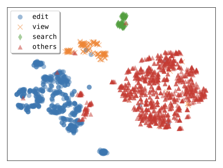

4. **Repository identity is visible in Pro tool space**
Several repositories overlap through generic editing and search tools, while Open Library produces a distinct group because its catalog data requires specialized parsing.

Figure 4b shows repository-conditioned clustering on SWE-Bench Pro.

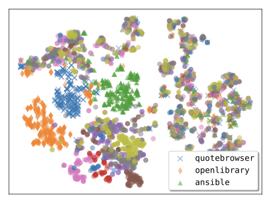

5. **Programming languages also shape generated scripts**
Language-aware inspection, parsing, build, and test behavior produces partially distinct clusters. This supports the claim that one fixed tool set can be suboptimal across heterogeneous repositories.

Figure 4c labels the same Pro tools by repository programming language.

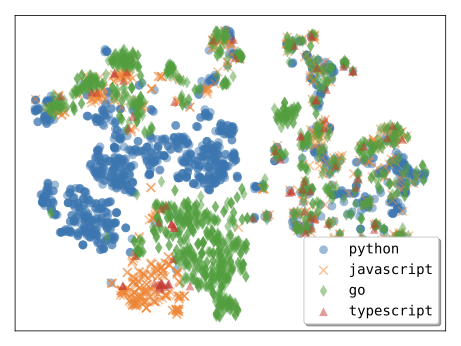

6. **The example search tool packages four useful policies**
It supports directory and pattern restrictions, skips `.git`, `__pycache__`, and `node_modules`, prints surrounding context, and limits output to the first 20 matches.

7. **The packaged interface reduces command complexity**
The paper contrasts a long `grep` pipeline and exclusions with a call like `python search_code.py code src/`. Fewer flags reduce errors from unsupported options and reduce repeated command construction in the model context.

Figure 5a compares the generated search script with the multi-flag shell command it replaces.

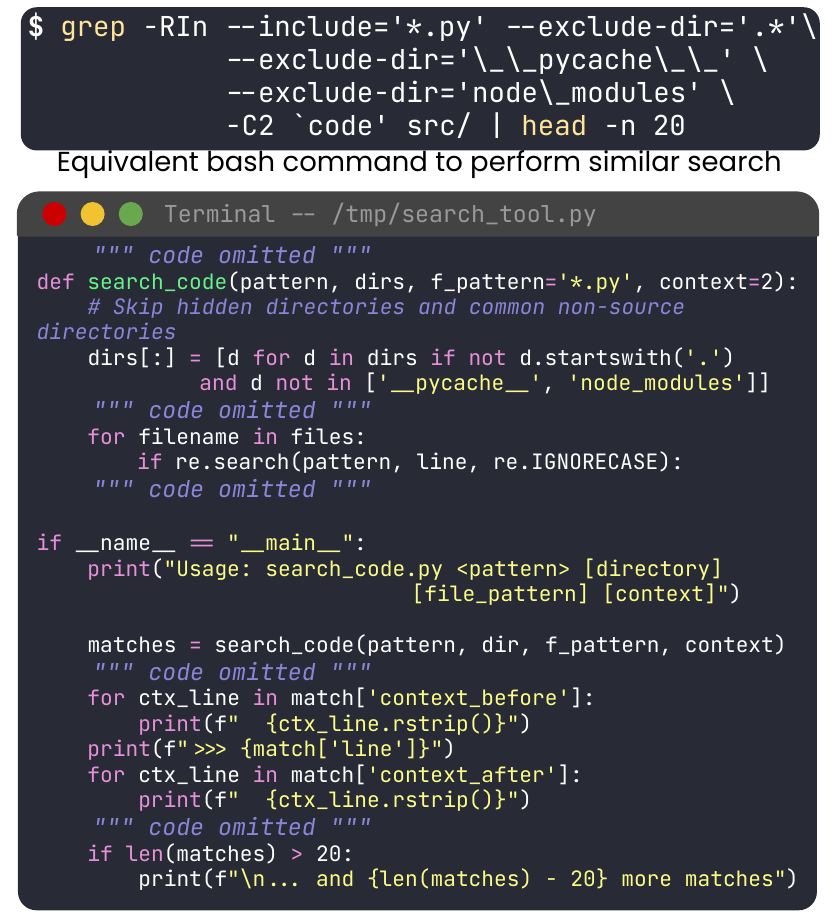

8. **The Go analyzer implements a lightweight language-specific static analysis interface**
It finds struct and function definitions, identifier references, and imports using Go-aware patterns. The paper reports that the agent used it to solve `navidrome__navidrome-10108c63c9b5bdf2966ffb3239bbfd89683e37b7`, which the compared baseline did not solve.

Figure 5b demonstrates a specialized tool whose logic is much harder to reproduce reliably with one shell pipeline.

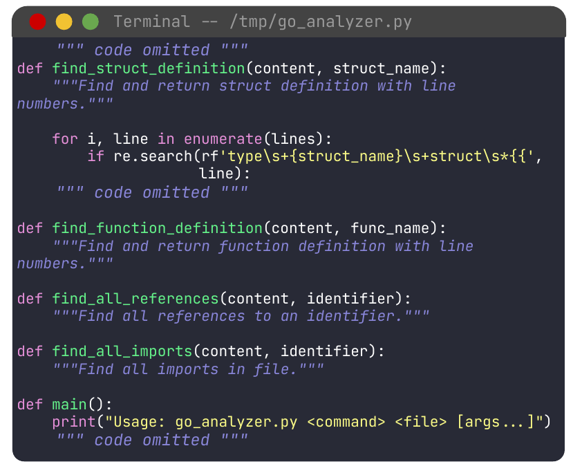

9. **The visual analysis is descriptive rather than causal**
t-SNE preserves local neighborhoods imperfectly, and filename labels can misclassify functionality. The plots show diversity and correlation with task context; they do not prove which tool caused a patch to pass.

10. **No per-tool usage or success attribution is reported**
The paper does not give execution counts, time saved, failure rates, or matched counterfactuals for individual scripts. Aggregate ablations provide stronger causal evidence than the cluster plots.

### 4.3 Ablation

1. **Component ablations use one random 50-task Verified subset**
Claude 4.5 Sonnet is the default. Appendix C publishes the exact instance IDs, enabling reproduction of the subset but not removing one-sample selection variance.

2. **Tool creation adds 14 absolute points over the fixed bash agent**
Full Live-SWE-agent resolves 76.0%, while removing tool creation yields 62.0%. This is the clearest direct evidence for the mechanism.

3. **Reflection adds 12 absolute points beyond initial instructions alone**
Without the per-step reminder, the model resolves 64.0%; with reflection it resolves 76.0%. The initial prompt by itself is only 2 points above the no-tool condition.

| Setup | Resolved | Mean tools created |
| --- | ---: | ---: |
| Without tool creation | 62.0% | 0.00 |
| Tool instruction, without reflection | 64.0% | 2.92 |
| Full Live-SWE-agent | **76.0%** | 3.28 |

4. **Tool quantity is not claimed as a fitness signal**
Reflection raises mean tools from 2.92 to 3.28, but the authors explicitly caution that count need not correlate with success. Quality, timing, reuse, and fit to the issue matter more.

5. **Backend capability changes the sign of the intervention**
GPT-5-Nano falls from 44.0% to 14.0%, and GPT-5-Mini falls from 60.0% to 58.0%. Runtime synthesis is therefore a demanding additional task, not a universally safe scaffold improvement.

6. **Weak-model failure is a looping behavior**
Trajectory inspection finds GPT-5-Nano misunderstanding the purpose of tool creation and becoming stuck. The reflection reminder can amplify unproductive behavior when the model cannot design or evaluate a useful script.

7. **Stronger models generally benefit**
GPT-5 rises from 60.0% to 68.0%, Claude 3.7 Sonnet from 46.0% to 50.0%, Claude 4 Sonnet from 58.0% to 64.0%, and Claude 4.5 Sonnet from 62.0% to 76.0%.

| Backend | mini-SWE-agent | Live-SWE-agent | Reported relative change |
| --- | ---: | ---: | ---: |
| GPT-5-Nano | 44.0% | 14.0% | -68.2% |
| GPT-5-Mini | 60.0% | 58.0% | -3.3% |
| GPT-5 | 60.0% | 68.0% | +13.3% |
| Claude 3.7 Sonnet | 46.0% | 50.0% | +8.7% |
| Claude 4 Sonnet | 58.0% | 64.0% | +10.3% |
| Claude 4.5 Sonnet | 62.0% | 76.0% | +22.6% |

8. **Claude 4.5 shows the largest tabled relative gain**
Its 22.6% relative increase is larger than GPT-5’s 13.3% and Claude 4’s 10.3%. The broader conclusion is an interaction between model reasoning strength and tool-synthesis overhead.

9. **Multilingual transfer adds six absolute points**
On the 50-task SWE-bench Multilingual subset, Claude 4.5 Sonnet with mini-SWE-agent resolves 40.0%, while Live-SWE-agent resolves 46.0%.

10. **Multilingual cost rises by \$0.07 per issue**
Average cost changes from \$0.59 to \$0.66, approximately 12%. The study does not report latency, step count, or tool-creation share of that cost.

| Method | Backend | Multilingual subset resolved | Average cost |
| --- | --- | ---: | ---: |
| mini-SWE-agent | Claude 4.5 Sonnet | 40.0% | \$0.59 |
| Live-SWE-agent | Claude 4.5 Sonnet | **46.0%** | \$0.66 |

11. **The model ablation weakens a universal generality claim**
The same interface can run with all six backends, but only four improve and two regress. Compatibility, benefit, and robustness are separate properties.

12. **The ablations lack repeated stochastic trials**
Each condition reports one patch per issue on one 50-task subset. Differences near two to four points may be sensitive to sampling, whereas the 14-point full-component gain is more substantial.

### 4.4 Discussion and Future Work

1. **Full scaffold rewriting is proposed, not demonstrated**
Future mutable targets include the system prompt, environment interaction protocol, and issue-solving workflow. The evaluated system leaves these components fixed.

2. **Cross-task memory is also future work**
The paper proposes serializing useful tools and insights as reusable skills instead of discarding them after each issue. No archive, retrieval policy, validation process, or forgetting mechanism is evaluated.

3. **Persistence would change both economics and risk**
Reusing a validated tool could amortize creation cost, but a faulty or malicious script could contaminate later tasks. The current task-local scope limits both positive accumulation and cross-task blast radius.

4. **The scaffold can act as a joint model benchmark**
Issue resolution measures coding ability, while tool creation stresses planning, abstraction, implementation, and self-monitoring. GPT-5-Nano’s collapse illustrates how the second capability can dominate overall performance.

5. **A unified open scaffold could reduce evaluation confounds**
Comparing models through one small public wrapper is more transparent than using different proprietary agents. However, runtime-created tools mean each model effectively constructs a different downstream scaffold, so the benchmark measures model-plus-adaptation ability rather than identical actions.

6. **Other software domains may benefit more from specialization**
Test generation, vulnerability detection, binary analysis, and greenfield software construction require profilers, decompilers, generators, or domain checkers. These proposed applications are not evaluated in the paper.

7. **Training-time self-evolution is speculative**
The discussion suggests training models to create tools and alter scaffolds rather than learning from fixed workflows. No loss, data-generation procedure, safety boundary, or training result is supplied.

8. **The paper omits a dedicated security evaluation**
Arbitrary Python scripts execute in the repository environment, yet there is no adversarial tool-generation study, privilege analysis, secret-access test, dependency policy, or static checker. Step and dollar limits constrain resources but do not establish safety.

9. **Final repository tests are an incomplete tool verifier**
A patch can pass while a helper script has unsafe side effects, brittle assumptions, or hidden data dependencies. Deployment would need tool sandboxing and an immutable verifier separate from mutable runtime files.

10. **The central open question is persistence without ossification**
A continual successor must decide which task-local tools deserve retention, how to generalize them, when to revise them, and how to prevent a growing toolbox from overwhelming the model—the same problem the runtime approach uses to criticize fixed tool sets.

## 5. Related Work

### 5.1 Software Engineering Agents

1. **Interactive repair establishes the feedback-driven lineage**
Early systems use compiler or test feedback to refine patches over multiple turns. Modern software agents extend the loop with repository navigation, tool calls, and autonomous patch submission.

2. **SWE-agent and OpenHands represent engineered tool scaffolds**
Their action spaces include dedicated editors, viewers, search, and terminal operations. Live-SWE-agent instead begins with bash and asks the model to create the interface appropriate to the issue.

3. **Agentless and Moatless represent workflow simplification**
These systems argue that carefully staged prompts can replace complex general agents. Live-SWE-agent is also structurally small, but adds an adaptive action space inside the loop.

4. **Post-trained coding models improve the substrate rather than the scaffold**
SWE-RL, DeepSWE, DeepSeek, MiniMax, Kimi, SWE-1.5, and Code World Model target model capability. Live-SWE-agent keeps weights fixed and depends on the backend’s existing ability to write reliable helper code.

5. **SICA, DGM, and HGM are the explicit self-improvement predecessors**
They search for improved coding-agent implementations offline and then reuse a selected scaffold. Live-SWE-agent changes the adaptation time scale and granularity from benchmark-wide scaffold search to per-issue tool construction.

6. **The comparison is a tradeoff, not a simple replacement**
Offline systems pay large one-time development costs but can amortize a reusable artifact across tasks. Live-SWE-agent pays smaller per-task adaptation costs and obtains issue specificity, but learns nothing persistent in the current implementation.

7. **Prior tool-creation research supplies the broader mechanism lineage**
LLMs have created tools for reasoning, embodied agents, and verifiable task solving. This work applies that idea to real repository repair and evaluates end-to-end benchmark resolution.

8. **Live-SWE-agent’s novelty is the placement of tool synthesis**
It is interleaved after ordinary environment feedback inside a standard software-agent trajectory, rather than performed as a separate library-building stage.

### 5.2 Benchmarks for Software Engineering Agents

1. **SWE-bench provides executable issue-resolution tasks**
Its variants include the full collection, Lite, and the human-validated Verified subset used for the paper’s 500-task headline.

2. **Multilingual benchmarks address Python concentration**
SWE-PolyBench, SWE-bench Multilingual, and Multi-SWE-bench extend repository repair across programming languages. Live-SWE-agent’s 50-task Multilingual result is an initial rather than comprehensive evaluation.

3. **Live benchmark builders address staleness and setup cost**
SWE-bench-Live and SWE-rebench use automation to collect newer issues and environments. The paper does not evaluate whether runtime tool synthesis remains effective under continual issue distribution shift.

4. **SWE-Bench Pro targets realism and enterprise complexity**
Its 731 public tasks across 11 repositories and four languages provide the paper’s strongest evidence outside the familiar Verified distribution.

5. **All evaluated datasets remain repository-patch benchmarks**
The experiments do not establish generality to vulnerability research, test generation, binary analysis, or greenfield development despite proposing those domains.

## 6. Conclusion

1. **The implemented contribution is lightweight and reproducible in concept**
Two prompt changes—tool-creation instructions and per-step reflection—let a shell-capable model build a task-specific action space without an offline search pipeline.

2. **The empirical result is strong for capable backends**
The system reaches 77.4% on full Verified, 45.8% on Pro, and 46.0% on a Multilingual subset under single-patch evaluation.

3. **Reflection is as important as permission**
On the 50-task component subset, merely permitting tools reaches 64.0%, while repeated reflection reaches 76.0%. The mechanism works by revisiting the decision at the moment task evidence becomes informative.

4. **The principal failure case is capability mismatch**
GPT-5-Nano drops from 44.0% to 14.0% and loops while trying to create tools. A deployment policy should gate or simplify runtime synthesis for models that cannot reliably execute the meta-level task.

5. **The paper demonstrates within-task adaptation, not continual self-improvement**
There is no persistent archive, cross-task memory, benchmark-driven optimizer, or modification of the running loop. Calling the system “live” is accurate; calling it continuously accumulating would exceed the evidence.

6. **Leaderboard claims are timestamped and partly uncontrolled**
The best comparisons are valid as of the paper’s revision, while several external baseline numbers are reused and costs are not always reported. The paired mini-SWE-agent tables and component ablation are the most controlled evidence.

7. **Safety, latency, and causal tool attribution remain major omissions**
The paper does not quantify wall-clock time, per-tool failures or benefits, or risks from arbitrary generated scripts. Those measurements are necessary before persisting or deploying self-created tools beyond disposable benchmark environments.

## Appendix A. Additional experimental settings

1. **The 250-step and \$3 limits are reused everywhere**
They come from the mini-SWE-agent defaults and bound each issue independently.

2. **Gemini 3 Pro uses temperature 1**
This follows its developer recommendation. The single patch is nevertheless a stochastic sample, so exact reproducibility requires more than the prompt and model identifier.

3. **Anthropic models use temperature 0.0**
Claude 3.7, Claude 4, and Claude 4.5 follow mini-SWE-agent’s deterministic-temperature convention, subject to any provider-side nondeterminism.

4. **OpenAI reasoning models use temperature 1**
GPT-5, GPT-5-Mini, and GPT-5-Nano do not support temperature 0.0 in the evaluated interface, so the experiments use 1.

5. **Pro changes only the repository root in the prompt**
The source path changes from `/testbed` to `/app` because the Pro containers mount the repository there. The tool instructions and feedback reflection remain the same across evaluations.

## Appendix B. Additional tool analysis

1. **Verified tools also cluster by repository**
All Verified repositories are Python, so repository labels reveal domain variation without a language confound. The appendix labels only two representative repositories in the legend for readability.

Figure 6a supplies the repository-colored Verified view omitted from the main analysis.

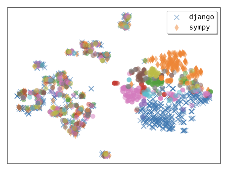

2. **Pro tools also cluster by function name**
This complements the main repository and language views and again shows generic families alongside variation in implementation.

Figure 6b supplies the tool-function view for SWE-Bench Pro.

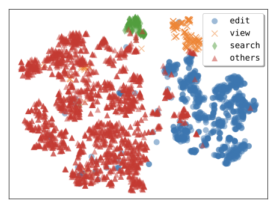

3. **The visualization pipeline uses PCA before t-SNE**
Script embeddings are reduced to 50 principal components, then sklearn t-SNE runs for 1,000 iterations.

4. **The plots are exploratory artifacts**
No clustering metric, stability analysis, or relationship between embedding position and issue resolution is reported. They support qualitative inspection rather than inferential claims.

## Appendix C. Ablation problems

### C.1 SWE-bench Verified ablation subset

1. **The appendix enumerates all 50 task IDs**
Publishing the exact random subset makes the 62.0%, 64.0%, and 76.0% component comparison and the six-backend table repeatable on the same issues.

2. **One shared subset enables paired model comparisons**
Each backend and setup faces the same issue list, reducing task-mix confounding within the ablation.

3. **Subset reuse can still invite adaptation**
The paper does not report a separately held-out component-ablation set or confidence intervals, so the 50-task findings should be checked on additional samples.

### C.2 SWE-bench Multilingual ablation subset

1. **The appendix lists the 50 multilingual issue IDs**
This defines the scope behind the 40.0% versus 46.0% result rather than implying evaluation on the full benchmark.

2. **The sample spans several language ecosystems**
Task-local tools can package different build, search, and analysis behavior, but per-language resolve rates are not reported.

3. **Aggregate gain can hide uneven transfer**
Without language-stratified results, the six-point improvement may be concentrated in one or a few ecosystems.

## Appendix D. Prompts Used

### D.1 Initial prompt

1. **Most of the prompt is inherited from mini-SWE-agent**
The model receives the PR description, repository boundaries, a recommended inspect–reproduce–edit–verify workflow, and a one-command-per-turn response format.

2. **The base protocol requires explicit reasoning and one shell command**
Each response contains a thought section and exactly one bash block. Independent commands must be spread across turns or connected within one block.

3. **Source changes are constrained to non-test files**
The prompt tells the model not to modify tests or configuration files and to work under the repository root. These are instructions rather than independently enforced policies described by the paper.

4. **The Live-specific addition permits Python tool creation**
Tools must be command-line scripts with informative output or errors and should simplify the workflow relative to raw bash.

5. **An edit tool is explicitly mandatory**
The model is told it should at least create a simple arbitrary-file editor. This requirement helps explain why the mean tool count is near three rather than showing spontaneous creation from an unprimed baseline.

6. **Tools are encouraged to be issue-specific**
The prompt rejects generality as a requirement and asks the model to optimize for the current task. This instruction operationalizes the claimed advantage over one global toolbox.

7. **Creation and invocation examples teach the interface**
The prompt demonstrates writing a Python file with a shell heredoc and later calling it with input. No separate schema or function-calling layer is required.

8. **Submission uses the base agent’s ordinary patch protocol**
When complete, the agent stages changes and emits the diff. The custom tools themselves are transient working aids unless they happen to be included in the patch, which the task instructions generally discourage.

### D.2 Feedback message

1. **Every environment response exposes return code and output**
These observations let the model assess whether a command or generated tool behaved as intended.

2. **One sentence supplies the repeated reflection operator**
After each result, the model is asked to review prior steps and decide whether a tool could help with the current task.

3. **A second sentence counters bash complacency**
The reminder says that availability of a basic shell command does not mean a custom tool would be useless. This prompt pressure likely contributes to the higher 3.28 mean tool count.

4. **Long command output is truncated symmetrically**
When output is too large, the feedback retains the first 5,000 and last 5,000 characters and reports how much was elided.

5. **The warning suggests selective alternatives**
It recommends `head`, `tail`, `sed`, narrower search patterns, or a custom viewer. The same mechanism that prevents context overflow also nudges the agent toward tool creation.

6. **Reflection has no structured answer field**
The model is free to create a tool or continue with an ordinary command. The system does not require a yes/no decision, confidence score, or justification that a separate evaluator can inspect.

7. **The previous trajectory is stored only in conversational context**
There is no compressed skill record, episodic database, or archive of prior task tools. Context-window pressure can therefore affect both task reasoning and the decision to synthesize.

8. **The feedback prompt is the causal centerpiece**
Removing it reduces the component-subset score from 76.0% to 64.0%, much more than the two-point difference between no tool creation and tool permission without reflection.
