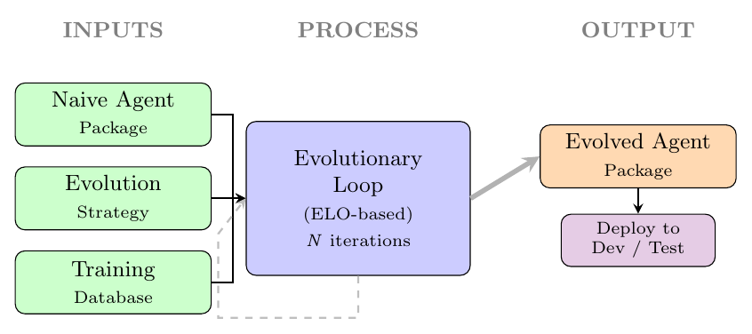
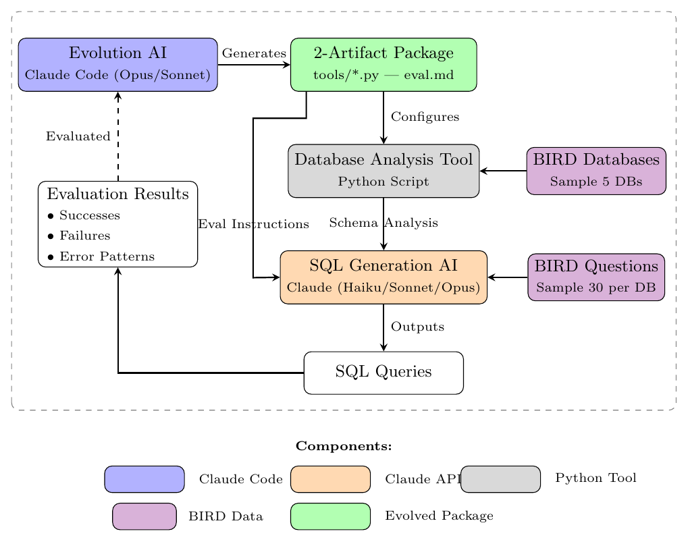

# RoboPhD: Self-Improving Text-to-SQL Through Autonomous Agent Evolution

Source: https://arxiv.org/abs/2601.01126v2

## Overview / Takeaway

RoboPhD is a domain-specific, offline evolutionary system that improves a deployable Text-to-SQL agent by jointly rewriting a deterministic Python database-analysis tool and Markdown SQL-generation instructions. A Claude Code evolution agent cross-pollinates prior candidates using sampled BIRD execution accuracy, error reports, Deep Focus refinement, and persistent ELO ratings; the winning runtime artifact is static and does not modify itself during deployment. Across Claude 4.5 tiers, evolution raises BIRD development accuracy by **2.3 points for Opus, 3.5 for Sonnet, and 8.9 for Haiku**, enabling evolved cheaper models to beat naive models one tier above them. The official BIRD test result is **73.67%** with Opus 4.5, including a **7.02-point** gain on challenging questions, but the study reports one evolutionary trajectory, limited ablation evidence, model-dependent nondeterminism, and no production security evaluation.

## 1 Introduction

1. **Text-to-SQL performance usually depends on substantial human engineering**
Text-to-SQL maps natural-language questions to executable database queries, but high-performing systems commonly require manual prompts, model selection, schema representations, correction logic, and database expertise. RoboPhD asks whether an AI system can instead conduct a bounded research cycle—analyze failures, propose hypotheses, implement changes, and test them—without authors hand-coding the winning SQL techniques.

2. **The system evolves artifacts rather than model weights**
Each candidate comprises a **Python database-analysis tool** and **SQL-generation instructions**. The tool performs offline analysis once per database, and its output is combined with the instructions at online inference; the underlying Claude models remain fixed, so “self-improvement” means search over agent code and prompts, not gradient training or self-rewriting model weights.

3. **The autonomy claim is deliberately bounded**
The paper calls the system *well short of a full self-improving system*. Human authors choose BIRD, the two-artifact architecture, the evaluator, the models, a 200K-token deployment constraint, selection rules, and a primarily hand-written evolution strategy; autonomy applies inside this scaffold, where the evolution agent chooses domain techniques and rewrites candidate artifacts.

4. **A trivial baseline grows into a much larger deployment package**
The starting package has roughly **70 lines**: a **50-line** Python script that dumps raw DDL and about **20 lines** of minimal SQL instructions. After **18 evolutionary iterations**, the champion contains more than **1,000 lines of Python** and roughly **500 lines of instructions**—reported as approximately **1,500 lines** in the abstract—and incorporates adaptive schema analysis, evidence interpretation, precise column selection, string matching, and aggregation rules.

5. **ELO turns repeated sampled contests into a persistent population ranking**
Agents enter at different iterations and compete on changing subsets of BIRD training questions. The paper claims this is the first active use of **ELO** for evolutionary prompt or agent optimization, using persistent ratings to compare asynchronous entrants and to select future parents and challengers.

6. **The central empirical pattern is larger improvement for weaker models**
The evolved package improves BIRD development execution accuracy by **+8.9 points for Haiku 4.5**, **+3.5 for Sonnet 4.5**, and **+2.3 for Opus 4.5**. This is evidence across three model tiers, not a demonstrated scaling law: there are no repeated evolutionary runs, confidence intervals, or broader model families establishing a causal inverse-scaling relationship.

The original Figure 1 makes the boundary of the system clear: fixed human-specified inputs enter an offline evolutionary loop, which emits a conventional agent package for development or test deployment.

## 2 Related Work

### 2.1 Text-to-SQL Systems

1. **Contemporary BIRD systems combine many human-designed mechanisms**
The comparison situates RoboPhD against systems reporting roughly **71–77%** BIRD accuracy as of mid-September 2025. Examples include AskData at **77.14%** with GPT-4o, data analysis, and metadata extraction; CHASE-SQL at **76.02%** with decomposition, execution-plan reasoning, synthetic examples, and a learned selector; and XiYan-SQL at **75.63%** with multiple generators, an M-Schema representation, supervised fine-tuning, and learned selection.

2. **Several baselines emphasize correction, reinforcement learning, or candidate diversity**
CSC-SQL reports **73.67%** through self-consistency, self-correction, and GRPO-trained generation and merge-revision models. Reasoning-SQL reaches **72.78%** using syntax, execution, and n-gram rewards; OpenSearch-SQL reaches **72.28%** with multiple agents and a SQL-like intermediate language; OmniSQL reaches **72.06%** after using **2.5 million** synthetic examples across **16,000 databases**.

3. **Cost-aware and modular baselines provide important context**
GenaSQL reports **72.28%** at **$0.039 per query** using diverse schema representations and consistency without chain-of-thought or fine-tuning. Distillery reaches **71.83%** by fitting the full schema in context with augmentation, selection, and correction, while CHESS reaches **71.1%** through four manually specified roles: retrieval, schema selection, candidate generation, and unit testing.

4. **RoboPhD’s differentiator is search over complete domain artifacts**
APE, OPRO, DSPy, TextGrad, and ACE optimize prompts or textual feedback loops; RoboPhD searches both an executable analysis program and a prompt. Its detailed error reports resemble **TextGrad’s textual gradients**, but the evolution model decides whether and how to turn those error descriptions into code and instructions.

5. **The method inherits ideas from population search and rating systems**
Neural architecture search, covariance-matrix adaptation, and population-based training establish evolutionary optimization over candidate systems. ELO and Chatbot Arena establish persistent pairwise rankings; RoboPhD changes their role from passive evaluation to an active signal for population selection.

6. **Prior Text-to-SQL papers were not inputs to the main reported run**
The authors experimented with a separate “research-driven” strategy that supplied the listed Text-to-SQL papers to the evolution agent, but exclude that strategy from the primary results because evidence was insufficient. The reported champion comes from cross-pollination of generated agents, so comparisons to those systems establish context rather than direct methodological inheritance.

## 3 Method

1. **Three fixed inputs define the search problem**
RoboPhD begins with the naive package, an evolution strategy, and BIRD training data containing **69 databases and about 6,600 questions**. After $N$ contests, it returns a population with performance histories and ELO ratings; a selected artifact can then be evaluated on held-out development or official test data.

2. **The mutable substrate is narrow but operationally meaningful**
Evolution can change files under `tools/*.py` and `eval_instructions.md`. It does not change the SQL-generation model, the evolution model, ELO formula, benchmark metric, sampling protocol, cross-pollination prompt, or runtime verifier, making RoboPhD closer to **domain-specific program-and-prompt evolution** than unrestricted recursive self-improvement.

### 3.1 Conceptual Overview: The Graduate Student Metaphor

1. **The evolution agent plays a graduate-student role inside each creation session**
Claude Code with **Claude Sonnet 4.5 or Opus 4.5** examines failures, proposes improvements, implements an agent, tests it, and refines it. A fresh evolution agent is used for each outer iteration, while context is retained throughout that iteration’s artifact creation and Deep Focus refinement.

2. **Domain independence means no explicit technique list, not no domain capability**
The strategy asks the model to combine successful agent techniques and provides no author-written recipe such as schema linking or column pruning. However, its approximately **240-line** prompt tells the model it is an expert in Text-to-SQL, mandates a tool-only architecture, supplies error evidence, and relies on the model’s pretrained SQL knowledge; the result therefore tests latent-domain-knowledge elicitation within strong meta-level guidance.

3. **The evolutionary cycle alternates evaluation, ranking, mutation, and tournament selection**
For iteration $i$, the system samples data, evaluates current competitors, converts accuracies into pairwise outcomes, updates ELO, selects the accuracy winner, evolves one new agent from the competitors and error analysis, then forms the next contest from the current winner, the newcomer, and a highly rated incumbent. The output is a population archive rather than a single overwritten lineage.

4. **Sampling makes each contest a 150-question comparison**
Each standard iteration samples **5 databases** and **30 questions per database**, so all competitors face the same **150 questions**. This common-task comparison controls difficulty within an iteration even though absolute accuracy varies substantially between sampled database sets.

5. **The algorithm mixes an immediate winner with a persistent rating**
The next round always retains the agent with maximum accuracy on the current sample, while another slot is drawn from the top two ELO performers. The current-sample winner preserves short-term evolutionary pressure; the rating-based slot gives previously strong candidates opportunities to re-enter.

### 3.2 Technical Implementation

#### 3.2.1 System Overview: Evolving an Agent with Two Components

1. **The two artifacts form a strict information bottleneck**
The Python tool sees the full SQLite schema and row data offline but no user question. The SQL-generation model does not receive the raw database directly; database knowledge must pass through the tool’s structured analysis, which forces evolution to optimize both information extraction and instructions for consuming it.

2. **The evolution model is separate from the deployed SQL model**
Claude Code running Sonnet or Opus produces candidate files. Claude Haiku, Sonnet, or Opus via the API consumes those files and generates SQL, allowing one evolved artifact to be tested across model tiers without deploying the expensive evolution infrastructure.

The original Figure 2 shows the precise loop: the Evolution AI emits a two-artifact package, BIRD data exercises the deterministic analysis tool and SQL model, and success/failure patterns return to the next design step.

#### 3.2.2 Offline Database Analysis

1. **The offline tool produces detailed, reusable database documentation**
Strong candidates output DDL, row counts, foreign-key relationships and cardinalities, sample values, categorical enumerations, numeric ranges, format patterns, and semantic structure. It runs once for each database before questions arrive, matching deployments where expensive preprocessing is acceptable but per-query latency is constrained.

2. **Deterministic tool-only analysis wins the internal architecture contest**
The project explored LLM-only analysis, a hybrid LLM-plus-tools design, and Python-only execution. Tool-only analysis was strongest, deterministic, and reported as **$0.00 per database**, compared with roughly **$0.50 per database** for LLM analysis; the paper hypothesizes that deterministic outputs are also easier for evolution to optimize.

3. **A hybrid fallback remains in the system**
If the generated Python tool fails, tool-assisted hybrid analysis can take over. Such failures represented **5.5% of total costs** while evolving the best system, indicating that deterministic generation reduced rather than eliminated execution risk.

4. **Offline analysis is a deliberate deployment tradeoff**
A single fixed database summary is simple to cache and reuse, but cannot adapt its schema exploration to an individual question. The paper explicitly notes that per-question dynamic analysis could improve accuracy at the price of a more complex and costly deployment architecture.

#### 3.2.3 Online SQL Generation

1. **Online inference is concatenation of four information sources**
The runtime prompt is

\[
\operatorname{Prompt}
= \operatorname{DatabaseAnalysis}
\oplus \operatorname{EvalInstructions}
\oplus \operatorname{Question}
\oplus \operatorname{Evidence},
\]

where $\oplus$ means concatenation. `DatabaseAnalysis` is the Python tool’s cached output, `EvalInstructions` is the evolved Markdown guidance, `Question` is the user request, and `Evidence` is BIRD’s supplied domain or schema hint.

2. **The champion’s 527-line instructions target recurrent exact-match failures**
Rules emphasize returning only requested columns, interpreting **seven evidence patterns**, consulting enumerated values for case-sensitive matches, choosing `LIKE` versus equality, and parsing which set belongs in the numerator of a percentage. These details matter because an executable query can still fail BIRD’s exact set comparison through an extra output column or reversed aggregation.

3. **Universal verification adds up to two correction rounds**
After executing a candidate query, the model reviews the result alongside the question and database context, then returns either `CORRECT` or revised SQL. The system allows $k=2$ corrections with progressive temperatures **0.0, 0.2, and 0.3** across initial generation and retries; an error or empty result also triggers an additional targeted retry that highlights the failure.

4. **Verification is self-critique rather than an independent oracle**
The same model judges its own SQL from execution behavior and prompt context; it has no ground-truth query during deployment. This can repair syntax and obvious semantic failures, but correlated reasoning errors can survive because there is no separate learned verifier or formal semantic specification.

#### 3.2.4 Evolution

1. **Candidate generation consumes both aggregate and example-level feedback**
The evolution model sees ELO rankings, accuracies, detailed error analysis, and the artifacts of prior competitors. It writes a `reasoning.md` trace before producing the Python tools and SQL instructions, creating an auditable—though not necessarily faithful—record of the design rationale.

2. **Cross-pollination combines complementary parent mechanisms**
The primary strategy asks which techniques consistently work, which agents have complementary strengths, which failures remain, and how a combined deterministic analyzer could improve them. Alternative refinement, research-driven, and error-focused strategies were explored but not supported strongly enough to replace cross-pollination in the reported results.

3. **The evolution strategy is a fixed human-authored outer scaffold**
The primary prompt is about **240 lines** and was the main exception to a codebase otherwise heavily produced with Claude Code. It prescribes cross-pollination, error-driven analysis, a tool-only output, unseen-database generalization, expert Text-to-SQL reasoning, and extended deliberation; evolving this controller is future work.

4. **Deep Focus performs within-session local refinement**
Before entering the population, a new agent is retested against tasks from recent prior iterations and compared to prior agents on uniquely correct and uniquely wrong cases. The evolution model revises artifacts in the same Claude Code context, preserving its planning state rather than launching an independent critic.

5. **The default Deep Focus depth is one**
The authors tried $k\in\{0,1,2,3\}$ prior-iteration test rounds and chose **$k=1$**, describing one round as providing useful refinement at reasonable time. No numerical ablation table isolates Deep Focus’s causal contribution or compares the four values on held-out outcomes.

#### 3.2.5 Evaluation and ELO Ranking

1. **Execution accuracy is exact at the result-set level**
All competing agents receive identical sampled questions. BIRD execution accuracy ignores row order but requires the returned set to match exactly, so syntactically different SQL can count as correct while an extra column, missing row, or incorrect value fails.

2. **Three competitors create three pairwise ELO events**
If accuracies are **65%, 62%, and 62%**, agent A records wins over B and C, while B and C tie. Magnitudes of accuracy differences are discarded: a one-point and a twenty-point win both become score $S=1$.

3. **The standard ELO update uses a fixed K-factor**
For each pair, ratings change according to

\[
\Delta_{\mathrm{ELO}} = K(S-E), \qquad K=32,
\]

where $S\in\{0,0.5,1\}$ is the observed loss, tie, or win and $E$ is the expected score derived from the two current ratings. An upset therefore moves ratings more than an expected victory.

4. **Persistent ratings support asynchronous candidate entry**
New agents can enter after incumbents have accumulated results, and pairwise outcomes connect their rating to the existing population. This is useful for an archive whose members were not all evaluated on the same database sample.

5. **ELO aggregates non-transitive outcomes but does not resolve specialization**
The paper says ELO handles rock-paper-scissors behavior across database samples. More precisely, a scalar rating can absorb cyclic outcomes into an average ranking, but it cannot represent which agent specializes on which schema or preserve a full non-transitive payoff matrix; population diversity may therefore be hidden by the summary score.

6. **Win-loss conversion normalizes difficulty at a cost**
Absolute sampled accuracy reportedly ranges from about **60% to 80%**, while same-sample pairwise outcomes remain comparable. This reduces sensitivity to batch difficulty, but discards effect size and uncertainty from only 150 questions, so rating noise can still influence selection.

#### 3.2.6 Experimental Protocol: Selection and Sampling

1. **Standard selection balances exploitation and limited exploration**
Iterations 1–11 prioritize the prior winner, the newly evolved agent, and a random choice among the top two ELO candidates excluding the winner. Ties can carry multiple pending winners into available priority slots.

2. **Late-stage iterations allocate 30% of rounds to re-evaluation**
From iterations 12–30, a round uses standard three-agent evolution with **70% probability**. With **15% probability**, a four-agent “challenger” round performs no evolution and targets under-tested, above-average agents with **ELO greater than 1500**; another **15%** uses four randomly selected ELO candidates without evolution.

3. **Random undersampling changes the evidence every round**
BIRD provides a median of **82 questions per database** and about **6,600** training questions overall, but one iteration sees only 30 questions from each of 5 of 69 databases. Changing samples discourages overfitting to one fixed mini-benchmark, although repeated adaptive use of the same training pool across 18–30 rounds can still overfit selection decisions to the pool as a whole.

4. **No dedicated held-out selection set is described inside evolution**
Candidate generation, local refinement, current winners, and ELO are all driven by sampled BIRD training data. Generalization is assessed later on the 11-database development set and official test set, but the paper does not report an independent validation split used to decide when to stop or which evolutionary trajectory to release.

## 4 Experiments

### 4.1 Experimental Setup

1. **Evolution uses BIRD training data and Haiku for sampled SQL generation**
BIRD contains **69 training databases** and **11 development databases** across domains. Evolutionary contests use **Claude Haiku 4.5** for SQL generation, while candidate creation uses Claude Code with Sonnet or Opus 4.5; final artifact evaluation then tests Haiku, Sonnet, and Opus tiers.

2. **A standard iteration is inexpensive but the accounting is incomplete**
One iteration costs approximately **$2 in Claude API calls** and averages **22 minutes**. Claude Code evolution uses subscription quota rather than metered API spending; a **30-iteration** run consumes about **12% of a Claude Max weekly quota**, so the reported dollar figure is not a full economic cost for reproducing evolution.

3. **Hardware requirements are modest for the benchmark-scale database work**
Runs used either a **MacBook Pro with 48 GB RAM** or an **Azure VM with 8 vCPUs and 32 GB RAM**. Model inference is remote, and the local machines primarily orchestrate evolution, SQLite analysis, execution, and evaluation.

4. **The evaluation lacks variance estimates**
The paper reports one main evolutionary outcome without replicate runs, random seeds, confidence intervals, or statistical tests. Because both LLM generation and sampled evolutionary contests are stochastic, the headline champion and gain sizes cannot be separated from trajectory variance using the presented evidence.

### 4.2 Main Results

1. **All three model tiers improve on BIRD development**
The evolved artifact changes Opus from **69.0% to 71.3%**, Sonnet from **65.7% to 69.2%**, and Haiku from **57.2% to 66.1%**. The within-tier costs per query also rise—from **1.61¢ to 3.13¢**, **0.56¢ to 0.87¢**, and **0.34¢ to 0.51¢**, respectively—because the evolved package supplies more context and verification.

Table 1 is the core development-set comparison; it supports the improvement and cross-tier deployment claims while showing that evolution is not cheaper within a fixed model tier.

| Agent package | Opus 4.5 accuracy | Opus cost/query | Sonnet 4.5 accuracy | Sonnet cost/query | Haiku 4.5 accuracy | Haiku cost/query |
| --- | ---: | ---: | ---: | ---: | ---: | ---: |
| Naive | 69.0% | 1.61¢ | 65.7% | 0.56¢ | 57.2% | 0.34¢ |
| Best evolved | 71.3% | 3.13¢ | 69.2% | 0.87¢ | 66.1% | 0.51¢ |
| Accuracy change | +2.3 | — | +3.5 | — | +8.9 | — |

*Table 1: Results on the BIRD development set.*

2. **Cross-tier comparisons create the practical cost win**
Evolved Haiku reaches **66.1% at 0.51¢ per query**, exceeding naive Sonnet’s **65.7% at 0.56¢**. Evolved Sonnet reaches **69.2% at 0.87¢**, exceeding naive Opus’s **69.0% at 1.61¢**; the second comparison nearly halves per-query model cost after a one-time evolution expense.

3. **The inverse-benefit interpretation remains correlational**
Haiku gains nearly four times as many points as Opus, consistent with weaker models having more tool-and-prompt headroom. Yet the three models share one vendor and generation, and the artifact was evolved using Haiku contests; targeted optimization for Haiku is a plausible alternative explanation that the experiment does not disentangle.

4. **Official test gains concentrate on harder questions**
With Opus 4.5, overall execution accuracy rises from **72.16% to 73.67%**. Simple questions decline **0.32 points**, moderate questions improve **1.80**, and challenging questions improve **7.02**, suggesting the enlarged analysis and instruction package pays most on compositional cases rather than already-saturated easy cases.

Table 2 preserves the official BIRD test breakdown produced by the benchmark team from two submitted configurations.

| Agent package | Total | Simple | Moderate | Challenging |
| --- | ---: | ---: | ---: | ---: |
| Naive | 72.16% | 81.35% | 68.65% | 48.42% |
| Best evolved | 73.67% | 81.03% | 70.45% | 55.44% |
| Change | +1.51 | −0.32 | +1.80 | +7.02 |

*Table 2: Official BIRD test-set execution accuracy with Opus 4.5.*

5. **The final score is competitive but not state of the art**
The **73.67%** test result ranked **16th on the BIRD leaderboard in December 2025** and equals the CSC-SQL figure listed in related work, while trailing several systems above 75%. Its significance is achieving a strong result through automated artifact design, not setting the best benchmark score.

### 4.3 Evolution Analysis

#### Champion Agent Design

1. **The iteration-18 champion fuses three equally accurate parents**
`iter18_hybrid_comprehensive_analyzer` cross-pollinates three agents that each scored **76% training accuracy in iteration 17**. Their complementary mechanisms were adaptive context scaling, semantic pattern analysis, and precise column coverage, providing a concrete example of population diversity yielding a combined design.

2. **Size-adaptive analysis prevents context-overflow collapse**
Earlier agents could reach **0% accuracy** on large schemas when their summaries exceeded Claude’s **200K-token** context window. The champion reduces samples, enumerations, semantic analysis, and cross-table validation as column count grows, preserving detail for typical databases while degrading gracefully on very large ones.

Table 3 is the evolved size policy rather than a manually supplied ablation grid.

| Feature | Small (≤150 columns) | Medium (≤300) | Large (≤400) | Ultra (>400) |
| --- | ---: | ---: | ---: | ---: |
| Sample values per column | 10 | 5 | 3 | 1 |
| Enumerated-value limit | All | 15 | 5 | 0 |
| Semantic patterns | Full | Essential | Skip | Skip |
| Cross-table validation | Full | Critical | Skip | Skip |

*Table 3: Size-adaptive feature matrix for fitting database analysis within the 200K-token context.*

3. **The analysis script expands into ten structured sections**
Its roughly **1,000 lines** generate: DDL; table and row-count overview; column types and samples; foreign-key cardinalities; low-cardinality enumerations; numeric ranges; format detection for dates, currencies, and codes; temporal or hierarchical semantic patterns; orphaned-key validation; and database-specific query pitfalls.

4. **The instruction artifact codifies exact-output discipline**
Its **527 lines** distinguish requested output columns from columns used only for filtering or sorting, map multi-column evidence in exact order, and apply `LIMIT 1` to explicit superlatives rather than merely singular nouns. These learned rules directly target BIRD’s exact set-match evaluation.

5. **The champion analysis is descriptive rather than causal**
The paper does not remove individual champion components, rerun the population without cross-pollination, or compare the 18th-iteration package against all parents on multiple held-out samples. The feature narrative plausibly explains improvement, but it is not a controlled component ablation.

## 5 Discussion and Future Work

### 5.1 Practical Applicability

1. **Deployment discards the evolutionary infrastructure**
The final Python script runs once per database and emits a structured analysis; that analysis and the Markdown instructions become a fixed system prompt. Runtime needs only the prompt, the user question, optional evidence, SQL execution, and universal verification—no Claude Code, population archive, ELO service, or evolutionary loop.

2. **The package is portable but not model-independent by evidence**
It is plain Python plus Markdown and works across three Claude 4.5 tiers, making integration comparatively simple. The paper does not test other vendors, open-weight models, non-SQL dialects, streaming schema changes, or production databases with access control and sensitive data.

### 5.2 Architectural Options Under Investigation

1. **Meta-evolution could make the outer strategy mutable**
A proposed meta-agent would critique and schedule evolution strategies based on performance trends and prior reasoning. Preliminary results are described as promising but ambiguous, with possible value mainly beyond **30 iterations**; no quantitative evidence supports inclusion in the current method.

2. **Research-driven evolution is intriguing but not validated**
One alternative supplies domain papers to the evolution agent so it can extract techniques, while other variants emphasize refinement or specific error classes. The paper keeps the manually written cross-pollination strategy because these alternatives lack sufficient experimental support.

3. **Targeted LLM database analysis may bridge two extremes**
The current tool is either deterministic or uses a broad LLM fallback. A generated script that requests semantic reasoning only for ambiguous relationships or columns could recover question-relevant understanding without paying the full **$0.50-per-database** LLM-analysis cost.

### 5.3 Broader Applications

1. **Transfer to harder SQL benchmarks is untested**
Spider 2.0 offers enterprise-scale schemas and multi-step reasoning, while BIRD-Critic focuses on repairing incorrect SQL. Both could test whether the learned artifact architecture transfers beyond the original BIRD generation setting.

2. **Code generation is a plausible but unevaluated target**
The authors expect the same evolutionary pressure to discover prompts and tools for programming tasks because the initial strategy contains little explicit SQL technique. That extrapolation remains a hypothesis: only one benchmark, task family, tool interface, and set of underlying models are evaluated.

### Evidence Boundaries, Limitations, and Open Questions

1. **Autonomous discovery depends on strong human and pretrained priors**
The evolution prompt is lengthy, specifies cross-pollination and deterministic tooling, labels the model a Text-to-SQL expert, and fixes the experimental scaffold. The system discovers implementation details inside that envelope, but the experiment does not compare against equally budgeted human prompt engineering or a simpler automated optimizer.

2. **Adaptive training feedback creates selection-overfitting risk**
Changing 150-question samples reduces fixed-batch memorization, but the same 69-database training pool repeatedly controls mutation, Deep Focus, ELO, and winner retention. A separate selection split, repeated runs, and a preregistered release rule would clarify how much generalization arises from the method rather than adaptive reuse.

3. **ELO is a lossy model of agent quality**
It converts each batch to win, tie, or loss, ignores margin and question-level uncertainty, and compresses domain-specific strengths into one scalar. Contextual ratings by database property, Bayesian uncertainty, or quality-diversity archives could preserve specialists that a top-two ELO policy discards.

4. **Cost claims exclude important components**
The reported **$2 per iteration** covers Claude API calls but not the subscription quota, local compute, engineering time, security review, repeated failed trajectories, or database preprocessing. Within a model tier the evolved system is more expensive per query; savings appear only in selected cross-tier comparisons.

5. **The best mechanism is not isolated experimentally**
There are no quantitative ablations for ELO versus direct accuracy selection, cross-pollination versus mutation, tool-only versus hybrid under matched budgets, Deep Focus depth, late-stage challenger rounds, verification, or the champion’s individual features. These are the most important follow-up experiments for attributing the observed gains.

6. **Reproducibility means similar trajectories, not exact reconstruction**
The framework and artifacts are open, but Claude responses are nondeterministic, and early variation compounds across evolutionary rounds. The reproducibility statement expects reruns to produce similar agents, not identical candidates or scores.

7. **Generalization beyond Claude and BIRD remains open**
Useful tests include another vendor or open model, PostgreSQL and enterprise schemas, schema drift after offline analysis, hidden database families, and tasks whose verifier is noisy or unavailable. These would determine whether RoboPhD’s result is a reusable evolutionary pattern or a benchmark-and-model-specific optimization.

8. **Production safety needs evaluation as a first-class objective**
Future evolution could jointly optimize accuracy, latency, prompt length, cost, code complexity, security tests, and data-access constraints. The current scalar performance process has no explicit incentive to produce safe or maintainable code beyond the fixed tool-only architecture and execution environment.

## 6 Conclusion

1. **The demonstrated result is a bounded autonomous research loop**
RoboPhD turns a minimal Text-to-SQL package into a substantially more capable database-analysis program and instruction set through feedback-driven population search. Its strongest evidence is the official **73.67%** BIRD test result and the concentration of gains on challenging questions.

2. **The durable contribution is the separation of evolution from deployment**
An expensive code-producing agent explores candidate artifacts offline, while the released product is a static Python tool and Markdown prompt. This pattern is practical for domains with executable feedback and reusable preprocessing, even though it is not continual or runtime self-improvement.

3. **Claims should be read as system-design evidence rather than a universal law**
The study shows one credible evolutionary trajectory in Text-to-SQL; it does not establish broad domain independence, exact reproducibility, a causal inverse-scaling law, or superiority to other automated optimizers. Its open-source implementation creates a basis for those controlled comparisons.

## Ethics Statement

1. **Autonomous code execution is an acknowledged direct risk**
Claude Code runs generated code without human review during evolution, so a candidate could theoretically execute destructive commands. The project uses process isolation and filesystem permissions, but explicitly treats autonomous execution safety as unresolved.

2. **Evolved database tools introduce an adversarial input surface**
A malicious schema or value could manipulate generated analysis, exfiltrate data, or trigger unintended behavior. Public BIRD databases do not exercise this threat model; production use would require strict sandboxing, network isolation, least privilege, and security auditing of every evolved artifact.

3. **Open release is paired with deployment warnings**
The authors release the framework for reproducibility and scrutiny while recommending safeguards for similar autonomous code-generation systems. Safety is enforced externally rather than optimized by the evolutionary objective.

## Appendix A LLM Usage

### A.1 Roles within the RoboPhD System

1. **Different model interfaces serve design and execution roles**
Claude Code with Opus or Sonnet 4.5 acts as the Evolution Agent; Claude Haiku, Sonnet, or Opus 4.5 through the API performs SQL generation. This distinction matters to both cost accounting and reproducibility.

### A.2 LLMs Used as Software-Engineering Tools

1. **LLMs produced most of the infrastructure under human supervision**
Claude Code authored, enhanced, and refactored nearly all framework code while humans specified behavior, reviewed diffs, enforced tests and style, and made final decisions. The primarily manual exception is the evolution strategy prompt, reinforcing that the outer research policy remains human-owned.

### A.3 LLMs Used in Manuscript Preparation

1. **Several models assisted writing but humans own the argument**
Most manuscript text was human-written, with drafting or editing support from Claude Code Opus 4.1 and 4.5, ChatGPT 5, and Gemini 3. The authors state that they chose the structure, reviewed generated text, and remain responsible for the scientific claims.

### A.4 Attribution, Authorship, and Accountability

1. **Human authors retain scientific responsibility**
The agents are tools rather than attributed authors, and the human researchers accept responsibility for experiments, analysis, and conclusions. Candidate agents had no independent access to private test data.

### A.5 Data Governance and Safeguards

1. **Benchmark leakage controls constrain the research loop**
Prompts and outputs are limited to permitted schemas, evidence, and allowed literature; ground-truth SQL and test questions are withheld. Key prompt and output logs are retained for audit, and the official BIRD team generated test results from **two submitted configurations**.

## Appendix B Reproducibility Statement

1. **The open bundle supports rerunning the complete evolution process**
The repository includes instructions and supplementary artifacts for repeating all iterations with the stated Claude Code and API roles. Model nondeterminism means a rerun should create similar rather than identical agents, and small early differences can amplify through later selection and cross-pollination.

## Appendix C Cross-Pollination Strategy Prompt

### C.1 Core Objective

1. **The strategy permits both recombination and occasional invention**
The model is told to build a new agent primarily from successful elements of multiple prior agents, while retaining permission to introduce a new idea when it detects an opportunity.

### C.2 Cross-Pollination Approach

1. **Complementarity is the prompt’s central search heuristic**
The model identifies each parent’s strongest mechanism, asks how tools complement one another, searches for recurring success patterns, and combines the best elements into one analyzer rather than copying the current winner wholesale.

### C.3 Tool-Only Requirement

1. **Deterministic analysis is a hard constraint, not an evolved discovery**
The cross-pollination prompt requires a Python or shell tool to generate the complete analysis and bypasses an analysis-time AI agent. Evolution discovers the contents of that deterministic program but does not choose whether the main run should use this execution mode.

### C.4 Meta-Level Guidance

1. **The prompt contains substantial process and capability elicitation**
It tells the evolution model to use its Text-to-SQL expertise, inspect accuracy-reducing failures, build for unseen databases, combine multiple top agents, and use extended reasoning. This supports autonomous implementation while qualifying claims that the system begins with only a trivial human-provided input.

## Appendix D Agent Selection Protocol

### D.1 Standard Selection: Iterations 1–11

1. **Priority slots preserve recent winners and force newcomer testing**
The prior winner or tied winners enter first, every newly evolved agent receives a contest slot, and remaining capacity goes to a top ELO candidate. This guarantees immediate evaluation of mutations instead of requiring them to earn entry through a separate filter.

### D.2 Late-Stage Exploration: Iterations 12–30

1. **Non-evolution rounds revisit under-tested population members**
Challenger rounds prioritize above-average agents with ELO over 1500 and few prior tests, while random “none” rounds broaden coverage. Both use four agents to compensate for producing no new candidate and aim to recover “hidden gems” from a noisy archive.

## Appendix E The Naive Baseline Agent

### E.1 Database Analysis Agent

1. **The baseline wrapper only orchestrates schema extraction**
Its agent file invokes a Python tool, copies the produced schema, and defines simple fallback steps if `database.sqlite` or the tool fails. It performs no semantic analysis, value enumeration, or relationship reasoning.

### E.2 SQL Generation Instructions

1. **The baseline prompt encodes only formatting and minimal evidence use**
It requests executable SQLite without Markdown, comments, or explanations; tells the model to follow supplied evidence carefully; and otherwise says to keep the query simple. This makes it a deliberately weak artifact baseline rather than a comparison to expert prompt engineering.

### E.3 Schema Extraction Tool

1. **The 50-line script emits raw SQLite DDL deterministically**
It queries `sqlite_master` for non-null SQL definitions, orders them by table, type, and name, joins the statements, and writes `tool_output/schema.txt`. The dramatic artifact growth therefore starts from a functional but information-poor schema dump, not from an empty program.
