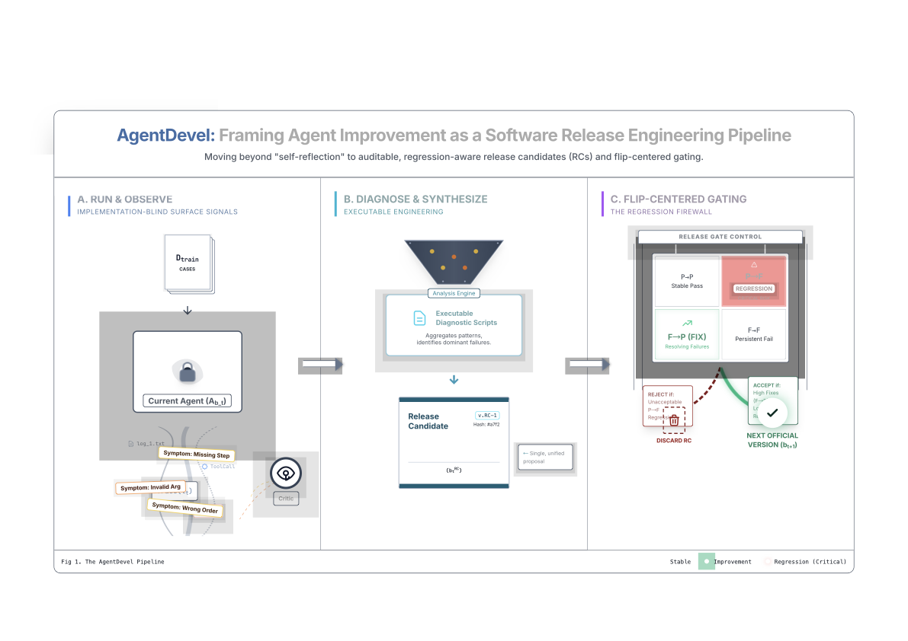

# Paper Assets

## Figure 1: fig:main

Caption: Main pipeline of AgentDevel



## Table 1: tab:main_results

Caption: Main results (primary metric only). Base agent and AgentDevel start from the same initial blueprint b_0.

```tex
[t]
\centering
\small
\setlength{\tabcolsep}{4pt}
\renewcommand{\arraystretch}{1.15}
\begin{threeparttable}

\begin{tabularx}{\columnwidth}{@{}l X S[table-format=2.2]@{}}
\toprule
Benchmark & Method & {Primary metric (\%)} \\
\midrule

\multicolumn{3}{@{}l}{\textbf{SWE-bench Lite} \quad (Resolved $\uparrow$)} \\
& Base agent ($b_0$) & 11.00 \\
& AgentDevel (final) & 22.00 \\
& SWE-agent\tnote{$\dagger$} & 18.00 \\

\addlinespace[2pt]
\multicolumn{3}{@{}l}{\textbf{SWE-bench Verified} \quad (Resolved $\uparrow$)} \\
& Base agent ($b_0$) & 15.00 \\
& AgentDevel (final) & 30.00 \\
& GPT-4o (scaffolded)\tnote{$\dagger$} & 33.20 \\

\addlinespace[2pt]
\multicolumn{3}{@{}l}{\textbf{WebArena} \quad (Success $\uparrow$)} \\
& Base agent ($b_0$) & 17.00 \\
& AgentDevel (final) & 35.50 \\
& CER\_hybrid\tnote{$\dagger$} & 36.70 \\

\addlinespace[2pt]
\multicolumn{3}{@{}l}{\textbf{StableToolBench} \quad (SoWR $\uparrow$)} \\
& Base agent ($b_0$) & 54.00 \\
& AgentDevel (final) & 73.50 \\
& DFS\tnote{$\dagger$} & 70.20 \\

\bottomrule
\end{tabularx}

\begin{tablenotes}[flushleft]
\footnotesize
\item[$\dagger$] Reported numbers from prior work (not rerun under our exact setup/budget).
\end{tablenotes}
\end{threeparttable}
\caption{Main results (primary metric only). Base agent and AgentDevel start from the same initial blueprint $b_0$.}
\label{tab:main_results}
```

## Table 2: tab:gate-summary

Caption: Flip-centered gate summary across iterations on StableToolBench.

```tex
[t]
\centering
\small
\setlength{\tabcolsep}{3pt}
\renewcommand{\arraystretch}{1.12}
\caption{\textbf{Flip-centered gate summary across iterations on StableToolBench.}}
\label{tab:gate-summary}

\begin{tabularx}{\linewidth}{@{}c c r r r r r@{}}
\toprule
Iter. &
Gate &
$\lvert \mathrm{F2P}_t \rvert$ &
$\lvert \mathrm{P2F}_t \rvert$ &
$\rho^{\mathrm{P2F}}_t$ &
hit rate &
\textbf{FTP / P2P} \\
\midrule

0 & --- & --- & --- & --- & --- & --- \\

1 & Acc. & 38 & 4  & 0.006 & 0.74 & 0.12 / 0.98 \\
2 & Acc. & 30 & 5  & 0.007 & 0.78 & 0.20 / 0.979 \\
3 & Rej. & 42 & 28 & 0.040 & 0.41 & 0.28 / 0.93 \\
4 & Acc. & 25 & 3  & 0.004 & 0.81 & 0.32 / 0.978 \\
5 & Acc. & 18 & 4  & 0.005 & 0.83 & 0.36 / 0.977 \\
6 & Acc. & 12 & 3  & 0.004 & 0.86 & 0.39 / 0.977 \\
7 & Rej. & 9  & 15 & 0.021 & 0.52 & 0.41 / 0.955 \\
8 & Acc. & 8  & 2  & 0.003 & 0.88 & 0.44 / 0.976 \\
9 & Acc. & 6  & 2  & 0.003 & 0.90 & 0.46 / 0.975 \\
10 & Acc. & 5 & 2  & 0.003 & 0.92 & 0.47 / 0.974 \\
11 & Rej. & 2 & 3  & 0.004 & 0.67 & 0.48 / 0.97 \\
\bottomrule
\end{tabularx}

\vspace{2pt}
```

## Table 3: tab:ablation

Caption: Ablations on release stability and regression control on WebArena.

```tex
[t]
\centering
\small
\setlength{\tabcolsep}{4pt}
\renewcommand{\arraystretch}{1.10}

\caption{\textbf{Ablations on release stability and regression control on WebArena.}}
\label{tab:ablation}

\begin{tabularx}{\textwidth}{@{}
p{0.26\textwidth}
*{7}{>{\centering\arraybackslash}X}
@{}}
\toprule
\textbf{Setting} &
\makecell{\textbf{Final}\\\textbf{Test}\\\textbf{metric}} &
\makecell{\textbf{Final}\\\textbf{Train}\\\textbf{pass}} &
\makecell{\textbf{Total}\\F$\rightarrow$P} &
\makecell{\textbf{Total}\\P$\rightarrow$F} &
\makecell{\textbf{P$\rightarrow$F}\\\textbf{rate}} &
\makecell{\textbf{Gate}\\\textbf{reject}\\\textbf{rate}} &
\makecell{\textbf{Bad}\\\textbf{release}\\\textbf{count}} \\
\midrule
AgentDevel (full) &
34.2 & 78.5 & 214 & 18 & 3.1\% & 42\% & 0 \\
w/o flip gate &
35.0 & 81.0 & 230 & 95 & 14.8\% & N/A & 4 \\
w/o executable diagnosis &
31.8 & 74.0 & 150 & 22 & 3.9\% & 63\% & 0 \\
critic not blind (critic sees blueprint) &
32.5 & 83.5 & 205 & 40 & 6.7\% & 58\% & 0 \\
\bottomrule
\end{tabularx}

\vspace{2pt}
\footnotesize
\textbf{Notes.}
All settings start from the same initial blueprint $b_0$ with the same data split and budget.
F$\rightarrow$P and P$\rightarrow$F are computed on $D_{\text{train}}$ by comparing each promoted release to its evaluated RC (use a single consistent protocol).
\emph{Bad release count} is the number of promoted updates whose regressions exceed a preset threshold.
For \texttt{w/o flip gate}, reject rate is N/A by design.
```
