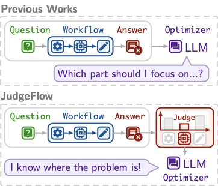
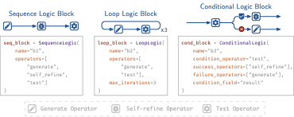
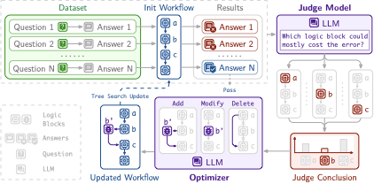
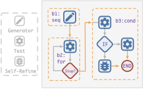

# JudgeFlow: Agentic Workflow Optimization via Block Judge

**Source:** [arXiv:2601.07477v2](https://arxiv.org/abs/2601.07477)  
**Authors:** Zihan Ma, Zhikai Zhao, Chuanbo Hua, Federico Berto, and Jinkyoo Park  
**Latest revision read:** v2, 2 February 2026

## Overview / Takeaway

JudgeFlow optimizes code-represented agent workflows by inserting a diagnostic level between low-level operators and the whole program: sequence, loop, and conditional logic blocks. On every failed training example, an LLM judge ranks all blocks by responsibility; ranks are aggregated across failures, and an LLM optimizer performs one add, remove, or modify operation focused on the most consistently blamed block. Using fixed executor-model weights, the resulting workflows average 82.2 across GSM8K, MATH, MBPP, and HumanEval, 1.4 points above the strongest reported baseline, and reach 44.67 on AIME 2025 versus AFlow’s 42.00. The method’s strongest evidence is faster MBPP optimization plus held-out and cross-benchmark gains, while its central unresolved assumption is judge validity: no experiment measures whether block-level blame matches a ground-truth causal attribution.

## 1. Introduction

1. **Agent systems add a structural optimization target beyond model weights**
LLMs can be embedded in prompts, tools, reasoning loops, and multi-agent communication patterns. Keeping the underlying model parameters fixed and optimizing this surrounding computation can be cheaper than pretraining or fine-tuning.

2. **Handcrafting does not scale with workflow complexity**
Prompts and communication topologies become costly and brittle as tasks require more stages, branching, or iteration. Automating their design is the agent-system analogue of replacing manual machine-learning pipelines with AutoML.

3. **Workflow representations trade expressivity for tractability**
Directed acyclic graphs expose a convenient search space but cannot naturally represent loops and conditional branches. Arbitrary code expresses those structures, yet makes it difficult to locate which portion caused a wrong final answer.

4. **End-to-end scores answer whether a workflow failed, not where**
An optimizer receiving only final accuracy can alter irrelevant code, make low-impact changes, or repeatedly explore weak regions. Conditional execution makes attribution harder because inactive branches produce no trajectory evidence.

5. **Operators are too fine-grained for structural diagnosis**
AFlow encapsulates actions such as generation, testing, and refinement as configurable operators and searches code workflows with an LLM-guided MCTS variant. JudgeFlow keeps these operators but groups them into control-flow units that provide meaningful execution boundaries.

6. **Logic blocks form the intermediate representation**
The three block types are sequential execution, looping, and conditional branching. They retain common code-level control structures while making traces and structural edits easier to describe.

7. **The judge converts failed traces into optimization guidance**
For each incorrect execution, an LLM compares block inputs and outputs with the known correct answer and assigns a unique responsibility rank to every block. Rank 1 means most responsible.

8. **Dataset-level aggregation is intended to suppress noisy judgments**
Individual attributions may be unreliable, so JudgeFlow sums each block’s ranks across all failures and selects the lowest-sum block. This favors a component blamed consistently rather than one blamed strongly in a single outlier.

9. **The optimizer receives both performance and location information**
The overall workflow score preserves the end-to-end objective, while the selected block and its failure log specify where and why to edit. The optimizer is constrained to one targeted structural action.

10. **The method claims sample efficiency through narrower search**
Instead of expanding many globally modified workflows, each iteration diagnoses one weak block and changes its neighborhood or configuration. The MBPP optimization curves provide the principal empirical support for this claim.

Figure 1 contrasts an optimizer that must guess where to act with JudgeFlow’s explicit block-level failure attribution.

## 2. Related Work

### LLM-based (Multi-)Agent Systems

1. **Single-agent foundations interleave reasoning, action, and tools**
ReAct-style agents, tree-structured thought exploration, and tool/API interaction expand what one model call can accomplish. Their prompts and action protocols are usually manually specified.

2. **Multi-agent systems add communication structure**
CAMEL, AutoGen, and MetaGPT assign roles and orchestrate messages among several agents. Strong performance comes with additional choices about topology, turn order, and shared state.

3. **Rigid designs motivate architecture search**
As task complexity grows, a fixed prompt or collaboration graph may be poorly matched to the problem. JudgeFlow treats the workflow itself as the mutable artifact while keeping the LLM engines fixed.

### Agentic Systems Automation

1. **Automation began with prompt-level optimization**
LLM optimizers, PromptBreeder-style self-reference, textual gradients, and self-supervised optimization update instructions while leaving most execution structure unchanged.

2. **Later systems search graphs, modules, code, and supernets**
GPTSwarm adjusts computational graphs, ADAS uses a meta-agent to invent systems, AFlow searches operator workflows, MaAS produces query-specific paths through a supernet, and MermaidFlow evolves declarative graphs under safety constraints.

3. **JudgeFlow directly extends AFlow’s operator vocabulary**
It reuses configurable actions and LLM-based workflow updates, then adds logic blocks and explicit attribution. Its optimization pool is top-$K$ rather than a full unrestricted program archive.

4. **Targeted diagnosis is the claimed differentiator**
Prior methods mostly select or mutate with global task performance. JudgeFlow uses final performance for candidate retention but supplies block-specific error examples to the mutation operator.

5. **Representational constraints remain substantial**
Only three logic types, five supplied operators, and at most three top-level blocks are used. The approach is more expressive than a simple DAG but far narrower than arbitrary code.

### LLM as a Judge

1. **LLM judges scale qualitative evaluation but introduce bias**
Ranking-based methods can improve consistency relative to free-form scores. JudgeFlow adopts a permutation of integer ranks, forcing the judge to distinguish blocks even when several share responsibility.

2. **Agentic systems can evaluate other agentic systems**
Prior work uses agents as evaluators and performs automated failure attribution. JudgeFlow narrows that idea to one workflow’s block trace and immediately feeds the result into search.

3. **Ground-truth answers strengthen attribution**
The judge sees the question, correct answer, wrong answer, workflow definition, and every available block input/output. This supports precise diagnosis but restricts optimization to tasks with labeled or automatically verifiable answers.

4. **Aggregation follows evidence that repeated failures expose stable patterns**
Summing ranks over many failures is intended to average away single-call noise. The paper does not compare this rule with majority voting, calibrated probabilities, judge ensembles, or ground-truth causal labels.

## 3. Methodology

### 3.1 Problem Formulation

1. **A configured operator is an action plus its parameters**
$O(D)$ combines an operator label $O$, such as `generate` or `self_refine`, with configuration $D$, including the LLM backbone, prompt template, and hyperparameters.

2. **A block orchestrates one or more configured operators**
A logic block is $(B,C)$, where block type $B$ belongs to the available set $\mathcal{B}$ and configuration $C$ contains its operators and control parameters.

3. **SequenceLogic implements linear dataflow**
Each operator consumes its predecessor’s output and produces the next state. This block packages one or more steps into a unit with one trace boundary.

4. **LoopLogic implements bounded or condition-driven repetition**
Its operators repeat until a stop condition becomes false or a maximum iteration count is reached. The appendix gives a default maximum of three.

5. **ConditionalLogic implements one condition and two branches**
A designated operator produces the condition field, then only the success or failure operator sequence executes. Attribution is assigned to the whole conditional block rather than an inactive branch.

Figure 2 shows the three block schemas and the generate, self-refine, and test operators that can populate them.

6. **A workflow is an ordered top-level block sequence**
The formal representation is $W=(\lbrace(B_i,C_i)\rbrace_{i=1}^{M},S)$, where $M$ is the block count and $S$ is their top-level execution order. Branching and iteration occur inside individual blocks.

7. **Every block receives the query as well as predecessor state**
For query $q$ and prior state $a'_{i-1}$, block $i$ produces

\[
a'_i=\phi_{\mathrm{exe}}^{(i)}(a'_{i-1},q;B_i,C_i),\qquad i=1,2,\ldots,M.
\]

The initial state is $a'_0=\varnothing$, and the final result is $a'_M$.

8. **Workflow search maximizes expected evaluator score**
Given labeled dataset $\mathcal{D}$ and candidate space $\mathcal{W}$, the objective is

\[
W^*=\underset{W\in\mathcal{W}}{\operatorname{argmax}}\;
\mathbb{E}_{(q,a)\sim\mathcal{D}}
\left[\phi_{\mathrm{eval}}(a'_M,a)\right].
\]

The evaluator compares the final output with ground truth $a$; block ranks guide search but do not replace this objective.

9. **The block abstraction sacrifices within-block credit assignment**
A multi-operator block receives one responsibility rank. This makes optimization tractable but cannot distinguish whether its prompt, operator choice, iteration rule, or one internal branch was the true cause.

### 3.2 JudgeFlow

1. **The outer loop has four stages**
Evaluation executes a candidate workflow, Judge diagnoses failures, Optimization proposes a targeted edit, and Update evaluates and inserts the candidate into a bounded pool.

2. **Successful and failed examples are treated differently**
All scores contribute to overall performance, but only examples below the success threshold invoke the judge and enter a block-specific error log.

3. **The candidate pool preserves several strong alternatives**
Up to $K$ workflows survive by evaluation score. Softmax sampling lets later iterations start from alternatives rather than always extending one canonical best workflow.

Figure 3 visualizes the trace-to-rank diagnostic path and the add/modify/delete update feeding the retained workflow pool.

#### 3.2.1 Evaluation-Judge

1. **Evaluation records every final score**
For each $(q,a)\in\mathcal{D}$, execution returns all block states $\lbrace a_i'\rbrace_{i=1}^{M}$ and the evaluator computes $s=\phi_{\mathrm{eval}}(a'_M,a)$. Scores accumulate in $\mathcal{P}_{\mathrm{scores}}$.

2. **The threshold gates diagnostic cost**
If $s\geq\varepsilon$, JudgeFlow skips attribution. The experiments set $\varepsilon=1$, so only non-perfect executions under the task evaluator are diagnosed.

3. **A failure record contains full workflow context**
The judge receives $Q=(W,q,a,\lbrace a_i'\rbrace_{i=1}^{M})$: workflow definition, input, ground truth, and intermediate trace. It also sees the workflow’s incorrect final answer through the prompt.

4. **Every failed run yields a total responsibility ranking**
The vector $(r_i)_{i=1}^{M}$ uses every integer from 1 to $M$ exactly once. $r_i=1$ identifies the most responsible block; $r_i=M$ identifies the least responsible.

5. **RoundWorst builds block-specific evidence logs**
For each failed instance,

\[
B_{\mathrm{rw}}=\lbrace B_i\mid r_i=1\rbrace,
\]

and the query, answer, and trace are appended only to $\mathcal{L}_{B_{\mathrm{rw}}}$. These examples later become few-shot optimization evidence.

6. **OverallWorst aggregates across all failed executions**
With $T$ failures, the selected block is

\[
B_{\mathrm{sel}}=
\underset{B_k\in W}{\operatorname{argmin}}
\sum_{t=1}^{T}r_k^{(t)}.
\]

A consistently low rank produces the smallest sum. The paper does not state how ties are resolved or what happens when a workflow has no failures.

7. **The judge prompt asks for causal comparison, not stylistic preference**
It identifies the first critical deviation, considers whether later blocks could have repaired it, and uses the counterfactual question of whether a correct block would have made the final answer correct.

8. **Temporal position is deliberately not decisive**
Earlier blocks can be blamed for introducing an error, while later blocks can be blamed for failing to correct it despite sufficient context. This prevents automatic attribution to the first or last stage.

9. **The output contract is JSON-only**
Block names map to unique integer ranks with no explanation. This makes parsing reliable but discards the judge’s reasoning, confidence, and uncertainty from downstream auditing.

10. **Rank aggregation is robust only under specific noise assumptions**
Summation helps if errors are roughly independent and the true weak block tends to receive lower ranks. Systematic judge bias toward certain block types, positions, or verbose traces will persist or amplify.

11. **No direct attribution benchmark is reported**
Performance improvements are indirect evidence that the signal is useful. The study never labels a known faulty block and measures judge accuracy, rank correlation, calibration, or causal repair success.

#### 3.2.2 Optimization-Update

1. **The optimizer receives a sharply scoped input**
The current workflow, selected block, one action, and sampled examples from that block’s error log produce

\[
W'\leftarrow
\operatorname{Optimizer}
\left(W,B_{\mathrm{sel}},A,
\operatorname{sample}(\mathcal{L}_{B_{\mathrm{sel}}})\right).
\]

2. **Add Block inserts a new neighbor**
The optimizer creates a new configured block immediately before or after the selected weak block. This can introduce a preparation, verification, or refinement stage without rewriting the blamed component.

3. **Remove Block deletes a harmful stage**
The selected block and its incident edges are removed, while predecessor and successor are reconnected to preserve top-level sequential flow.

4. **Modify Block changes the weak block in place**
The map $C_{\mathrm{sel}}\mapsto C'_{\mathrm{sel}}$ can alter block type, operator choice, ordering, prompts, and block parameters while keeping its role in the sequence.

5. **Exactly one strategy is applied per optimization attempt**
The prompt forbids global rewrites and requires focus on the blamed block. It also bans configurations already present in optimization history and asks for a novelty check.

6. **Workflow size is capped at three blocks**
The experimental constraint $M\leq3$ bounds structural complexity and judge context. It also makes the unique ranking problem much easier than attribution in large production workflows.

7. **Candidate retention remains end-to-end**
After evaluating $W'$ for score $P_{W'}$, the pool update is

\[
\mathcal{W}_{\mathrm{pool}}\leftarrow
\operatorname{TopK}
\left(\mathcal{W}_{\mathrm{pool}}\cup
\lbrace(W',P_{W'})\rbrace\right).
\]

Block diagnosis guides candidate generation, but only final task performance decides survival.

8. **Softmax sampling balances exploitation and branching**
For score $s_i$ and temperature $\tau$,

\[
\Pr(W_i)=
\frac{\exp\!\left((s_i-\max_j s_j)/\tau\right)}
{\sum_{k=1}^{|\mathcal{W}_{\mathrm{pool}}|}
\exp\!\left((s_k-\max_j s_j)/\tau\right)}.
\]

Subtracting the maximum stabilizes exponentiation. The paper does not report the value of $\tau$, a material reproducibility omission.

9. **The pool is a small performance archive**
With $K=3$, it preserves alternatives but discards all except the three highest-scoring candidates. It has no novelty objective, ancestry analysis, held-out release gate, or explicit complexity penalty.

10. **The optimizer may overfit the selected failure examples**
The prompt warns against overfitting and includes previous workflow history, yet structural proposals are generated from samples of training failures. Held-out test curves and cross-benchmark transfer are therefore essential checks.

## 4. Experiments

### 4.1 Experimental Setups

#### Benchmarks

1. **Three datasets test mathematical reasoning**
GSM8K covers grade-school word problems, MATH covers harder competition-style problems, and AIME 2025 supplies a substantially more difficult contest benchmark.

2. **Two datasets test code generation**
MBPP and HumanEval are evaluated with pass@1. Math benchmarks use solve rate.

3. **Optimization and evaluation use train/test splits**
The workflow is optimized on training examples and reported on test examples following prior workflow-search studies. The paper does not provide split sizes, task IDs, or sampling details.

#### Baselines

1. **Single-agent baselines cover prompt complexity**
Input–output prompting, chain-of-thought, and self-consistency separate gains from ordinary inference-time reasoning strategies.

2. **Handcrafted systems cover multi-agent coordination**
SELF-REFINE, LLM-Debate, LLM-Blender, and DyLAN represent manually designed refinement, debate, ensembling, and dynamic collaboration. MultiPersona is named in setup but absent from the main result table.

3. **Autonomous design baselines are the closest comparison**
GPTSwarm, ADAS, AFlow, MaAS, and MermaidFlow search or adapt workflow structures. MermaidFlow is the strongest average baseline in the reported table.

4. **AFlow is the primary mechanism baseline**
It shares configurable operators and LLM-driven workflow search but lacks JudgeFlow’s block-level attribution signal, making its optimization curve more informative than comparisons to unrelated systems.

#### Implementation Details

1. **Main four-benchmark experiments use GPT-4o-mini-0718**
Table 1 states that execution and workflow optimization results are obtained with this model and averaged over three independent runs.

2. **AIME uses GPT-4.1-mini**
Its reported 44.67 result is averaged over five independent runs. The plot shows error bars of $\pm2.78$ for JudgeFlow and $\pm5.00$ for AFlow, but does not define whether these are standard deviation, standard error, or another interval.

3. **Search lasts 20 iterations**
Each round evaluates, diagnoses, proposes one targeted update, scores the candidate, and updates the pool.

4. **Three hyperparameters sharply bound search**
The system uses $M\leq3$ blocks, success threshold $\varepsilon=1$, and candidate pool size $K=3$. Judge-sampling count, pool temperature $\tau$, and error-example sample size are not specified.

5. **Model role wording is incomplete**
The setup names GPT-4o-mini and GPT-4.1-mini as optimization, judge, and execution LLMs, while captions clarify GPT-4o-mini for the four main tasks and GPT-4.1-mini for AIME. API versions, decoding temperatures, and prompts for the underlying operators are not fully specified in the main text.

### 4.2 Experimental Results

1. **JudgeFlow leads every column in the four-task table**
It scores 93.0 on GSM8K, 58.5 on MATH, 83.8 on MBPP, and 93.4 on HumanEval, averaging 82.2.

| Method | GSM8K | MATH | MBPP | HumanEval | Average |
| --- | ---: | ---: | ---: | ---: | ---: |
| IO | 87.8 | 48.6 | 73.9 | 87.0 | 74.3 |
| CoT | 87.0 | 48.8 | 74.2 | 88.6 | 74.7 |
| CoT self-consistency | 86.9 | 50.4 | 73.3 | 91.6 | 75.6 |
| SELF-REFINE | 85.5 | 46.1 | 71.8 | 87.8 | 72.8 |
| LLM-Debate | 89.5 | 48.6 | 70.3 | 88.8 | 74.3 |
| LLM-Blender | 88.4 | 46.9 | 77.1 | 88.7 | 75.3 |
| DyLAN | 90.0 | 48.5 | 77.3 | 90.4 | 76.6 |
| GPTSwarm | 89.1 | 47.9 | 77.4 | 89.3 | 75.9 |
| ADAS | 88.4 | 43.2 | 77.1 | 84.2 | 73.2 |
| AFlow | 90.1 | 52.8 | 81.7 | 90.1 | 78.7 |
| MaAS | 91.5 | 52.2 | 82.2 | 91.6 | 79.4 |
| MermaidFlow | 92.4 | 55.4 | 82.3 | 92.9 | 80.8 |
| **JudgeFlow** | **93.0** | **58.5** | **83.8** | **93.4** | **82.2** |

2. **MATH supplies the largest gain over the strongest baseline**
JudgeFlow exceeds MermaidFlow by 3.1 points, a 5.6% relative improvement over 55.4.

3. **MBPP gains 1.5 points**
The 83.8 score is 1.8% relatively above MermaidFlow’s 82.3.

4. **Simpler tasks show smaller but consistent improvements**
GSM8K rises 0.6 points from 92.4 to 93.0, and HumanEval rises 0.5 from 92.9 to 93.4.

5. **Average improvement is 1.4 points**
The 82.2 average is 1.7% relatively above MermaidFlow’s 80.8. Three-run averaging improves reliability, but standard deviations are not reported in the table.

6. **AIME provides a harder separate test**
JudgeFlow averages 44.67 versus AFlow’s 42.00 over five independent runs, an absolute gain of 2.67 points.

| Method | AIME 2025 mean | Plotted uncertainty |
| --- | ---: | ---: |
| AFlow | 42.00 | $\pm5.00$ |
| JudgeFlow | **44.67** | $\pm2.78$ |

7. **The AIME result is less fully contextualized**
Only AFlow is shown, and the source does not define the uncertainty statistic or provide a significance test. The lower JudgeFlow error bar is suggestive but not a formal robustness claim.

### 4.3 Analysis

#### Best Performing Workflow

1. **The discovered MBPP workflow uses all three logic types**
Block `b1` is a sequence with `generate`, `b2` is a loop that repeatedly calls `test` until stopping, and `b3` is a conditional that tests correctness and routes failures to `self_refine`.

2. **Generation, verification, and repair have separate boundaries**
The representation lets the judge distinguish a poor initial program from ineffective testing or unsuccessful refinement, while each block can still contain internal operator logic.

3. **The best workflow saturates the three-block cap**
Its structure demonstrates the expressivity of the available templates but does not show how JudgeFlow behaves when useful workflows require more stages.

Figure 5 depicts the best MBPP workflow with sequential generation, iterative tests, and conditional refinement.

#### Ablation

1. **Judge guidance changes the first five iterations**
JudgeFlow test pass@1 starts at 73.90%, jumps to 80.35% at iteration 4, and reaches 83.28% at iteration 5. AFlow stays near 73.02% over the same period.

2. **JudgeFlow continues improving after its early jump**
Its test curve reaches 84.16% at iteration 10 and 85.63% at iteration 16, then remains there through iteration 20.

3. **AFlow improves only near iteration 18**
Its test score remains approximately 73.02% through iteration 17, then rises to 80.65%. Its training curve similarly moves from 74.42% to 80.23% at iteration 18.

| Method/split | Iteration 1 | Iteration 5 | Iteration 10 | Iteration 16 | Iteration 20 |
| --- | ---: | ---: | ---: | ---: | ---: |
| JudgeFlow train | 73.26% | 83.72% | 83.72% | 84.88% | 84.88% |
| JudgeFlow test | 73.90% | 83.28% | 84.16% | 85.63% | 85.63% |
| AFlow train | 74.42% | 74.42% | 74.42% | 74.42% | 80.23% |
| AFlow test | 73.02% | 73.02% | 73.02% | 73.02% | 80.65% |

4. **The curve supports sample efficiency but is one benchmark trace**
Rapid held-out gains are consistent with better candidate targeting. The paper does not show equivalent iteration curves for GSM8K, MATH, HumanEval, or AIME, nor variation across repeated optimization runs.

5. **The ablation does not isolate every component**
JudgeFlow combines logic-block representation, ranking, aggregation, targeted prompts, and pool update. The comparison to AFlow does not separately remove block abstraction, replace ranks with scalar blame, or randomize the selected block.

#### Impact of LLMs

1. **The executor remains GPT-4o-mini-0718**
Only the judge and optimizer model are varied together, so the result measures the combined diagnostic-and-update backend rather than either role independently.

2. **Larger alternatives improve MBPP modestly**
GPT-4o yields 84.5, Gemini 2.5 Flash yields 84.4, and GPT-4o-mini yields 83.8.

| Judge and optimizer model | MBPP score |
| --- | ---: |
| GPT-4o-mini | 83.8 |
| GPT-4o | **84.5** |
| Gemini 2.5 Flash | 84.4 |

3. **Model capacity is not cleanly established as the cause**
The table has no token budget, cost, latency, decoding, or repeated-run uncertainty, and changes two roles simultaneously. It shows compatibility with three backends and a narrow score range.

#### Cross-benchmark Generalization

1. **Math transfer optimizes on MATH and tests zero-shot on GSM8K**
JudgeFlow reaches 92.89 versus AFlow’s 91.95, a 0.94-point gain.

2. **Code transfer optimizes on MBPP and tests on HumanEval**
JudgeFlow reaches 93.89 versus AFlow’s 90.84, a 3.05-point gain.

| Optimization benchmark $\rightarrow$ zero-shot benchmark | AFlow | JudgeFlow |
| --- | ---: | ---: |
| MATH $\rightarrow$ GSM8K | 91.95 | **92.89** |
| MBPP $\rightarrow$ HumanEval | 90.84 | **93.89** |

3. **Transfer supports reusable structure rather than memorized items**
The optimized workflow moves across datasets in the same broad domain without further search. The paper does not test transfer across domains, such as MATH to code or MBPP to math.

#### Optimization Cost

1. **Judging is cheap relative to evaluation in one GSM8K round**
Evaluation costs \$0.45 and the judge costs \$0.01, so the judge/evaluation ratio is about 2.2%, reported as approximately 2%.

2. **The cost claim is partial**
The paper does not include the optimizer call, workflow execution latency, total 20-round cost, failed-example count, or costs on other benchmarks. It establishes marginal judge-call cost, not total search efficiency.

3. **Failure rate controls judge expense**
Only unsuccessful examples invoke attribution. As workflows improve, fewer judge calls may be required, but the paper does not plot this quantity across iterations.

### 4.4 Case Study

1. **The initial GSM8K workflow has two sequence blocks**
`b1` uses `multi_generate_ensemble` with `num_solutions=3`, and `b2` uses `programmer` to turn the selected reasoning into executable Python and a final answer.

2. **Per-example ranks can disagree**
One failure produces `{"b2":1,"b1":2}`, while another produces `{"b1":1,"b2":2}`. The method expects such variation and makes no update from one case alone.

3. **Aggregated ranks select the generation block**
Across failures, `b1` has the smaller summed rank and becomes `OverallWorst`. The diagnostic interpretation is that low-quality candidate ideas constrain the downstream programmer.

4. **The optimizer chooses Add Block**
A new sequence block `b3` containing `self_refine` is inserted between generation and programming. The workflow changes from `["b1","b2"]` to `["b1","b3","b2"]`.

5. **The edit responds to the diagnosed bottleneck**
Rather than modifying the final programmer, the system improves candidates before they reach it. This is a plausible causal repair aligned with the rank aggregation.

6. **The case study demonstrates mechanism, not attribution accuracy**
The paper does not report before/after scores for this individual workflow or compare the chosen block with counterfactual edits to `b2`. It illustrates traceability but does not validate the judge’s causal claim.

Figure 7 shows the conflicting per-run ranks, aggregate selection of `b1`, and insertion of the self-refinement block.

## 5. Conclusion

1. **JudgeFlow’s contribution is a credit-assignment interface for workflow search**
Logic blocks turn code control structures into judgeable units, and rank aggregation turns failure traces into one edit target.

2. **End-to-end performance remains the final authority**
The judge affects which candidates are proposed, while evaluator score determines the top-three pool. This protects search from accepting a persuasive but ineffective diagnosis without benchmark improvement.

3. **The reported gains are broad but modest**
JudgeFlow leads all four main columns by 0.5 to 3.1 points and AIME by 2.67 points. Faster MBPP improvement is more diagnostic of the method than the final table alone.

4. **The main limitation is an unvalidated judge**
There is no ground-truth failure-attribution dataset, judge ensemble, confidence score, or robustness test against misleading traces. The paper’s only explicit future direction is a more robust judge.

5. **Search complexity is intentionally small**
Three blocks, five operators, a top-three pool, and 20 iterations make attribution and optimization manageable. Scaling to dozens of blocks, nested structures, tools, shared state, or multi-agent conversations is untested.

6. **Optimization relies on privileged supervision**
The judge receives the correct answer for every failure. Application to open-ended research, subjective generation, or environments without reliable verifiers would require a different diagnostic signal.

7. **Release discipline is not separated from training fitness**
The paper reports held-out tests, but does not describe a final immutable validation set, complexity/cost objective, workflow safety review, or canonical release criterion beyond performance.

## Impact Statement

1. **No specific societal consequence is analyzed**
The impact statement says the work advances machine learning and identifies no consequence that requires highlighting.

2. **Automated workflow optimization has plausible dual-use effects**
More capable workflows can improve benign reasoning and code generation, but the same optimizer could amplify unsafe agent behavior. This is an analytical implication, not an experiment in the paper.

3. **Safety is not part of JudgeFlow’s objective**
Unlike safety-constrained workflow search, the top-$K$ pool ranks candidates only by task evaluation score. The optimizer prompt enforces syntax, novelty, and a three-block limit, not behavioral safety.

4. **One operator has an explicit execution boundary**
The `programmer` operator runs generated Python in a restricted environment. No comparable sandbox, permission, or adversarial evaluation is described for the workflow optimizer as a whole.

## Appendix A. Operators

1. **`generate` creates candidate solutions**
It conditions on the problem and optionally previous results. Its prompt and LLM are part of configuration $D$.

2. **`test` executes candidates and produces feedback**
It supports verification loops and conditional routing, particularly in the best MBPP workflow.

3. **`self_refine` revises an existing solution**
It is used as a repair stage in both the discovered MBPP workflow and GSM8K case study.

4. **`multi_generate_ensemble` applies self-consistency**
It generates multiple candidates and combines them into a selected solution. The GSM8K case uses three candidates.

5. **`programmer` uses code as a reasoning tool**
It synthesizes Python for math problems, executes it in a restricted environment, and repairs errors iteratively.

6. **The operator vocabulary is inherited**
The five actions come from AFlow, MaAS, and MermaidFlow rather than being discovered by JudgeFlow. Search recomposes and reconfigures them.

## Appendix B. Logic Blocks

1. **SequenceLogic has no optional fields**
Its JSON schema contains a name, type `seq`, and an ordered operator-alias array.

2. **LoopLogic adds iteration and an optional condition**
It uses type `for`, defaults to three maximum iterations, and can stop based on a named output field equaling a configured value.

3. **ConditionalLogic has one condition operator and two operator lists**
The optional `condition_field` defaults to `result`; the selected branch then uses sequence-style data passing.

4. **Schemas constrain the optimizer’s output**
The LLM emits parseable JSON rather than arbitrary Python. This improves structural validity but limits custom control logic not expressible by the three templates.

5. **Top-level flow is still sequential**
The workflow list orders blocks, while loop and branch semantics are encapsulated inside them. Cross-block cycles or general graphs are not represented.

## Appendix C. Judge Prompt

1. **The system role is workflow failure analyst**
It receives dynamically inserted descriptions of available blocks and operators, grounding judgments in the actual search vocabulary.

2. **The prompt privileges mistakes over redundancy**
A block that introduces or fails to repair the critical error should rank worse than a block that merely adds unnecessary work.

3. **Evidence includes correct and incorrect outputs**
The user message supplies the problem, correct answer, wrong answer, workflow structure, XML trace, and block list.

4. **Responsibility includes propagation and missed correction**
The judge checks output versus input and ground truth, where deviation begins, how it is amplified, and whether a later block had sufficient information to recover.

5. **Counterfactual reasoning breaks apparent ties**
The prompt asks whether making one block correct would make the final answer correct. The total-rank contract nevertheless forbids actual ties or shared blame.

6. **JSON-only output aids automation but weakens auditability**
Natural-language reasoning remains internal and is not logged. A rank can be consumed reliably, but a human cannot inspect why it was assigned.

7. **Prompt robustness is not tested**
There are no ablations for removing the correct answer, hiding block order, perturbing traces, changing responsibility principles, or using multiple judges.

## Appendix D. Optimization Prompt

1. **The optimizer is explicitly limited to the weak block**
It receives selected-block output from error cases, current workflow JSON, score, and previous optimization history.

2. **Instruction text is treated as a major optimization parameter**
The prompt emphasizes task-specific reasoning guidance, output format, and quality standards for code and math operators.

3. **Add, remove, and modify are mutually exclusive**
Exactly one strategy must be selected. Add creates a new named block adjacent to the target, remove reconnects the remaining flow, and modify rewrites the selected block.

4. **The three-block maximum is enforced in the prompt**
The optimizer must inspect the current count before adding. Structural validity is primarily instruction-based rather than described as a formal post-generation checker.

5. **Compatibility is part of the contract**
Each block should have a distinct purpose, and the proposed change must preserve interfaces with neighboring blocks.

6. **History supplies a diversity constraint**
Prior workflows and the current workflow are prohibited outputs, and an internal novelty check asks for at least two structural differences from banned configurations.

7. **Only one attempt is allowed per optimizer call**
The LLM must reason internally and emit clean JSON with no explanation. Invalid, unsafe, or semantically incompatible proposals are not discussed as failure modes.

8. **Few-shot errors can guide or overfit**
The prompt asks for patterns that generalize across the dataset and explicitly warns against matching the supplied examples too closely. No ablation varies the number or selection of sampled errors.
