# Continual Harness: Online Adaptation for Self-Improving Foundation Agents

**Source:** [arXiv:2605.09998v1](https://arxiv.org/abs/2605.09998v1) — Seth Karten, Joel Zhang, Tersoo Upaa Jr, Ruirong Feng, Wenzhe Li, Chengshuai Shi, Chi Jin, and Kiran Vodrahalli; submitted 11 May 2026.

## Overview / Takeaway

Continual Harness turns an agent's scaffold—not only its model weights—into mutable state that can be repaired while one long episode is still running. A same-model Refiner periodically rewrites the system prompt, sub-agents, executable skills, and persistent memory after inspecting recent failures, while an optional second loop uses process rewards and a frontier teacher to update an open model between 256-step blocks without resetting the emulator. On Pokémon Red and Emerald, the mechanism helps Gemini 3.1 Pro substantially and reduces the Pro median Emerald API cost from \$215 to \$130 at essentially complete coverage, but it is mixed for Flash and harmful for Flash-Lite. The paper also documents the human-refined Gemini Plays Pokémon lineage and reports five advancing Gemma-4 co-learning trajectories, though the latter do not isolate policy learning from continued play and harness refinement. The central lesson is therefore conditional: runtime scaffold editing can be useful, but it needs a sufficiently capable editor, component-reuse discipline, reliable evaluators, and stronger controls than this first game-domain study supplies.

## Reading map

1. **The paper has three evidentiary layers.**
The historical Gemini Plays Pokémon (GPP) study motivates the method through human-in-the-loop harness edits; the frontier-model experiments test an automated runtime Refiner; and the open-model experiments add intermittent weight updates. These layers should not be conflated: only the latter two implement Continual Harness, and only the last changes model weights.

2. **The main contribution is a mutable runtime substrate.**
The edited object is the full harness \(\mathcal H=(p,\mathcal G,\mathcal K,\mathcal M)\): prompt, sub-agents, skills, and memory. The model itself remains fixed in the frontier-model experiments, so improvement there is in-context adaptation mediated by persistent external state.

3. **The strongest quantitative result is capability-dependent cost efficiency.**
Gemini 3.1 Pro with a from-scratch Continual Harness reaches all 31 Emerald milestones at a \$130 median cost versus 98% at \$215 for the minimalist harness, about a 40% reduction. The same mechanism fails to dominate for Flash and pushes Flash-Lite below its minimalist baseline.

4. **The strongest mechanistic result is the pathfinding trace.**
Evolved navigation skills move from roughly a 50% path-cost penalty toward a single-digit deficit relative to a Dijkstra oracle while accumulating hundreds of invocations. This is more diagnostic than final milestone performance because it measures one mutable component against an explicit target.

5. **Two internal reporting tensions matter.**
The main text says Red bootstrap-updating beats from-scratch at every monitored milestone, whereas Appendix C says it later falls below both from-scratch and \(\mathcal H_{\min}\) around step 213 when it abandons inherited sub-agents. The training appendix also calls the 31B Red SFT checkpoint the online initialization, while the reset-free DAgger discussion elsewhere describes a 26B SFT initial policy; conclusions about the exact student checkpoint should remain qualified.

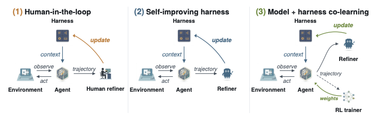

*Figure 1. The authors' three-stage framing. The topology is intentionally constant; the identity of the refiner and whether model weights update are what change.*

## 1. Introduction

6. **Coding-agent scaffolds motivate an embodied-agent analogue.**
Coding systems routinely wrap a foundation model with tools, memory, planning, and persistent workspace state. The paper argues that long-horizon embodied agents have no comparably mature general scaffold, and cites the PokeAgent Challenge result that frontier vision-language models make little RPG progress without domain-specific assistance.

7. **GPP supplies the empirical origin story, not a clean automated-method evaluation.**
The authors report completions of Pokémon Blue in May 2025, Yellow Legacy on hard mode in August 2025, and Crystal in November 2025. Those runs mixed human-authored scaffolding, live human refinement, and later agent-created components over thousands of gameplay hours, so they demonstrate the value of iterative harness work but do not by themselves validate autonomous self-improvement.

8. **Continual Harness moves refinement inside a single episode.**
Every \(F\) steps after a warm-up of \(W\) steps, a Refiner examines the recent trajectory and edits the live harness. This contrasts with prompt optimizers that evaluate whole episodes and restart before applying the next candidate.

9. **The claimed contributions span runtime and training timescales.**
The paper claims: multiple full-game GPP completions; automated reset-free harness construction from a minimal interface; recovery of much of the expert-harness efficiency gap on Red and Emerald; and sustained open-model milestone progress when the live harness is coupled to process-reward relabeling and soft SFT.

## 2. Preliminaries

### 2.1 Embodied Agent Environments

10. **The observation is minimal relative to an expert harness, but it is not raw pixels alone.**
At step \(t\), the agent receives a rendered frame \(o_t\) plus an ASCII local map \(m_t\), then selects a button action \(a_t\in\mathcal A\). The map exposes nearby geometry, walkable positions, NPCs, interactables, and facing direction; it omits objectives, walkthroughs, global maps, pathfinding, and hidden mechanics. This engineered text channel compensates for current models' weak visual spatial reasoning and should be counted as scaffold.

11. **Partial observability is central to the setup.**
NPC intent, battle mechanics, and unobserved regions remain hidden. Successful behavior therefore requires accumulating local information, remembering discoveries, and repairing mistaken abstractions during a long trajectory.

### 2.2 Agentic Harnesses

12. **The harness is explicitly factorized into four editable stores.**
The paper defines

$$
\mathcal H=(p,\mathcal G,\mathcal K,\mathcal M),
$$

where \(p\) is the system prompt, \(\mathcal G\) a set of specialized sub-agents, \(\mathcal K\) reusable textual or executable skills, and \(\mathcal M\) persistent memory. Fixed meta-tools such as agent definition, code execution, and memory processing expose create/read/update/delete operations on these stores.

13. **Three harness conditions establish the comparison.**
The exact settings and reported values make the relevant comparison concrete.

| Condition | Starting contents | Runtime refinement |
|---|---|---|
| \(\mathcal H_{\min}\) | Frame, local map, buttons, generic prompt; no authored skills, sub-agents, or memory | No |
| \(\mathcal H_{\mathrm{expert}}\) | Hand-built PokeAgent/GPP scaffold with A* pathfinding, type chart, damage calculator, curated objectives, and sub-agents | Fixed for evaluation |
| \(\mathcal H_{\mathrm{CH}}\) | Same starting point as \(\mathcal H_{\min}\) | Refiner edits all four stores |

14. **The expert harness is both an upper reference and a source of asymmetry.**
Its privileged game knowledge and engineered tools make it a useful efficiency target, but it is not a compute- or information-matched baseline. Recovering part of the gap shows scaffold synthesis can substitute for some manual engineering; it does not show equivalence to expert domain knowledge.

## 3. Methodology

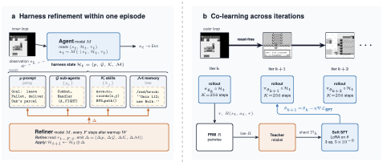

*Figure 2. Within an episode, the Refiner changes harness state. Across co-learning iterations, a PRM and teacher drive intermittent model-weight updates while emulator state persists.*

### 3.1 Overview and Two-Loop Architecture

15. **The inner loop acts; the outer loop edits.**
Let \(s_t=(o_t,m_t)\). The agent model wrapped by \(\mathcal H_t\) maps current state and trajectory context to \(a_t\). Periodically the Refiner maps a recent window \(\tau_{t-F:t}\) to an edit bundle

$$
\Delta=(\Delta p,\Delta\mathcal G,\Delta\mathcal K,\Delta\mathcal M),
$$

and applies

$$
\mathcal H_{t+1}=\mathcal H_t\oplus\Delta.
$$

Prompt text is replaced or revised, while the three stores receive CRUD-style operations.

16. **Agent and Refiner share a model but differ in timing and context.**
Frontier experiments use the same Gemini 3.1 variant for action and refinement. This makes model capability a joint bottleneck: a weak model must both use the scaffold and diagnose/edit it, explaining why refinement can compound error rather than correct it.

17. **The paper does not expose key cadence details.**
It formalizes refinement frequency \(F\) and warm-up \(W\), yet does not report concrete experimental values for them in the methods or appendix. That omission impedes exact replication and makes refiner overhead difficult to separate from agent effort.

### 3.2 Refinement Loop

18. **Each refinement cycle looks for operational failure signatures.**
The Refiner searches for navigation loops, failed tool calls, stalled objectives, and missed exploration. It then performs four passes: prompt repair; sub-agent creation/editing/deletion; successful-sequence codification and executable-skill repair; and memory addition, updating, or importance demotion.

19. **Persistence is the mechanism behind reset-free compounding.**
An edit affects the very next agent step and stays available later in the same emulator episode. Earlier failure evidence also remains in trajectory or persistent stores, enabling repairs to target failures that arise only deep in the game.

20. **“Monotonic accumulation” applies to accessible evidence, not harness contents.**
The authors describe refinement information as accumulating monotonically, but \(\mathcal G\), \(\mathcal K\), and \(\mathcal M\) can be deleted, overwritten, or demoted. The safer interpretation is that historical failure signatures remain potentially accessible; the operational scaffold itself can regress, as the Red bootstrap result demonstrates.

21. **Runtime code generation creates both leverage and a control problem.**
The same API that lets the system write pathfinders and wrappers can preserve schema errors, duplicate brittle agents, or exploit sandbox loopholes. The method has no learned release gate or rollback policy separating experimental edits from a stable canonical harness.

### 3.3 Continual Model-Harness Co-Learning Loop

22. **Co-learning adds a slower weight-update loop.**
In online iteration \(k\), policy \(\pi_{\theta_k}\) plays for \(K=256\) steps inside the live-refining harness. A pairwise process reward model scores transitions,

$$
R(s_t,a_t,\tau)\in[0,1],
$$

Low-scoring windows are relabeled by Gemini 3.1 Pro, and soft SFT produces \(\theta_{k+1}\). Thus \(\mathcal H_t\) changes within an iteration while \(\theta_k\) changes between iterations.

23. **“Online” means sequential data collection and persistent environment state, not one-step gradient updates.**
The emulator snapshot at iteration \(k\)'s end becomes iteration \(k+1\)'s start, and newly collected on-policy data drives the next update. But learning still occurs in 256-step batches, after offline scoring and frontier-teacher relabeling.

24. **The trajectory distribution co-adapts with both mutable objects.**
Policy actions determine the visited states; those states expose failures to the Refiner; harness edits alter later observations and actions; and relabeled data changes the policy. This coupling is the conceptual novelty, but it also makes causal attribution difficult without fixed-policy, fixed-harness, and no-update controls at equal interaction budgets.

## 4. Experiments

### 4.1 Setup

25. **Evaluation covers two milestone suites and multiple capability levels.**
Red has 18 canonical milestones through the third gym and Emerald has 31 through the third gym. The frontier study uses Gemini 3.1 Pro, Flash, and Flash-Lite; the open transfer study considers Gemma-4 E2B, E4B, 26B MoE, and 31B dense. Every stated experimental condition uses at least three seeds, with median curves and faint per-seed traces.

26. **Button presses are the primary environment-efficiency metric.**
Every button is counted, including buttons batched into a tool call. The API-cost plot separately uses dollar spend with cached input priced at 25%, allowing a performance–compute view but not capturing historical human engineering, training cost, or all infrastructure overhead.

27. **Bootstrap variants test cross-run scaffold transfer.**
Bootstrap-frozen loads the terminal stores from a successful from-scratch run and disables edits. Bootstrap-updating loads the same stores and keeps the Refiner active. Both reset game state, so this experiment studies harness transfer across episodes even though each individual run remains reset-free after it starts.

### 4.2 Gemini Plays Pokémon completes multiple RPGs

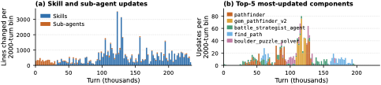

*Figure 3. Human/agent mixed GPP harness updates continue throughout Yellow Legacy and concentrate on a few repeatedly revised components.*

28. **GPP shows that harnesses continue changing deep into long runs.**
Yellow Legacy logs contain prompt, skill, and sub-agent CRUD operations throughout play rather than a quick convergence to a fixed design. Most updates concentrate on a small number of navigation and battle components.

*Figure 4. The battle strategist alternates between expansion and simplification before logic is reorganized under a master agent.*

29. **Structural complexity is non-monotone.**
Across 14 battle-agent checkpoints, node count, decision gates, graph depth, and fan-out grow, shrink, and reorganize. The pattern supports iterative architecture revision rather than a simplistic “more prompt equals better” story, although completion—not a component-level counterfactual—supplies the quality signal.

30. **Several emergent behaviors expose the power and fragility of meta-tools.**
Agents built pathfinders, named battle strategies, and a truth-table representation of a switch puzzle. They also wrapped an `autopress_buttons` sandbox loophole into a general sequence primitive, evidence that open-ended tool construction can discover unintended affordances as readily as useful skills.

### 4.3 Continual Harness closes the gap to a hand-engineered harness

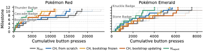

*Figure 5. Median milestone staircases with per-seed traces. The displayed subsets cover 11 Red milestones through Thunder Badge and 9 Emerald milestones through Knuckle Badge.*

31. **Automated refinement usually lowers interaction cost for the monitored frontier-model runs.**
On both games, Continual Harness curves reach monitored milestones with fewer cumulative button presses than \(\mathcal H_{\min}\) and close much of the visual gap to \(\mathcal H_{\mathrm{expert}}\). The remaining gap clusters around dialogue-heavy interiors and multi-turn battle strategy, areas the Refiner does not reliably synthesize.

32. **The paper does not provide a scalar “gap recovered” statistic.**
“A majority” is inferred from milestone curves rather than reported as one aggregate with uncertainty. Per-milestone medians and traces are useful, but readers cannot reconstruct a single robust recovery percentage from the text alone.

33. **Red bootstrap reporting is internally inconsistent.**
Section 4.3 says bootstrap-updating is more efficient than from-scratch at every Red milestone. Appendix C.2.1 instead says the same condition drifts below from-scratch and then below \(\mathcal H_{\min}\) around step 213 as inherited sub-agent use collapses. The appendix's component evidence makes regression plausible; the stronger main-text generalization should therefore be treated as applying only to the displayed monitored range or as requiring correction.

### 4.4 Continual Harness gain depends on model capability

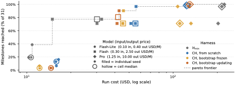

*Figure 6. Individual 24-hour seeds and per-cell medians across 31 Emerald milestones; cached input is priced at 25%.*

34. **Gemini 3.1 Pro receives the clearest Pareto improvement.**
The exact settings and reported values make the relevant comparison concrete.

| Model / harness | Median milestones | Median API cost | Interpretation |
|---|---:|---:|---|
| Pro, \(\mathcal H_{\min}\) | 98% | \$215 | High completion, highest median cost |
| Pro, CH from scratch | 100% | \$130 | About 40% cheaper with no completion loss |
| Pro, CH bootstrap variants | 96–100% | \$110–\$140 | Similar Pareto-efficient region |
| Flash, \(\mathcal H_{\min}\) | 77% | \$30 | Cheap baseline |
| Flash, CH bootstrap-updating | 80% | \$42 | Slight completion gain at higher cost; high variance |
| Flash-Lite, \(\mathcal H_{\min}\) | 20% | \$11 | Weak but best Lite condition |
| Flash-Lite, any CH | 3–13% | Comparable or higher | Refinement harms completion |

35. **A capable editor is a precondition, not a side detail.**
A weaker model can write low-quality components, fail to invoke useful components, or spend tokens on refinement without recovering the cost. The observed transition from dominance to mixed benefit to harm is direct evidence against treating more self-modification as uniformly beneficial.

36. **Cost accounting is useful but incomplete.**
The plot includes live Gemini API spend, apparently including Refiner calls, and states its cache-price convention. It does not include the costs of developing the interface, collecting the GPP foundation harness, training open models, or operating the evaluator stack.

### 4.5 Open-source students co-learn with a refining harness

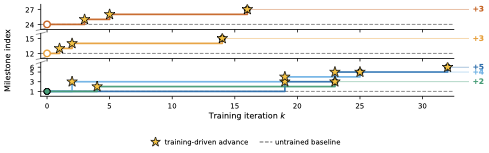

*Figure 7. Five selected advancing Gemma-4 runs make judge-verified objective gains from beginning- and mid-game checkpoints; the dashed untrained baseline does not advance.*

37. **Offline warm-up enables formatting but not meaningful live progress.**
The open model first receives SFT on Gemini 3.1 Pro Continual Harness trajectories and then optional offline GRPO. These stages improve tool-call compliance and transition-level diagnostics, but the authors report no meaningful milestone advancement until the online DAgger-plus-PRM stage.

38. **Five plotted runs advance across persistent training iterations.**
The curves include start-of-game and mid-game checkpoints, and stars mark judge-verified progress. Because the caption explicitly calls them the “five advancing runs,” the denominator of all launched runs is not disclosed; the figure supports existence and repeatability across those five trajectories, not a success rate for the procedure.

39. **The no-reset design confounds learning with continued interaction.**
Each curve is one cumulative gameplay trajectory, so additional milestones might result from more play, harness changes, weight changes, or their interaction. An untrained Gemma baseline makes zero progress and Qwen3.5 27B/35B models make parseable calls but cannot leave the start, which are useful negative controls, yet neither matches total interaction time with fixed weights inside the same evolving harness.

40. **The open system is not autonomous self-training.**
Gemini 3 Flash Preview supplies PRM judgments and Gemini 3.1 Pro relabels low-reward windows. The authors explicitly acknowledge that Gemma-4 up to 31B cannot yet serve as both teacher and trainee.

41. **Student initialization is reported inconsistently.**
The Red evaluation table states that 31B SFT is the viable checkpoint used to initialize online co-learning because the 26B Red adapter was degenerate. A separate reset-free DAgger description calls the initial model 26B SFT. Exact model-size attribution should be withheld pending clarification.

### 4.6 Skills measurably self-improve toward an oracle

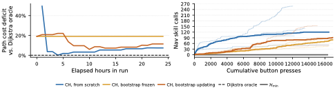

*Figure 8. Left: path-cost deficit of the top 10% evolved skills relative to Dijkstra. Right: cumulative navigation-skill use during 24-hour runs.*

42. **From-scratch navigation skills rapidly approach the oracle.**
The path-cost deficit begins near 50%, falls to single digits early in the run, and remains low. The score uses warp-to-warp obstacle-navigation tasks and removes dialogue and battle movement, providing a cleaner component metric than milestone completion.

43. **The oracle itself uses pooled hindsight map coverage.**
Optimal paths are computed by BFS/Dijkstra over the union of tiles observed by any run on a map. That makes the comparator stable and informative, but it has cross-run coverage unavailable to an online agent and is therefore an evaluator rather than an achievable information-matched policy.

44. **Inheritance and continued updating both contribute.**
\(\mathcal H_{\min}\) never calls a navigation skill; every CH condition reaches hundreds of invocations. Bootstrap-frozen bounds the value of inherited skills, while bootstrap-updating matching or beating it shows additional in-run repairs can still add value.

## 5. Related Work

### 5.1 Agentic Harnesses and Scaffolding

45. **The direct methodological contrast is full-state editing versus prompt-only optimization.**
GEPA and related prompt optimizers update prompts after complete evaluations, while Reflexion and Self-Refine retain reflective text between attempts. Continual Harness cites these as predecessors but changes the optimized object to \((p,\mathcal G,\mathcal K,\mathcal M)\) and applies edits mid-episode.

46. **PokeAgent is the clearest explicit foundation.**
It contributes the RPG benchmark, harness decomposition, minimalist/expert comparison, and evidence that models need scaffolding. Continual Harness directly automates the manual and model-assisted refinement process observed in the subsequent GPP project.

### 5.2 Autonomous Agents in Games

47. **Tool-building game agents supply a neighboring lineage.**
Voyager and Claude Plays Pokémon show that an LLM can create reusable tools during play, whereas PokeAgent pairs a model with a designed planner. Continual Harness adds periodic failure diagnosis and coordinated edits across multiple persistent stores.

### 5.3 Reset-Free Training, In-Context Learning, and Process Rewards

48. **Several established operators are composed rather than reinvented.**
The training loop combines reset-free RL's persistent environment premise, DAgger-style on-policy collection and relabeling, process reward models, SFT, offline GRPO, and STaR-like self-training. The novel object is the coupled evolution of policy and harness under one continuing trajectory.

49. **“Online in-context learning” is an external-memory interpretation.**
No gradient update is required for the runtime Refiner experiments; adaptation lives in prompt text, tools, sub-agents, and memory. This places the method between inference-time reflection and explicit source-rewriting agents rather than ordinary parameter learning.

## 6. Discussion

50. **The paper's positive conclusion is bounded by a capability floor.**
Pro can exploit and improve the scaffold, Flash is variable, and Flash-Lite is harmed. A practical deployment should therefore gate edits using held-out checks, retain known-good components, and measure whether the editor can predict improvement before allowing persistent mutation.

51. **The open-model result establishes progress, not convergence.**
The authors report sustained movement over the tested horizon but no saturation point. They also do not compare reset-free and reset-based training under matched data, compute, starting states, or evaluator budgets.

52. **The games-only scope leaves broad generalization open.**
Red and Emerald share action semantics, genre structure, and emulator instrumentation. The evidence does not yet establish transfer to coding, robotics, web operations, or environments where code execution and persistent memory carry real security consequences.

53. **No dedicated safety evaluation accompanies self-modification.**
Operational scope is bounded by the emulator's eight-button action space and the fixed meta-tool API, but the GPP sandbox-loophole behavior, schema mismatch failure, and Red regression demonstrate that those bounds do not guarantee benign or useful edits. The paper tests neither prompt injection nor tool permissions, rollback, adversarial memory, evaluator gaming, or safe release discipline.

## Appendix A. Pokémon Environment

54. **The emulator interface is carefully standardized.**
Red and Crystal render at 160×144 pixels and Emerald at 240×160; frames are shown to the model at 2× scale. The agent selects among eight buttons, and each observation step advances 120 emulator frames.

55. **The ASCII map exposes local screen-readable geometry plus a small margin.**
It labels walls, walkable tiles, NPCs, interactables, and orientation without supplying a global map or route. General primitives such as party-HP inspection remain available, whereas the expert harness adds RAM-aware and game-specific tools.

56. **Milestones are a partial-game proxy.**
The automated Red and Emerald suites stop around the third gym rather than full-game completion. Full completions belong to the historically different, human-in-the-loop GPP evidence.

## Appendix B. Gemini Plays Pokémon: Additional Evidence

*Figure 9. Gemini 3 Pro needs roughly half the turns and about 60% fewer tokens than Gemini 2.5 Pro under the same Crystal harness, according to the paper.*

57. **Model capability changes how a fixed scaffold is used.**
On Crystal, Gemini 3 Pro reaches comparable early milestones with roughly half as many turns and about 60% fewer tokens than Gemini 2.5 Pro. At Olivine Lighthouse, 2.5 Pro remains trapped for 16,403 turns, illustrating that a strong harness cannot fully compensate for persistent faulty beliefs.

58. **Yellow's Elite Four attempts show cumulative written strategy.**
The exact settings and reported values make the relevant comparison concrete.

| Opponent | Lifetime attempts | Downstream progress |
|---|---:|---|
| Lorelei | 18 | Reached Bruno at least 15 times |
| Bruno | 20 | Reached Agatha at least 12 times |
| Agatha | 18 | Reached Lance at least 12 times |
| Lance | 19 | Reached the Champion 4 times |
| Champion Pixel | 4 | Won on attempt 4 |

The associated battle prompt underwent 14 structural checkpoints, turning repeated failures into a text-encoded decision process.

### B.1 Yellow Legacy Battle-Agent Evolution Checkpoints

59. **The strategist cycles through decomposition strategies.**
Early veto swarms are pruned, fallback logic is rebuilt, viability and coverage checks are introduced, and eventually a master agent dispatches to subordinate analyses. The appendix's checkpoint graphs make the non-monotonic architectural evolution concrete, but they do not include per-revision controlled performance estimates.

### B.2 Crystal Battle Advisor Evolution Checkpoints

60. **Crystal supplies a second qualitative revision trace.**
Ten checkpoints show the advisor incorporating opponent state, HP, free-turn reasoning, coverage, screen text, and prediction before later hierarchical consolidation. This supports recurrence of the pattern across runs, not a statistical estimate of each edit's value.

### B.3 Case Study: Power Plant Route Loop

61. **A 1,003-turn failure reveals feedback blindness.**
Over roughly 3.5 hours on 29 August 2025, the agent repeatedly sent a schema-invalid payload 842 times. Most productive tool generation occurred in the first 50–200 turns, while no new repair tool appeared after the 500-turn stall, motivating explicit periodic diagnosis.

62. **The case also warns that persistence can harden errors.**
Long context alone did not cause self-correction; the agent rehearsed the same malformed interface assumption. Continual Harness targets this behavior, but the paper does not evaluate whether its Refiner reliably repairs this exact trace under a controlled replay.

## Appendix C. Harness Ablations

### C.1 Mechanism Attribution

#### C.1.1 Pathfinding skills

63. **Skill quality is measured independently from end-task reward.**
For each map, issued navigation presses are divided by a shortest-path reference after removing battles and dialogue. The top 10% evolved skill set is tracked over time, revealing early sharp improvement and later stabilization.

#### C.1.2 Skill debugging

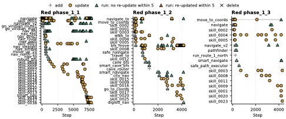

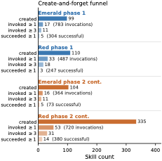

*Figure 16. Most created skills are never invoked; a much smaller working set receives repeated use and repair.*

64. **Use is far more selective than creation.**
Many skills are authored once and never called. The useful set is small, receives repeated invocations, and is more likely to be repaired after observed failure, suggesting that a creation prior alone is insufficient and invocation-aware maintenance matters.

65. **The appendix provides tracing, not a deletion ablation.**
Before/after success around updates indicates that relied-on skills can improve, but unused regressions are tolerated. A controlled policy that prunes never-used or repeatedly failing components remains untested.

#### C.1.3 Sub-agent handoffs

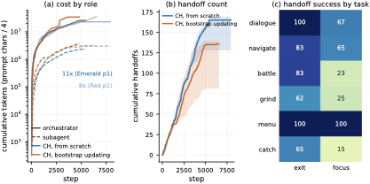

*Figure 17. Sub-agent calls are shorter than orchestrator calls and vary in how cleanly they return control and preserve focus.*

66. **Sub-agents appear to decompose bounded work.**
Their token use is roughly an order of magnitude below the orchestrator's, and cleaner returns correlate with higher task scale. The plot is observational, so it does not establish that adding a sub-agent caused the milestone gains.

#### C.1.4 Memory reuse

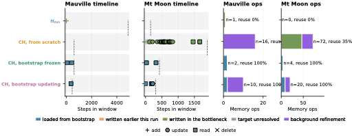

*Figure 18. Bootstrap agents consult inherited memory more often than from-scratch agents consult newly written entries.*

67. **Writing memory is easier than reusing it.**
Every step lists all memory IDs and titles, yet from-scratch runs create many entries and rarely retrieve their full contents. Bootstrap runs use a mature inherited store more actively, but absolute reference rates remain low and most entries are never used.

68. **A reuse prior is an obvious missing operator.**
Persistent storage does not guarantee behavioral influence. Selection should reward entries that are retrieved and improve outcomes, or demote content that is merely accumulated.

### C.2 Reset-Free Bootstrap Transfer

69. **Most inherited stores dominate later invocations.**
The exact settings and reported values make the relevant comparison concrete.

| Game | Store | Bootstrap frozen | Bootstrap updating |
|---|---|---:|---:|
| Emerald | Skills | 100.0% ± 0.0 | 99.6% ± 0.6 |
| Emerald | Sub-agents | 100.0% ± 0.0 | 100.0% ± 0.0 |
| Emerald | Memories | 98.2% ± 1.9 | 100.0% ± 0.0 |
| Red | Skills | 100.0% ± 0.0 | 96.5% ± 3.8 |
| Red | Sub-agents | 100.0% ± 0.0 | 6.4% ± 5.7 |
| Red | Memories | 100.0% ± 0.0 | 100.0% ± 0.0 |

Values are means across \(n=3\) seeds and measure the fraction of phase-two invocations targeting phase-one components.

#### C.2.1 Red Bootstrap-Updating Regression

70. **Abandoning inherited sub-agents predicts the Red collapse.**
Around step 213, newly authored sub-agents overtake inherited ones; those new agents have lower per-invocation success and have not undergone the same repair cycle. The authors propose a reuse prior or deletion rule for redundant new agents, effectively acknowledging that unrestricted continued mutation can be worse than freezing a known-good harness.

## Appendix D. Training Setup and Results

### D.1 Training Hyperparameters

71. **SFT is a large-teacher imitation warm-up.**
Gemma-4 E2B, E4B, 26B MoE, and 31B dense models receive LoRA with rank \(r=256\), \(\alpha=256\), bf16 precision, and an 8K-token context using Unsloth on H200 GPUs. Training examples pair screenshot and harness prompt with a Gemini 3.1 Pro response; optimization uses learning rate \(2\times10^{-5}\), 3% linear warm-up, cosine decay, and one pass over the teacher trajectories.

72. **Offline GRPO uses four samples and a Gemini evaluator.**
At each teacher-visited state, the policy samples \(G=4\) completions. Gemini 3 Flash Preview supplies a binary composite reward with 0.6 weight on action correctness and 0.4 on format; group-normalized updates use learning rate \(10^{-6}\), KL coefficient \(\beta=0.04\), batch size 8 states, and 590 optimizer steps.

73. **Online relabeling weights progress most heavily.**
Each 256-step rollout is scored using progress 0.4, action correctness 0.3, reasoning quality 0.2, and format 0.1. Low-reward windows are relabeled by Gemini 3.1 Pro, then soft-SFT-trained for three epochs at learning rate \(5\times10^{-6}\); the pairwise PRM uses stride 8.

### D.2 Gemma-4 Full Eval Matrix

74. **Emerald SFT has a sharp size-dependent success pattern.**
The exact settings and reported values make the relevant comparison concrete.

| Metric | Base 26B | Base 31B | SFT 26B | SFT 31B | GRPO 26B |
|---|---:|---:|---:|---:|---:|
| Tool format | 0.00 | 0.00 | **0.95** | 0.35 | 0.00 |
| Actionable | 0.20 | 0.55 | **0.95** | 0.35 | 0.00 |
| Grounding | 0.15 | 0.39 | **0.72** | 0.45 | 0.40 |
| Action relevance | 0.15 | 0.51 | **0.50** | 0.25 | 0.00 |
| Reasoning similarity | 0.15 | 0.45 | **0.35** | 0.05 | 0.00 |
| Hallucination | 0.05 | 0.05 | 0.55 | 0.50 | 0.00 |

The paper labels the 26B SFT Emerald checkpoint strongest on most metrics, while the offline GRPO checkpoint collapses on the full harness prompt. “Hallucination” is reported as a raw diagnostic whose direction is not explained clearly enough to interpret the larger SFT values as better or worse.

75. **Red instead favors the 31B SFT checkpoint.**
The exact settings and reported values make the relevant comparison concrete.

| Metric | Base 26B | Base 31B | SFT 31B | GRPO 26B |
|---|---:|---:|---:|---:|
| Tool format | 0.05 | 0.05 | **0.50** | 0.50 |
| Actionable | 0.25 | 0.35 | **0.50** | 0.50 |
| Grounding | 0.23 | 0.31 | **0.44** | 0.44 |
| Action relevance | 0.33 | 0.42 | **0.75** | 0.65 |
| Reasoning similarity | 0.25 | 0.40 | **0.65** | 0.50 |
| Hallucination | 0.05 | 0.00 | 0.30 | 0.40 |

The 26B Red SFT adapter is omitted as degenerate. Metrics come from only 20 held-out transitions, so they are diagnostics rather than stable benchmark estimates.

### D.3 Training Curves and Reward Decomposition

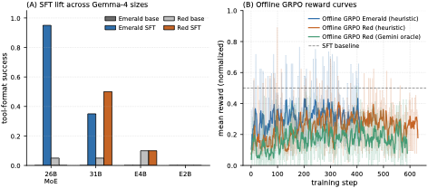

*Figure 19. SFT improves tool-call formatting mainly for larger checkpoints; offline GRPO reward remains noisy and does not translate into live milestone progress.*

76. **Format compliance is the clearest warm-up gain.**
The exact settings and reported values make the relevant comparison concrete.

| Stage | Model | Tool format | Actionable | Action relevance | Reasoning | Grounding |
|---|---|---:|---:|---:|---:|---:|
| Base | Gemma-4 26B | 0.05 | 0.25 | 0.33 | 0.25 | 0.23 |
| SFT | Gemma-4 31B | 0.50 | 0.50 | **0.75** | **0.65** | 0.44 |
| GRPO, heuristic | Gemma-4 26B | 0.50 | 0.50 | 0.65 | 0.50 | 0.44 |
| GRPO, Gemini oracle | Gemma-4 26B | 0.50 | 0.50 | 0.55 | 0.30 | 0.40 |
| Base | Qwen3.5 35B | Parseable | Parseable | 0 live progress | 0 live progress | 0 live progress |

77. **Offline reward curves are noisy and reward choice matters.**
Heuristic and Gemini-oracle GRPO fluctuate around modest normalized rewards, and neither checkpoint independently advances milestones. Optimizing transition judgments is therefore not sufficient evidence of long-horizon competence.

### D.4 Reset-Free DAgger+PRM Experiments

78. **Large progress tends to follow several moderately high PRM iterations.**
The appendix reports that multiple consecutive iterations near or above 0.40 mean reward often precede the biggest milestone gains. PRM reward is nevertheless non-monotonic, so the evidence is correlational rather than a calibrated predictor of future progress.

79. **Resume events introduce a repeatable protocol artifact.**
The first iteration after loading a checkpoint often regresses, with recovery after two or three iterations. This indicates sensitivity to serialized state, context reconstruction, or optimizer resumption and should be treated as part of the system's reliability profile.

80. **The most important missing control is matched continual play without weight updates.**
A fixed student running for the same number of 256-step blocks inside an identically refining harness would isolate whether \(\theta\) updates add progress beyond continued interaction and scaffold accumulation. A fixed harness plus weight updates would in turn isolate co-adaptation from ordinary online imitation.

## Appendix E. LLM Acknowledgments

81. **Language models assisted presentation, not scientific decision-making, according to the authors.**
The appendix reports LLM use for prose editing and figure/code assistance while assigning responsibility for claims and verification to the human authors. This disclosure does not alter the experimental evidence but is part of the paper's provenance.

## Consolidated strengths, limitations, and open questions

### What the evidence supports well

82. **Full-harness mutation is operationally feasible during a continuous episode.**
Logs, component traces, and invocation histories show that prompts, skills, sub-agents, and memory can all be edited and reused without resetting game state.

83. **Harness benefit depends strongly on editor capability.**
The Pro/Flash/Flash-Lite gradient is unusually informative negative evidence: self-refinement is an ability that can fail, not a free wrapper improvement.

84. **Component-level evaluation can reveal real learning hidden by endpoint metrics.**
The navigation oracle, skill-use funnel, inheritance shares, and memory-pull traces make internal dynamics more inspectable than milestone scores alone.

### What remains weak or unresolved

85. **Causal attribution is incomplete.**
Most component analyses are observational, and the co-learning curves combine continued environment exposure, harness mutation, teacher relabeling, and weight updates. Equal-budget ablations are needed for each operator.

86. **Selection and release discipline are underdeveloped.**
Edits are applied directly to the live scaffold; there is no held-out validation set, canonical release line, rollback trigger, or population archive. The Red sub-agent collapse is precisely the failure such controls are designed to prevent.

87. **Replication details and outcome denominators are incomplete.**
The refinement cadence \(F\) and warm-up \(W\) are unspecified, the total number of co-learning jobs behind “five advancing runs” is absent, and student-model identity conflicts across appendix descriptions.

88. **Safety is largely outside the evaluation.**
Persistent code, memory, and agent definitions increase attack and error surface. A real deployment needs least-privilege tools, provenance, edit review, sandbox-hardening, memory-integrity checks, evaluator-robustness tests, and recoverable checkpoints.

### High-value follow-up experiments

89. **Factor the coupled system into a controlled matrix.**
Compare fixed versus mutable harness, fixed versus updated weights, reset versus persistent state, and teacher versus self-teacher under identical model calls, environment steps, and starting checkpoints.

90. **Gate mutations against held-out situations.**
Evaluate a candidate component on replayed failure traces plus unrelated regression cases before promotion, and retain an automatically recoverable last-known-good harness.

91. **Optimize reuse rather than creation count.**
Reward skills, agents, and memories for successful later invocation; penalize redundant components, schema failures, and entries that consume context without affecting behavior.

92. **Test across domains with different failure economics.**
Coding, browser operation, robotics, and production operations would reveal whether reset-free editing transfers beyond emulator games and whether safety gates erase or preserve its efficiency gains.
