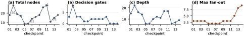
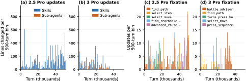
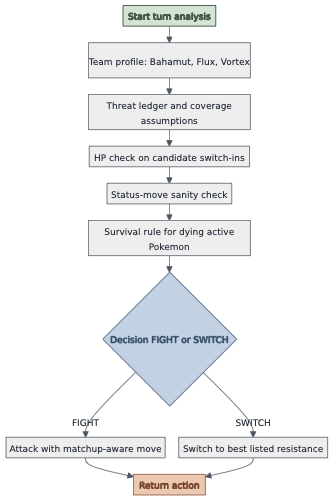
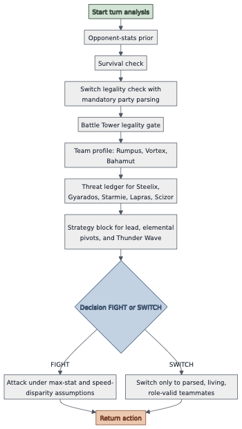

# Paper Assets

## Figure 1: fig:hero

Caption: Continual Harness automates the harness refinement performed manually in GPP, and extends to joint training of model weights and harness state. Each panel shares the same topology (environment, agent, harness, refiner); only the identity of the refiner changes. (1) Human-in-the-loop: in our Gemini Plays Pok\'emon (GPP) experiments, a human reads trajectories and rewrites the harness, producing the first AI system to complete Pok\'emon Blue, Yellow Legacy (hard mode), and Crystal. (2) Self-improving harness: Continual Harness replaces the human with an automated refiner that operates on trajectory data within a single continuous episode; evaluated on Red and Emerald across frontier models. (3) Model + harness co-learning: after warm-up stages, an open-source model's weights and the harness state update jointly during online play.

![Continual Harness automates the harness refinement performed manually in GPP, and extends to joint training of model weights and harness state. Each panel shares the same topology (environment, agent, harness, refiner); only the identity of the refiner changes. (1) Human-in-the-loop: in our Gemini Plays Pok\'emon (GPP) experiments, a human reads trajectories and rewrites the harness, producing the first AI system to complete Pok\'emon Blue, Yellow Legacy (hard mode), and Crystal. (2) Self-improving harness: Continual Harness replaces the human with an automated refiner that operates on trajectory data within a single continuous episode; evaluated on Red and Emerald across frontier models. (3) Model + harness co-learning: after warm-up stages, an open-source model's weights and the harness state update jointly during online play.](figures/hero_progression.png)

## Figure 2: fig:methodology

Caption: Methodology overview. (a) Harness refinement within one episode: the Agent reads (s_t,H,) and emits a_t; every F steps the Refiner reads _t-F:t, emits per-component edits =( p,,,) via the meta-tool API, and H\!\!H. (b) Co-learning across DAgger+PRM iterations: each iteration runs __k inside a live-refining H_t for K=256 steps. The trajectory is scored by a pairwise PRM, low-R windows are relabeled by Gemini-3.1-pro, and a soft SFT update produces _k+1. The loop is reset-free: a persistent state at the end of iter k is loaded as the start of iter k+1.

![Methodology overview. (a) Harness refinement within one episode: the Agent reads (s_t,H,) and emits a_t; every F steps the Refiner reads _t-F:t, emits per-component edits =( p,,,) via the meta-tool API, and H\!\!H. (b) Co-learning across DAgger+PRM iterations: each iteration runs __k inside a live-refining H_t for K=256 steps. The trajectory is scored by a pairwise PRM, low-R windows are relabeled by Gemini-3.1-pro, and a soft SFT update produces _k+1. The loop is reset-free: a persistent state at the end of iter k is loaded as the start of iter k+1.](figures/h_methodology.png)

## Figure 3: fig:gpp_yellow

Caption: Yellow Legacy harness refinement is concentrated and recurrent rather than uniform. (a) Counts of CRUD operations (creation, update, delete) on skill and sub-agent definitions, binned per 2,000 turns. The harness is updated throughout the run rather than converging to a fixed scaffold. (b) Update counts for the five most-updated components over the same horizon. A small subset of navigation and battle components accounts for the majority of updates.

## Figure 4: fig:gpp_battle_complexity

Caption: Decision-making complexity of the Yellow Legacy battle_strategist_agent prompt at successive revisions during the Elite Four phase of the run: total nodes, decision gates, graph depth, and max fan-out. See appendix app:gpp for details.

## Figure 5: fig:progression

Caption: Milestones reached vs.\ cumulative button presses. Red (left): 11-milestone subset sequence through Thunder Badge. Emerald (right): 9-milestone sequence through Knuckle Badge (2nd gym); x-axis capped at 8.5k. Lines stop at each run's last monitored milestone. Thick lines: seed medians; faint lines: individual seeds.

## Figure 6: fig:pareto

Caption: Emerald cost--completion Pareto plane. Filled markers: individual 24-hour seeds. Ringed markers: per-cell medians. Dashed staircase: cost-monotone Pareto frontier. Y axis: fraction of the 31-milestone Emerald set reached; X axis: Gemini API spend (log scale, cached input at 25%).

## Figure 7: fig:colearn_pipeline

Caption: Reset-free DAgger+PRM training drives sustained milestone progress on Pok\'emon Red. Milestone index reached versus training iteration k for the five advancing runs; the broken y-axis labels each band's start and end. Filled dots: beginning of game. Open rings: mid-game checkpoint. Stars: judge-verified advances. +N: net objective gain. Dashed line: untrained Gemma-4 baseline (zero advance beyond the starting milestone). Teacher model: Gemini-3.1-pro.

## Figure 8: fig:pathfinding

Caption: Pathfinding skill mechanism. (Left) Path-cost deficit of the top-10% evolved navigation skill set (Gemini 3.1 Pro) relative to the Dijkstra oracle over a 24-hour run on warp-to-warp obstacle-navigation tasks; lower is better, dashed line at 0% marks the oracle. (Right) Cumulative navigation-skill invocations against button presses across the same conditions.

## Figure 9: fig:emerald_full_speedrunning_route

Caption: Emerald Speedrunning Route. Milestones from Littleroot Town (1) to aquiring the Dynamo Badge (31), with game frames from each waypoint. The geographic overview (right) maps key locations. This series of milestones require substantial exploration and backtracking; agents must navigate branching paths, and manage nonlinear dependencies between objectives. The current world record speedrun completes this segment in 1:00:57 minutes keepingiticy2024emerald.

## Figure 10: fig:red_full_speedrunning_route

Caption: Pok\'emon Red Speedrunning Route. Milestones from obtaining starter Pok\'emon (1) to aquiring the Thunder Badge (18), with game frames from each waypoint. The geographic overview (right) maps key locations. This series of milestones require substantial exploration and backtracking; agents must navigate branching paths, and manage nonlinear dependencies between objectives. The current world record speedrun completes this segment in 43:04 minutes; see https://www.speedrun.com/pkmnredblue.

## Figure 11: fig:gpp_crystal

Caption: Crystal head-to-head comparison under the same harness. (Top) per-500-turn updates on skills and sub-agents for Gemini 2.5 Pro (left) and 3 Pro (right). (Bottom) top-5 most-updated components per model.

## Table 1: tab:gpp_yellow_e4

Caption: Yellow Legacy Elite Four lifetime attempt totals. The retries were accompanied by increasingly structured battle prompts (fig:gpp_battle_complexity) and persistent written memory, producing a text-encoded decision process across the gauntlet.

| Opponent | Lifetime attempts | Notes |
| --- | --- | --- |
| Lorelei | 18 | Reached Bruno 15+ times |
| Bruno | 20 | Reached Agatha 12+ times |
| Agatha | 18 | Reached Lance 12+ times |
| Lance | 19 | Reached Champion 4 times |
| Champion Pixel | 4 | Victory on attempt 4 |

## Figure 12: fig:yellow-battle-agent-evolution-appendix

Caption: The four Yellow Legacy battle-agent checkpoints marked a1/b1/c1/d1 on the complexity plot in fig:gpp_battle_complexity. These span the arc from a linear survival-gate chain (a1), through a hard-reset compact rebuild (b1), to a rebuilt-bigger screen-text-grounded program (c1), and finally to a master-agent decomposition (d1) that dispatches to five named sub-checks.

## Figure 13: fig:yellow-battle-agent-evolution-appendix-rest

Caption: The remaining ten Yellow Legacy battle-agent checkpoints, grouped by natural aspect. Row 1: long-chain variants around the first complexity spike and the late ``last-stand'' rewrite. Row 2: medium-hierarchy checkpoints across the rebuild-and-grow-again window. Row 3: the two wide master-agent variants that extend the decomposition introduced at checkpoint 12.

## Figure 14: fig:crystal-battle-advisor-evolution-appendix

Caption: Crystal battle_advisor checkpoints 1--6 from the Battle Tower window. The graphs trace the early evolution from a baseline matchup recommender (1) through legality and weakness-check additions (2--4) to role-based and survival rules (5--6).

## Figure 15: fig:crystal-battle-advisor-evolution-appendix-rest

Caption: Crystal battle_advisor checkpoints 7--10. The late-window evolution adds switch-legality bookkeeping (7), an empirical-override / paranoia layer (8), a team-specific reconfiguration (9), and an explicit speed calculation rule (10).

## Figure 16: fig:skill_debug

Caption: Left: per-seed skill lifetime for the three Red from-scratch H_CH runs. Markers are add, update, run_skill (green if no re-update within 5 steps, red otherwise), and delete. Right: create-and-forget funnel across both games and both H_CH bootstrap variants.

## Figure 17: fig:subagent

Caption: Sub-agent handoffs. (a) Cumulative approximate tokens by role (orchestrator solid, sub-agent dashed). (b) Cumulative execute_custom_subagent count. (c) Per-task-type handoff success: exit is the percent of spans ending via return_to_orchestrator; focus is the percent of returns where the orchestrator either pursued the pre-handoff objective or crossed a milestone within ten subsequent steps.

## Figure 18: fig:memory

Caption: process_memory use inside the first real bottleneck of each game: Mauville Gym (Emerald, left column) and Mt Moon (Red, right column). One representative seed per condition. Top row: per-run timeline where each marker is a process_memory tool call at the step it fired; color encodes provenance of the memory entry. Bottom row: the same ops aggregated into a stacked composition bar.

## Table 2: tab:c5_inheritance

Caption: C5 inheritance: fraction of phase-2 invocations whose target was present in the phase-1 bootstrap. Mean across seeds (n=3 for each cell). ``--'' means no invocations of that store type in the run.

| Game | Store | Frozen | Continued |
| --- | --- | --- | --- |
| Emerald | skills | 100.0% 0.0 | 99.6% 0.6 |
| subagents | 100.0% 0.0 | 100.0% 0.0 |  |
| memories | 98.2% 1.9 | 100.0% 0.0 |  |
| Red | skills | 100.0% 0.0 | 96.5% 3.8 |
| subagents | 100.0% 0.0 | 6.4% 5.7 |  |
| memories | 100.0% 0.0 | 100.0% 0.0 |  |

## Table 3: tab:h6_eval_full_emerald

Caption: Full Gemma-4 eval matrix on Emerald. SFT rows are fine-tuned on Gemini-3.1-pro Continual Harness trajectories. The GRPO column reports the offline-GRPO warm-up checkpoint, which emits degenerate completions on this prompt set. Smaller Gemma-4 sizes train to low loss but collapse under the full harness prompt.

| Metric | 4cBase | 4cSFT (emerald) | GRPO |  |  |  |  |  |  |
| --- | --- | --- | --- | --- | --- | --- | --- | --- | --- |
| (lr)2-5 (lr)6-9 (lr)10-10 | 26B | 31B | e4b | e2b | 26B | 31B | e4b | e2b | 26B |
| tool_format | 0.00 | 0.00 | 0.00 | 0.00 | 0.95 | 0.35 | 0.00 | 0.00 | 0.00 |
| actionable | 0.20 | 0.55 | 0.55 | 0.40 | 0.95 | 0.35 | 0.40 | 0.20 | 0.00 |
| grounding | 0.15 | 0.39 | 0.54 | 0.28 | 0.72 | 0.45 | 0.52 | 0.33 | 0.40 |
| action_relevance | 0.15 | 0.51 | 0.38 | 0.15 | 0.50 | 0.25 | 0.35 | 0.07 | 0.00 |
| reasoning_similarity | 0.15 | 0.45 | 0.26 | 0.10 | 0.35 | 0.05 | 0.28 | 0.05 | 0.00 |
| hallucination | 0.05 | 0.05 | 0.30 | 0.05 | 0.55 | 0.50 | 0.30 | 0.25 | 0.00 |
| degenerate | 0.00 | 0.00 | 0.00 | 0.05 | 0.05 | 0.10 | 0.10 | 0.00 | 0.00 |
| tokens/s | 154 | 18 | 188 | 221 | 166 | 27 | 188 | 221 | 26 |

## Table 4: tab:h6_eval_full_red

Caption: Full Gemma-4 eval matrix on Red. The 26B Red SFT row is omitted because the adapter was degenerate at eval time. 31B SFT is the viable Red checkpoint and is used as the initial policy for the online co-learning stage.

| Metric | 4cBase | 2cSFT (red) | GRPO |  |  |  |  |
| --- | --- | --- | --- | --- | --- | --- | --- |
| (lr)2-5 (lr)6-7 (lr)8-8 | 26B | 31B | e4b | e2b | 31B | e4b | 26B |
| tool_format | 0.05 | 0.05 | 0.10 | 0.00 | 0.50 | 0.10 | 0.50 |
| actionable | 0.25 | 0.35 | 0.45 | 0.15 | 0.50 | 0.35 | 0.50 |
| grounding | 0.23 | 0.31 | 0.40 | 0.09 | 0.44 | 0.38 | 0.44 |
| action_relevance | 0.33 | 0.42 | 0.33 | 0.03 | 0.75 | 0.55 | 0.65 |
| reasoning_similarity | 0.25 | 0.40 | 0.40 | 0.00 | 0.65 | 0.45 | 0.50 |
| hallucination | 0.05 | 0.00 | 0.25 | 0.20 | 0.30 | 0.30 | 0.40 |
| degenerate | 0.00 | 0.00 | 0.00 | 0.05 | 0.00 | 0.00 | 0.05 |
| tokens/s | 162 | 21 | 189 | 233 | 26 | 101 | 89 |

## Table 5: tab:h6_progression

Caption: Progressive improvement across warm-up stages on Pok\'emon Red, evaluated on 20 held-out transitions. SFT lifts format compliance from near zero. Offline GRPO with a 4-component heuristic reward and offline GRPO with a Gemini-oracle reward both maintain format and shift action quality. The online co-learning stage produces sustained milestone progress in live gameplay; per-iteration progression and PRM rewards are reported in app:training:dagger_resetfree. Qwen3.5 35B is shown as a cross-family baseline: it produces parseable tool calls through the harness but cannot advance in the game.

| 2cFormat (Tier 1) | 3cAction Quality (Tier 2) |  |  |  |  |  |
| --- | --- | --- | --- | --- | --- | --- |
| (lr)3-4(lr)5-7 Stage | Model | tool_fmt | act'ble | act_rel | reason | ground |
| Base | Gemma-4 26B | 0.05 | 0.25 | 0.33 | 0.25 | 0.23 |
| SFT | Gemma-4 31B | 0.50 | 0.50 | 0.75 | 0.65 | 0.44 |
| Offline GRPO (heuristic) | Gemma-4 26B | 0.50 | 0.50 | 0.65 | 0.50 | 0.44 |
| Offline GRPO (Gemini oracle) | Gemma-4 26B | 0.50 | 0.50 | 0.55 | 0.30 | 0.40 |
| Base | Qwen3.5 35B | 2cparseable | 3c0 game progress (stuck) |  |  |  |

## Figure 19: fig:h6_training

Caption: Gemma-4 tool-calling behavior across warm-up stages. (A) SFT on frontier Continual Harness trajectories lifts tool_format success from near zero. (B) Reward curves for the two offline GRPO variants (heuristic 4-component reward and Gemini-oracle reward); the dashed line marks the approximate SFT reward baseline.

