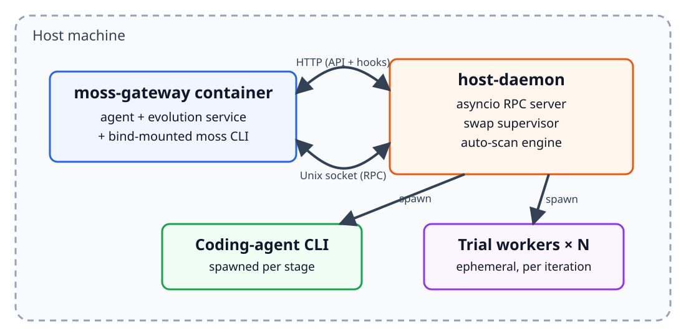
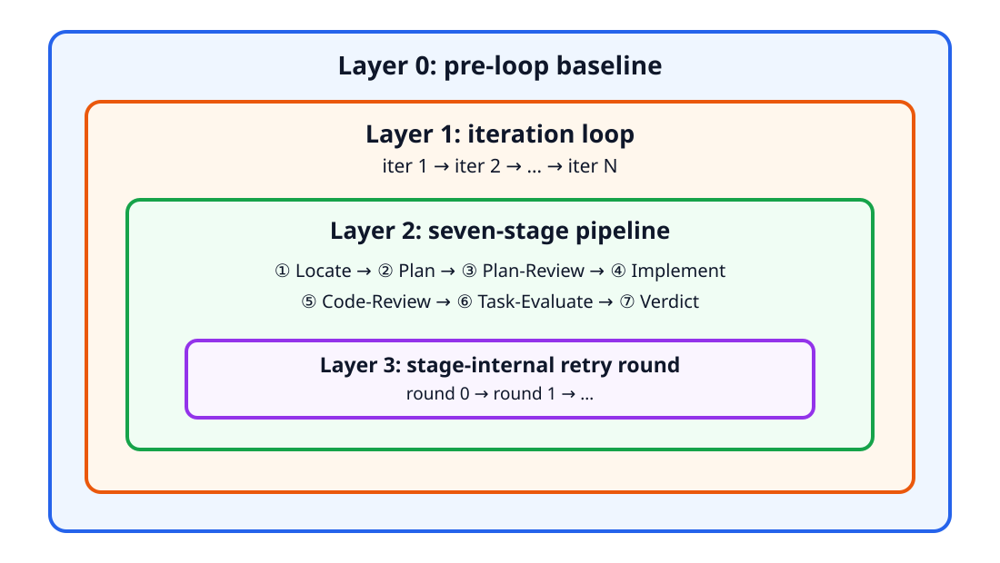
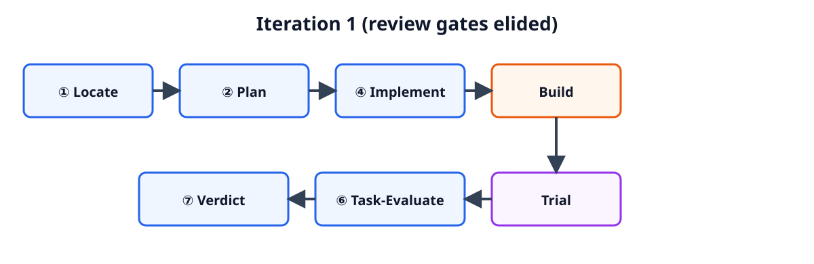

# MOSS: Self-Evolution through Source-Level Rewriting in Autonomous Agent Systems

Source: [arXiv:2605.22794](https://arxiv.org/abs/2605.22794), version 2, accessed 2026-09-01.

## Overview / Takeaway

MOSS moves self-evolution from prompts, skills, memories, and workflows into the source code of a production agent harness, allowing it to modify routing, hooks, dispatch, state handling, and other behavior unavailable to text-only updates. It combines production-failure batching, a deterministic seven-stage development pipeline, a pluggable coding-agent CLI, containerized replay, user-approved promotion, persistent state, and health-probe rollback. In one OpenClaw case study, a three-file harness patch with 177 insertions and one deletion raises the mean score on four claweval tasks from 0.2526 to 0.6100. That result validates one targeted repair on the same tasks used to drive evolution; it does not establish held-out generalization, superiority to text-only repair, long-term safety, or the paper’s broader claims that source edits are immune to context drift.

## 1 Introduction

1. **Deployed agent systems accumulate failures that their static implementations cannot learn from**
Application-level agents now serve users through channels such as Slack, Discord, and the web, but recurring failures normally wait for a human-authored release. MOSS targets the gap between abundant production evidence and an agent harness that remains frozen after deployment.

2. **Text-mutable evolution cannot reach decisions made by the harness**
Skills, prompts, memory schemas, and workflow graphs can alter what a model considers, says, or invokes. They cannot directly repair routing, state management, dispatch, hook ordering, mediation, session lifecycle, or cross-skill atomicity when those mechanisms live in source code.

3. **Harness complexity makes the unreachable failure class more important**
Misrouted messages, out-of-order hooks, corrupted state, and concurrent-skill atomicity bugs are structural. The claimed gap should widen as a production scaffold gains plugins, channels, persistence, and orchestration surfaces.

4. **MOSS positions source code as a strict representational superset**
The argument has four parts: a programming-language search space is Turing-complete; it can represent text artifacts as data as well as arbitrary control logic; code paths take effect without asking the model to follow newly added prose; and encoded control flow is not diluted merely because the context grows. This is an expressiveness argument—not evidence that useful source edits are easy to search for, correct, or safe.

5. **“Deterministic effect” has a narrower meaning than deterministic agent behavior**
A routing branch executes as code rather than depending on whether the base model notices an instruction. The surrounding system can still be stochastic because model outputs, external services, concurrency, and production inputs vary; source-level adaptation does not make the whole agent deterministic.

6. **The long-context-drift advantage is asserted rather than experimentally tested**
Code does not compete for attention as an instruction token does, but code can still decay operationally through dependency changes, distribution shift, interaction effects, and accumulating patches. The single-cycle case study contains no weeks-long comparison between code and text fixes.

7. **Earlier source-rewriting systems establish feasibility on smaller scaffolds**
SICA, Darwin Gödel Machine, HyperAgents, and Meta-Harness are explicit predecessors. MOSS distinguishes itself by moving from benchmark-scored minimal scaffolds to an application-level substrate with live state, a large codebase, no universal fitness score, and a deployment boundary.

8. **Production evolution is directed by concrete failures rather than open-ended fitness**
Automatic session scanning and conversational user flags feed a shared failure batch. Every later stage is scoped to that batch, replacing random mutation and global benchmark optimization with localized repair intent.

9. **The end-to-end contribution includes deployment, not only code generation**
MOSS exposes lifecycle commands through the deployed agent, delegates editing to a coding-agent subprocess, builds a candidate image, replays failures in ephemeral workers, notifies the user, pauses for approval, swaps the live container, preserves user state, and rolls back after failed health probes.

10. **The reported evidence is a controlled case study, not a broad benchmark suite**
One OpenClaw evolution cycle over four tasks improves the mean from approximately 0.25 to 0.61. This demonstrates that the machinery can produce and deploy one effective source-level patch, but the experiment has no held-out tasks, competing repair methods, ablation, multiple substrates, or repeated evolution histories.

The paper’s scope comparison makes the claimed substrate boundary explicit:

| Project | Skill | Prompt | Memory | Harness |
|---|:---:|:---:|:---:|:---:|
| Hermes Agent | ✓ | ✗ | ✓ | ✗ |
| SkillClaw | ✓ | ✗ | ✗ | ✗ |
| GenericAgent | ✓ | ✗ | ✓ | ✗ |
| EvoAgentX | ✓ | ✓ | ✗ | ✗ |
| **MOSS** | **✓** | **✓** | **✓** | **✓** |

This table records declared editable scope, not a controlled quality comparison among the systems.

## 2 System Architecture

1. **Five components separate the live agent, control, editing, supervision, and testing planes**
The architecture consists of the main substrate container, a lifecycle CLI, a pluggable external coding-agent CLI, a host-resident daemon, and ephemeral trial workers. The separation lets the live container request evolution without owning the privileges required to replace itself.

### 2.1 Substrate

1. **OpenClaw is the implemented substrate**
OpenClaw supplies a multi-channel gateway, plugin and hook plumbing, sessions, skills, and persistent user state. MOSS claims the contract can adapt to systems such as Hermes Agent, but only OpenClaw is demonstrated.

2. **The substrate choice creates the paper’s engineering problem**
Academic self-rewriters typically operate over small scaffolds. OpenClaw has cross-file invariants and concurrent state interactions, so localization, safe testing, and state-preserving deployment matter as much as proposal quality.

### 2.2 Control Surface

1. **Nine commands expose the entire evolution lifecycle**
The `moss evo` CLI provides `status`, `batches`, `batch`, `start`, `stop`, `restart`, `apply`, `flag`, and `catch-up`. The first seven call injected gateway HTTP endpoints; `flag` and `catch-up` use a Unix socket to reach the host-daemon’s scanning engine.

2. **One bind mount makes the CLI visible inside the substrate container**
MOSS mounts the script at installation time instead of baking lifecycle logic into the substrate. This keeps the integration narrow while still letting the user-facing agent invoke evolution through its shell tool.

3. **A prompt pointer teaches the agent when to discover the capability**
A one-paragraph system-prompt block points to an on-disk capability document. The agent reads it on demand when users mention evolution, batches, applying a version, or dissatisfaction, reducing the permanent prompt footprint while still relying on model compliance to initiate some control actions.

4. **Three webhooks carry asynchronous state back to conversation**
`evolution-converged` and `evolution-failed` originate from the in-container evolution service; `apply-complete` comes from the host-daemon after a swap. A hook mapping turns each POST into a system message on the agent’s next turn.

5. **Portability requires five substrate primitives**
A new substrate needs shell-equivalent execution, filesystem read, periodic scheduling, webhook-to-agent delivery, and system-prompt injection. “No changes to MOSS” therefore means configuration against this nontrivial host contract, not zero integration work.

### 2.3 External Coding Agent

1. **MOSS owns control flow while a separate coding agent owns edits**
The in-container deterministic state machine controls stage order, verdicts, termination, and deployment. A host-side coding-agent process receives a stage-specific scope and edits the codebase, because the host holds network egress, shell configuration, and editing mounts.

2. **Stage decomposition limits context overload**
Rather than ask one inference to diagnose, plan, implement, verify, and decide, MOSS spawns the coding-agent CLI separately for each reasoning stage. Different stages read different artifacts and have explicit review boundaries.

3. **Four providers ship behind a four-method runner interface**
The repository includes runners for Claude Code, OpenAI Codex, DeepSeek-TUI, and OpenCode. Providers are selected by configuration, and individual spawns can override the default so different roles use different coding agents.

4. **Provider independence is architectural but not empirically evaluated**
Adding a provider requires one runner file and one registry line, while dispatcher, RPC schema, pipeline, and gateway remain stable. The case study does not identify or compare coding-agent providers, leaving the effect of proposer quality and cost unresolved.

### 2.4 Host-Daemon Supervision

1. **The live container cannot safely replace itself**
Stopping the current container destroys the process that would otherwise need to launch its successor. A permanent host-side `asyncio` daemon therefore owns lifecycle transitions.

2. **The daemon centralizes four privileged operation families**
Its Unix-socket RPC handles coding-agent invocation, trial-worker lifecycle, Docker build and image management, and automatic session scanning. Centralization simplifies orchestration but makes the daemon a high-value security and availability boundary.

3. **A polling supervisor mediates promotion requests**
The gateway atomically writes a swap-request file; the daemon detects it, restarts against the candidate image, probes health, and commits or rolls back. After settlement it sends `apply-complete` to the freshly started gateway.

### 2.5 Topology

1. **The topology isolates transient workers from persistent user state**
The gateway container is long-lived, the coding-agent process lasts one stage, and $N$ trial containers last one iteration. Sessions, memory, credentials, and agent configuration live in a host-mounted volume inherited by the new gateway image but withheld from trial workers.

The topology diagram shows which component owns each privilege and communication path:

2. **The candidate tested is the image eligible for promotion**
Trial workers start from the same candidate image that would replace the gateway. This avoids testing one artifact and deploying another, though live state and real traffic remain absent from trials.

3. **Isolation is selective rather than complete**
Trial containers are network- and mount-isolated from the live main container, while the host-side coding agent deliberately receives editing mounts and network egress. The paper does not specify least-privilege policies, secret access, syscall isolation, or defenses against a malicious generated patch.

## 3 The Evolution Process

1. **One evolution maps a failure batch to a deployable image**
The control flow is directed evidence collection, bounded iteration, a seven-stage pipeline, production-equivalent runtime verification, and an in-place swap. Each stage emits artifacts that later stages and users can inspect.

### 3.1 Directed Evolution

1. **MOSS rejects global random search for production repair**
Large codebases make undirected mutation unlikely to land usefully; production quality is task-specific; live traffic makes unanchored changes risky; and users want their observed failure repaired. MOSS therefore optimizes against a concrete evidence batch rather than a global scalar fitness.

2. **Automatic catch-up scans session logs incrementally**
A periodic cron job runs `moss evo catch-up`, reads each session JSONL from a stored cursor, chunks new content, and applies Task-Evaluate. Only chunks whose keypoints are `weak` or `missing` enter the conversation’s open batch.

3. **Conversational flags share the same ingestion backend**
When a user expresses dissatisfaction, the agent invokes `moss evo flag`, scanning that session from its cursor to end-of-file. Automatic and user-triggered evidence therefore enter the same batch representation.

4. **Batches are conversation-local and seal at eight chunks by default**
MOSS keeps one open batch per conversation. Reaching the configurable default threshold of eight chunks seals it and opens a replacement; `moss evo start` selects the latest nonempty batch and seals it first if necessary.

5. **Automated curation can miss silent failures**
The same Task-Evaluate mechanism that later judges candidates decides whether automatically scanned dialogue is weak enough to include. False negatives, biased keypoints, or model confidence can prevent important failures from ever reaching evolution; no curation precision or recall study is reported.

### 3.2 Evolution Loop

1. **The original production transcripts form the baseline**
Before iteration 1, Task-Evaluate scores captured transcripts against a chosen keypoint set. This baseline keypoint matrix anchors all later comparisons and avoids rerunning an old image, but it can compare historical production conditions with isolated candidate trials.

2. **Structured evaluation feeds the next repair attempt**
If one patch is insufficient, its task-level outcomes and cross-iteration matrix inform subsequent localization and planning rather than restarting blindly. The loop is bounded because success is defined against the batch.

3. **Four verdicts separate success, progress, model limits, and architecture limits**
`CONVERGED` means the batch is considered fixed; `NEED_MORE_WORK` continues; `FUNDAMENTAL_LIMIT_MODEL` attributes the ceiling to the base model; and `FUNDAMENTAL_LIMIT_ARCHITECTURE` says the current harness cannot resolve it.

4. **A plateau guard can force convergence without fixing the batch**
If no keypoint improves for several iterations, the orchestrator converts further-work into convergence at the current peak. “Converged” can therefore mean successful repair or simply no observed improvement within a configured window.

5. **Depth presets jointly scale several budgets**
`light`, `standard`, and `deep` adjust maximum iterations, per-stage rounds, trials per task, and plateau threshold; `standard` is the default. The paper does not publish the numerical values, preventing independent cost and stopping-rule reproduction.

### 3.3 Stage Pipeline

1. **Seven reasoning stages impose a fixed causal order**
Locate diagnoses without fixing; Plan identifies root cause, target files, changes, and exclusions; Plan-Review gates architecture and scope; Implement writes one Git commit; Code-Review checks the diff against the plan; Task-Evaluate scores behavior; Verdict decides loop state.

2. **Planning and implementation each have bounded repair loops**
Plan alternates with Plan-Review until approval or a round cap. Implement alternates with Code-Review, and the working tree is hard-reset to the loop’s starting commit between rejected code rounds, preventing rejected edits from leaking into later attempts.

3. **Task-Evaluate locks four to seven keypoints per task**
Each keypoint receives one of four ordinal labels: `strong`, `adequate`, `weak`, or `missing`. The baseline-chosen keypoint set remains fixed across iterations so later matrices compare the same criteria.

4. **Build and Trial are runtime affordances, not counted stages**
They sit between code review and behavioral evaluation. This explains why an end-to-end trace contains more operations than the numbered seven-stage reasoning pipeline.

The nesting diagram clarifies the four budgets that can terminate or retry work:

5. **Review gates improve auditability but share the same possible model biases**
Stage boundaries create inspectable plans, diffs, and verdicts. The paper does not specify whether reviewers are independent models, how disagreement is handled, or whether the proposer can influence the judge through artifacts.

6. **The qualitative matrix is not a formal non-regression test**
The verdict synthesizes keypoint labels rather than enforcing exact pass-to-fail constraints over a broad regression suite. Improvements on the selected batch can coexist with regressions on tasks that never entered it.

### 3.4 Runtime Verification

1. **Code review cannot expose execution-dependent faults**
Race conditions, hook order, state propagation, routing, and lifecycle failures may be syntactically valid. MOSS therefore tests the built image by executing the agent rather than relying only on code review or unit tests.

2. **Ephemeral workers replay every batch task multiple times**
After Build, the daemon starts $N$ short-lived containers, runs the candidate autonomously, repeats tasks to expose flakiness, and destroys the workers after the iteration. The exact $N$ and repetition budget depend on depth but are not published.

3. **Production equivalence is limited by deliberate isolation**
Workers use the deployable image but not the live user-state volume or production traffic. This prevents corruption and leakage while leaving state-dependent, concurrency-dependent, and real-network failures for post-swap health checks—or users—to discover.

4. **Candidate evaluation is directly adaptive to the failure batch**
The same tasks drive localization, planning, trial scoring, and convergence. This is appropriate for incident repair but provides no evidence that the patch preserves unrelated capabilities or generalizes beyond those incidents.

### 3.5 In-Place Container Swap

1. **Single-instance persistent state motivates replacement in place**
Blue-green or canary deployment would require sticky-session routing or state migration. MOSS instead swaps the image underneath an unchanged host-mounted volume so sessions, memory, credentials, and configuration survive.

2. **Convergence pauses at a user-consent gate**
The system marks the batch ready, emits `evolution-converged`, and waits for `moss evo apply`. This separates autonomous proposal from deployment authority, although the case study auto-acknowledges the gate and therefore does not evaluate real user review.

3. **The swap protocol is precise and bounded**
The supervisor polls every two seconds, then opens a 90-second probe window sampled every five seconds. Each sample checks heartbeat freshness of at most $30$ seconds, container-running status, and two substrate CLI status probes; three consecutive passing samples commit the candidate.

4. **Failed probes restore an independently recorded image**
Rollback reads the last-known-good image from a record separate from the swap request. A stale or malformed request therefore cannot designate its own rollback target and repeatedly trap the system.

5. **Health probes establish liveness, not behavioral correctness**
Heartbeat and CLI checks can verify that the process starts, but not that unrelated conversations remain correct, credentials are safe, or the patch has no subtle regressions. The authors explicitly acknowledge that a trial-passing candidate can fail under live state or traffic.

6. **Persistent volumes preserve both useful and risky state**
Continuity avoids replacing the user’s agent identity, but credentials and memories are mounted into newly generated code. A production threat model should address exfiltration, destructive migrations, schema incompatibility, and rollback after irreversible external side effects.

## 4 Case Study

1. **The experiment is an end-to-end proof of mechanism**
Four compliance-audit tasks become the failure batch, the pipeline generates a source patch, trial workers verify it, and the host-daemon swaps the image. The same tasks are then scored before and after.

### 4.1 Setup: Tasks and Baseline

1. **Two bilingual task pairs test multi-step operational reasoning**
T141zh and T142 are Chinese and English SLA-compliance audits requiring P1 ticket identification and tiered deadline calculations from a mock configuration service. T137zh and T138 are Chinese and English restock-chain checks spanning scheduler jobs, integration configuration, and inventory.

2. **OpenClaw uses DeepSeek V3.2 as the unchanged base model**
Baseline task means range from 0.2090 to 0.3273 on claweval’s $[0,1]$ scale. The four-task mean is 0.2526, far below the 0.75 pass threshold.

3. **Baseline failures are partial and attribution-sensitive**
SLA responses omit tickets, declare information incomplete, or assign customers to the wrong adjacent ticket. Restock responses fail to connect scheduler, integration, and inventory evidence into complete chains.

4. **The external grader is not MOSS’s internal selection signal**
Claweval supplies a reader-facing numeric witness. The evolution verdict uses the qualitative Task-Evaluate keypoint matrix, so the reported score did not directly determine promotion.

5. **The “test set” is identical to the optimization batch**
The four tasks are both input evidence and post-evolution evaluation. This controlled before/after design isolates whether the system repaired those scenarios, but it cannot measure held-out generalization or regression.

### 4.2 What MOSS Does With the Batch

1. **The baseline matrix localizes weak tool sequencing, extraction, and reporting**
Task-Evaluate locks these behavioral surfaces before candidate development, providing a stable vocabulary for the iteration-1 verdict.

2. **Locate finds a harness-level mediator gap**
The agent frequently chooses a generic execution path rather than semantic tools, but the mediator lacks an annotation branch for that path. When multiple lookups are packed into one shell construct, a second dispatch-synthesis parsing issue merges outputs and loses attribution.

3. **Plan proposes a two-surface structural repair**
One new annotation branch adds an explicit usage hint for multi-entity payloads. A pre-call deny gate blocks the problematic batched-shell pattern and steers the model toward separate, individually parseable calls.

4. **The implementation is verifiably source-level**
One commit changes three OpenClaw harness files with 177 insertions and one deletion: mediator logic and helpers, a before-tool-call hook check, and a mediator test file. The fix changes execution mediation and hook behavior, not a skill, prompt, memory entry, or workflow configuration.

5. **Both review gates approve in the first iteration**
Plan-Review requests no revision; Code-Review approves the commit. The candidate builds, trial workers replay the batch, Task-Evaluate observes broad lift, and Verdict returns convergence.

The executed iteration contains the following source-preserved sequence; Plan-Review and Code-Review are intentionally omitted from the compact figure:

### 4.3 Results: Iteration-1 Outcome

1. **All four task means improve after the swap**
Each reported value is the mean of three trials, giving 12 baseline and 12 post-swap task executions in total.

| Task | Baseline | Iteration 1 | Absolute change |
|---|---:|---:|---:|
| T141zh_sla_compliance_audit | 0.3273 | 0.5330 | +0.2057 |
| T142_sla_compliance_audit | 0.2527 | 0.5453 | +0.2926 |
| T137zh_restock_chain_check | 0.2213 | 0.4567 | +0.2354 |
| T138_restock_chain_check | 0.2090 | 0.9049 | +0.6959 |
| **Mean** | **0.2526** | **0.6100** | **+0.3574** |

2. **The mean improves by 0.3574, or approximately 141.5% relative**
The post-swap score is about 2.41 times the baseline. This is a large within-batch effect, but 0.6100 remains below the grader’s 0.75 pass threshold.

3. **T138 supplies most of the aggregate lift**
Its 0.6959 gain is 48.7% of the sum of the four task-level gains. It reaches 0.9049 and all three trials pass, making it the only task explicitly reported as passing in every trial.

4. **The remaining tasks are improved but incompletely solved**
The SLA pair rises to 0.5330 and 0.5453 because the annotation repair closes the largest coverage defect, while time arithmetic and SLA-tier classification remain difficult. T137zh reaches 0.4567; one of its three trials passes and two remain below threshold.

5. **Outputs become more complete and attributable**
SLA transcripts now provide per-ticket classifications and an aggregate such as two of six P1 tickets violating SLA, affected customers, and mean overrun. Restock transcripts return complete chains rather than disconnected fragments.

6. **The unchanged model supports a proximate causal claim, not a definitive one**
DeepSeek V3.2 and task definitions remain constant while the harness changes, making the patch the most immediate intervention. Yet stochastic trials, lack of paired transcript statistics, and reuse of optimization tasks prevent a strong causal or generalization claim.

7. **The deployment-safety story is not exercised under normal conditions**
The benchmark run auto-acknowledges user consent so the pipeline completes without interaction. No failed health probe, rollback event, preserved-state validation, or production-traffic incident is reported.

8. **No competing repair scope is tested**
The experiment does not ask whether a prompt, skill, tool description, or smaller code edit could have achieved the same improvement. It proves reachability of a harness fix, not that source-level repair was uniquely necessary or superior for this case.

## 5 Related Work

### 5.1 Agentic Systems

1. **Tool use and reasoning–action loops form the substrate lineage**
Toolformer and ToolLLM turn models into API callers; ReAct closes calls into an iterative think/act loop. MOSS operates one level above this inner loop by allowing deployed orchestration code itself to change.

2. **Multi-agent systems expand coordination without necessarily enabling self-rewrite**
MetaGPT, AutoGen, ChatDev, and CAMEL demonstrate role specialization inside an inference frame. MOSS instead focuses on persistent application infrastructure and a single system’s post-deployment evolution.

3. **Production agents add persistent state and lifecycle obligations**
Claude assistants and OpenClaw represent multi-channel, multi-user application systems. Their harnesses govern routing, gating, and lifecycle, creating the source-level surface MOSS targets.

### 5.2 Self-Evolving Agents

1. **SICA is an explicit source-editing feasibility predecessor**
SICA shows that an agent can edit its own implementation and improve SWE-bench performance. MOSS adapts the primitive to a larger deployed substrate and incident-oriented feedback.

2. **Darwin Gödel Machine supplies the archive-search contrast**
Darwin Gödel Machine retains an open-ended archive of variants under benchmark fitness. MOSS uses a bounded, directed canonical loop around a concrete failure batch and an eventual deployment decision.

3. **HyperAgents extends editability to the meta-procedure**
Where HyperAgents makes the improvement procedure itself mutable, MOSS keeps stage ordering and verdict logic deterministic while delegating only stage-specific code work.

4. **Meta-Harness motivates trace-rich proposal evidence**
Its finding that execution traces help more than scores alone aligns with MOSS’s use of production transcripts, qualitative keypoints, and runtime replay.

5. **Application-level predecessors remain text-mutable by the paper’s taxonomy**
Hermes Agent, Capability Evolver, SkillClaw, GenericAgent, and EvoAgentX update combinations of skills, prompts, memories, behavioral genes, SOPs, or workflow graphs. MOSS’s claimed extension is the harness layer, not merely another optimizer for those artifacts.

6. **DSPy and GEPA represent prompt-optimization alternatives**
They compile or search prompts associated with Hermes. A decisive comparison would test these text-level optimizers and MOSS against the same incidents, costs, and held-out regression suite; this paper does not do so.

## 6 Conclusion

1. **MOSS closes an operational loop from incident evidence to deployed source patch**
The system connects automatic and user-supplied failures, deterministic orchestration, external coding agents, runtime replay, explicit promotion, container replacement, persistent state, and rollback. That systems integration is the paper’s main contribution.

2. **The case study confirms that the mutable substrate includes real harness code**
The successful change modifies mediation, pre-call hooks, and tests across three files. It directly supports the source-level rewriting claim and demonstrates that the running image can be replaced without changing the base model.

3. **The empirical claim should remain narrow**
One four-task, one-iteration, same-batch evaluation shows targeted repair. It does not validate open-ended continual evolution, cross-task generalization, regression freedom, provider independence, or production safety over many swaps.

4. **Expressiveness and operational safety pull in opposite directions**
Source code is more expressive than text-only artifacts precisely because it can change more behavior. The same reach increases the blast radius, so sandboxing, regression evaluation, authorization, provenance, and rollback must become stronger—not optional—as edit scope expands.

## Limitations and Open Questions

1. **There is no held-out evaluation**
The four claweval tasks both drive the repair and measure its success. A separate set of related tasks, unrelated capability tests, and real production incidents is needed to distinguish repair from batch overfitting.

2. **The experiment is too small for reliability claims**
Only one substrate, one base model, one batch, one evolution iteration, four tasks, and three trials per task are reported. There are no confidence intervals, repeated evolution runs, provider comparisons, or longitudinal measurements.

3. **No ablation isolates architectural components**
The contribution of automatic curation, stage decomposition, review loops, runtime replay, depth settings, user consent, health probes, and source scope is not measured independently.

4. **Costs and budgets are undisclosed**
Light, standard, and deep alter iterations, review rounds, and trials, but exact settings are absent. There are no model-call counts, tokens, build times, container costs, wall-clock duration, or human audit time.

5. **Generated code creates a substantial supply-chain and privilege risk**
The coding-agent subprocess has editing mounts and network egress, candidate code later receives user credentials and memory, and the daemon controls Docker. The paper does not document sandboxes, allowlists, signing, static security analysis, dependency review, secret isolation, or manual diff requirements.

6. **Rollback cannot undo external side effects**
Restoring an image can recover process code, but a bad candidate may already have changed remote systems, corrupted persistent state, migrated schemas, or disclosed data. Transactional tools, canaries, state snapshots, and compensating actions remain open.

7. **Batch replay does not constitute a regression suite**
The gate asks whether targeted failures improve, not whether unrelated behaviors remain stable. A canonical harness test suite, risk-weighted invariants, and held-out production replays should accompany batch-specific keypoints.

8. **Source-level expressiveness does not imply practical search superiority**
Turing completeness says what can be represented, not whether an LLM can find a correct edit under finite context and budget. Comparative experiments should match code, prompt, skill, and hybrid scopes on repair rate, regressions, and cost.

9. **The auto-scan evaluator may become a self-confirming bottleneck**
Task-Evaluate chooses evidence, defines baseline keypoints, judges candidates, and informs verdicts. Independent evaluators, user feedback, hard checks, and disagreement handling could reduce correlated blind spots.

10. **“Fundamental limit” verdicts need calibration**
The system distinguishes model and architecture ceilings, but no ground-truth study shows that it can attribute failures correctly. Misclassification could stop a repair prematurely or trigger unnecessary architectural rewriting.

11. **Persistent state needs compatibility verification**
Mounting the same volume preserves continuity only if new code understands the old schema. Migration tests, backward-compatible readers, snapshot restoration, and credential-access policies are not specified.

12. **User consent should be studied as an interface, not only a gate**
Users need intelligible diffs, predicted risks, replay evidence, and rollback expectations. The benchmark bypasses this interaction, so approval quality and automation bias remain unknown.

13. **Long-context stability requires longitudinal evidence**
A direct study should compare functionally equivalent prompt and code fixes as prompts, memories, and patches accumulate over weeks, tracking adherence, unintended interactions, and maintenance burden.

14. **Multi-user evidence raises privacy and ownership questions**
Session JSONLs may contain personal data and credentials, while failure batches and coding-agent prompts move evidence across processes. Consent, retention, redaction, tenant isolation, and deletion semantics are not discussed.

15. **The next decisive experiment is a matched repair benchmark**
Evaluate MOSS, text-only evolution, human maintenance, and hybrid repair on many production-like incidents across multiple substrates. Measure targeted repair, held-out regressions, security violations, deployment failures, cost, latency, and durability across repeated swaps.
