# Adaptive Auto-Harness: Sustained Self-Improvement for Agentic System Deployment on Open-Ended Task Streams

Source: https://arxiv.org/abs/2606.01770v2

## Overview / Takeaway

Adaptive Auto-Harness reframes agent self-improvement as a deployment problem over chronological, heterogeneous, non-stationary task streams rather than a one-shot search on a fixed benchmark. It decomposes the shortfall from an oracle harness into **evolution loss**, caused by what the evolver cannot construct from history, and **adaptation loss**, caused by committing to one harness before seeing the next task. Its implementation combines a persistent four-role evolver, a git-backed tree of specialized harnesses with solve-time routing, temporal-reveal controls, and narrowly triggered human steering. Across PolyBench, CTF-Dojo, and FutureX, the three system variants jointly lead the reported metrics, but the evidence also shows that improvement is not uniformly monotonic: routing hurts FutureX, two multi-agent runs peak well before their final cycles, and full evolution-side cost is unreported.

## 1 Introduction

1. **Static auto-harness evaluations omit the central pressure of deployment**
An agent harness includes the **prompts, skills, tools, memory, and infrastructure** surrounding a fixed LLM. Existing auto-harness systems can optimize these components from execution feedback on a fixed benchmark, but deployment produces an indefinitely growing chronological history in which task types and distributions change. The target is therefore not merely a high-scoring final harness; it is a harnessing process that remains useful while new evidence and new regimes continue to arrive.

2. **More evolution can make a single dense harness worse**
On a PolyBench stream, A-Evolve was stopped after 3, 7, 15, 30, or 51 cycles. Longer evolution grew the skill inventory from **12 to 34 skills** and the prompt from **2 KB to 68 KB**, yet every stopping budget eventually peaked and declined. A concrete shortcut, `news_from_future.md`, supported **138 correct versus 16 wrong BUY decisions** overall, but transferred from a sports task to a politics task incorrectly. Later in the stream, shorter runs could outperform longer ones, so accumulated artifacts are not equivalent to sustained improvement.

Figure 1 makes the non-monotonicity visible: harness size keeps growing while the gain relative to a no-evolution solver fades.

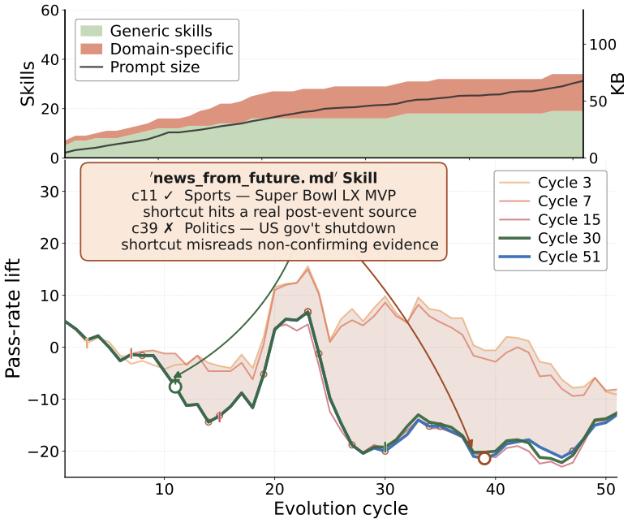

3. **Three deployment dimensions create distinct failure modes**
**D1, unbounded streams**, makes a single evolver compress growing trajectories, delayed labels, and prior work into a finite context. **D2, task heterogeneity**, makes one globally injected harness inappropriate when politics, sports, finance, cryptography, exploitation, and retrieval tasks need incompatible sources or rules. **D3, distributional non-stationarity**, makes even a historically strong harness drift out of fit as task language, difficulty, source accessibility, or market conditions change.

Figure 2 summarizes why continued construction and per-task selection are separate requirements.

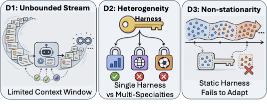

4. **The proposed response has three complementary axes**
**Sustained auto-harnessing** replaces a stateless one-shot editor with a stateful multi-agent process; **solve-time adaptation** selects a task-relevant branch instead of injecting every artifact; and **human-in-the-loop steering** supplies external source or access information that cannot be inferred from prior trajectories. The first two correspond to the paper's formal losses, while human steering explicitly sits outside that decomposition when history contains no relevant signal.

5. **The empirical claim is breadth across three kinds of streams**
The evaluation spans **5,075 prediction-market tasks**, **261 security challenges**, and **503 event-forecasting questions**. It includes five auto-harness baselines, multiple frozen base models, a human-designed tool system, component ablations, cross-branch replays, per-category analyses, cost accounting, and a logged human-steering study. This is stronger evidence for deployment-specific mechanisms than a single final benchmark score, although all three streams remain finite retrospective evaluations.

## 2 Related Work

1. **The method is a harness-level analogue of continual learning and mixture-of-experts routing**
Continual learning preserves capabilities across sequential tasks, domain and test-time adaptation handle distribution shift, and mixture-of-experts systems route inputs to specialized modules. Adaptive Auto-Harness moves these ideas from model weights or learned experts to **filesystem-level prompts, tools, skills, memory, and infrastructure**, with a routing decision over complete harness branches.

2. **A-Evolve is the closest linear-chain predecessor**
A-Evolve repeatedly reads batch trajectories and mutates prompts, skills, memory, and tools. Adaptive Auto-Harness preserves this execution-feedback loop but argues that a single evolving chain accumulates non-transferable artifacts, then replaces it with stateful role separation and branch isolation.

3. **GEPA, Meta-Harness, Continual Harness, and SkillOS cover adjacent design choices**
GEPA uses reflective Pareto prompt evolution driven by textual feedback; Meta-Harness uses a growing filesystem archive and Claude Code as proposer; Continual Harness alternates action and refinement in a continuous deployment run; SkillOS learns a reinforcement-learning curator for reusable skills. The present method differs by jointly targeting **cross-cycle construction state**, **whole-harness branch routing at solve time**, **delayed-label reveal**, and **auditable human hooks**.

## 3 Method

1. **The architecture separates expensive construction from lightweight task-time choice**
At evolution time, an **Analyst → parallel Researchers → Builder → Verifier** pipeline updates a persistent workspace and a tree of solver workspaces. At solve time, a router inspects branch metadata using `git show`, selects one branch, and lets the fixed solver execute from that checkout. This division is intended to make per-task adaptation cheap while keeping specialization and verification in the slower evolution loop.

Figure 3 shows the state channels, branch structure, temporal reveal, solve-time router, and two human hooks in one pipeline.

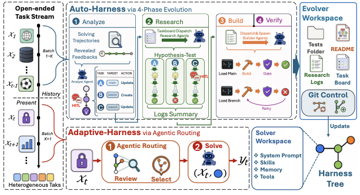

### 3.1 Problem Formulation

1. **Tasks arrive from a time-varying distribution with delayed experience**
The stream is $x_1,x_2,\ldots,x_T$ with $x_t\sim P_t$, where the distribution $P_t$ may change with time. Before solving $x_t$, the system has history

\[
\mathcal H_t=\{(x_i,r_i,\tau_i)\}_{i=1}^{t-1},
\]

where $r_i$ is an optional realized reward and $\tau_i$ records actions, intermediate observations, and tool calls. A missing or delayed $r_i$ is operationally important because market and forecasting outcomes may resolve after the trajectory is available.

2. **A harness is a bounded, evolver-produced representation**
The evolver $\varphi$ maps history to a capacity-limited harness,

\[
C=\varphi(\mathcal H_t),\qquad |C|\le K,
\]

where $C$ can contain prompts, skills, memory, and tools, and $K$ is the harness capacity budget. The solver then samples an action from

\[
a_t\sim\pi(a\mid x_t,C_t),
\]

so the LLM policy $\pi$ is fixed while its conditioning infrastructure changes.

### 3.2 Analytical Framework

1. **Harness quality is defined as expected task reward**
For task $x_t$, the expected utility of harness $C$ is

\[
V(C,x_t)=\mathbb E_{a_t\sim\pi(\cdot\mid x_t,C)}
\bigl[r(a_t,y(x_t))\bigr],
\]

where $y(x_t)$ is the ground truth and $r$ scores the sampled action. The full-history ceiling $V(\mathcal H_t,x_t)$ is the supremum over every harness of size at most $K$, not the performance of a directly implemented system.

2. **Regret compares the deployed evolver with an ideal bounded harness**
The paper defines

\[
\operatorname{Regret}(\varphi,x_t)
=V(\mathcal H_t,x_t)-V(\varphi(\mathcal H_t),x_t)\ge 0.
\]

This ideal assumes that a solver with full history, the same compute, and the same tools could reconstruct any bounded candidate harness on demand. It is therefore a conceptual diagnostic ceiling rather than a measurable benchmark score.

3. **A task-conditioned oracle exposes the cost of pre-commitment**
For evolver class $\Phi$, the solve-time oracle is

\[
C^*_{\Phi}(x_t)=
\arg\max_{\substack{C=\varphi(\mathcal H_t,x_t),\ \varphi\in\Phi\\|C|\le K}}
V(C,x_t).
\]

Unlike the deployed evolver, this oracle may see the incoming task before choosing its harness. It is the pivot that separates construction capability from task-specific selection.

4. **Expected regret decomposes into evolution and adaptation losses**
Proposition 1 states

\[
\mathbb E_{x_t}[\operatorname{Regret}(\varphi,x_t)]
=L_{\mathrm{evo}}(\Phi)+L_{\mathrm{adapt}}(\varphi),
\]

with

\[
L_{\mathrm{evo}}(\Phi)=\mathbb E_{x_t}
\left[V(\mathcal H_t,x_t)-V(C^*_{\Phi}(x_t),x_t)\right]
\]

and

\[
L_{\mathrm{adapt}}(\varphi)=\mathbb E_{x_t}
\left[V(C^*_{\Phi}(x_t),x_t)-V(\varphi(\mathcal H_t),x_t)\right].
\]

The identity is algebraic: add and subtract the task-conditioned oracle utility. Its value is conceptual because it maps the first term to what the evolver class cannot construct and the second to what a fixed pre-task commitment fails to select.

5. **History insufficiency is deliberately outside the decomposition**
Both losses assume that $\mathcal H_t$ contains signal relevant to $x_t$. Credentials, a newly required source, or a proprietary endpoint may be absent from history entirely. The human channel is consequently not presented as a third summand; it changes the information available to the system.

### 3.3 Sustained Auto-Harness via Multi-Agent Evolution

1. **Role separation expands the effective evolver class**
The Analyst diagnoses failures and selects targets; three parallel Researchers investigate disjoint regimes; the Builder implements verified approaches; and the Verifier tests the result, with up to **three build/verify retries**. Each phase receives its own context budget instead of forcing analysis, research, implementation, and testing into one agent window.

2. **Temporal reveal blocks future-label leakage**
Trajectories may enter history immediately, but realized outcome feedback is exposed only after the task's resolution time. Unresolved tasks remain unlabeled evidence. This is essential for prediction and forecasting streams, where a current web page or later market outcome could otherwise reveal the answer.

3. **Persistent state prevents every cycle from starting over**
The evolver workspace retains a prioritized `task_board.md`, tested hypotheses and verdicts in research logs, architecture notes, verifier reports, and tests. The Analyst also audits newly added artifacts for transferability, looking for hard-coded task IDs, time-specific rules, conflicting prompt instructions, or branches that underperform `main` on routed tasks.

4. **Branch creation is gated by repeated evidence**
The Analyst targets `main` only for changes judged domain-general and non-degrading. Regime-specific or cross-category harmful changes go to a branch; a new branch should not be created for fewer than **two tasks** or a single-cycle observation. This encodes the paper's main safety idea: isolate specialization instead of allowing every local fix to contaminate the global harness.

### 3.4 Solve-Time Adaptation via Harness-Tree Routing

1. **A git branch is a complete, versioned harness specialization**
Branches such as `branch/crypto-classical` or `branch/binary-reversing` can independently carry prompts, skills, tools, and registry changes. Git supplies isolation and lineage, while `main` remains the fallback for ambiguous tasks.

2. **The router uses branch documentation rather than outcome labels**
For each task, the router reads each branch README, matches positive and negative applicability signals, and emits one JSON decision with a branch, confidence, and reason. A specialized branch requires a strong match and nominal confidence of at least **0.7**; otherwise the policy says to choose `main`. The solver then checks out the selected branch and executes.

3. **Construction quality and routing quality are separate bottlenecks**
A tree can contain a strong branch without the router selecting it, and a router cannot recover a capability absent from every branch. The experiments therefore compare an oracle best branch, the deployed adaptive choice, fixed `main`, and the worst branch to distinguish branch headroom from routing realization.

### 3.5 Human-in-the-Loop Channel

1. **Task-board steering supplies missing direction before research**
After failure analysis, a human can add or reprioritize entries and supply domain guidance or source-access knowledge. The intervention affects subsequent research and construction, but the human does not provide answers or select solver branches.

2. **Research-phase assistance unblocks access barriers at failure time**
A Researcher can request credentials or help when an authentication wall prevents testing an endpoint. The released study logs these events, redacts keys, and distinguishes credential assistance from source guidance so the contribution of human input remains auditable.

## 4 Experiments

### 4.1 Experimental Setup

1. **Three chronological streams cover different deployment bottlenecks**
The exact settings and reported values make the relevant comparison concrete.

| Benchmark | Tasks | Span | Domain | Main metric |
| --- | ---: | --- | --- | --- |
| PolyBench | 5,075 | Feb 6–22, 2026 | Prediction markets | Accuracy and Return |
| CTF-Dojo | 261 | 2011–2024 | Security | Pass@1 |
| FutureX | 503 | Jan–Apr 2026 | Event forecasting | Pass@1 |

PolyBench mixes politics, sports, finance, crypto, entertainment, and other markets. CTF-Dojo covers binary exploitation, web security, cryptography, reversing, forensics, and miscellaneous tasks. FutureX spans English and Chinese questions over finance, technology, geopolitics, sports, and entertainment.

2. **The comparison controls the solver, schedule, and feedback gate**
Claude **Sonnet 4.6** is the solver, Claude **Opus 4.6** is the evolver, and Sonnet 4.6 is the router. Solver and evolver temperatures are **0**, batch sizes are **100/20/20**, and all algorithms share the same chronological loop and temporal-reveal gate. The no-evolution comparison also includes Haiku 4.5, DeepSeek-V3.2, Kimi-K2.5, and GLM-4.7.

3. **The baseline set spans five automatic and one human-designed harness**
The five auto-harness baselines are **A-Evolve, GEPA, Meta-Harness, Continual Harness, and SkillOS**; **OctoTools** is a frozen human-designed tool system. The proposed variants separate **Multi-agent** construction, **Adaptive** routing, and the **Full System** combining both. HITL is disabled in all main comparisons.

4. **PolyBench rewards coverage and confidence-weighted profitability**
For total markets $N$, executed trades $\mathcal T$, correctness $s_i$, investment $b_i$, and profit $g_i$,

\[
\mathrm{Coverage}=\frac{|\mathcal T|}{N},\qquad
\mathrm{Acc}=100\frac{1}{N}\sum_{i\in\mathcal T}s_i,
\]

\[
\mathrm{CWR}=100\frac{\sum_{i\in\mathcal T}g_i}{\sum_{i\in\mathcal T}b_i},
\qquad
\mathrm{Return}=\mathrm{Coverage}\cdot\mathrm{CWR}.
\]

Accuracy counts skipped markets against coverage, while Return discounts a high profit ratio earned on only a thin traded slice. CTF-Dojo and FutureX use their official Pass@1 criteria.

5. **The execution budget is substantial but deterministic**
The exact settings and reported values make the relevant comparison concrete.

| Hyperparameter | PolyBench | CTF-Dojo | FutureX |
| --- | ---: | ---: | ---: |
| Total tasks | 5,075 | 261 | 503 |
| Batch size | 100 | 20 | 20 |
| Evolution cycles | 51 | 14 | 26 |
| Solver max turns | 80 | 80 | 80 |
| Evolver max tokens | 128k | 128k | 128k |
| EGL threshold / window | 0.05 / 3 | 0.05 / 3 | 0.05 / 3 |
| Solve workers | 24 | 8 | 10 |
| Parallel Researchers | 3 | 3 | 3 |
| Routing confidence threshold | 0.7 | 0.7 | 0.7 |
| Solver/evolver sandbox network | none / none | none / none | bridge / bridge |

The reported metrics are point estimates rather than averages over re-sampling. This improves algorithmic comparability but leaves run-to-run uncertainty unmeasured.

### 4.2 Comparison with Baselines

1. **No single prior system leads both portfolio and pass-rate tasks**
A-Evolve reaches **45.2%** on CTF-Dojo and **47.5%** on FutureX but covers only **21.1%** of PolyBench. Meta-Harness reaches **55.3% coverage, 50.8% accuracy, and +320% Return** on PolyBench, yet scores **29.4%** on FutureX, below the **31.0%** no-evolution Sonnet. OctoTools does not lead any row.

2. **The three proposed variants jointly, not individually, lead every metric**
The exact settings and reported values make the relevant comparison concrete.

| Benchmark / metric | Sonnet | A-Evolve | GEPA | Meta-Harness | Continual Harness | SkillOS | OctoTools | Multi-agent | Adaptive | Full System |
| --- | ---: | ---: | ---: | ---: | ---: | ---: | ---: | ---: | ---: | ---: |
| PolyBench Accuracy | 22.2 | 18.4 | 13.4 | 50.8 | 8.5 | 21.4 | 40.0 | 79.8 | 77.4 | **80.9** |
| PolyBench Return | +1.7 | +7.2 | +0.2 | +320 | +1.7 | +3.6 | +20.4 | +351 | **+352** | +330 |
| CTF-Dojo Pass@1 | 37.2 | 45.2 | 42.9 | 41.0 | 25.7 | 29.5 | 38.3 | 47.9 | 46.0 | **50.2** |
| FutureX Pass@1 | 31.0 | 47.5 | 28.2 | 29.4 | 31.8 | 29.8 | 25.6 | **49.5** | 44.1 | 47.3 |

The Full System also attains **97.9% PolyBench coverage**, but Adaptive has the best Return and Multi-agent has the best FutureX Pass@1. Routing is therefore not universally additive.

3. **The base-model controls do not explain the evolved gains**
On PolyBench Accuracy, Haiku/DeepSeek/Kimi/GLM score **15.2/1.4/14.0/14.0**; on CTF-Dojo they score **23.8/26.1/24.5/12.6**; and on FutureX they score **31.0/31.2/27.8/30.8**. None approaches the best evolved variants, although the different model providers are not used as evolvers under a full factorial design.

### 4.3 Benchmark Bottlenecks

1. **PolyBench is limited by calibration, not only prediction**
The Multi-agent harness tracks market-consensus probabilities more closely, while single-agent variants remain comparatively flat and overconfident on low-consensus markets. This supports construction of confidence-calibration behavior as an evolution capability rather than treating every error as missing factual knowledge.

2. **FutureX is limited by source acquisition**
Pass@1 rises from **34.0%** with offline access to **47.6%** with date-filtered Wikipedia plus DuckDuckGo and to **57.1%** with unrestricted DuckDuckGo. Because retrieval access dominates, choosing among existing branches adds less value than building or unlocking the right source tools.

3. **CTF-Dojo is limited by payload-handling infrastructure**
Across challenge-file bins from no payload to more than **1 MB**, the best single-agent variant falls from **81.8% to 30.4%** and Multi-agent falls from **90.9% to 39.1%**. The roughly nine-point margin persists, but neither method eliminates degradation with large payloads.

Figure 4 puts these three distinct construction bottlenecks on benchmark-specific stress axes.

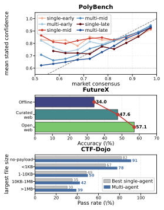

4. **Positive adaptation headroom persists across cycles**
Per-task adaptation lift is measured against the median score of single-committed-harness baselines. Its within-cycle mean and cross-category variation remain positive across all cycles on all three benchmarks, evidence that continued evolution of one dense harness does not erase the value of task-specific selection.

Figure 5 shows adaptation lift and category spread over evolution cycles.

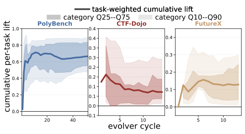

### 4.4 Stateful Multi-Agent Evolution

1. **Four-role evolution improves every curated ablation stream**
On subsets of **100/60/80 tasks** for PolyBench/CTF-Dojo/FutureX, the full stateful system improves over a single-agent evolver from **20.3 to 44.3 CWR**, **38% to 43% Pass@1**, and **38% to 44% Pass@1**, respectively. Removing cross-cycle memory produces the broadest degradation; removing evaluation feedback particularly damages PolyBench, where labels resolve after trading.

Figure 6 exposes the contribution of role separation, delayed feedback, and memory rather than reporting only the final system.

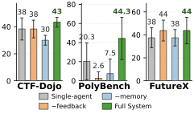

2. **The mechanism traces show concrete handoffs and checks**
The Analyst produces regime-specific targets, Researchers test candidate APIs or techniques, the Builder extends existing files, and the Verifier returns PASS/FAIL with specific tests. The router produces a branch decision with confidence and rationale, while the HITL trace records where a human-provided credential or source hint enters the workspace.

The three panels of Figure 8 show the evolution, routing, and HITL traces separately.

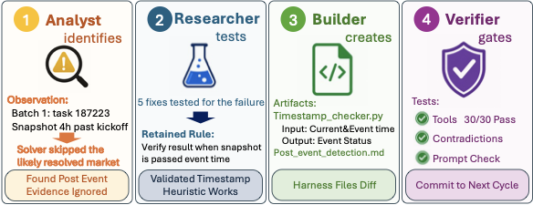

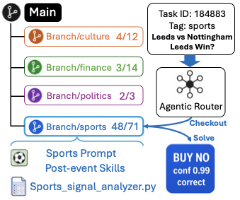

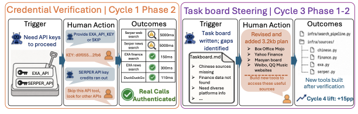

### 4.5 Solve-Time Routing on the Harness Tree

1. **The routing study deliberately isolates branch headroom**
One branch per task category is seeded, the tree is evolved, and every task in a replay subset is run through every available branch. The replay subsets contain **80 PolyBench, 40 CTF-Dojo, and 58 FutureX tasks**. Oracle and Worst are post-hoc bounds; Adapt is the live LLM router's selection; Naive always uses `main`.

Figure 7 visualizes the gap between branch construction and branch selection.

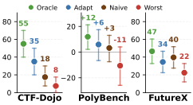

2. **Specialization creates significant headroom on CTF-Dojo and PolyBench**
The exact settings and reported values make the relevant comparison concrete.

| Condition | CTF-Dojo Pass% | PolyBench CWR% | FutureX Pass% |
| --- | ---: | ---: | ---: |
| Oracle | 55.0 [40.0, 70.0] | +12.0 [+2.1, +21.2] | 46.6 [32.8, 60.3] |
| Adapt | 35.0 [20.0, 50.0] | +5.9 [−6.6, +17.4] | 34.5 [22.4, 46.6] |
| Naive | 17.5 [7.5, 30.0] | +3.2 [−7.5, +13.0] | 39.7 [27.6, 51.7] |
| Worst | 7.5 [0.0, 17.5] | −10.6 [−25.9, +4.0] | 22.4 [12.1, 32.8] |
| Oracle − Naive | **+37.5** | **+8.8** | +6.9 |
| Adapt − Naive | **+17.5** | **+2.7** | **−5.2** |

Oracle−Naive is significant on CTF-Dojo with Holm-corrected $p=4.8\times10^{-4}$ and on PolyBench with $p=1.8\times10^{-5}$. The FutureX gap is smaller and not significant after correction.

3. **The realized router captures only part of the available gain**
Adapt recovers **17.5 of 37.5 points** on CTF-Dojo and **2.7 of 8.8 CWR points** on PolyBench, but loses **5.2 points** to `main` on FutureX. The result directly limits the generality of solve-time routing: specialization helps when branch quality and task-regime signals are reliable, not when every branch shares the same missing retrieval capability.

### 4.6 Human Steering for Auto-Harnessing

1. **Human input is targeted at missing external signal**
On a curated FutureX run of **100 tasks in five batches of 20**, two credential events in cycle 1 provide Exa and Serper access, while one substantive task-board intervention in cycle 3 directs research toward Western and Chinese specialty endpoints. Four other task-board prompts return `skip`, restricting intervention to cases covered by a pre-authored cheat sheet.

2. **The gain is localized around the supplied knowledge**
Slice-level lift is **0, +5, +20, +15, and 0 points** across the five regimes. It peaks on the directly targeted finance-and-technology slice, transfers to adjacent Western-specialty questions, and vanishes where the human hint is irrelevant. This supports source-specific steering, not a claim that generic human oversight always improves evolution.

Figure 9 aligns the two hook types with the affected task slices.

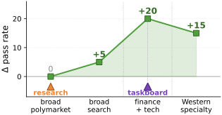

## 5 Conclusions

1. **Construction, selection, and information supply are complementary**
Stateful multi-agent evolution builds capabilities that a weaker evolver class cannot construct; routing selects among specialized capabilities after seeing the task; and human steering adds source or access information absent from historical experience. No one mechanism substitutes for the others across all three benchmarks.

2. **The strongest empirical lesson is conditional rather than universal**
Multi-agent construction is broadly useful, branch routing helps where regime labels align with strong specializations, and human input helps where it injects the missing external fact. FutureX demonstrates the boundary: improved source acquisition matters more than routing, and the Full System underperforms the Multi-agent-only variant.

## 6 Limitations

1. **The benchmark coverage is broad but still finite and retrospective**
The three streams represent prediction markets, security competitions, and event forecasting, but none is an indefinitely running live service. PolyBench covers **17 days**, FutureX **82 days**, and CTF-Dojo a chronological archive through 2024. “Open-ended” is therefore evaluated through chronological replay and continuing update rules, not demonstrated by an unbounded deployment.

2. **The formal losses are not estimated directly**
$L_{\mathrm{evo}}$ and $L_{\mathrm{adapt}}$ depend on oracle utilities that are unavailable. The experiments use capability stress tests, ablations, and Oracle−Naive replay gaps as proxies; the routing oracle is defined only over existing branches, not the full bounded harness space in the theory.

3. **Sustained improvement is not monotonic**
The full-stream Multi-agent run peaks at cycle **22 of 51** on PolyBench and **10 of 26** on FutureX. The appendix prose says CTF-Dojo continues accumulating utility across all 14 cycles, but its accompanying table reports **Peak = 1**, an internal inconsistency that needs clarification. The method mitigates dense-harness dilution, but its own reported trajectories do not establish indefinite monotonic improvement.

4. **Routing evaluation partly relies on designed branches and replay**
The RQ4 study seeds one branch per task category, uses smaller curated subsets, and obtains Oracle/Worst through exhaustive post-hoc replay. It demonstrates that specialization can help, but does not isolate how reliably the full autonomous evolver discovers the right branching structure from scratch.

5. **Closed models and single deterministic runs limit reproducibility**
The main pipeline relies on provider-hosted Sonnet 4.6 and Opus 4.6, both at temperature zero. Point estimates avoid sampling noise within a run but do not measure variability across API changes, repeated deterministic executions, prompt perturbations, or alternative solver/evolver pairs.

6. **Cost accounting omits a central part of the method**
Solver tokens and task wall-clock are reported, but **evolver-side tokens were not persisted**, and orchestration overhead is excluded. Since the method adds three parallel Researchers, a Builder, and a Verifier with retries, the missing evolution-side accounting prevents a full cost-effectiveness comparison.

7. **Human steering is an author-run intervention study**
The human follows a pre-authored cheat sheet and supplies credentials or source directions through Telegram. This is auditable and avoids answer labeling, but it does not measure operator burden, latency, disagreement, security review, or performance with independent users.

8. **Open questions follow directly from the remaining gaps**
Can a router learn from its own mistakes without leaking task outcomes? Can branch creation, merging, retirement, and `main` fallback be jointly optimized under a cost budget? Can evolution loss and adaptation loss be estimated without exhaustive branch replay? Can monotonic or risk-bounded release criteria prevent late-cycle regression? Can the system preserve security when evolved tools receive network access and human-supplied credentials? These questions are not resolved by the reported experiments.

## 7 Ethics Statement

1. **The evaluation uses public tasks with domain-specific containment**
No private user data are introduced. CTF-Dojo executes inside isolated benchmark containers with constrained network policy and verifies submitted flags by SHA-256 hash rather than targeting live systems.

2. **Human access is constrained but tool evolution remains security-sensitive**
Humans may provide source guidance, task-board edits, and credential decisions, but may not expose answers or choose branches. API tokens are redacted in logs. The stated controls reduce leakage and direct misuse, although the paper does not report automated secret scanning, least-privilege credential scopes, or adversarial testing of evolved tools.

## 8 AI Usage Statement

1. **AI assistants supported writing, debugging, and analysis**
The declared use covers prose refinement and accelerated implementation and evaluation work. No additional breakdown of generated code, review procedures, or provenance is provided.

## Appendix A Benchmark and Evaluation Details

### A.1 PolyBench

1. **Outcome labels follow market resolution time**
Each task stores release and resolution timestamps; the solver sees only release-time information, and the evolver receives the label only after resolution. Retries and duplicate records do not affect metrics because analysis keeps the first record for each `instance_id`.

2. **Later PolyBench markets become less decisive and less tradeable**
Tradeable markets fall from **97% early to 31% late**, markets with maximum price above 0.95 fall from **44% to 29%**, near-even markets rise from **18% to 35%**, and the market-price correctness proxy declines from **84% to 77%**. This makes calibration, abstention, and evidence gathering time-dependent.

Figure 12 shows the shift from liquid, decisive markets toward thinner, ambiguous ones.

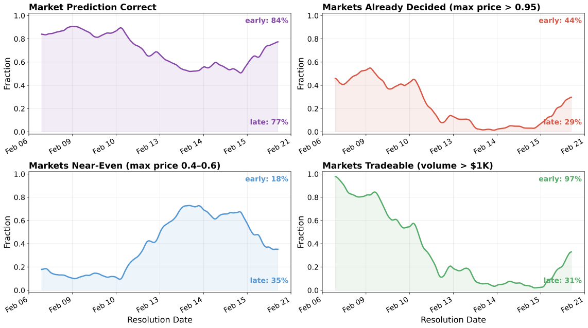

### A.2 CTF-Dojo

1. **Security tasks are verified in isolated per-task containers**
The 261 challenges come from `pwncollege/ctf-archive`, are ordered from 2011 to 2024, and span changing competitions and conventions. Each task runs in a Docker sandbox with constrained networking, and flags are checked against official SHA-256 hashes.

2. **Competition provenance shifts throughout the stream**
By the late stream, **100%** of tasks come from competitions unseen in the first third. Competition diversity within 50-task windows and cross-competition score variation show that early CTF experience is not uniformly transferable.

Figure 13 visualizes expanding competition coverage and variability.

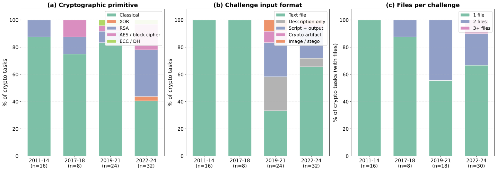

### A.3 FutureX

1. **Temporal retrieval combines cutoff-aware APIs with an LLM filter**
Wikipedia uses the latest revision before the task cutoff; DuckDuckGo results are filtered by extracted dates; structured series cap observations and realtime metadata at the cutoff. Evolved-tool output passes through an LLM temporal filter that either marks it `CLEAN` or replaces post-cutoff content with `[REDACTED]` before the solver sees it.

2. **Later batches shift language, source access, difficulty, and answer format**
Batch-level baseline accuracy ranges from **20% to 80%**. Chinese-titled questions, search-resistant platforms, Level 3–4 questions, and Chinese answer requirements become more common in later batches, coupling source construction with solve-time language and difficulty adaptation.

Figure 14 shows these simultaneous distribution shifts.

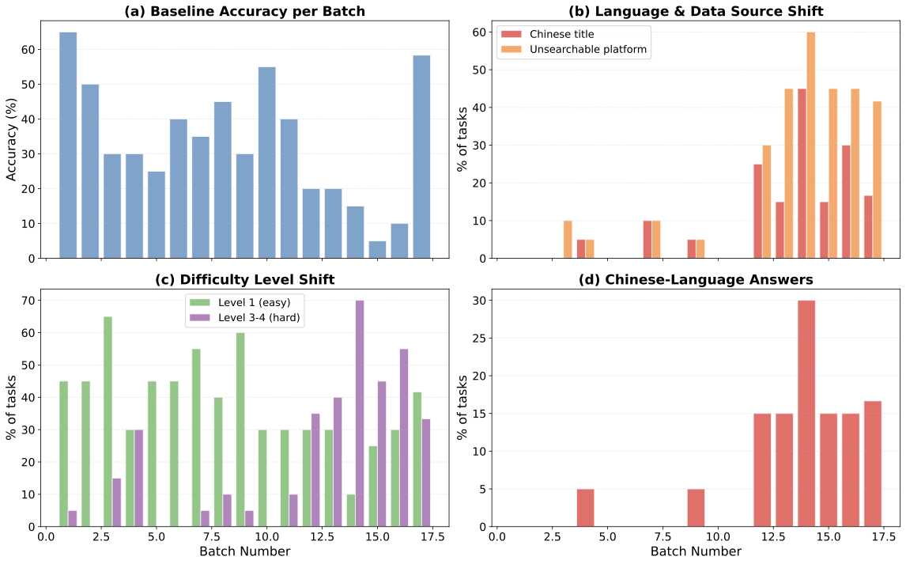

## Appendix B Implementation and Reproducibility Details

1. **The full runs contain one solve trajectory per task and one evolution cycle per batch**
The released runs contain **5,075/261/503 trajectories** and **51/14/26 evolution cycles** for PolyBench/CTF-Dojo/FutureX. Inference uses hosted APIs; local computation handles orchestration, aggregation, figures, and Docker execution. No model weights are trained or fine-tuned.

2. **The seed harness is intentionally sparse**
The exact settings and reported values make the relevant comparison concrete.

| Benchmark | Prompt lines | Seed skills | Seed tools | Seed memory entries | Infrastructure scaffold |
| --- | ---: | ---: | ---: | ---: | --- |
| PolyBench | 27 | 0 | 0 | 0 | No |
| CTF-Dojo | 24 | 0 | 0 | 0 | No |
| FutureX | 114 | 0 | 0 | 0 | Yes |

Only FutureX begins with infrastructure, needed to specify its temporal-retrieval contract. Every other skill, tool, or memory component is attributed to evolution rather than a hand-engineered seed.

3. **Solver-side resource use varies sharply by system and benchmark**
The exact settings and reported values make the relevant comparison concrete.

| System | PolyBench in/out M tokens, hours | CTF-Dojo in/out M tokens, hours | FutureX in/out M tokens, hours |
| --- | --- | --- | --- |
| Sonnet | 35.3 / 5.0, 25.6 h | 138.4 / 2.1, 22.4 h | 55.5 / 0.7, 34.2 h |
| A-Evolve | 365.4 / 4.2, 23.9 h | 111.3 / 1.7, 11.4 h | 268.8 / 1.2, 13.8 h |
| Meta-Harness | 245.0 / 9.6, 49.7 h | 142.7 / 2.2, 20.0 h | 39.1 / 0.5, 7.9 h |
| Multi-agent | 264.2 / 14.5, 78.0 h | 180.2 / 2.5, 21.2 h | 130.7 / 1.0, 12.1 h |
| Full System | 233.2 / 12.2, 59.5 h | 169.0 / 2.4, 21.1 h | 25.6 / 0.5, 6.6 h |

These sums exclude orchestration and evolver-side tokens. Full System is not uniformly more expensive at solve time because routing can select branches that finish quickly, but the table cannot establish total-system efficiency.

4. **Branch replay is diagnostic rather than deployable oracle access**
Every branch is rerun on a curated subset to construct Oracle and Worst. The live router sees only task context and branch metadata, never task labels or branch outcomes.

## Appendix C Benchmark Non-Stationarity Diagnostics

1. **Stronger evolvers help until construction budget saturates**
On CTF-Dojo, pass rate rises with evolver capability. Additional construction budget helps Haiku and Sonnet more than Opus, suggesting that budget cannot compensate indefinitely for a weaker evolver class.

Figure 10 separates evolver-model capability from budget.

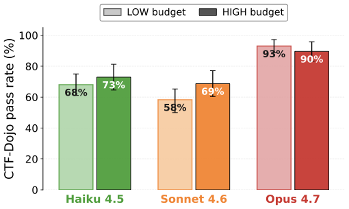

2. **Combining every evolved workspace can dilute performance**
The PolyBench-specific workspace has the strongest CWR, while an all-domain merged workspace loses **57 CWR points**. This is direct evidence against monolithic accumulation and motivates branch isolation.

Figure 11 compares domain-specific and merged workspaces.

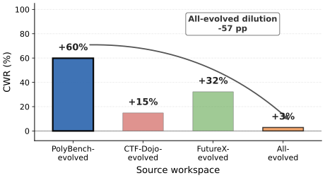

## Appendix D Further Experiments

1. **Model capability and storage organization solve different problems**
Increasing evolver capability improves what can be constructed; domain-specific storage prevents useful components from being diluted by unrelated ones. The two diagnostics support the theory's separation between evolver-class capability and task-specific fit, but neither provides a direct estimator of the formal losses.

## Appendix E Per-Domain and Per-Category Breakdowns

1. **CTF-Dojo gains concentrate in web and cryptography while binary exploitation remains hard**
The exact settings and reported values make the relevant comparison concrete.

| Category (N) | Sonnet | A-Evolve | Multi-agent | Adaptive | Full System |
| --- | ---: | ---: | ---: | ---: | ---: |
| Crypto (74) | 52.7 | 66.1 | 67.6 | 55.6 | **72.1** |
| Binary/pwn (41) | 4.9 | 11.5 | 7.0 | 4.8 | **14.8** |
| Web (11) | 45.5 | 41.7 | 33.3 | 50.0 | **72.7** |
| Reverse (65) | 49.2 | 62.7 | 59.7 | 57.0 | **66.2** |
| Forensics (12) | 58.3 | 61.5 | 64.3 | **71.4** | 58.3 |
| Misc (58) | 20.7 | 23.5 | 34.1 | **40.5** | 25.6 |

Full System gains about **27 points over Sonnet on web** and **19 points on crypto**, but combination is harmful on forensics and misc relative to Adaptive. This reinforces that routing and multi-agent evolution are complementary only in some categories.

2. **FutureX's Chinese-language slices expose a severe unresolved source problem**
The Multi-agent variant scores **30.0%** on ten Chinese-finance questions, while Adaptive scores **0.0%** and Full System **20.0%**. Every method scores **0.0%** on 25 Chinese-entertainment questions. English-finance improves from **21.1% Sonnet to 56.6% Full System**, showing that the failure is concentrated in language/source access rather than forecasting universally.

3. **PolyBench Return is dominated by sports and the uncategorized majority**
The exact settings and reported values make the relevant comparison concrete.

| Category (N) | Sonnet Acc/Return | Multi-agent | Adaptive | Full System |
| --- | --- | --- | --- | --- |
| Politics (372) | 18.3 / −5 | **87.9 / −3** | 87.6 / −2 | 87.1 / −4 |
| Sports (1,120) | 23.8 / +3 | 81.7 / +659 | 80.0 / +642 | **84.6 / +596** |
| Finance (240) | 19.6 / +2 | **81.7 / +10** | 77.1 / +8 | 80.4 / +9 |
| Crypto (447) | 20.4 / −3 | 89.3 / +4 | 88.4 / +4 | **90.8 / +5** |
| Entertainment (218) | 22.0 / −2 | **89.4 / +105** | 87.6 / +101 | 89.0 / +83 |
| Other (2,678) | 22.6 / +3 | 75.4 / +394 | 72.3 / +409 | **76.2 / +374** |

Politics achieves high accuracy but near-zero or negative Return, while liquid sports markets drive very large portfolio ratios. A single aggregate PolyBench number therefore conceals major category and stake-distribution effects.

## Appendix F Multi-Agent Evolution Dynamics

1. **Full-stream improvements coexist with early peaks**
The exact settings and reported values make the relevant comparison concrete.

| Benchmark | Metric | No evolution | A-Evolve | Multi-agent | Reported peak cycle | Total cycles |
| --- | --- | ---: | ---: | ---: | ---: | ---: |
| PolyBench | Accuracy | 22.2 | 18.4 | **79.8** | 22 | 51 |
| CTF-Dojo | Pass@1 | 37.2 | 45.2 | **47.9** | 1 | 14 |
| FutureX | Pass@1 | 31.0 | 47.5 | **49.5** | 10 | 26 |

The final aggregate system contrast supports multi-agent evolution, but the peak timing cautions against interpreting the results as monotonic self-improvement. The CTF-Dojo peak entry conflicts with the accompanying prose and should not be silently reconciled.

## Appendix G Routing Behaviour and Branch Performance

1. **The live router never uses its permitted `main` fallback on the analyzed subsets**
On 60 CTF-Dojo tasks it routes 20/20/12 tasks to crypto/rev/pwn branches and the remainder to misc/web/forensics; `branch/pwn` solves **0%** of its 12 assigned tasks. On 100 PolyBench tasks it sends **71** to sports at **67.6% HitRate**, 14 to finance at 21.4%, 12 to culture at 33.3%, and 3 to politics-world at 66.7%. On 80 FutureX tasks it assigns 28/30/8/14 tasks to level 1/2/3/4 branches, with level 3 solving **0%**.

2. **Low branch pass rate can reflect task difficulty, but fallback calibration remains questionable**
Hard tasks also have low Oracle success, so a weak realized branch rate does not alone prove misrouting. Nevertheless, never choosing `main` despite a 0.7 confidence threshold suggests the fallback policy is ineffective on these subsets and deserves explicit calibration analysis.

3. **Per-batch routing gains are unstable**
CTF-Dojo Oracle improves from **45% to 65%** between replay batches 2 and 3, while Adapt improves from **30% to 40%**. FutureX batch 3 has Oracle **57.9%**, Adapt **26.3%**, and Naive **52.6%**; only batch 4 shows Adapt **36.8%** versus Naive **21.1%**. PolyBench Adapt exceeds Naive in three of four replay batches but is slightly worse in batch 4 (**1.1 vs 1.4 CWR**).

## Appendix H Human-in-the-Loop Event Log

1. **Seven logged events distinguish credentials, guidance, and non-intervention**
Cycle 1 supplies redacted `EXA_API_KEY` and `SERPER_API_KEY` credentials. Task-board prompts in cycles 1, 2, 4, and 5 return `skip`; cycle 3 supplies endpoint families for US equities, box office, Chinese securities, film, and ranking sources. The event log makes clear that the human signal is sparse and pre-authorized rather than continuous answer supervision.

## Appendix I Run-Detail Analysis

1. **Turn and latency distributions are right-skewed and benchmark-dependent**
No-evolution Sonnet averages **89.4 turns and 308.4 seconds** on CTF-Dojo, indicating frequent budget saturation, but only **1.0 turn and 18.2 seconds** on PolyBench. Full System averages **36.4 turns/290.9 seconds** on CTF-Dojo, **5.4/42.2** on PolyBench, and **4.2/47.6** on FutureX. On FutureX, Full System is much faster than no-evolution Sonnet (**47.6 vs 244.4 mean seconds**), whereas CTF wall-clock remains nearly as high despite fewer turns.

2. **Reported wall-clock excludes orchestration and cannot be read as end-to-end latency**
The timing sums per-task solve durations only. Routing, evolution, parallel research, human waiting, retries, and framework overhead are outside the totals, so operational deployment cost remains undercharacterized.

## Appendix J System Prompts

1. **The router prompt encodes conservative fallback in principle**
It asks for exactly one branch, prioritizes README applicability signals, uses a **0.7** strong-match threshold, and says to prefer `main` when signals conflict or branch documentation is weak. The routing analysis shows that this conservative fallback is not realized in the tested subsets.

2. **Researchers must produce implementation-level, tested records**
Each Researcher receives an assigned regime, inspects existing code and prior research, searches and tests new approaches, records endpoint arguments and response formats, and marks reliability. Their output is consumed by the Builder rather than directly entering the live harness.

3. **The Builder is instructed to extend, not rewrite**
Only approaches recorded as working should be implemented. The Builder updates architecture documentation, avoids direct git operations, and can be sent back for up to three retries after verifier failure.

4. **The Verifier is a release gate**
It tests the changed solver workspace and emits an explicit PASS or FAIL plus individual test results. A PASS makes code live for the next batch; a FAIL returns concrete evidence to the Builder.

5. **The Analyst prompt operationalizes anti-overfitting safeguards**
Before proposing fixes, the Analyst compares category performance across cycles, audits new skills/tools/prompts/memory for domain or time specificity, checks contradictory rules, and retires branches that underperform `main`. It records “toxic artifacts” with an action—move to a branch, deprecate, or rewrite generically—and uses only temporally revealed observations rather than a masked feedback archive.
