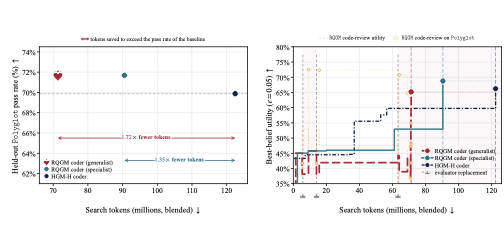
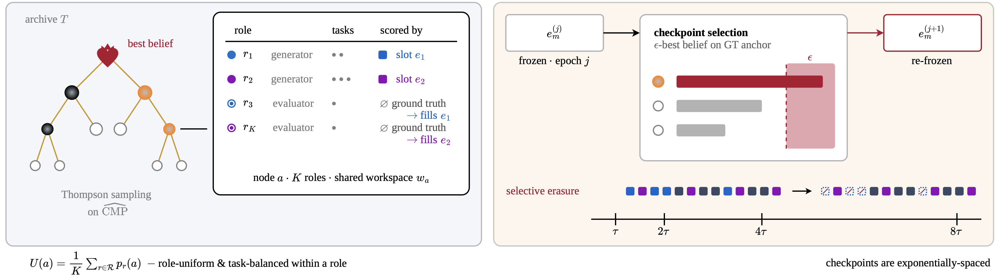
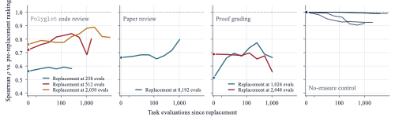
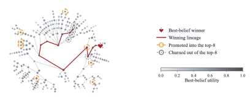
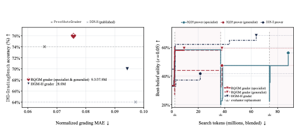
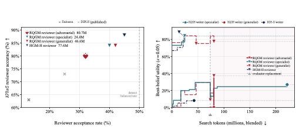

# The Red Queen Gödel Machine: Co-Evolving Agents and Their Evaluators

Source: [arXiv:2606.26294](https://arxiv.org/abs/2606.26294), version 2, accessed 2026-09-01.

## Overview / Takeaway

The Red Queen Gödel Machine (RQGM) makes learned evaluators part of recursive agent improvement instead of holding the utility fixed for an entire run. It freezes each evaluator within an epoch, replaces it only when a challenger has stronger conservative evidence on a fixed ground-truth anchor, and selectively erases scores made obsolete by the transition. Across coding, paper writing/review, and proof writing/grading, RQGM reports 71.7% held-out coding pass rate, 40.5% cross-reviewer paper acceptance, and a specialist prover score of 4.33/7. The central qualification is that guarantees are epoch-local: anchors can be weak or biased, task-agent utilities cannot be compared across evaluator epochs, and no theorem establishes global convergence of the co-evolving pair.

## 1 Introduction

1. **Fixed evaluation is the remaining stationary component in self-improving agent search**
Darwin Gödel Machine, Huxley Gödel Machine, and HyperAgents edit agent code and retain useful descendants, but their benchmark, verifier, or judge stays outside the improvement loop. This blocks domains without direct benchmarks, makes expensive evaluation a bottleneck, and invites saturation or reward hacking.

2. **RQGM treats the evaluator as another learned role in the workspace**
A task agent and its evaluator improve together. Learned evaluators can supply a signal for paper or proof writing, complement an executable verifier with code-quality judgments, or act as a cheaper proxy.

3. **Controlled utility evolution makes non-stationarity piecewise stationary**
Within an epoch, one evaluator is frozen. At a checkpoint, challengers are scored against a held-out anchor; a statistically preferred challenger can replace the incumbent, and records depending on the old evaluator are erased.

4. **The coding headline combines higher pass rate with lower search cost**
On held-out Polyglot tasks, RQGM reaches **71.7%** versus HGM-HyperAgents’ **69.9%**, using **1.35×–1.72× fewer search tokens** to exceed the baseline rate.

5. **Open-ended generators improve under fixed post-hoc panels**
The best co-evolved writer reaches **40.5%** mean acceptance across four fixed reviewers versus **21.8%** for HGM-HyperAgents, a **1.86×** ratio; the matched-cost generalist reaches 38.8%, or **1.78×**.

6. **Evaluator evolution can introduce objectives absent from the anchor**
The strongest baseline reviewer accepts AI-generated papers at up to **1.91×** the human rate. RQGM uses accepted machine papers from one epoch as an adversarial pool in the next, finding a reviewer with 80% anchor accuracy and similar stringency on human and machine writing.

7. **The paper explicitly loosens convergence ambitions**
The authors aim for agents and judges that recursively bootstrap one another, but acknowledge that changing objectives sacrifices guarantees available under a single static criterion.

## 2 Related Work

1. **RQGM directly extends the DGM–HGM–HyperAgents lineage**
DGM introduces archive search over self-modifying agents; HGM changes selection to clade metaproductivity; HyperAgents makes each node a meta-agent/task-agent pair across domains. RQGM turns the node into a multi-role workspace and makes evaluator slots replaceable.

2. **It differs from other self-rewriters by changing the criterion mid-run**
Live-SWE-Agent, SICA, PromptBreeder, STaR, and domain-specific self-tuning alter code, prompts, or reasoning while retaining an external objective. RQGM’s novelty is controlled objective replacement rather than self-modification alone.

3. **LLM judges provide the mechanism and the bias problem**
Judge-based discovery systems scale evaluation but inherit position, verbosity, and self-preference biases. RQGM makes judge improvement endogenous while retaining an external anchor for replacement.

4. **The Red Queen analogy comes from co-evolution and self-play**
Fitness sharing, self-modifying policies, and self-play adapt agents against moving opponents. RQGM moves the target in utility space: the learned criterion itself evolves.

## 3 RQGM: Co-Evolving Agents and Their Evaluators

1. **Four modifications turn HGM search into co-evolution**
Every node is a multi-agent workspace; evaluators are agentic programs; utility may change only at designated epochs; and evaluator slots can be replaced. The scoring and orchestration harness remains fixed.

### 3.1 Preliminaries: Self-Improvement as Tree Search

1. **Search grows an archive tree by modification and evaluation**
At step $t$, a node $a\in\mathcal T_t$ is edited into a child or evaluated for binary outcome $o\in\{0,1\}$. Successes $S_a$ and failures $F_a$ accumulate until budget $B$ is exhausted.

2. **Clade metaproductivity rewards productive ancestry**
For subtree $C(a)$,

$$
\widehat{\mathrm{CMP}}(a)=\frac{n^C_{\mathrm{success}}(a)}{n^C_{\mathrm{success}}(a)+n^C_{\mathrm{failure}}(a)}.
$$

Thompson sampling uses pooled descendant outcomes because a mediocre parent may generate excellent children.

3. **Best-belief is a conservative posterior quantile**
The formal expression makes the mechanism and its constraints explicit.

$$
BB_\epsilon(a)=I^{-1}_\epsilon(1+S_a,1+F_a).
$$

With $\epsilon=0.05$, this is a lower posterior quantile rather than a point estimate, discouraging selection from sparse lucky outcomes.

### 3.2 Search Space

1. **Roles and tasks form a shared editable workspace**
Each node contains $K$ roles $\mathcal R=\{r_1,\ldots,r_K\}$, each with task pool $\mathcal D_r$. A meta-agent may edit role agents and share code among them; only orchestration and scoring stay immutable.

2. **Evaluator-dependent roles have independently replaceable slots**
With $M\leq K$ learned-evaluator slots, epoch vector $\boldsymbol j=(j_1,\ldots,j_M)$ records which evaluator version scores each dependent role. Replacing one slot changes one component without forcing every utility to transition.

3. **Utility balances tasks and roles uniformly**
The formal expression makes the mechanism and its constraints explicit.

$$
p_{r,\boldsymbol j}(a)=\frac{1}{|\mathcal D_r|}\sum_{d\in\mathcal D_r}p_{r,d,\boldsymbol j}(a),\qquad
U_{\boldsymbol j}(a)=\frac{1}{|\mathcal R|}\sum_{r\in\mathcal R}p_{r,\boldsymbol j}(a).
$$

Uniform averages prevent roles with unbounded evaluation volume from dominating merely through sample count.

4. **Generation evidence and selection evidence are separated**
Meta-agents see training results for their node and ancestors, but search utility uses validation data only; final reporting uses a separate test split. Evaluator-dependent roles generate separate artifacts for training and search.

### 3.3 Three-Level Sampling Hierarchy

1. **UCB-Air controls archive growth**
A node is expanded when $N_t^\alpha\geq|\mathcal T_t|$, yielding archive size $\mathcal O(N_t^\alpha)$; the experiments use $\alpha=0.6$.

2. **Sampling chooses node, role, then task**
Thompson sampling first chooses a node by clade metaproductivity. The least-evaluated eligible role and then least-evaluated eligible task load-balance evidence, enabling the pooled posterior mean to converge to role–task balanced utility within a fixed epoch.

### 3.4 Co-Evolving Evaluation

1. **Stationarity is local to an epoch**
Evaluator code, artifact-generation protocol, and binary scoring rule must remain frozen inside the epoch. This converts each epoch into the fixed binary-outcome problem assumed by HGM theory.

2. **Selective erasure removes only evaluator-dependent history**
When a slot changes, RQGM deletes records scored by its displaced evaluator and preserves anchor evidence and unrelated roles. Multiple slot erasures commute.

3. **Erasure is essential for semantic validity, not mere cleanup**
Keeping or rescaling stale utilities would mix different functions. The no-erasure ablation later shows old rankings dominate and replacements eventually stall.

### 3.5 Controlled Utility Evolution

1. **Evaluator promotion is anchored to fixed ground truth**
At boundaries, incumbent and challengers are evaluated on objective or human-preference labels. The largest anchor $BB_\epsilon$ wins; ties retain the incumbent to avoid needless erasure.

2. **The probabilistic claim is a lower bound, not guaranteed superiority**
The selected evaluator maximizes a score that its anchor utility exceeds with probability $1-\epsilon$. It can still be worse because of finite evidence, anchor bias, distribution shift, or objectives not represented by the anchor.

3. **Lazy re-evaluation amortizes transition work**
Old nodes are re-scored only when search revisits them, using cached outputs where possible. Exponentially spaced checkpoints with ratio $\rho>1$ bound cumulative exposed records by $\mathcal O(B)$ rather than $\mathcal O(B^2)$ for transition after every evaluation.

4. **The theory is deliberately epoch-local**
Within-epoch HGM validity, anchor-guided replacement, and linear transition bookkeeping do not bound transition count, erased-evidence regret, or convergence to a globally optimal agent–evaluator pair.

## 4 Experimental Design

1. **Three paired domains probe four research questions**
Coding pairs Polyglot execution with a CRAVE-anchored code reviewer; paper writing pairs a writer with an APRES-anchored reviewer; proof writing pairs a prover with an IMO-GradBench-anchored grader.

2. **Specialist and generalist selection answer different optimization questions**
A specialist maximizes one utility; a generalist maximizes average best-belief across active utilities. Both are reported to expose whether target gains trade off other roles.

3. **HGM-HyperAgents is the principal matched baseline**
It uses HGM search but frozen evaluators from prior work. Published DGM-HyperAgents evaluator patches are additional unmatched-model references where available.

4. **Only anchored roles admit global winners**
Writer and prover scores depend on the frozen evaluator of their epoch, so trajectory heights are not comparable across epochs or runs. Authors select epoch-local winners and score them post-hoc with fixed panels.

5. **Headline runs share a 12,288-evaluation budget**
All use GPT-5.1 (low), three train samples per node, $\epsilon=0.05$, power-of-two checkpoints $\rho=2$, and no cooldown. Polyglot splits are 10 train, 49 validation, and 166 test tasks; APRES, IMO-GradBench, and CRAVE tests each contain 100 items.

6. **Cost uses output-weighted blended tokens**
Output tokens count five times input tokens. The cost assigned to a winner stops when it first reaches its maximum best-belief, not at run completion; this must be remembered when comparing trajectories.

## 5 Results

### 5.1 Learned evaluation helps even where ground truth exists (RQ1)

1. **A cheap reviewer complements executable tests**
Both specialist and generalist coders reach 119/166 held-out passes (**71.7%**) versus HGM-HyperAgents’ 116/166 (**69.9%**) at 1.35×–1.72× lower token cost.

2. **Shared edits explain part of the efficiency**
**90%** of accepted Polyglot patches modify shared task-agent functionality or infrastructure rather than role-specific code, letting one expansion benefit coder and reviewer.

### 5.2 Learned evaluation improves agents on domains without objective evaluation (RQ2)

| Writer | Search tokens | Sakana | DGM-H | HGM-H | RQGM adversarial | Panel mean |
|---|---:|---:|---:|---:|---:|---:|
| HGM-H writer | 42.5M | 1.0 | 12.0 | 64.0 | 10.0 | 21.8 ± 4.0 |
| RQGM generalist | 44.6M | 2.0 | 43.0 | 81.0 | 29.0 | 38.8 ± 4.8 |
| RQGM specialist | 221.8M | 5.0 | 40.0 | 86.0 | 31.0 | **40.5 ± 4.8** |

1. **Writer gains survive a heterogeneous reviewer panel**
The matched-cost generalist achieves 1.78× the baseline mean; the best specialist achieves 1.86× and beats the baseline under every reviewer. Each cell uses 100 generated papers; the mean pools 400 paper–reviewer decisions with 95% Jeffreys intervals.

| Prover | Search tokens | Score / 7 | Pass@6 | Pass@7 |
|---|---:|---:|---:|---:|
| Static prover | N/A | 4.07 ± 0.42 | 55.0% ± 6.4 | **55.0% ± 6.4** |
| HGM-H prover | 21.5M | 3.73 ± 0.43 | 51.7% ± 6.5 | 45.0% ± 6.4 |
| RQGM generalist | 37.9M | 3.73 ± 0.43 | 51.7% ± 6.5 | 45.0% ± 6.4 |
| RQGM specialist | 88.0M | **4.33 ± 0.41** | **61.7% ± 6.3** | 48.3% ± 6.5 |

2. **Proof results expose a metric tradeoff**
The specialist leads mean score and Pass@6 but trails the static prover on Pass@7. The generalist and HGM-H prover also fall below the static baseline, so co-evolution is not uniformly beneficial across selection points or strictness thresholds.

### 5.3 Evaluator replacements act as a curriculum on the search (RQ3)

1. **Replacement causes lasting archive re-ranking**
Post/pre Spearman correlations settle well below 1 after erasure, while the no-erasure control remains at $\rho\geq0.90$. New evaluators therefore change which nodes search favors rather than only sharpen confidence.

2. **A strong lineage survives while other top nodes churn**
The paper archive preserves its winning lineage, yet every prior top-eight member is re-ranked. This is suggestive of a curriculum, but it is observational rather than a causal measurement of increasing evaluator strictness.

### 5.4 Co-evolution improves the evaluators themselves (RQ4)

1. **The proof grader reaches higher anchored accuracy at lower cost**
The co-evolved grader is reported **9%** more accurate on ground truth and **3×** more token-efficient at specialist selection than HGM-H. At later generalist selection it costs 1.35× more, though HGM-H never matches its accuracy within equal budget.

2. **Raw reviewer accuracy alone rewards harmful leniency**
The HGM-H reviewer is accurate on APRES partly by over-accepting machine papers. RQGM deliberately sacrifices raw accuracy to retain 80% while matching human and AI acceptance rates more closely.

3. **The adversarial pool makes evaluator change task-aware**
Papers accepted by the displaced reviewer are replayed as negatives for its successor. This counters self-preference but also changes the objective beyond the anchor, so “improvement” becomes normative calibration rather than monotonic APRES accuracy.

### 5.5 Reducing search costs via hybrid-model approaches

1. **Evaluation, not expansion, dominates cost**
Expansion accounts for approximately 20% of cost across domains; repeated task-agent evaluation accounts for roughly 80%.

2. **Nemotron task calls yield an estimated 13× cost reduction**
Keeping the GPT-5.1 meta-agent but routing search-time paper evaluation through Nemotron approaches the GPT-only endpoint at approximately 13× lower search-token cost. The conversion is price-equivalent and time-sensitive, not a hardware-normalized token comparison.

## 6 Conclusion

1. **Controlled transitions are the conceptual contribution**
RQGM shows how a search objective can change without mixing incompatible records: freeze within epochs, anchor replacement externally, erase dependent history, and re-rank lazily.

2. **The empirical evidence supports utility, not global convergence**
Co-evolved evaluators improve coding efficiency, enable fixed-panel gains for open-ended generators, and can correct reviewer bias. Results remain preliminary and short-horizon.

### 6.1 Future Research Directions

1. **Anchors are both guardrails and ceilings**
A fixed anchor prevents unconstrained drift but limits evaluator evolution to its decision boundary. Richer epoch-level objectives may move beyond it, increasing both capability and alignment risk.

2. **Longer co-evolution is an untested hypothesis**
The paper expects stricter judges and stronger generators to compound, but cumulative erasure, inherited outdated topology, and adversarial cycling may instead dominate over long horizons.

## Appendix A: Appendix Overview

1. **The appendix supplies algorithm, protocols, analyses, theory, and limitations**
It discloses fixed and editable settings, raw held-out counts, mechanism ablations, lineage edits, formal assumptions, and the scope of guarantees.

## Appendix B: The Algorithm in Full

1. **Replacement is checkpointed and slot-specific**
The algorithm alternates HGM expansion/evaluation with checkpoint replacement. Only anchor evidence chooses a new evaluator; dependent records are erased before the next epoch.

2. **Cached artifacts reduce re-evaluation cost**
Task outputs can be rejudged without rerunning expensive generators, separating the cost of changing judgment from artifact creation.

## Appendix C: Experimental Setup

1. **Eight headline runs use matched evaluation budgets**
Coding, paper, and proof RQGM/HGM-H arms each run to 12,288 evaluations. Generous per-call caps are visible to the meta-agent but reportedly never approached.

2. **Uncertainty conventions differ between domains**
Writer cells report 95% Jeffreys intervals, while prover cells use one standard error, approximately 68% coverage; widths are not directly comparable.

## Appendix D: Results and Ablations

1. **The fixed critic saturates rather than becoming discerning**
Without replacement, the Nemotron writer reaches 75/75 accepted validation papers while reviewer anchor accuracy is only 78.2%, consistent with reward hacking.

2. **Replacement escapes saturation; erasure makes it effective**
Replacement-only reaches 91.2% reviewer anchor accuracy. Without erasure, stale utilities cause A→B→A evaluator oscillation and eventually suppress further replacements.

3. **Ablation writer acceptance is not cross-run comparable**
Each writer is scored by its own critic, so the fixed-critic 100% and full-mechanism 90.1% are not common-scale outcomes. Anchor accuracy is the valid cross-run comparison.

## Appendix E: What the Co-Evolution Discovered

1. **Patch histories mix shared infrastructure and role-specific changes**
Winning lineages modify prompts, agent code, reviewer/grader logic, meta-agent modules, notes, and shared infrastructure; this makes co-evolution a coupled program-search process rather than independent role tuning.

2. **The strongest reviewer is intentionally not the most anchor-accurate**
The adversarial objective seeks a hard-to-hack human–machine boundary. This is a value-laden selection change and should not be described as monotonic evaluator accuracy.

## Appendix F: Theory

1. **Working-posterior consistency is only in the mean**
Balanced sampling makes the posterior mean converge to balanced role–task utility under a fixed epoch, but does not yield full posterior calibration under all dependencies.

2. **Best-belief curves are calibrated lower-bound trajectories**
They are not absolute proof of monotonic capability, particularly for evaluator-dependent roles whose utility scale changes between epochs.

3. **Real deployments violate strict generative stationarity**
Provider model updates, nondeterministic tools, hardware variation, and unlogged prompt changes can alter outcome distributions even when RQGM freezes its own evaluator code.

## Appendix G: Limitations

1. **Empirical breadth and duration are constrained by compute**
Only coding, papers, and proofs are tested, each against an HGM-H control; no unified cross-domain tree, broad hyperparameter sweep, or long-horizon run is reported.

2. **Every main result uses GPT-5.1 low**
Model-family dependence is unknown, and the mechanism ablations use Nemotron rather than the headline model, complicating direct attribution.

3. **No human evaluation of generated papers or proofs is provided**
Panels measure model-judge acceptance and grading, not scientific merit or mathematical correctness established by experts.

4. **Weak anchors can legitimize evaluator drift**
APRES decisions and IMO-GradBench grades are imperfect. A high-confidence improvement on a biased anchor can still move the evaluator in an undesirable direction.

5. **Global co-evolution guarantees are absent**
Theory bounds neither transition count, erased-evidence regret, inherited topology mismatch, nor convergence of the agent–evaluator pair.

6. **The scheduler and replacement rule remain hand-crafted**
Making them evolvable would widen recursive improvement but requires stronger guardrails than the paper analyzes.

## Open Questions

1. **Can evaluator progress be validated independently of its anchor and generated artifacts?**
Human panels and hard verification are needed to detect shared blind spots.
2. **Do curricula keep improving over long horizons, or cycle?**
Track evaluator identity, archive rank, erased regret, and held-out capability across many transitions.
3. **How sensitive are results to checkpoint ratio, $\epsilon$, anchor size, and erasure policy?**
Headline GPT-5.1 ablations are needed.
4. **Can incompatible evaluator epochs be compared without pretending they share a scale?**
Off-policy rejudging or fixed audit panels may provide a common reference.
5. **What protects against collusion between generator and judge?**
Separate models, adversarial audits, provenance, and unmodifiable invariants deserve study.
6. **When should an objective be changed rather than its evaluator improved?**
The paper’s adversarial reviewer blends calibration with a normative utility transition.
7. **How does co-evolution behave outside intellectual artifacts?**
Robotics, browsing, and production agents introduce side effects and safety constraints absent here.
