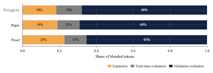
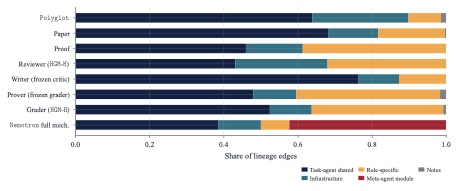

# Paper Assets

## Figure 1: fig:intro-token-efficiency

Caption: \ exceeds the prior SOTA \ on with 1.35--1.72 fewer search tokens by adding a cheap evolved code reviewer. Left: held-out pass rate vs.\ search cost; arrows give the tokens \ saves to exceed the baseline's rate, and the heart marks the run's best agent. Right: best-belief utility during search. At each evaluator replacement (crowned dashed rule), the utility drops as selective erasure discards records scored by the displaced reviewer, then re-climbs under its replacement; shaded bands mark epochs. Full details in sec:experimental-design,exp_design:reading_results_figures.

![\ exceeds the prior SOTA \ on with 1.35--1.72 fewer search tokens by adding a cheap evolved code reviewer. Left: held-out pass rate vs.\ search cost; arrows give the tokens \ saves to exceed the baseline's rate, and the heart marks the run's best agent. Right: best-belief utility during search. At each evaluator replacement (crowned dashed rule), the utility drops as selective erasure discards records scored by the displaced reviewer, then re-climbs under its replacement; shaded bands mark epochs. Full details in sec:experimental-design,exp_design:reading_results_figures.](figures/fig1_polyglot_arrows.png)

## Figure 2: fig:method-overview

Caption: \ searches over a multi-agent workspace tree containing both learnable task agents and evaluators. At each step, a node is selected by Thompson sampling over clade metaproductivity and either expanded by a meta-agent or evaluated. Evaluators are scored against a ground-truth anchor and task agents by their epoch-local frozen evaluator or a fixed benchmark for evaluator-independent roles. At checkpoints, each frozen slot compares its incumbent against challenger evaluators on a ground-truth anchor; then the -best-belief evaluator is frozen for the next epoch and the utility records from the displaced evaluator are erased (alg:main).

![\ searches over a multi-agent workspace tree containing both learnable task agents and evaluators. At each step, a node is selected by Thompson sampling over clade metaproductivity and either expanded by a meta-agent or evaluated. Evaluators are scored against a ground-truth anchor and task agents by their epoch-local frozen evaluator or a fixed benchmark for evaluator-independent roles. At checkpoints, each frozen slot compares its incumbent against challenger evaluators on a ground-truth anchor; then the -best-belief evaluator is frozen for the next epoch and the utility records from the displaced evaluator are erased (alg:main).](figures/rqgm-main-diagram-v3-corr-epsilon-tnr.png)

## Table 1: tab:paper-writer-cross-reviewer

Caption: Co-evolved writers achieve 1.78 higher mean acceptance than at matched search cost, and 1.86 for the best-found specialist. Rows are writer agents; the four Reviewers columns form a fixed panel from our work and prior baselines, each cell giving the percentage of writer-generated papers that reviewer accepts (mean 95% Jeffreys interval). Mean averages across the panel, with each writer's gain over in parentheses. adversarial is the reviewer regularized to be harsher on -written text (sec:exp-adversarial). Best per column in bold.

| r | 4cReviewer Acceptance Rate (%, ) |  |  |  |  |  |
| --- | --- | --- | --- | --- | --- | --- |
| (lr)3-6 Writer | [r]Search |  |  |  |  |  |
| Tokens |  |  |  |  |  |  |
| lu2024ai |  |  |  |  |  |  |
| zhang2026hyperagents |  |  |  |  |  |  |
| wang2025huxley,zhang2026hyperagents |  |  |  |  |  |  |
| adversarial | [6.8em][c]Mean (%, ) |  |  |  |  |  |
| writer | 42.5M | 1.0\,black!55 2.2 | 12.0\,black!55 6.3 | 64.0\,black!55 9.3 | 10.0\,black!55 5.9 | [6.8em][l][2.5em][r]21.8\,black!55 4.0\,[2.6em][l] |
| [2pt] writer (generalist) | 44.6M | 2.0\,black!55 2.9 | 43.0\,black!55 9.6 | 81.0\,black!55 7.6 | 29.0\,black!55 8.8 | [6.8em][l][2.5em][r]38.8\,black!55 4.8\,[2.6em][l](1.78) |
| [2pt] writer (specialist) | 221.8M | 5.0\,black!55 4.3 | 40.0\,black!55 9.5 | 86.0\,black!55 6.8 | 31.0\,black!55 9.0 | [6.8em][l][2.5em][r]40.5\,black!55 4.8\,[2.6em][l](1.86) |

## Table 2: tab:imo-proof-cross-grader

Caption: The co-evolved specialist prover attains the best mean score, while the prover and the generalist fall below the baseline. Rows are prover agents. A fixed panel of three graders from our work and prior baselines scores every prover's proofs, mirroring the reviewer panel of tab:paper-writer-cross-reviewer. Because graders report several metrics, we pool each metric across graders, with per-grader results in tab:proof-per-grader. Score is the mean grade (0--7), Pass@6 the fraction scoring at least 6 of 7, and Pass@7 the fraction earning full credit; all report s.e.m. Best per column in bold.

| Prover | Search Tokens | Score () | Pass@6 () | Pass@7 () |
| --- | --- | --- | --- | --- |
| Static prover | N/A | 4.07\,black!55 0.42 | 55.0%\,black!55 6.4 | 55.0%\,black!55 6.4 |
| prover | 21.5M | 3.73\,black!55 0.43 | 51.7%\,black!55 6.5 | 45.0%\,black!55 6.4 |
| prover (generalist) | 37.9M | 3.73\,black!55 0.43 | 51.7%\,black!55 6.5 | 45.0%\,black!55 6.4 |
| prover (specialist) | 88.0M | 4.33\,black!55 0.41 | 61.7%\,black!55 6.3 | 48.3%\,black!55 6.5 |

## Figure 3: fig:transition-rerank

Caption: Evaluator replacements permanently re-rank the archive. Each curve tracks one replacement, plotting the Spearman between post- and pre-replacement rankings as evaluations accumulate: = 1 (dotted) is the unchanged order, = 0 an uncorrelated reordering. Across all three tasks settles well below 1 and never recovers, so the new ordering holds. The no-erasure control (rightmost) stays high ( 0.90), showing erasure is necessary for utility transitions to guide search.

## Figure 4: fig:tree-paper

Caption: Evaluator replacement preserves the best lineage while re-ranking the remainder. The paper-run archive after an evaluator replacement (radial layout; node color is best-belief utility, size tracks evidence count). The crimson winning lineage survives intact, ending in the crowned-heart winner. Among the top-8 nodes, every prior member is re-ranked (rings mark promotions and churn).

## Figure 5: fig:prover-grader-results

Caption: The co-evolved \ grader reaches the best \ accuracy at 3 lower search cost than . A ground-truth-anchored slot has one global best-belief winner (the crowned heart), while an evaluator-dependent slot admits only epoch-local winners, scored post-hoc in the tables. Left: \ accuracy of selected graders against grading mean absolute error (MAE); the \ grader's global winner (heart) is the highest-accuracy point, with specialist and generalist coinciding. Right: the search trajectory over tokens, showing best-belief utility for the grader (top) and prover (bottom); the grader is scored on its ground-truth anchor, so its heights are comparable and carry the global winner, whereas each prover marker is only that epoch's best-belief winner under its own evaluator. Utility drops at each evaluator replacement (crown; shaded epochs) as erasure discards the displaced records, then re-climbs, and a line ends where its best-belief agent stops improving, not where search halts. For further details see sec:experimental-design,exp_design:reading_results_figures.

![The co-evolved \ grader reaches the best \ accuracy at 3 lower search cost than . A ground-truth-anchored slot has one global best-belief winner (the crowned heart), while an evaluator-dependent slot admits only epoch-local winners, scored post-hoc in the tables. Left: \ accuracy of selected graders against grading mean absolute error (MAE); the \ grader's global winner (heart) is the highest-accuracy point, with specialist and generalist coinciding. Right: the search trajectory over tokens, showing best-belief utility for the grader (top) and prover (bottom); the grader is scored on its ground-truth anchor, so its heights are comparable and carry the global winner, whereas each prover marker is only that epoch's best-belief winner under its own evaluator. Utility drops at each evaluator replacement (crown; shaded epochs) as erasure discards the displaced records, then re-climbs, and a line ends where its best-belief agent stops improving, not where search halts. For further details see sec:experimental-design,exp_design:reading_results_figures.](figures/fig5_prover_grader.png)

## Figure 6: fig:paper-writer-reviewer-results

Caption: The adversarial \ reviewer accepts and human papers at similar rates, a calibrated accept/reject boundary that drives the strongest writer (tab:paper-writer-cross-reviewer); \ reaches higher raw \ accuracy only by over-accepting -generated papers, which leaves its writer weak. Left: \ accuracy of selected reviewers against acceptance rate; the dashed line marks the dataset's true accept rate. The \ reviewer keeps high accuracy at a low acceptance rate, between the lenient \ and the over-harsh . Right: the same run over tokens, writers (top) and reviewers (bottom); at the adversarial-pool replacement the generalist's average best-belief drops as erasure re-ranks the affected utilities, then re-climbs under the harsher criterion.

![The adversarial \ reviewer accepts and human papers at similar rates, a calibrated accept/reject boundary that drives the strongest writer (tab:paper-writer-cross-reviewer); \ reaches higher raw \ accuracy only by over-accepting -generated papers, which leaves its writer weak. Left: \ accuracy of selected reviewers against acceptance rate; the dashed line marks the dataset's true accept rate. The \ reviewer keeps high accuracy at a low acceptance rate, between the lenient \ and the over-harsh . Right: the same run over tokens, writers (top) and reviewers (bottom); at the adversarial-pool replacement the generalist's average best-belief drops as erasure re-ranks the affected utilities, then re-climbs under the harsher criterion.](figures/fig4_writer_reviewer.png)

## Table 3: tab:settings-fixed

Caption: Fixed search configuration shared by the eight headline runs. These constants are held fixed across every run and are not exposed to the meta-agent. No search cool-down is used.

| ll@ Setting | Value |
| --- | --- |
| 2@lModels and budget |  |
| Base model | (low) |
| Ablation model |  |
| Total budget per run | 12,288 evaluations |
| Train samples per node | 3 |
| 2@lSelection and scheduling |  |
| Best-belief quantile | =0.05, five-outcome anchor minimum |
| Checkpoint schedule | power-of-two (=2) |
| UCB-Air expansion exponent | =0.6 (inherited, wang2025huxley) |
| Expansion gate | expand when N_t^|T_t| |
| Exploration--exploitation scheduler | B/b (b = remaining budget) |
| 2@lData splits |  |
| Test sets ( / / ) | 100 items each |
| train split | 10 items |
| validation split | 49 items |
| test split | 166 items |
| 2@lBudget caps |  |
| Expand cap | 25, 1,200\,s |
| Train cap | 8, 900\,s |
| Validation cap | 25, 1,200\,s |

## Table 4: tab:settings-editable

Caption: Meta-agent-editable surface and its initial values. Every setting below is exposed to the meta-agent, which may modify it during search.

| ll@ Setting | Initial value |
| --- | --- |
| Output tokens per call | 32,768 |
| Timeout, run | 86,400\,s |
| Timeout, eval | 1,200\,s |
| Timeout, LLM | 300\,s |
| Timeout, shell | 120\,s |
| Coder tool calls per task | 16 |
| Meta-agent tools | persistent bash (120\,s); editor; delegation |
| Meta-agent tool calls per turn | 40 |

## Table 5: tab:raw-counts

Caption: Raw held-out counts at selection behind sec:exp-polyglot,sec:exp-writer.

| Reviewer | Accuracy | Accept. |
| --- | --- | --- |
| specialist (node 51) | 88 | 45 |
| specialist (node 49) | 84 | 40 |
| generalist, pre-repl.\ (node 78) | 84 | 42 |
| adversarial, post-repl.\ (node 31) | 80 | 32 |
| (published) | 73 | 25 |
| prompt | 63 | 13 |

## Figure 7: fig:analysis-cost

Caption: Blended-token cost decomposition of the three headline (low) runs into workspace expansion, train-time evaluation, and validation evaluation.

## Figure 8: fig:analysis-transfer

Caption: Patch surfaces by run, classifying each accepted lineage edge by the code surface it modifies (task-agent shared, infrastructure, role-specific, meta-agent module, or notes).

