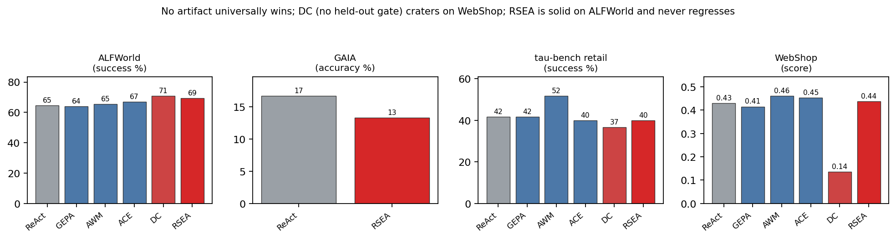
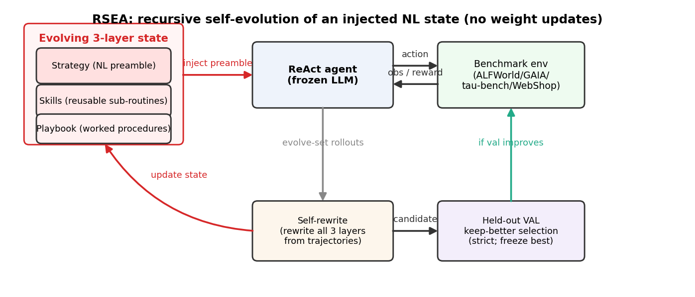
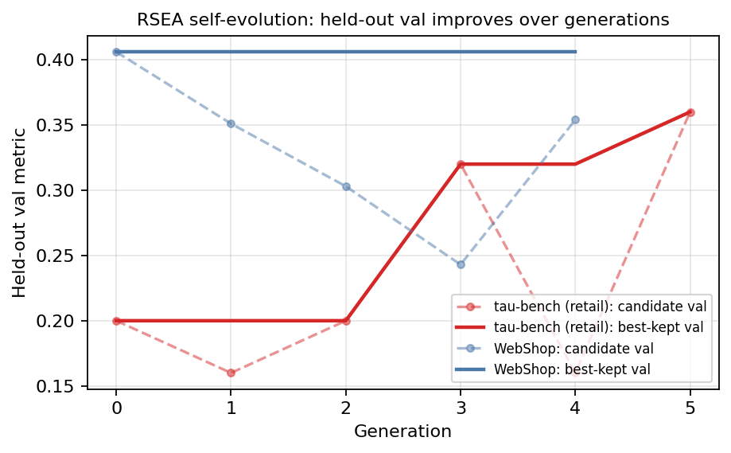

# Recursive Self-Evolving Agents via Held-Out Selection

Source: https://arxiv.org/abs/2606.28374v1

## Overview / Takeaway

RSEA evolves a frozen ReAct agent by recursively rewriting a compact natural-language state with three layers—strategy, skills, and playbook—then selecting candidates on a development split disjoint from both the rewrite trajectories and final test. Its central contribution is a two-threshold rule: a non-regressing candidate may become the working state, but only a strict validation improvement can replace the frozen best state; if nothing improves on validation, the method returns the empty state and behaves as ReAct. On ALFWorld, single-pass RSEA improves from **64.6% to 69.3%** and reaches **79.4%** with per-task retry, while transfer results show that concrete workflow induction can beat natural-language strategy evolution on strong tool-use backbones. The evidence supports empirical validation-set downside control, not universal test monotonicity: RSEA is numerically below ReAct on GAIA and $\tau$-bench but not significantly so, and repeated selection on a small validation set can still overfit that set.

## 1 Introduction

1. **Context adaptation offers self-improvement without changing model weights**
A frozen LLM can be conditioned by evolving reflections, workflows, playbooks, cheatsheets, or optimized prompts. This substrate is interpretable, auditable, transferable across model versions, and cheap to serve when the context is short or KV-cached. The agent's policy parameters remain fixed; only the natural-language artifact injected at inference changes.

2. **Prior comparisons obscure both relative merit and failure modes**
Context-evolution methods are commonly evaluated on one benchmark with different backbones, scaffolds, or decoding budgets. RSEA instead reimplements six methods in one harness and holds the model and rollout budget fixed within each benchmark. This reveals that artifact effectiveness is benchmark-dependent rather than an intrinsic property of a method.

3. **Context distraction is the motivating failure mode**
An evolved artifact can degrade a base policy by adding irrelevant or misleading instructions. Dynamic Cheatsheet illustrates the risk: it scores **70.7%** on ALFWorld but only **0.136** on WebShop, compared with ReAct's **0.429**. The regression comes from injected context rather than a weight or tool change.

4. **Selection is treated as more important than artifact sophistication**
The core hypothesis is that a rewrite operator inherits the variance of its own candidates unless a held-out gate rejects harmful updates. RSEA therefore makes commit discipline—not a more elaborate search algorithm—the design center. This framing is especially relevant to recursive improvement, where repeatedly testing and accepting self-generated changes can otherwise amplify overfitting.

5. **RSEA separates the state into three interpretable layers**
The state contains an imperative **strategy**, reusable **skills**, and a procedural **playbook**. Each generation rolls the current state out on an evolve set, rewrites all layers from successful and failed trajectories, and evaluates the candidate on a disjoint validation set. Only the frozen best state is evaluated on the held-out test set.

6. **Cross-task evolution and within-task retry are orthogonal mechanisms**
Single-pass RSEA starts each task with the selected cross-task prior. RSEA$_\mathrm{R}$ adds a Reflexion-style retry loop so the agent can correct itself within a task. The comparison distinguishes knowledge distilled across tasks from extra attempts on the current task.

7. **The headline claim is deliberately not universal victory**
On **134 ALFWorld tasks × 5 seeds** with a 7B model, RSEA significantly improves over ReAct and reaches **79.4%** with retry. On GAIA, $\tau$-bench, and WebShop with a stronger 30B model, RSEA is statistically tied with ReAct, while AWM's concrete procedures lead $\tau$-bench and WebShop. The paper's strongest general claim is downside control, not best performance everywhere.

Figure 1 makes the cross-benchmark tradeoff visible: no artifact wins every benchmark, and an unguarded online artifact can collapse.

8. **“Strongest single-pass” requires a statistical rather than numerical reading**
RSEA's **69.3%** ALFWorld mean is lower than Dynamic Cheatsheet's **70.7%** and only modestly above ACE's **66.9%**. RSEA significantly beats ReAct at $p=0.015$, whereas its comparisons with ACE and Dynamic Cheatsheet are ties at $p=0.20$ and $p=0.45$. Its distinction is reliable improvement over the base under paired testing, not the largest raw mean.

## 2 Related Work

### LLM agents that reason and act

1. **RSEA preserves the ReAct scaffold to isolate context effects**
ReAct interleaves reasoning with actions and observations. RSEA does not alter this loop, tool interface, or model; it inserts only the evolved state immediately before the task. This makes vanilla ReAct both the empty-state initialization and the fallback returned when validation selection finds no improvement.

2. **Within-task reflection is distinct from cross-task state evolution**
Reflexion revises behavior across attempts on one task but carries no learned artifact to future tasks. RSEA evolves a cross-task prior, while RSEA$_\mathrm{R}$ combines that prior with Reflexion-style retries. The distinction matters because either a better initial policy or additional trials can increase success.

### Tool-use agents and tool learning

1. **RSEA evolves instructions over a fixed tool interface**
Tool-learning systems modify tool selection, tools, or tool policies. RSEA instead changes natural-language strategy while keeping actions and APIs fixed. Its weak transfer gains on $\tau$-bench and WebShop suggest that an abstract strategy adds little when a strong model already receives a detailed API or domain wiki.

### Prompt and context optimization

1. **Flat prompt optimization differs in form but not always in using validation**
GEPA evolves a flat prompt through reflective Pareto mutation and selects on validation minibatches. ACE maintains an itemized playbook with add-only deltas and a non-strict validation keep-best rule. RSEA's novel emphasis is therefore the combination of a structured three-layer rewrite with a **strict** best update, not the first use of validation in context optimization.

2. **Surface-form brittleness motivates conservative commitment**
Prompt behavior can change under small wording differences. Holistically rewriting three layers gives RSEA expressive updates but also creates candidate variance. Held-out scoring acts as a release gate for that brittleness.

### Self-evolving and self-improving agents

1. **RSEA occupies the weight-frozen, natural-language-state corner**
Other systems bootstrap reasoning data, update tools, learn skills with reinforcement learning, or search over agent code and topology. Automated Design of Agentic Systems is explicitly cited as code/topology search. RSEA instead recursively rewrites an injected string while freezing weights, tools, and the ReAct scaffold.

2. **Selection discipline is the proposed safety distinction**
The method contrasts itself with self-evolution loops that commit changes based on training fitness or without a disjoint check. Its empirical argument is that a strict validation best-state record bounds observed validation downside even when candidate rewrites are high variance.

### Reinforcement learning for LLM agents

1. **Execution feedback is used without policy-gradient training**
RSEA uses environment-verified outcomes to rewrite context and rank candidates, avoiding weight training, reward-model optimization, and RL instability. It still depends critically on the selection signal: sparse success is used where adequate, and WebShop uses dense benchmark reward.

### Agent memory, experiential learning, and overfitting

1. **The closest artifacts are reusable natural-language experience stores**
ExpeL, Agent Workflow Memory, Agentic Context Engineering, Dynamic Cheatsheet, and explicit memory stores all carry experience across tasks. They differ in whether the artifact is a workflow list, bullet playbook, online cheatsheet, or more general memory and whether selection is held out.

2. **Classical overfitting provides the conceptual analogy**
Selecting on the same trajectories used to propose a rewrite can reward instance-specific rules that fail on new tasks. RSEA's evolve/validation/test separation treats a natural-language artifact like a learned model whose release should depend on out-of-sample evidence.

### Benchmarks, multi-agent systems, and the broader landscape

1. **Diverse benchmarks reveal scope conditions hidden by single-benchmark studies**
The benchmark slate spans embodied household control, open-ended web assistance, retail tool-user interaction, and web shopping. This diversity exposes whether the bottleneck is procedural strategy, tool-policy execution, retrieval, or grounding rather than treating all agent tasks as one regime.

## 3 Background and Motivation

### Context adaptation

1. **Context evolution can be decomposed into form, update, and selection**
For frozen policy $\pi_\theta$ and injected string $c$, the objective is to improve $\pi_\theta(\cdot\mid c)$ without changing $\theta$. A method is characterized by the **form** of $c$, the **update operator** that proposes a new $c$ from feedback, and the **selection rule** that decides whether to keep it. RSEA argues that reliability is primarily controlled by the third component.

| Method | Artifact form | Update operator | Selection rule |
| --- | --- | --- | --- |
| Reflexion | Per-task reflection | Verbal self-feedback | None; within-task retry |
| GEPA | Flat prompt | Reflective mutation | Pareto on validation minibatch |
| AWM | Workflow list | Induction from successes | None; induce and inject |
| ACE | Bullet playbook | Add-only deltas | Validation keep-best, non-strict |
| Dynamic Cheatsheet | Single cheatsheet | Online rewrite | None; no held-out gate |
| RSEA | Three-layer state | Holistic rewrite of all layers | Strict held-out keep-better |

### Limitations of existing methods

1. **A single artifact form conflates different granularities of knowledge**
A high-level policy, a reusable conditional move, and a worked task-family procedure are not interchangeable. Folding them into one string makes it harder to inspect which kind of knowledge changed and where gains originate.

2. **Unguarded commitment can convert useful adaptation into distraction**
Online append or rewrite methods may inject a locally useful rule into unrelated future tasks. Because the same update mechanism operates whether the new context generalizes or not, performance can vary sharply across benchmarks.

3. **RSEA targets form and release discipline separately**
The three-layer state organizes knowledge for interpretation and rewriting, while strict held-out selection prevents an empirically worse candidate from becoming the returned prior. The ablations later show that the layers overlap, making selection the better-supported distinctive contribution.

## 4 Method: RSEA

### Three-layer evolving state

1. **The state represents policy, reusable moves, and worked procedures**
RSEA uses

\[
s=(\textsc{strategy},\textsc{skills},\textsc{playbook}).
\]

**Strategy** is an imperative preamble of at most a few sentences; **skills** are reusable subroutines or conditional rules; **playbook** entries are ordered procedures distilled from successful trajectories. The rendered state is injected before the task in an otherwise canonical ReAct prompt.

2. **The state is bounded by rewriting rather than append-only growth**
The meta-optimizer may edit or delete any layer. Skills and procedures must remain short, general, and instance-agnostic. This prevents the monotonic context growth of add-only memory systems and limits inference overhead to a few hundred tokens.

### The self-rewrite operator

1. **Proposal data and selection data are disjoint**
The development pool is divided into evolve set $D_e$ and validation set $D_v$. At generation $g$, the current working state $s_{g-1}$ is rolled out only on $D_e$, producing task, trajectory, and environment-verified outcome tuples. The same frozen LLM then receives a balanced sample of successes and failures and proposes $\tilde s_g$.

2. **The rewrite prompt asks for transferable causal lessons**
The model records successful action phrasing, where relevant objects or values were found, and rules that would have prevented failures. Each output entry should abstract beyond a particular task instance. Because the proposal model and task model are identical, gains cannot be attributed to a stronger external optimizer.

### Strict held-out keep-better selection

1. **Working-state acceptance permits plateaus**
The candidate is evaluated on $D_v$ with score

\[
v_g=\operatorname{Eval}(\pi,\tilde s_g,D_v).
\]

It becomes the next working state when it is no worse than the current working state on validation:

\[
v_g\geq \operatorname{Eval}(\pi,s_{g-1},D_v).
\]

Allowing equality lets the search move laterally across a validation plateau.

2. **Frozen-best acceptance requires strict empirical improvement**
Initialize $s^\star=\varnothing$ and $v^\star=\operatorname{Eval}(\pi,\varnothing,D_v)$, where the empty state is ReAct. Update the returned state only when

\[
v_g>v^\star,
\qquad
s^\star\leftarrow\tilde s_g,
\qquad
v^\star\leftarrow v_g.
\]

The recorded best validation score is therefore nondecreasing and the final state is empirically better than empty on this fixed $D_v$. If no candidate strictly beats empty, the returned state remains empty.

3. **The monotone guarantee is validation-specific**
The rule guarantees no regression on the repeatedly observed validation split, not on every unseen task distribution. A small $D_v$ can mis-rank candidates, and testing many generations against the same $D_v$ can adaptively overfit it. The paper acknowledges the first limitation but does not correct for repeated comparisons or provide a population-level bound.

4. **Selection signals follow benchmark reward density**
ALFWorld and $\tau$-bench use environment-verified success. WebShop uses its dense reward because binary success is too sparse. This means “keep-better” is only as reliable as the benchmark metric and the representativeness of $D_v$.

Figure 2 traces the evolve rollout, holistic rewrite, held-out gate, and injection into the frozen ReAct agent.

### RSEA$_\mathrm{R}$: evolution × retry

1. **Retry tests whether a selected prior and within-task correction compose**
RSEA$_\mathrm{R}$ inserts $s^\star$ into a multi-trial Reflexion loop. On ALFWorld, single-pass RSEA scores **69.3%** and retry reaches **79.4%**, a **10.1-point** lift; ReAct to Reflexion rises from **64.6% to 76.4%**, an **11.8-point** lift. Similar retry gains suggest that a better initial prior and extra attempts address partly independent errors.

## 5 Experimental Setup

### Backbone (fairness iron law)

1. **Every method shares a local model and decoding budget within a benchmark**
ALFWorld uses **Qwen2.5-7B-Instruct** so the base agent remains below ceiling. GAIA, $\tau$-bench, and WebShop use **Qwen3-30B-A3B-Instruct**. Models are served with vLLM over **4 × A100 GPUs**, round-robin across methods; the task, reflection, and rewrite LLM are identical.

2. **The comparison is controlled within benchmarks, not across model scales**
ALFWorld results use a 7B backbone while transfer tasks use a 30B backbone. The design supports method comparisons on each benchmark and a scope claim about stronger tool-use agents, but raw performance differences across benchmark columns do not isolate backbone size.

### Benchmarks

1. **ALFWorld provides multi-seed embodied-task evaluation**
The evaluation uses a balanced **134-task** test set across **5 seeds** and a disjoint **30-task development pool**. Environment success is the metric. The paper does not state the exact $D_e/D_v$ sizes in its experimental section.

2. **GAIA uses a small live-web evaluation**
The study evaluates **30 GAIA v1 Level-1 text tasks** with self-built search, fetch, and Python tools plus the official deterministic scorer. Live retrieval makes repeated execution non-deterministic despite fixed states.

3. **$\tau$-bench tests retail tool-user interaction**
The benchmark uses an LLM user simulator, a tool-calling agent, and official database-hash success, with **60 held-out evaluation tasks**.

4. **WebShop tests retrieval and grounded product choice**
The study uses a **1,000-product subset**, Lucene retrieval, and **100 held-out tasks** scored by dense attribute, option, and price reward.

5. **Transfer splits are carved from test because official dev is saturated**
For the 30B tool-use benchmarks, the official development split is already saturated. The study seed-shuffles the test pool into disjoint evolve, validation, and evaluation slices. This prevents direct leakage but makes results dependent on one split seed.

### Baselines

1. **Six baseline loops are ported into the same harness**
The baselines are **ReAct, Reflexion, GEPA, Agent Workflow Memory, Agentic Context Engineering, and Dynamic Cheatsheet**. Core loops are ported from their original repositories, inserted at the same prompt location, and assigned the same per-method rollout budget.

2. **Not every baseline is run on every benchmark**
The cross-benchmark table reports only ReAct and RSEA on GAIA; GEPA, AWM, ACE, and Dynamic Cheatsheet are marked unavailable there. The “six baselines across four benchmarks” framing therefore describes the study collection, not a full method-by-benchmark factorial comparison.

3. **Statistical testing is strongest on ALFWorld**
ALFWorld reports multi-seed means with 95% confidence intervals and paired McNemar tests over matched task-seed cells. Transfer benchmarks use one shuffled split seed and paired tests over tasks. WebShop's dense score does not map as naturally to McNemar's binary paired-outcome assumptions, and the paper does not detail a separate dense-score test.

## 6 Results on ALFWorld: the evolved prior significantly helps

1. **Single-pass RSEA significantly improves over ReAct**
The exact settings and reported values make the relevant comparison concrete.

| Single-pass method | Success (%) | Comparison with RSEA |
| --- | ---: | --- |
| ReAct | $64.6\pm4.3$ | RSEA better, $p=0.015$ |
| GEPA | $63.9\pm5.3$ | RSEA better, $p=0.004$ |
| AWM | $65.4\pm3.3$ | RSEA better, $p=0.037$ |
| ACE | $66.9\pm2.5$ | Tied with RSEA, $p=0.20$ |
| Dynamic Cheatsheet | $70.7\pm3.4$ | Tied with RSEA, $p=0.45$ |
| RSEA | $69.3\pm9.3$ | +4.7 points over ReAct |

The large **±9.3-point** interval shows substantial seed variability even though the paired test detects an improvement across matched task-seed outcomes.

2. **RSEA$_\mathrm{R}$ is best overall but not significantly above the strongest retry baselines**
The exact settings and reported values make the relevant comparison concrete.

| Retry method | Success (%) | RSEA$_\mathrm{R}$ comparison |
| --- | ---: | --- |
| Reflexion | 76.4 | $p=0.09$ |
| GEPA$_\mathrm{R}$ | $75.8\pm5.4$ | $p=0.052$ |
| ACE$_\mathrm{R}$ | $76.7\pm4.9$ | $p=0.13$ |
| RSEA$_\mathrm{R}$ | $79.4\pm7.4$ | +14.8 points over ReAct |

RSEA$_\mathrm{R}$ is significantly above ReAct and single-pass RSEA at $p<10^{-4}$, but its margins over the best retry baselines are trends rather than conventional $p<0.05$ results.

### Where the gains come from

1. **The evolved state fixes specific ALFWorld failure families**
The exact settings and reported values make the relevant comparison concrete.

| Method | Examine | Pick two | Pick and place | Heat | Cool | Clean |
| --- | ---: | ---: | ---: | ---: | ---: | ---: |
| ReAct | 6.7 | 36.5 | 82.5 | 76.5 | 81.0 | **80.0** |
| RSEA | 26.7 | 43.5 | 91.7 | 79.1 | 83.8 | 73.5 |
| RSEA$_\mathrm{R}$ | **44.4** | **67.1** | **99.2** | **87.0** | **88.6** | 79.4 |

Examine improves by **20 points** under single-pass RSEA because the selected state adds a desklamp-before-examine rule. Pick-two and pick-and-place gain roughly **7–9 points** from take-before-place procedures.

2. **RSEA still exhibits local context distraction**
Clean tasks fall from **80.0% to 73.5%**, a **6.5-point** regression, before retry restores them to 79.4%. The strict gate controls aggregate validation score, not every task family or subgroup.

3. **Interpretability supports a mechanism-level explanation**
The state explicitly encodes not repeating actions that produce no effect, taking objects before placement, and using a desklamp before examination. The per-family gains align with these instructions more clearly than a single opaque optimized prompt would.

## 7 Transfer to GAIA, $\tau$-bench, and WebShop

1. **No method dominates the strong-backbone tool-use tasks**
The exact settings and reported values make the relevant comparison concrete.

| Method | ALFWorld success % | GAIA accuracy % | $\tau$-bench success % | WebShop score |
| --- | ---: | ---: | ---: | ---: |
| ReAct | 64.6 | **16.7** | 41.7 | 0.429 |
| GEPA | 63.9 | — | 41.7 | 0.415 |
| AWM | 65.4 | — | **51.7** | **0.460** |
| ACE | 66.9 | — | 40.0 | 0.453 |
| Dynamic Cheatsheet | **70.7** | — | 36.7 | 0.136 |
| RSEA | 69.3 | 13.3 | 40.0 | 0.437 |

AWM's concrete workflows lead $\tau$-bench and WebShop. The result suggests that procedures complement a detailed tool API better than another abstract strategy layer.

2. **“Never regresses” means no statistically significant regression**
RSEA is numerically below ReAct on GAIA (**13.3% vs 16.7%**) and $\tau$-bench (**40.0% vs 41.7%**) and above it on WebShop (**0.437 vs 0.429**). All three differences are reported as non-significant with $p>0.1$. The accurate claim is therefore **no significant underperformance**, not nonnegative raw improvement on every benchmark.

3. **WebShop demonstrates the empty-state fallback**
Every evolved candidate scored below the empty state on WebShop validation, so $s^\star$ remained empty and test behavior reduced to ReAct. The small test difference from 0.429 to 0.437 reflects evaluation noise rather than a selected evolved prior.

4. **$\tau$-bench shows that validation monotonicity does not guarantee test gain**
The best-kept validation score rises from **0.20 to 0.36**, yet RSEA test success is **40.0%**, numerically below ReAct's **41.7%**. This is compatible with the method's stated limitation: strict selection protects the observed validation split, not every unseen test draw.

5. **Dynamic Cheatsheet illustrates high variance but is not a gate-only ablation**
Dynamic Cheatsheet falls to **36.7%** on $\tau$-bench and **0.136** on WebShop after leading ALFWorld numerically. It differs from RSEA not only by lacking a held-out gate but also by artifact form, online update schedule, and rewrite operator, so its collapse motivates held-out selection but does not by itself isolate selection as the sole cause.

Figure 3 shows candidate validation scores and the frozen best trace: $\tau$-bench improves stepwise, while WebShop candidates are rejected below the empty baseline.

6. **GAIA is too small and time-varying for a stable rank**
Only **30 tasks** are evaluated, and live web retrieval changes across runs. Two evaluations of the same frozen states flip the sign of a difference of at most one task, so the 16.7 versus 13.3 ordering should not be treated as a robust method ranking.

## 8 Ablations

1. **Every individual state layer beats the empty-state baseline on the ablation subset**
The exact settings and reported values make the relevant comparison concrete.

| Injected state | Success (%) |
| --- | ---: |
| Empty, equivalent to ReAct | 64.2 |
| Strategy only | 67.3 |
| Skills only | **69.8** |
| Playbook only | **69.8** |
| Strategy + skills | 67.9 |
| Full RSEA | 68.5 |

This ablation uses **54 tasks × 3 seeds** with temperature 0.6. Skills and playbook are strongest individually, while the full three-layer state is lower at 68.5%, within the multi-seed band.

### Each layer helps; the layers overlap

1. **The layers organize overlapping procedural information**
Combining layers does not yield additive gains: skills-only and playbook-only each score **69.8%**, compared with **68.5%** for all layers. The three-layer representation is best justified by interpretability and rewrite structure, not evidence that all three layers are jointly necessary.

### Held-out selection prevents overfitting

1. **Selecting on the proposal set creates a 33-point train–test gap**
The exact settings and reported values make the relevant comparison concrete.

| Variant | In-sample selection | Test success |
| --- | ---: | ---: |
| ReAct, empty state | — | 63.6 |
| RSEA, no held-out gate | 100.0 | 66.7 |
| RSEA, strict held-out gate | — | **67.3** |

The no-gate state reaches **100%** on the same data used for evolution but **66.7%** on test, a **33.3-point** gap. This is strong evidence of proposal-set overfitting.

2. **The isolated strict-versus-no-gate test difference is small**
Strict selection scores **67.3%**, only **0.6 points** above the no-gate state's 66.7%; no significance test is reported for that gap. The ablation clearly shows in-sample inflation, but the claim that the gate alone causes large test gains relies partly on cross-method Dynamic Cheatsheet evidence.

### Robustness

1. **Strictness chooses the simpler fallback on validation ties**
If frozen best used $\geq$ instead of $>$, a candidate that ties the empty state on a small validation sample could be returned and still harm test. Strict update preserves the empty state on a tie, producing the fallback observed on WebShop.

2. **Repeated validation reuse remains an untested failure mode**
The same $D_v$ scores every generation, so candidate generation can indirectly adapt to validation through accept/reject history even without seeing validation trajectories. The paper does not vary validation size, use nested selection, or report a multiple-comparison correction.

## 9 Compute and Cost

1. **Evolution adds linear meta-call overhead**
For $G$ generations, each cycle runs the evolve set, makes one self-rewrite call, and runs validation, giving $O(G)$ meta-level calls in addition to task rollouts. The $\tau$-bench experiment uses **190 meta plus selection calls** in total.

2. **Inference context is deliberately bounded**
The rendered state adds at most a few hundred tokens. Because the rewrite can drop entries, its length need not grow with the number of generations or test tasks, unlike an append-only online cheatsheet.

3. **The paper reports call structure rather than full resource accounting**
It provides four A100s, model identities, fixed rollout budgets, and one call count, but no GPU-hours, token totals, wall-clock, energy, or per-method cost table. The “iso-rollout” claim controls one cost dimension while rewrite and validation overheads still differ by method.

4. **Selection trades compute for empirical downside control**
Every candidate requires a validation rollout. When all candidates fail, as on WebShop, this compute yields no evolved artifact but preserves the empty fallback. Whether the cost is worthwhile depends on the operational value of preventing regressions.

## 10 Discussion and Limitations

### When does cross-task NL evolution help?

1. **Procedural strategy is the favorable regime**
ALFWorld exposes repeated action patterns that a 7B policy fails to execute reliably. A compact state can capture those procedures and transfer them across task instances, producing large gains on examine and object-manipulation families.

2. **Detailed APIs and strong policies reduce the marginal value of abstract strategy**
On $\tau$-bench, the retail wiki already states rules that the 30B model can follow; on WebShop and GAIA, retrieval and grounding dominate. In these regimes, AWM's concrete workflows help more, or RSEA safely returns empty.

### Why the framing is selection-first

1. **A release gate converts unconstrained proposal search into conservative deployment**
The rewrite operator may propose any changed state, but deployment only sees the best empirically validated state. This separation resembles a canonical release line: exploratory working states can move laterally, while the released state changes only after a strict validation gain.

2. **Selection-first does not make the artifact irrelevant**
AWM beats RSEA on two tool-use tasks, and the layer ablation shows different artifact forms carry different procedural value. The evidence supports selection as a necessary reliability mechanism, not as proof that form and update operator never matter.

### Limitations

1. **Transfer results rely on one split seed and modest evaluation sets**
GAIA has 30 tasks, $\tau$-bench 60, and WebShop 100. Only ALFWorld uses five seeds. A different evolve/validation/evaluation split could change which candidates pass the strict gate.

2. **Live web retrieval introduces non-stationary evaluation noise**
GAIA's rank changes across independent runs of the same frozen states. This weakens both selection and test conclusions when external evidence is time-varying.

3. **The comparison excludes code- and weight-updating self-improvement**
RSEA addresses only weight-frozen natural-language state. It does not establish how held-out selection compares with executable agent rewrites, tool evolution, RL updates, or topology search.

4. **Validation safety is not population or per-slice safety**
Strict selection guarantees empirical $D_v$ non-regression. It does not prevent the **6.5-point clean-task regression**, numerical drops on GAIA and $\tau$-bench, or failure under a shifted test distribution.

5. **Key search hyperparameters are under-specified in the paper text**
The exact evolve/validation sizes, generation counts for each benchmark, rewrite prompt budget, retry count, and decoding settings outside the ablations are not fully tabulated. Released manifests may contain them, but the paper itself does not make every setting inspectable in one place.

6. **Open questions center on validation reuse and deployment shift**
How should the gate account for many adaptively proposed candidates? How large and representative must $D_v$ be? Can subgroup constraints prevent aggregate selection from harming a task family? Should the validation distribution co-evolve under deployment shift or remain fixed for comparability? Can uncertainty-aware or sequential tests replace a strict point-estimate comparison? These questions remain unresolved.

## 11 Conclusion

1. **The durable contribution is a conservative recursive release rule**
RSEA couples holistic natural-language rewriting with a frozen best-state record initialized to ReAct. It significantly helps where procedure is the bottleneck and abstains from deploying harmful context when validation evidence is absent.

2. **The study favors honest scope over a universal-win narrative**
RSEA is not the largest raw mean on ALFWorld and does not lead strong-backbone tool tasks. Its result is that a context-evolving agent can preserve base-level performance under paired tests while gaining on a favorable benchmark—subject to the limits of small, reused validation splits.

## Appendix A Evolved states (qualitative)

### ALFWorld (frozen best state)

1. **The selected strategy targets repeated-action and object-ordering failures**
The state tells the agent to stop repeating actions that produce no effect, take an object before placing it, and use desklamps for examination. Skills add fallback navigation when a take action fails. The playbook encodes take-before-go-before-put sequences for pick-and-place and analogous heat and cool procedures.

2. **The artifact explains both gains and remaining distraction**
These rules map directly to the examine and placement improvements, making the selected state auditable. They are not complete environment knowledge, and aggregate validation selection does not guarantee that every included rule helps clean or other families.

### $\tau$-bench retail (frozen best state)

1. **The selected state largely restates the existing policy wiki**
It prioritizes email authentication, falls back to name and zip, requires confirmation before modifications, forbids invented IDs, and distinguishes delivered-order exchanges from pending-order modifications. The 30B model already follows most of these instructions from the domain wiki, explaining the neutral test effect despite validation improvement.

## Appendix B Reproducibility

1. **Released artifacts support matched reruns**
The release includes the common harness, six baseline reimplementations, preregistered task manifests, evolve/validation/evaluation splits, and per-task JSON results. All methods share local backbones and decoding budgets, and task and reflection LLMs are identical.

2. **The statistical unit differs across benchmark groups**
ALFWorld uses paired McNemar over matched task-seed cells from five seeds. Transfer benchmarks use paired McNemar over tasks from one seed-shuffled split. Layer and selection ablations use temperature-0.6 multi-seed decoding on an ALFWorld subset.
